# Calibrated cost/benefit evaluation of automated code-review harnesses

*(report revision 2026-09-18 · tag `report-2026-09-18`)*

**Campaign:** `20260910-mrv0120-manifold` (+ vanilla reuse batches, era rule in §2.3.2) · **Data freeze:**
2026-09-16 09:35 (verified: no data-generating lanes alive at 09:45; every number below is
computed from `runs/*/summary.json` as of the freeze — re-run the commands in §5 and you will get
these numbers) · **This report supersedes** `archive/report-2026-08-26-batch083.md`,
`archive/report2-2026-08-26-batch083.md`, `docs/FRAMEWORK_COMPARISON.md`.

Companion documents: **`EXECUTIVE_SUMMARY.md`** (1–2 pages, decision-first),
**`analysis/COVERAGE.md`** (coverage table + sampling disclosure), figures in
`analysis/figures/` (embedded in the HTML rendering), machine-readable numbers in
`analysis/final_report_metrics.json` / `analysis/final_report_dataset.json`.

> **Note on naming:** this file was `REPORT_FINAL.md`; the `FINAL` name was dropped because the
> report is a living revision, not a final artifact. The historical August-2026 reports live in `archive/`.

## Abstract

Agentic code-review harnesses — orchestrators that dispatch several model passes and synthesise the
result — are increasingly positioned as a step change over single-prompt review, and priced like one.
Almost all of the advice about them is anecdotal: a setup that worked for someone, argued from opinion
and resonance rather than evidence, with cost claims quoted per token instead of per review. This report
takes one important, difficult, yet fungible workflow — code review — and studies it with the scientific
method and repeatable methods, against ground truth that can be *executed*, not only read. Eight models
(three Claude-family, three OpenAI-family, two open-weight GLM) ran through three frameworks — one-shot
prompting plus two agentic harnesses — at three reasoning-effort levels on the six highest-severity PRs
of a public 50-PR benchmark: 2,416 healthy runs, 66 of 72 complete model×framework×effort cells. Quality
is scored under two lenses: the benchmark's 42 human-verified golden comments, and a primary true golden
set built by auditing the campaign's own discoveries into 105 individually test-validated defects — each
owning an executed fail-on-head/pass-on-fix test (147 distinct bugs; a September 2026 audit withdrew
three and merged two duplicates). Unmatched findings are adjudicated real-bug/hallucination, headline
numbers carry PR-level cluster-bootstrap intervals, and cost, tokens and wall-clock are metered.

Harnesses beat one-shot prompting on recall in 39 of 42 matched model·effort pairs (mean Δrecall +0.135;
peak-recall ratio 1.63×). Within harnesses, metareview is the better bet on average (ΔF2′ +17/−4 across
21 matched pairs) — but no single cell wins: the top cell on our evaluator (F2′ 0.494) is statistically
indistinguishable from its metareview counterpart (0.491). The best harness cell leads the best
single-prompt cell 0.494 to 0.406, a 1.22× point estimate whose paired 95% CI (−0.007 to +0.169) crosses
zero. The winners are open-weight: GLM harness cells reach equal-or-better F2′ at $0.22–$0.63 per review
against $6.12 for the best commercial harness cell (9.8×–27.6× cheaper), trading wall-clock, not
tokens.

Caveats: one run per cell per PR (intervals cover PR sampling only); a severity-weighted six-PR sample;
instrument-sensitive precision. Read the intervals, not the rankings.

## 1. Introduction

**Why this report exists.** Code review is one of the largest recurring engineering costs in a software
organisation, and automated review is sold as a way to cut it. Almost everywhere you turn, however, the
advice is vibe-driven: a practitioner's setup that worked well for them, a vendor's chosen example, a
resonant blog post — stories with no controlled comparison behind them, and with costs quoted per token
rather than per review. The dominant claim in that discourse is not that a model can read a diff — that
is table stakes — but that an *agentic harness*, an orchestrator that dispatches several model passes
and synthesises them, finds materially more real bugs than prompting once. Plausible, but rarely backed
by evidence a buyer can check: quality figures usually rest on chosen examples or human-labelled ground
truth nobody can execute, and the arithmetic behind the cost case is seldom shown. A working figure
inside this project — that open-weight models are "~1/200th per token, ~1/10th per task" — is a case in
point: at published list prices the real ratios for the comparison it describes are **1/57 per blended
token and 1/38 per task** (§3.5.2).

**What we set out to do.** We picked a workflow that is at once important, difficult, and fungible —
code review: high-value enough to matter, hard enough that the answer is not obvious, and comparable
enough that the same work can be run across tools and models — and studied it scientifically, with
repeatable methods. We ran the same eight models through one-shot prompting and two agentic
harnesses at three reasoning-effort levels, over a public 50-PR benchmark spanning five codebases,
measuring for every cell the four things a buyer cares about: real bugs found, noise a human must triage,
cost in money/tokens/wall-clock, and whether those answers survive honest adjudication. That last word is
load-bearing: the benchmark's 42 golden comments are incomplete, so we audited the campaign's entire
output into a true golden set of 147 distinct bugs in which every hidden defect owns a fail-on-head,
pass-on-fix test. Where a claim could not be tested that way, we say so rather than rounding in the
tool's favour.

**The questions.**

1. **Q1 — Do harnesses find more real bugs than one-shot prompting?** If not, the orchestrator premium
   buys nothing; if so, how large is the gap, and does it hold across models and efforts?
2. **Q2 — Which framework, effort and model cell should a team actually run?** The practitioner's choice
   is among cells, so the results are organised around cell-level cost/benefit.
3. **Q3 — What do those cells cost in money, tokens and wall-clock?** Measured at published list prices
   with a retrieval date, cache pricing included — the folklore ratios above show how easily cost claims
   drift.
4. **Q4 — How much of the apparent signal survives evidence audit and instrument comparability?** A
   cluster is not a bug, an unmatched finding is not necessarily a hallucination, and a metric that
   cannot be computed for some cells is not a zero.

**Scope and history.** One selected run per cell per PR — PR-level uncertainty is quantified by cluster
bootstrap, but repeat-run variance is *not* measured. One benchmark, one 50-PR sample, headline numbers
from its six highest-severity PRs (§2.4 tests that this is a hard-but-valid slice, not a recall-harder
one). This report supersedes the August 2026 experiment (`archive/report-2026-08-26-batch083.md`), which
scored the same frameworks against human labels only; what is new here is executed, audited hidden-gold
ground truth and per-review metered cost.

**In brief.** Under the strict 42-golden lens, the recommended open-weight cell
(`glm-5.3-vision-background`, metareview, low effort) matched the best frontier harness on golden recall
within overlapping CIs and beat it on F1 at **7.5% [6.7–8.5%] of the opus compound-engineering cost**;
the cheaper
`glm-5.3-flash-background` reaches recall 0.83 [0.74, 0.92] at **0.8% of the opus CE-low cost**, paying
in precision (adjP 0.54 vs 0.67). Under the true-set lens the robust results are framework-level:
harnesses beat one-shot prompting in **39/42** matched pairs (mean Δrecall **+0.135**); **MRV leads CE on
average** (ΔF2′ **+17/−4**); the best harness cell leads the best vanilla cell **1.22× on F2′** (0.494 vs
0.406) with a paired CI that **crosses zero**; no single cell wins inside the GLM-vision family (0.494 vs
0.491); and the best commercial harness cell (opus·CE·medium, F2′ 0.460) costs **$6.12 per review** while
GLM harness cells reach equal-or-better F2′ at **$0.22–$0.63** (9.8×–27.6× cheaper). Where the best cell
still misses, it misses *complementarily*: it finds 88 of the 147 true bugs and all 52 of its misses were
found by another configuration (the union of all 66 complete cells covers 140/147).

## 2. Methodology

### 2.1 The lab and the benchmark

**Benchmark-defined** (Martian offline code-review benchmark, README
`third_party/code-review-benchmark/offline/README.md`): 50 PRs across 5 codebases; 173 human-verified
golden comments with severity (Low/Medium/High/Critical) and category tags. Pipeline: extract →
deduplicate → LLM-judge semantic matching → profile-based scoring.

- **Scoring profiles:** Strict = {bug, security, concurrency, data, api} (139 goldens);
  **Core (default)** = +{perf, test_gap, doc_defect} (158); All = +{style, speculative} (173).
  A candidate matching a golden excluded by the active profile is **matched-excluded** — neither
  rewarded nor penalised. Our frozen matcher matches against all 173 goldens, so stored recall is
  the **All** profile; Core/Strict splits are derived per run from `per_golden_matches`. On the
  severity top-6, the three profiles differ by at most one golden (PR 10967's single style
  comment), so top-6 numbers are effectively profile-invariant (§3.2, T1).
- **F-beta:** F1 and F2 (recall-weighted 4:1 — a missed bug costs more than a false alarm) are
  reported for every cell. Fβ = (1+β²)·R·P/(β²·P+R).
- **Judges:** gpt-5.2 for the Anthropic-model rows (fable/opus/sonnet) and the GLM rows;
  claude-opus-4-5-20251101 for the OpenAI rows (sol/terra/astra). Anti-self-preference by vendor,
  single judge family per row (so within-row framework comparisons are judge-consistent);
  cross-judge agreement is only partially measured (§4, `analysis/ADJUDICATOR_INTERRATER.md`).

**Our extensions beyond the benchmark** (each with its tool, each disclosed per-metric):

- **Honest re-adjudication (precision side).** The benchmark's raw precision counts every
  unmatched candidate as a false positive; Martian's own methodology concedes the golden set is
  incomplete. We adjudicate every unmatched finding three-way: `bug` / `important_non_bug` /
  `hallucination` (v2 in-run, `harnesseval/adjudicate.py`; hardened v3.1 = `readjudicate3.py` with
  cross-run clustering, grounded hallucination, provenance stripping, k-vote). adjP =
  TP/(TP+hallucinations); **beyond-gold** = bug+important_non_bug outside the golden set.
  Campaign judgement lock: **rj3 at k=1 with v3.1 clustering**; no re-adjudication was performed
  for this report, so k=1 everywhere (§2.3.3 quantifies the instrument effects).
- **Cluster (PR-level) bootstrap CIs** on every headline number (§2.3.2).
- **Metered cost accounting** at published list prices (§3.4) with a retrieval date, pricing
  fresh input / cached reads / cache writes / output separately.
- Analysis docs we build on and do not rewrite: `analysis/ADJUDICATOR_INTERRATER.md`
  (adjudicator agreement 0.43–0.83 across judge models; the v1→v3 instability motivation),
  `analysis/ADVISORY_RECALIBRATION.md` (advisory-channel accounting fix; mrv 0.11.1–0.11.2),
  `analysis/CE_VS_MRV_GAPS.md` (15% CE-only hidden-gold; ~9% verdict flips across phrasings),
  `analysis/EXTERNAL_REVIEWER_GAPS.md` (92% of CodeRabbit/BugBot findings covered by our union),
  `analysis/ACCEPTANCE_0111_FINAL.md` (0.11.1 acceptance with k=3 adjudication),
  `analysis/CE_RESIDUE_AFTER_UPGRADE.md` (hidden-gold gap decomposition), `FURTHER-RESEARCH.md`.


### 2.2 What we ran: frameworks, models, efforts, judges

**The matrix.** 8 models × 3 frameworks × 3 reasoning-effort levels = 72 cells, a cell being one run of
one combination on one PR. On the six-PR primary sample 66 cells are complete (396 runs, n = 1 run/PR);
six fable compound/metareview cells have 1–2 PRs — coverage gaps, not results (`analysis/COVERAGE.md`).
The campaign holds 2,416 healthy runs, 2,234 of them selected (one per cell×PR); run health and the era
rule deciding which batches a framework may draw from are in §2.3.2.

**Models.** Three vendor families plus open weights:

| model | family | role in the study |
|---|---|---|
| `claude-fable-5-1` | Claude | strongest one-shot performer (best vanilla cell on F2′) |
| `claude-opus-5` | Claude | frontier reference for the cost comparisons |
| `claude-sonnet-5` | Claude | mid-tier commercial |
| `gpt-5.6-sol`, `gpt-5.6-terra`, `gpt-6-astra` | OpenAI | commercial comparison family |
| `glm-5.3-vision-background` | open-weight (GLM) | the recommended cell's model |
| `glm-5.3-flash-background` | open-weight (GLM) | cheapest strong cell |

**Frameworks.** `vanilla-engineered` is an engineered single prompt (8-category rubric plus severity
guidance) executed as one model call with no subagents — the baseline of pointing a coding agent at a
diff. `compound-realistic` (CE) drives the Compound Engineering `ce-code-review` skill: a risk-driven
persona roster dispatched as parallel subagents, then a separate synthesis pass. `metareview-realistic`
(MRV) drives the metareview binary: deterministic Go gates (free) plus eight adversarial LLM lenses as
parallel subagents, single-pass synthesis. Both harness adapters run the real plugin/CLI inside a host
agent loop, so subagent dispatch is real — with cost-attribution consequences disclosed in §2.3.

**Effort.** `low` / `medium` / `high` map to the provider's reasoning-effort setting (Anthropic: thinking
disabled at low/medium; OpenAI/GLM: `reasoning_effort`); `xhigh` is outside this matrix (§3.5.4).

**Judges and adjudication instruments.** Golden matching and three-way adjudication
(`bug` / `important_non_bug` / `hallucination`) use cross-family judges to avoid self-preference:
`gpt-5.2` for Claude- and GLM-family rows, `claude-opus-4-5-20251101` for OpenAI-family rows, k = 1
(campaign lock). Three precision instruments appear across cells — `v1` (legacy binary, unable to
classify nitpick-class findings), `v2` (in-run three-way), `rj3` (v3.1 clustered re-adjudication); their
comparability limits are disclosed in §2.3.3 and qualify the F1′/F2′ comparisons in §2.6.

**Samples.** Primary: the six PRs with the highest summed original-golden severity weight (§2.4).
Secondary: the full 50, used only for the selection-effect check on the 33 cells with ≥40/50 healthy
scored PRs (§3.6). All headline numbers are primary-sample numbers unless labelled otherwise.

### 2.3 Instruments, comparability, and disclosure rules


#### 2.3.1 Frozen instruments (unchanged; do not modify)

`harnesseval/judge.py` (golden matcher), `readjudicate3.py` prompt/version semantics, and the
golden dataset were **not modified** for this report. n = 1 selected run per cell×PR (selection
rule in §2.3.2); duplicate healthy scored runs exist for some vanilla cells (listed in
`analysis/COVERAGE.md`) and were not pooled. Adjudication k = 1 (campaign lock); if anyone
re-adjudicates at k≥3, both numbers must be reported (`analysis/ACCEPTANCE_0111_FINAL.md` shows
what k=3 looks like on the 0.11.1 acceptance cells).

#### 2.3.2 Run selection and the era rule

One healthy, scored run per (model × framework × effort × PR): health rule = no error, tokens>0,
findings-or-≤20k-tokens; scored = integer tp/fn present; **era rule (banked 2026-09-13):**
vanilla-engineered pairs accept healthy runs from any batch/era; compound/metareview pairs must
come from batch `20260910-mrv0120-manifold` (pre-0.12 metareview binaries are instrument-confounded).
Within the rule we prefer the current campaign batch, then the fable vanilla batches, then newer
legacy batches (`tools/final_report_extract.py`).

#### 2.3.3 Precision-instrument disclosure (per cell, in T1)

rj3 files exist for ~half the vanilla cells (opus/sonnet vanilla, fable vanilla low, parts of
astra/sol/terra/glm-flash) but almost no compound/metareview cells of the current campaign; the
harness cells use the in-run **v2** three-way adjudicator (same judge family, same taxonomy, k=1,
per-finding instead of clustered). Measured on the same runs, the v1 binary instrument (pre-2026-09-07
vanilla reuse) over-counts hallucinations massively — e.g. opus-5 vanilla low adjP v1 0.50 → rj3
0.90 (28→3 hallucinations), fable vanilla low 0.46→0.82 (37→7) — which is why v1 cells
(fable vanilla medium/high, opus vanilla medium) are flagged in T1 and their adjP/F1/F2 read as
**lower bounds on the honest value**. The v2→rj3 gap is the residual instrument risk for harness
cells; `analysis/CE_VS_MRV_GAPS.md` measured ~9% verdict flips across phrasings under v2 that v3.1
clustering removes by construction — direction of bias on aggregate adjP is not established.

#### 2.3.4 Provider incident disclosure (GLM rows)

The 2026-09-14/15 Lunaroute gateway incident (aggregate concurrent output > ~400k tokens wedging
the batch; OpenAI SDK `max_retries=2` silently tripling timeouts) was fixed by ~2026-09-15 16:00
(`max_retries=0`, first-attempt retry + streaming, lens semaphore 4, FD headroom). Per-cell
exposure, using a conservative cutoff of 2026-09-15 23:00 UTC (16:00 PDT): **every GLM harness cell
on the top-6 contains pre-fix runs** (glm-vis mrv medium 5/6, high 2/6 are the least exposed); the
glm-flash vanilla cells selected the post-fix 2026-09-16 runs. The incident was operational
(reliability), not a prompt or dataset change, and every selected run passed the health gate; but
the headline GLM cells (incl. the §3.6 recommendation cell glm-vis MRV low, run 2026-09-10) cannot
claim post-fix infrastructure. Treat GLM quality numbers as carrying this caveat; the
gateway-capacity caveat (throughput, not quality) is in §3.5.5.

Also disclosed: the six glm-*-compound cells and glm-vis MRV low lack per-model token splits
(`per_model_usage`); their metered $ prices **all** input at the fresh rate (no cache discount), so
those cells' $ are upper bounds on the input side. Anthropic rows carry real provider billing
(`cost_usd`), which our metered table reproduces to within 4% for opus/sonnet (median metered/billed
0.96/0.96) and underestimates fable-5.1 billing by ~15% (median 0.85 — cache-write pricing), so
fable $ are conservative.


### 2.4 The top-6 design choice, argued and tested


#### 2.4.1 Definition and rationale (deliberate, not convenience)

**top-6 = the six PRs with the highest summed golden-comment severity weight** (Critical=4,
High=3, Medium=2, Low=1; ties by comment count) — i.e. the six PRs with the **highest original-golden
severity totals** (CAMPAIGN_GLOSSARY.md; verifier `tools/verify_hitlist.py`; artifact
`manifold_top6_hitlist.csv`): cal.com/11059 (sev 26, 9 comments), discourse-graphite/4 (21, 8),
discourse-graphite/10 (21, 7), cal.com/14740 (14, 6), discourse-graphite/8 (14, 6),
cal.com/10967 (13, 6). This selection is by ground-truth severity density, not by any measured
detection difficulty for these tools — §2.4.3 below tests directly that the top-6 is *not* measurably
recall-harder, so read "hard" below as severity-weighted, not as an estimate of what the tools find hard. This is a **deliberate weighting toward higher-severity workloads**: a code-review
tool that only catches easy issues is not worth buying, and cost/benefit is decided at the hard
end. (A lexicographic misreading of "top-6" already corrupted one subset earlier in this campaign —
the severity ordering is binding.)

#### 2.4.2 Representativeness claim, stated as testable
**How hard is the sample?** Measured directly (panel 5 of the dashboard): summing each PR's golden severity
weights (Critical 4 … Low 1), the six headlined PRs average **18.2** against **6.1** for the other 44 — about
**3×** — and the **mildest of the six is as severe as the most severe PR we did not pick** (both 13). The
sample is therefore not merely representative but a deliberately hard slice of the benchmark; where setups
score lower on the six, our headline figures are the pessimistic ones.


Claim: *the top-6 is a deliberately hard-biased but internally valid sample; differences measured
on it are expected to persist on the full 50.* Tested two ways on the 33 cells with ≥40/50
healthy scored PRs (T3):

1. **Direct gap (selection effect).** Mean recall gap (top-6 − full-50) = **+0.006** (median +0.014,
   range −0.14…+0.14; vanilla +0.005, harness +0.007): recall measured on the top-6 is an
   essentially unbiased estimator of full-set recall — the severity-weighting does *not* make the
   top-6 recall-harder for these tools. The F1 gap is larger and systematic (+0.065 mean, harness
   +0.084): harness adjP is *higher* on the top-6 (the non-top-6 PRs elicit more hallucinated
   noise from harnesses), so top-6 F1s overstate full-set F1 for harness cells and should be
   corrected by roughly the T3 per-cell gaps when extrapolating.
2. **Ranking agreement.** Spearman ρ of model F1 ranks (top-6 vs full-50) within framework×effort:
   **0.80** for vanilla-low, CE-medium, CE-high and MRV-low, and **0.37 for CE-low** (T3): the
   CE-low ranking is the one place the top-6 reorders models
   (sonnet-5 collapses from 3rd on full-50 to last on top-6); everywhere else ranks are preserved
   or near-preserved. This is direct, if not uniform, evidence for the claim.

#### 2.4.3 Monotonicity check — the "lower bound" sub-claim is NOT supported

If recall were systematically lower on higher-severity PRs, the top-6 ranking would be a lower
bound on full-set recall. Measured: Spearman ρ(per-PR severity weight, per-PR recall) over the 33
full rows averages **+0.10**, with 6/33 negative — recall is *not* monotonically lower on harder
PRs. **Report the top-6 as a hard-weighted sample whose recall matches the full set on average
(§2.4.2), not as a lower bound.** Where a specific cell shows a large gap (e.g. sol vanilla high:
top-6 0.62 vs full 0.76), the T3 table is the correction.


### 2.5 Building ground truth we could execute

**Why the human-labelled gold was not enough.** The benchmark's 42 golden comments are expert-labelled and
well defined, but they are only what those reviewers happened to write — they cannot tell us whether a
finding *outside* the list is real, and a buyer comparing harnesses needs exactly that. The campaign's own
discoveries are the only larger source of candidate truth, and a discovery is only trustworthy if it can be
checked mechanically. So the ground truth used in §3.1 is not a label set: it is a set of defects each of
which owns an executed test.

**From clusters to executed defects.** Appendix A's "211 additional bugs" were still *clusters* — produced by an LLM merge over candidate keys, so they
carried both over-counts (one defect restated several ways) and under-counts (real defects the audit split
away and never restored). §3.1 replaces them with **individually executed defects**, and the count chain in
full runs: **359** raw pre-merge clusters → **253** after the strict re-merge → **152** candidates →
**147** distinct after the 2026-09-18 audit (42 goldens + 105 verified defects).

**Construction (all artifacts in `analysis/verified_gold/`).** For each candidate the pipeline authored a
test, ran it on the PR head (must **FAIL**), authored a minimal fix, ran it again (must **PASS**), and — where
a sibling defect existed at the same site — re-ran under the *bundle's* fix, which must leave it **RED**
(orthogonality: a defect is only counted separately if its own fix is required). The merge audit
(`MERGE_AUDIT.json`) then split multi-concern bundles; an independent six-reviewer duplicate pass plus
fix-location adjudication removed **23 defect-level** restatements; container-level folding removed **17**
more. Finally the audits' own label lists were walked for **under**-counts, restoring **10 defects** that had
been dropped (including an unset-secret **auth bypass** and a missing scheme check before `open(url)`).
Every defect now owns `defects/<id>/{test.diff,fix.patch,logs/,meta.json}`; the canonical list is
**`analysis/verified_gold/GOLD_DEFECT_CATALOG.md`** (110 entries, one per defect — 105 verified distinct,
plus 3 marked WITHDRAWN and 2 marked DUPLICATE by the 2026-09-18 audit — each with its test, its fix
and its provenance). Provenance is stated per defect: **34** have a test the verifier wrote for that defect
alone (orthogonality proven against the bundle's fix), and **76** are their container's own claim, whose
executed test is therefore that defect's exact test — checked mechanically rather than asserted. The
comparison numbers quoted below (paired deltas, ensemble coverage, the best cell's misses) are persisted in
`final_report_metrics.json` under `true_gold_defects.<variant>.derived`.

**Verified universe: 42 goldens + 105 verified distinct defects = 147 true bugs.**
All 105 are `D-verified` (fail-on-head → own-fix-pass). A 2026-09-18 post-publication audit — triggered by
external review — withdrew 3 defects whose tests did not demonstrate the claimed behavior (11059-D28,
4-D04, 4-D29) and merged 2 as duplicates (11059-D32 → 11059-D19; 11059-D14, already described by the
original golden); see `analysis/verified_gold/WITHDRAWALS_AND_DEDUP_2026-09-18.md`.
**What the audit taught us.** Three pipeline failures were found by adversarial re-checking, and each one
changed the numbers:

- **A test can manufacture its own failure.** One candidate's test mocked the very dependency whose
  behaviour the claim was about (a mocked `zod` with no default export, while the installed package has
  one); another's recorded "head failure" was a harness stub error (`blank?` on a String) that fired
  *before* the claimed behaviour was ever reached; a third failed with an unrelated `NameError` while the
  claimed exception never fired. Re-reading the **failure reason** in every one of the 110 head logs — not
  just the red/green exit status — is what surfaced them, and is why the three defects named above were
  withdrawn rather than counted.
- **Duplicates can hide across containers.** Two defects described the same missing-secret guard at the
  same call site, differing only in the HTTP status the fix returns; a third restated a mechanism the
  original golden already names, fix site included. Candidate pairs were adjudicated with the repo's
  cross-fix standard — a pair is one defect only if *neither* defect's own minimal fix cures the other's
  test — which merged 2 and kept 4 borderline pairs (4-D14, 4-D45, 11059-D33-vs-D22, 4-D56-vs-4-D36) as
  genuinely distinct.
- **The scoring map itself had a quiet hole.** The finding→defect assignment considered only the first 60
  findings of each multi-defect bundle: **276 findings were silently dropped** (51 of them in cells that
  were being credited), and at least one finding was mis-credited (the `embed_by_username.downcase`-on-nil
  finding went to the queue-flooding defect 4-D04 instead of 4-D56). The repaired pipeline considers all
  **2,923** findings, permits explicit no-match `null`s (71 of them), and re-verifies low-signal
  assignments (`DEFECT_ASSIGN_AUDIT.json`). Every §3.1 number was recomputed from the repaired inputs —
  which is why absolute recall and F2′ levels rose.

The audit's full record, with the evidence behind every decision, is
`analysis/verified_gold/WITHDRAWALS_AND_DEDUP_2026-09-18.md`.

One honest boundary: the 105 are the defects the pipeline could *execute*. The earlier audits' label lists
suggest a small number of further claims whose tests did not converge; we report those as in-doubt plumbing
rather than as verified bugs (`UNDERCOUNT_2026-09-18.md`).

### 2.6 Metrics and the evaluator choice

Three choices shape every number in §3: how defects are counted (the metrics tool below), which composite
is read (F2′), and which cells are allowed to be compared at all (the instrument caveat). Each is a stated
choice with a cost, and each is stated here rather than buried in the results.

Metrics: `tools/verified_gold_defect_metrics.py` (cluster bootstrap, B=10,000, seed 20260916); finding-to-
defect assignment by `tools/verified_gold_defect_assign.py` (repaired 2026-09-18: every one of the 2,923
findings is now considered — the pre-repair version silently dropped 276 past a 60-finding cap; audit trail
in `DEFECT_ASSIGN_AUDIT.json`); the section is also exposed as `true_gold_defects` in
`analysis/final_report_metrics.json`.

**Which composite to read.** The campaign's *declared preference* is that a missed bug matters more
than a false alarm (4:1) — which corresponds to β=2, i.e. **F2**, not F1. That is a **choice of emphasis we
made up front**, not a measured developer cost: no study in this campaign measures what a missed bug or a
false alarm actually costs a developer. Because adjP′ charges nitpicks, F1′ (β=1) is also
volume-sensitive in a particular direction — it can rank a terse cell above a higher-recall cell (see
below) — but that is the preference debate F1′ and F2′ encode, not an artifact one of them removes; they
are two legitimate readings and we report both. We lead with **F2′** (recall-weighted, nitpicks charged)
as the composite, next to **recall** and **adjP** (real-bug precision), and keep **F1′** as the labelled
equal-weight, nitpick-averse alternative. Caveat on cell selection: the best harness and best vanilla cells above
were picked *after* observing the results, which biases exactly this kind of post-hoc pairwise comparison
optimistic — the MRV-high-vs-vanilla-high pair below resolves at 95% while this best-vs-best pair does not,
which is the fragility that selection induces.

**Why F2′ is our evaluator (and not F1, F1′, or recall alone).**
This is a stated preference, not a measurement, and it follows from what a code-review tool is *for*:

- **Recall alone** answers only half the question. A tool that dumps every possible comment would score
  perfect recall and be useless; recall must be paired with a noise term.
- **Precision terms we have**: `adjP` = TP/(TP + hallucinations) — charges only *unsound* claims (claim
  soundness). `adjP′` = TP/(TP + hallucinations + nitpicks) — also charges *important_non_bug* findings
  (substantive review concerns that are not bugs; the taxonomy does not establish they are trivia, only
  that they are not defects) — the "user lens" in which the reader also pays for them.
- **β is the real choice, and it is ours.** F1/F1′ are β=1 (a missed bug and a false alarm count the
  same). F2/F2′ are β=2 (**recall weighted 4:1**). We *declare* that a missed bug matters more than a
  false alarm; nothing in this campaign measures the actual developer cost of either, so β=2 is a
  chosen recall preference — and F1′ remains a legitimate alternative preference, not an error. Note also
  that F2′ normalizes each cell against **its own** noise mix, so cross-cell F2′ comparisons embed both the
  β preference and each cell's hallucination+nitpick mix.
- **Sensitivity (do not read F2′ as money).** Under a *literal* 4:1 developer-cost utility — 4×(missed
  bugs) + (hallucinations + nitpicks) — the best-vs-best pair (glm-vis·CE·medium vs fable·van·medium)
  costs **409 vs 395, favoring the vanilla cell**, while the MRV-high pair (glm-vis·MRV·high vs
  fable·van·high) costs 398 vs 405, favoring harness. The two utility readings disagree across pairs, so
  **no economic claim follows from these scores without an explicit, measured utility model**; treat
  developer-time savings as unmeasured.
- **Why the preference matters empirically**: F1′ (β=1, nitpick-charged) ranks the terse,
  20%-hallucinating vanilla run above the verbose harness run that found **76 real bugs to 51**
  (glm-vis·MRV·high vs fable·van·high). But note the instrument caveat below: fable's zero nitpicks are
  largely *not measured*, not earned — its v1 binary adjudicator has no nitpick category, so its adjP′ is
  structurally identical to adjP. Under F2′ (recall weighted 4×) the extra real bugs outweigh the extra
  nitpicks and the harness cells lead — though it is still not a pure bugs-found ranking (opus · CE ·
  medium finds the most real bugs, 88/147, and sits 6th on F2′ at 0.460).
- **What follows.** On F2′ the best harness cell leads the best vanilla cell by a point estimate
  whose paired 95% CI crosses zero, while F1′ ranks the best vanilla cell narrowly first (§3.1) —
  the two composites disagree about the *size* of the harness lead, not about which family occupies
  the top of the table.

**Instrument caveat (read nitpick-charged metrics with it).** The six selected fable·van·medium and
fable·van·high runs were adjudicated by the older **v1 binary instrument**, which has no
`important_non_bug` category (`tools/final_report_extract.py` sets `imp = 0` for v1 by construction). For
those cells "nitpick-class: 0" means **not measured**, not "precise". Because v1 cells are never charged
nitpicks, their adjP′/F1′/F2′ are *inflated relative to v2/rj3 cells* — a bias that **favors the vanilla
side** in every harness-vs-vanilla comparison here, so the harness leads reported in §3.1 are conservative on
this axis. Cross-instrument comparisons of nitpick-charged metrics are only apples-to-apples among
v2/rj3 cells; `DEFECT_METRICS.json` now carries a per-cell `instruments` field so any consumer can filter.

## 3. Results

### 3.1 The primary matrix: the true golden set

The true-golden ground truth built in §2.5 gives the results below on the six-PR sample; **F2′** is
defined and justified in §2.6, and its instrument caveat applies to every nitpick-charged number here.

**Headline (true set).**

| | cell | recall | adjP (real-bug precision) | **F2′ — our evaluator** | F1′ (diagnostic only) |
|---|---|---|---|---|---|
| best harness recall | `claude-opus-5 · CE · medium` | **0.599** | 0.518 | 0.460 | 0.342 |
| **best harness F2′** | `glm-vis · CE · medium` | 0.544 [0.477, 0.691] | 0.792 | **0.494** [0.443, 0.593] | 0.435 |
| best vanilla | `claude-fable-5-1 · van · medium` † | 0.367 [0.269, 0.484] | 0.701 | 0.406 | 0.482 |

† v1 binary adjudicator: the nitpick (important_non_bug) category is **structurally unmeasured** for this
cell — see the instrument caveat in §2.6; its adjP′ = adjP by construction.

**Top by F2′ (our evaluator, complete cells only):** glm-vis·CE·medium 0.494 [0.443, 0.593], glm-vis·MRV·medium 0.491,
glm-vis·MRV·high 0.488, glm-vis·MRV·low 0.470, glm-flash·MRV·high 0.463, opus·CE·medium 0.460 — the top six
are all harness cells; the best vanilla cell is fable·van·medium at 0.406 (14th; v1 instrument — see §2.6). The ordering within the top three is inside the mutual CIs (glm-vis·CE·medium vs
glm-vis·MRV·medium: Δ −0.004, CI [−0.052, +0.052]) — a cell-level crown is not established; the
pair-level facts (39/42 Δrecall; MRV +17/−4 on ΔF2′) are the load-bearing ones.

The raw counts behind the F2′ ranking:

| cell | reported findings | goldens | **hidden-gold defects** | total real | halluc. | nitpick-class. | halluc. % of findings | nitpick % of findings | adjP | adjP′ | F2′ |
|---|---|---|---|---|---|---|---|---|---|---|---|
| fable · vanilla · medium † | 98 | 29 | **25** | 54 | 23 | n/a (v1) | 23% | n/a | 0.701 | 0.701 | 0.406 |
| fable · vanilla · high † | 103 | 30 | **21** | 51 | 21 | n/a (v1) | 20% | n/a | 0.708 | 0.708 | 0.386 |
| glm-vis · MRV · high | 652 | 32 | **44** | 76 | 7 | 107 | 1% | 16% | 0.916 | 0.400 | 0.488 |
| glm-flash · MRV · high | 563 | 32 | **41** | 73 | 6 | 122 | 1% | 22% | 0.924 | 0.363 | 0.463 |
| opus · CE · medium | 636 | 35 | **53** | 88 | 82 | 198 | 13% | 31% | 0.518 | 0.239 | 0.460 |
| astra · MRV · high | 113 | 25 | **24** | 49 | 8 | 8 | 7% | 7% | 0.860 | 0.754 | 0.375 |
| opus · MRV · high | 511 | 31 | **40** | 71 | 49 | 111 | 10% | 22% | 0.592 | 0.307 | 0.433 |

† v1 binary instrument: the nitpick category is **structurally unmeasured** for these cells (see §2.6), so their adjP′ = adjP and their nitpick-charged metrics are not comparable to
the v2 cells' — they are inflated in the vanilla cells' favor.

The consequence is visible in the ranking: by **hidden-gold defects found** the leaders are
`opus · CE · medium` (53), `glm-vis · CE · medium` (45) and `glm-vis ·MRV· high` (44) — while the F1′
leader `fable · vanilla · medium` ranks far down that list with **25**, on a run that reports only 16–18
findings per PR, whose hallucinations are 23% of everything it says, and whose zero-nitpick column is an
unmeasured v1-instrument artifact rather than a precision result. Conversely the two GLM MRV-high cells'
hallucination rate is ~1% and their claim soundness adjP is 0.92, but 16–22% of their findings are
nitpick-classified, which
is what pushes adjP′ to ~0.36–0.40 and F1′ below vanilla.

**So: for "did it find the real bugs", read hidden-gold defects found / recall (harness cells lead). For
"how much noise per real bug", read adjP (claim soundness) and the nitpick share. For a single composite,
read **F2′** — the recall-weighted preference this campaign declares (β=2; defined and justified in §2.6), on which the best harness cell leads the best vanilla cell 0.494 to 0.406 (a
point-estimate lead whose paired CI crosses zero). Read **F1′** as the legitimate equal-weight alternative
on which the best vanilla cell (0.482, v1 instrument) narrowly leads.

> **Figure 3.1a — What each cell found, and how much of it is noise** *(interactive — toggle the key to
> isolate cells; hover bars for counts)*
>
> How to read: each cell's reported findings are decomposed into original goldens found, hidden-gold defects
> found, hallucinations and nitpick-class findings. The nitpick share here is of *adjudicated* findings
> (goldens + distinct defects + hallucinations + nitpicks) — a different denominator from the report's
> "nitpick % of findings" column. Cells run on the v1 binary instrument show n/a for the nitpick category,
> because that instrument cannot measure it.
>
> 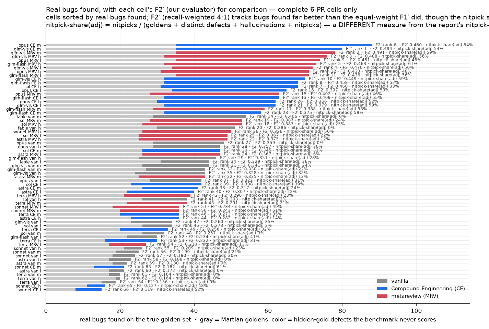
>
> **Takeaway:** harness cells find substantially more real bugs — `opus · CE · medium` leads with 53
> hidden-gold defects and 88 real bugs — but they also carry the larger nitpick charge; the vanilla cells
> report the fewest findings in total.

**What the true set changes.**
- **Recall levels rise** (denominator 253 → 147 after the re-merge and the 2026-09-18 audit) and the harness
  lead survives our evaluator: on **F2′** the best harness cell beats the best vanilla cell **1.22×** as a
  point estimate (0.494 vs 0.406; paired CI −0.007 to +0.169 — not resolved at 95%; the previously-published
  MRV-high pair resolves: Δ +0.102, CI +0.003 to +0.168).
- **Harnesses find more real bugs**: across 42 matched model·effort pairs, Δrecall > 0 in **39/42**
  (mean **+0.135**) and ΔF1′ > 0 in 27/42 (mean +0.031); the harness's stronger recall is what carries F2′
  despite its much heavier nitpick charge.
- **Peak-recall ratio** harness ÷ vanilla = **1.63×** (0.599 vs 0.367); **F2′ ratio = 1.22×** (harness
  ahead on the point estimate). The equal-weight F1′ lens is the outlier (best vanilla 0.482 vs best
  harness 0.472, 0.98×) and is treated as a legitimate alternative preference, not a result.
- **MRV vs CE** (21 matched model·effort pairs): on our evaluator, **+17 / −4** on ΔF2′ (mean **+0.041**;
  **7/21** resolve at 95%); Δrecall +17 / −4, mean +0.038; for reference ΔF1′ is +17 / −4. MRV is ahead on
  average, not uniformly.
- The Appendix A cost and token conclusions are untouched (they do not depend on the gold set).

**Per PR (§3.1).**

| PR | goldens | verified defects | universe |
|---|---|---|---|
| ai-code-review-evaluation/discourse-graphite/pull/4 | 8 | **42** | 50 |
| ai-code-review-evaluation/discourse-graphite/pull/8 | 6 | **6** | 12 |
| ai-code-review-evaluation/discourse-graphite/pull/10 | 7 | **20** | 27 |
| calcom/cal.com/pull/10967 | 6 | **5** | 11 |
| calcom/cal.com/pull/11059 | 9 | **15** | 24 |
| calcom/cal.com/pull/14740 | 6 | **17** | 23 |
| **total** | **42** | **105** | **147** |

> **Figure 3.1b — Recall vs F2′ on the 147-bug true golden set** *(interactive — toggle the key to isolate
> model/framework/effort series; hover cells for their values)*
>
> How to read: each point is a complete cell. x is recall against the 147-bug true golden set; y is **F2′**
> (our evaluator: recall weighted 4:1, with hallucinations and nitpick-class findings charged). Whiskers are
> 95% cluster-bootstrap CIs. Partial-coverage cells (fewer than six PRs) are drawn open — read them as gaps,
> not as results.
>
> 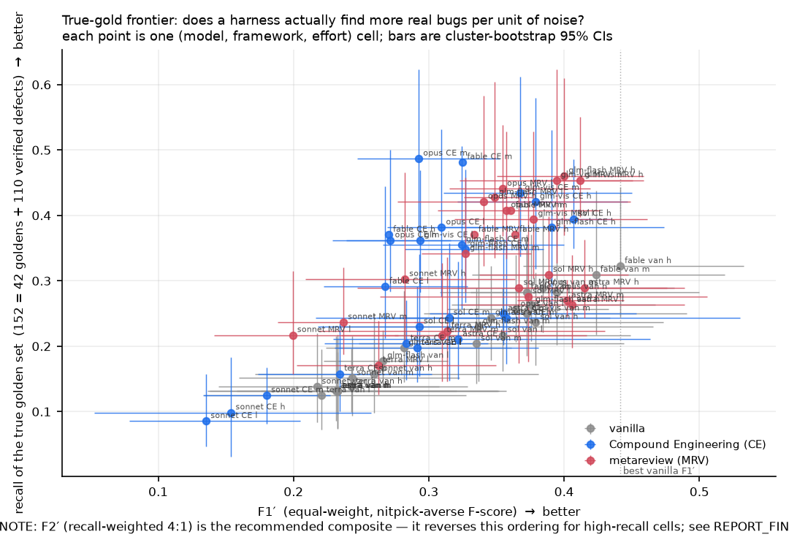
>
> **Takeaway:** the harness cells occupy the top of the cloud, and the interval on any one cell is wider
> than the gaps between the leaders — which is why the pair-level facts, not a cell ranking, carry the claim.

**Why the recall levels — and therefore F2′ — look low, and why no cell finds everything.**
The denominator is not a list of things an agent could reasonably be expected to find; it is what the whole
campaign (2,416 healthy runs, unioned and then audited) turned up. Three facts follow:

1. **1 of the 105 verified distinct defects was never reported by any run** (`10967-D05`; surfaced by
   our own audit, real and test-validated, but no run's findings describe it). It sits in every cell's
   denominator and caps recall by a hair. Measured against only the defects some run actually reported
   (**104**), the denominators become 146 instead of 147 and recall moves less than half a point: the
   best-recall harness cell, opus · CE · medium, goes 0.599 → **0.603** (and the best-F2′ cell glm-vis ·
   CE · medium 0.494 → 0.497); the harness-vs-vanilla ordering is unchanged.
   The `reachable` variant in `DEFECT_METRICS.json` reports this denominator. (Pre-audit this
   understated reachability more severely: 13 defects had zero *credited* findings, but the assignment
   pipeline had silently dropped 276 findings past a 60-finding cap and mis-assigned others — at least
   one of the "never reported" defects, 4-D56, had in fact been reported.)
2. **A cell is one run per PR; the gold set is the union of the fleet.** Averaged over the 66 complete cells,
   a cell finds **25.2 of 42 goldens (60%; best 35/42 = 83%) but only 20.7 of 105 hidden-gold defects (20%;
   best 53/105 = 50%)**. Official goldens are largely reachable; the hidden-gold tail is not.
3. **The tail is heavy and the ceiling is ~95%.** 30 defects have ≤3 assigned findings anywhere, 12 are found
   by exactly one of the 66 cells, and **unioning all 66 cells still reaches only 140/147 (95%)** — 6 defects
   (4-D38, 10-D20, 10-D21, 10-D22, 10967-D05, 11059-D33) and 1 golden are found by no complete cell at all.
   The defects no complete cell finds concentrate in PR 10 (3 of the 6).

So F2′ ≈ 0.49 is the product of an ensemble-union recall (~0.50–0.60) and a nitpick-charged precision
(~0.36–0.40) — neither term is a statement that the tool is weak in absolute terms. Read the levels with the
denominator in hand; read the *ordering* for the comparison.

**Honest limitations.** The adjudication/duplicate judges are non-deterministic (documented); duplicate
calls used majority rules and fix-location evidence rather than a single judge's word. The ground-truth
construction, the 2026-09-18 evidence audit (3 withheld from the verified universe, 2 merged as
duplicates) and the finding→defect assignment repair are described in §2.5, with per-defect evidence in
`WITHDRAWALS_AND_DEDUP_2026-09-18.md`.

### 3.2 The strict benchmark lens (42 goldens), kept for comparison


66 of 72 cells are complete (6/6 PRs each; 396 runs, n = 1 run/PR, k = 1); the six fable
compound/metareview cells have 1–2 PRs each (**coverage gaps, not results** — fable's account was
rate-capped ~3 days; `analysis/COVERAGE.md`). `xhigh` is out of the matrix by operator
decision (legacy rows aside: §3.5.4). Judges, batches, instruments per cell are in T1/T2 notes and
`analysis/COVERAGE.md`.

#### T1 — apples-to-apples matrix (severity top-6): quality, 95% cluster-bootstrap CIs

recall = frozen-matcher TP/(TP+FN) vs all 173 goldens (All profile; Core/Strict differ only by
PR 10967's single style golden on this PR set). adjP = TP/(TP+hallucinations), k=1 verdicts;
`inst` = precision instrument (rj3 = v3.1 clustered k=1, v2 = in-run three-way, v1 = binary legacy).
n = PRs with a selected healthy scored run (1 run/PR). Judge: gpt-5.2 for fable/opus/sonnet/glm rows,
claude-opus-4-5-20251101 for sol/terra/astra rows.

| model | fw | eff | n | recall [CI] | adjP [CI] | F1 [CI] | F2 [CI] | beyond-gold/PR | inst |
|---|---|---|---|---|---|---|---|---|---|
| fable-5.1 | van | low | 6 | 0.74 [0.67, 0.81] | 0.82 [0.74, 0.89] | 0.78 [0.72, 0.81] | 0.75 [0.70, 0.81] | 12.3 | rj3 |
| fable-5.1 | van | medium | 6 | 0.69 [0.55, 0.82] | 0.56 [0.50, 0.61] | 0.62 [0.54, 0.68] | 0.66 [0.56, 0.75] | 7.8 | v1 |
| fable-5.1 | van | high | 6 | 0.71 [0.57, 0.84] | 0.59 [0.54, 0.65] | 0.65 [0.59, 0.70] | 0.68 [0.58, 0.77] | 8.8 | v1 |
| fable-5.1 **GAP** | CE | low | 2 | 0.60 [0.38, 0.86] | 0.28 [0.21, 0.33] | 0.38 [0.27, 0.48] | 0.49 [0.33, 0.65] | 66.0 | v2 |
| fable-5.1 **GAP** | CE | medium | 1 | 0.86 [0.86, 0.86] | 0.38 [0.38, 0.38] | 0.52 [0.52, 0.52] | 0.68 [0.68, 0.68] | 75.0 | v2 |
| fable-5.1 **GAP** | CE | high | 1 | 0.86 [0.86, 0.86] | 0.40 [0.40, 0.40] | 0.55 [0.55, 0.55] | 0.70 [0.70, 0.70] | 54.0 | v2 |
| fable-5.1 **GAP** | MRV | low | 1 | 0.86 [0.86, 0.86] | 0.46 [0.46, 0.46] | 0.60 [0.60, 0.60] | 0.73 [0.73, 0.73] | 50.0 | v2 |
| fable-5.1 **GAP** | MRV | medium | 1 | 0.86 [0.86, 0.86] | 0.50 [0.50, 0.50] | 0.63 [0.63, 0.63] | 0.75 [0.75, 0.75] | 65.0 | v2 |
| fable-5.1 **GAP** | MRV | high | 1 | 0.86 [0.86, 0.86] | 0.75 [0.75, 0.75] | 0.80 [0.80, 0.80] | 0.83 [0.83, 0.83] | 59.0 | v2 |
| astra | van | low | 6 | 0.40 [0.33, 0.49] | 1.00 [1.00, 1.00] | 0.58 [0.49, 0.66] | 0.46 [0.38, 0.55] | 2.5 | rj3/v2 |
| astra | van | medium | 6 | 0.43 [0.33, 0.51] | 0.95 [0.83, 1.00] | 0.59 [0.48, 0.68] | 0.48 [0.38, 0.57] | 2.3 | rj3 |
| astra | van | high | 6 | 0.40 [0.29, 0.54] | 1.00 [1.00, 1.00] | 0.58 [0.44, 0.70] | 0.46 [0.33, 0.60] | 2.8 | rj3 |
| astra | CE | low | 6 | 0.52 [0.44, 0.62] | 0.69 [0.58, 0.81] | 0.59 [0.53, 0.68] | 0.55 [0.47, 0.63] | 11.3 | rj3/v2 |
| astra | CE | medium | 6 | 0.62 [0.51, 0.74] | 0.87 [0.70, 1.00] | 0.72 [0.59, 0.84] | 0.66 [0.54, 0.77] | 9.0 | rj3/v2 |
| astra | CE | high | 6 | 0.55 [0.43, 0.68] | 0.74 [0.59, 0.90] | 0.63 [0.50, 0.77] | 0.58 [0.45, 0.71] | 8.3 | rj3/v2 |
| astra | MRV | low | 6 | 0.62 [0.47, 0.77] | 0.93 [0.86, 1.00] | 0.74 [0.62, 0.84] | 0.66 [0.52, 0.80] | 9.5 | rj3 |
| astra | MRV | medium | 6 | 0.60 [0.47, 0.71] | 0.86 [0.74, 0.97] | 0.70 [0.59, 0.81] | 0.63 [0.51, 0.74] | 8.2 | rj3/v2 |
| astra | MRV | high | 6 | 0.60 [0.45, 0.73] | 0.76 [0.59, 1.00] | 0.67 [0.53, 0.78] | 0.62 [0.48, 0.73] | 11.8 | rj3/v2 |
| sol | van | low | 6 | 0.62 [0.43, 0.80] | 1.00 [1.00, 1.00] | 0.76 [0.60, 0.89] | 0.67 [0.48, 0.83] | 3.7 | v2 |
| sol | van | medium | 6 | 0.62 [0.42, 0.83] | 0.96 [0.88, 1.00] | 0.75 [0.58, 0.89] | 0.67 [0.47, 0.85] | 3.8 | v2 |
| sol | van | high | 6 | 0.62 [0.44, 0.77] | 0.96 [0.88, 1.00] | 0.75 [0.60, 0.87] | 0.67 [0.49, 0.81] | 4.8 | v2 |
| sol | CE | low | 6 | 0.55 [0.31, 0.77] | 0.61 [0.47, 0.71] | 0.57 [0.38, 0.72] | 0.56 [0.33, 0.75] | 18.0 | v2 |
| sol | CE | medium | 6 | 0.62 [0.40, 0.81] | 0.60 [0.49, 0.79] | 0.61 [0.47, 0.74] | 0.62 [0.43, 0.77] | 21.5 | v2 |
| sol | CE | high | 6 | 0.74 [0.67, 0.80] | 0.48 [0.37, 0.67] | 0.58 [0.48, 0.70] | 0.67 [0.60, 0.74] | 33.0 | v2 |
| sol | MRV | low | 6 | 0.60 [0.42, 0.76] | 0.66 [0.54, 0.79] | 0.62 [0.48, 0.77] | 0.61 [0.44, 0.76] | 13.2 | v2 |
| sol | MRV | medium | 6 | 0.67 [0.40, 0.84] | 0.57 [0.43, 0.67] | 0.62 [0.42, 0.74] | 0.65 [0.41, 0.79] | 19.5 | v2 |
| sol | MRV | high | 6 | 0.62 [0.42, 0.80] | 0.58 [0.49, 0.68] | 0.60 [0.46, 0.70] | 0.61 [0.44, 0.75] | 22.7 | v2 |
| opus-5 | van | low | 6 | 0.67 [0.60, 0.72] | 0.90 [0.82, 0.97] | 0.77 [0.70, 0.82] | 0.70 [0.64, 0.76] | 9.3 | rj3 |
| opus-5 | van | medium | 6 | 0.69 [0.51, 0.84] | 0.47 [0.34, 0.57] | 0.56 [0.41, 0.65] | 0.63 [0.47, 0.75] | 7.7 | v1 |
| opus-5 | van | high | 6 | 0.69 [0.55, 0.82] | 0.94 [0.85, 1.00] | 0.79 [0.67, 0.89] | 0.73 [0.59, 0.84] | 11.3 | rj3 |
| opus-5 | CE | low | 6 | 0.81 [0.72, 0.87] | 0.44 [0.33, 0.67] | 0.57 [0.47, 0.71] | 0.69 [0.64, 0.77] | 55.5 | v2 |
| opus-5 | CE | medium | 6 | 0.83 [0.75, 0.91] | 0.30 [0.23, 0.42] | 0.44 [0.36, 0.56] | 0.61 [0.55, 0.72] | 78.8 | v2 |
| opus-5 | CE | high | 6 | 0.71 [0.55, 0.84] | 0.32 [0.23, 0.52] | 0.44 [0.33, 0.62] | 0.57 [0.44, 0.70] | 61.5 | v2 |
| opus-5 | MRV | low | 6 | 0.83 [0.76, 0.91] | 0.41 [0.35, 0.48] | 0.55 [0.50, 0.60] | 0.69 [0.65, 0.74] | 48.8 | v2 |
| opus-5 | MRV | medium | 6 | 0.67 [0.40, 0.86] | 0.40 [0.30, 0.59] | 0.50 [0.37, 0.65] | 0.59 [0.40, 0.73] | 53.2 | v2 |
| opus-5 | MRV | high | 6 | 0.74 [0.51, 0.90] | 0.39 [0.28, 0.61] | 0.51 [0.39, 0.69] | 0.63 [0.47, 0.78] | 67.2 | v2 |
| glm-vis | van | low | 6 | 0.55 [0.38, 0.72] | 0.74 [0.58, 0.90] | 0.63 [0.47, 0.77] | 0.58 [0.42, 0.74] | 9.5 | v2 |
| glm-vis | van | medium | 6 | 0.62 [0.48, 0.76] | 1.00 [1.00, 1.00] | 0.76 [0.65, 0.86] | 0.67 [0.53, 0.80] | 10.7 | v2 |
| glm-vis | van | high | 6 | 0.57 [0.40, 0.74] | 0.96 [0.86, 1.00] | 0.72 [0.56, 0.85] | 0.62 [0.45, 0.78] | 12.7 | v2 |
| glm-vis | CE | low | 6 | 0.76 [0.63, 0.86] | 0.49 [0.35, 0.67] | 0.60 [0.46, 0.73] | 0.69 [0.57, 0.79] | 55.3 | v2 |
| glm-vis | CE | medium | 6 | 0.83 [0.71, 0.95] | 0.62 [0.45, 0.84] | 0.71 [0.55, 0.89] | 0.78 [0.64, 0.92] | 77.2 | v2 |
| glm-vis | CE | high | 6 | 0.76 [0.62, 0.90] | 0.80 [0.73, 0.86] | 0.78 [0.68, 0.87] | 0.77 [0.64, 0.89] | 71.3 | v2 |
| glm-vis | MRV | low | 6 | 0.81 [0.74, 0.86] | 0.67 [0.59, 0.78] | 0.73 [0.67, 0.80] | 0.78 [0.71, 0.83] | 54.3 | v2 |
| glm-vis | MRV | medium | 6 | 0.83 [0.76, 0.91] | 0.85 [0.80, 0.91] | 0.84 [0.82, 0.87] | 0.84 [0.78, 0.89] | 90.0 | v2 |
| glm-vis | MRV | high | 6 | 0.76 [0.67, 0.84] | 0.82 [0.68, 0.94] | 0.79 [0.71, 0.87] | 0.77 [0.69, 0.84] | 96.8 | v2 |
| terra | van | low | 6 | 0.36 [0.25, 0.45] | 0.94 [0.79, 1.00] | 0.52 [0.38, 0.62] | 0.41 [0.29, 0.50] | 2.7 | v2 |
| terra | van | medium | 6 | 0.40 [0.26, 0.54] | 1.00 [1.00, 1.00] | 0.58 [0.41, 0.70] | 0.46 [0.31, 0.60] | 2.3 | v2 |
| terra | van | high | 6 | 0.45 [0.35, 0.56] | 1.00 [1.00, 1.00] | 0.62 [0.52, 0.71] | 0.51 [0.40, 0.61] | 2.8 | v2 |
| terra | CE | low | 6 | 0.48 [0.35, 0.59] | 0.77 [0.65, 0.91] | 0.59 [0.46, 0.70] | 0.52 [0.39, 0.62] | 10.7 | v2 |
| terra | CE | medium | 6 | 0.48 [0.32, 0.63] | 0.65 [0.53, 0.78] | 0.55 [0.41, 0.67] | 0.50 [0.35, 0.64] | 12.5 | v2 |
| terra | CE | high | 6 | 0.38 [0.23, 0.54] | 0.59 [0.50, 0.82] | 0.46 [0.34, 0.55] | 0.41 [0.26, 0.54] | 10.7 | v2 |
| terra | MRV | low | 6 | 0.40 [0.26, 0.56] | 0.55 [0.33, 0.82] | 0.47 [0.28, 0.65] | 0.43 [0.26, 0.59] | 8.5 | v2 |
| terra | MRV | medium | 6 | 0.52 [0.32, 0.74] | 0.61 [0.51, 0.78] | 0.56 [0.43, 0.68] | 0.54 [0.36, 0.69] | 13.3 | v2 |
| terra | MRV | high | 6 | 0.50 [0.30, 0.69] | 0.58 [0.44, 0.77] | 0.54 [0.36, 0.70] | 0.51 [0.33, 0.68] | 13.7 | v2 |
| sonnet-5 | van | low | 6 | 0.43 [0.27, 0.59] | 0.72 [0.56, 0.81] | 0.54 [0.37, 0.68] | 0.47 [0.30, 0.62] | 5.3 | rj3 |
| sonnet-5 | van | medium | 6 | 0.45 [0.29, 0.59] | 0.76 [0.64, 0.86] | 0.57 [0.40, 0.69] | 0.49 [0.32, 0.63] | 3.8 | rj3 |
| sonnet-5 | van | high | 6 | 0.50 [0.38, 0.59] | 0.95 [0.88, 1.00] | 0.66 [0.55, 0.72] | 0.55 [0.43, 0.64] | 4.0 | rj3 |
| sonnet-5 | CE | low | 6 | 0.19 [0.10, 0.30] | 0.62 [0.36, 0.86] | 0.29 [0.15, 0.43] | 0.22 [0.11, 0.34] | 6.5 | v2 |
| sonnet-5 | CE | medium | 6 | 0.31 [0.25, 0.35] | 0.81 [0.68, 1.00] | 0.45 [0.39, 0.48] | 0.35 [0.29, 0.39] | 10.5 | v2 |
| sonnet-5 | CE | high | 6 | 0.26 [0.06, 0.47] | 0.61 [0.33, 0.72] | 0.37 [0.10, 0.56] | 0.30 [0.07, 0.50] | 7.7 | v2 |
| sonnet-5 | MRV | low | 6 | 0.43 [0.38, 0.47] | 0.24 [0.18, 0.32] | 0.31 [0.25, 0.38] | 0.37 [0.32, 0.43] | 24.3 | v2 |
| sonnet-5 | MRV | medium | 6 | 0.48 [0.38, 0.57] | 0.34 [0.23, 0.49] | 0.40 [0.30, 0.51] | 0.44 [0.35, 0.55] | 29.2 | v2 |
| sonnet-5 | MRV | high | 6 | 0.62 [0.39, 0.82] | 0.40 [0.33, 0.47] | 0.49 [0.37, 0.59] | 0.56 [0.38, 0.71] | 34.0 | v2 |
| glm-flash | van | low | 6 | 0.52 [0.39, 0.63] | 0.92 [0.84, 1.00] | 0.67 [0.56, 0.75] | 0.57 [0.45, 0.67] | 8.8 | v2 |
| glm-flash | van | medium | 6 | 0.64 [0.53, 0.77] | 0.79 [0.69, 0.92] | 0.71 [0.61, 0.83] | 0.67 [0.56, 0.79] | 8.8 | v2 |
| glm-flash | van | high | 6 | 0.60 [0.40, 0.77] | 0.93 [0.83, 1.00] | 0.72 [0.55, 0.85] | 0.64 [0.44, 0.80] | 12.3 | rj3/v2 |
| glm-flash | CE | low | 6 | 0.76 [0.63, 0.88] | 0.63 [0.55, 0.72] | 0.69 [0.62, 0.74] | 0.73 [0.63, 0.81] | 48.8 | v2 |
| glm-flash | CE | medium | 6 | 0.76 [0.55, 0.95] | 0.64 [0.55, 0.75] | 0.70 [0.57, 0.79] | 0.73 [0.56, 0.87] | 60.3 | v2 |
| glm-flash | CE | high | 6 | 0.76 [0.58, 0.93] | 0.82 [0.72, 0.96] | 0.79 [0.70, 0.86] | 0.77 [0.62, 0.89] | 57.8 | v2 |
| glm-flash | MRV | low | 6 | 0.83 [0.74, 0.92] | 0.54 [0.49, 0.59] | 0.65 [0.62, 0.69] | 0.75 [0.70, 0.80] | 54.7 | v2 |
| glm-flash | MRV | medium | 6 | 0.69 [0.51, 0.84] | 0.67 [0.52, 0.82] | 0.68 [0.53, 0.81] | 0.69 [0.52, 0.83] | 57.5 | v2 |
| glm-flash | MRV | high | 6 | 0.76 [0.56, 0.93] | 0.84 [0.73, 0.93] | 0.80 [0.63, 0.92] | 0.78 [0.59, 0.93] | 83.0 | v2 |

**Reading the matrix.** (a) *Harnesses raise recall where the base model is weak or mid-tier and
leave it unchanged or worse at the top of the frontier*: +0.14…+0.31 recall for opus-5/glm rows
(17/42 pairs resolve positive and 2 negative, i.e. 19 pairs whose paired CI excludes 0; median Δrecall +0.12), while sol/terra
rows are inside noise (T4) — a strong model in a single pass already finds what the harness's
lenses find on these PRs. (b) *sonnet-5 is the counterexample that matters for buyers*: its
compound cells *lose* recall (−0.24 [−0.46, −0.04] at high effort) because Claude-Code-style
compound routing sends reviewer subagents to haiku-4.5 (visible in `per_model_usage`) — a
harness is only as good as the models it actually calls. (c) *adjP is where frontier harness cells
bleed*: opus-5 CE/MRV adjP 0.30–0.44 vs glm-vis MRV medium 0.85 and astra MRV low 0.93 — the
expensive harnesses emit large volumes of non-golden content of which more is judged waste.

> **Figure 3.2a — Recall with CIs, per cell (strict 42-golden lens)** *(static figure)*
>
> How to read: one bar per cell, grouped by framework within model; bar height is recall against the
> benchmark's 42 human-verified golden comments, with 95% cluster-bootstrap whiskers. This is the
> benchmark's own lens, kept here for comparison with the true-golden results in §3.1.
>
> 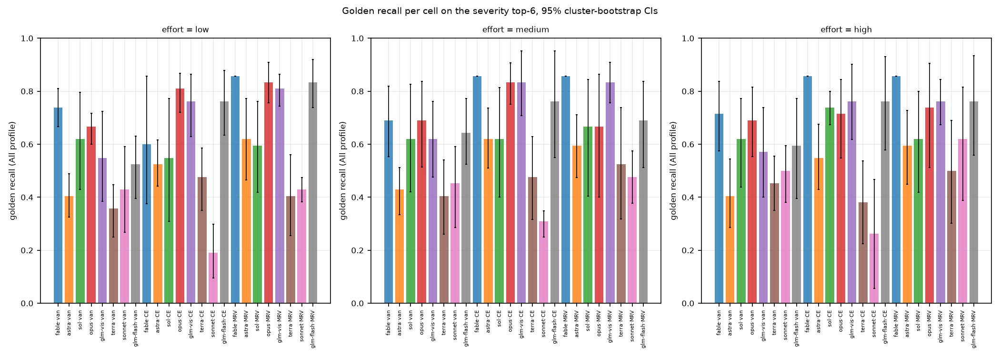
>
> **Takeaway:** under the benchmark's own lens, harnesses raise recall where the base model is weak or
> mid-tier and leave it unchanged or worse at the top of the frontier (reading (a) above).


### 3.3 CE vs MRV on the same PRs

#### T13 — CE vs MRV, paired on the same PRs (Δ = MRV − CE, semantic metrics)

| model · effort | n PRs | Δrecall_sem | ΔF1 | ΔF1' |
|---|---|---|---|---|
| opus-5 · high | 6 | +0.020 [-0.996, +0.581] | +0.035 [-0.174, +0.197] | +0.042 [-0.132, +0.144] |
| opus-5 · low | 6 | +0.032 [-0.342, +0.727] | +0.020 [-0.125, +0.145] | +0.030 [-0.097, +0.119] |
| opus-5 · medium | 6 | -0.087 [-0.224, +0.250] | -0.031 [-0.070, +0.061] | +0.035 [-0.056, +0.047] |
| sonnet-5 · high | 6 | +0.198 [-0.636, +0.506] | +0.227 [-0.187, +0.162] | +0.159 [-0.132, +0.129] |
| sonnet-5 · low | 6 | +0.126 [-0.823, +0.549] | +0.143 [-0.217, +0.178] | +0.097 [-0.178, +0.140] |
| sonnet-5 · medium | 6 | +0.130 [-1.412, +0.301] | +0.148 [-0.268, +0.175] | +0.109 [-0.255, +0.131] |
| glm-flash · high | 6 | +0.051 [-0.344, +0.251] | +0.052 [-0.095, +0.082] | +0.003 [-0.071, +0.062] |
| glm-flash · low | 6 | +0.004 [-0.686, +0.253] | -0.011 [-0.127, +0.113] | -0.026 [-0.109, +0.087] |
| glm-flash · medium | 6 | +0.028 [-0.311, +0.314] | +0.035 [-0.117, +0.105] | +0.035 [-0.092, +0.085] |
| glm-vis · high | 6 | +0.012 [-0.109, +0.270] | +0.013 [-0.046, +0.049] | +0.017 [-0.037, +0.045] |
| glm-vis · low | 6 | +0.040 [-0.428, +0.610] | +0.062 [-0.160, +0.139] | +0.083 [-0.122, +0.104] |
| glm-vis · medium | 6 | -0.004 [-0.376, +0.315] | +0.020 [-0.097, +0.093] | +0.008 [-0.073, +0.073] |
| sol · high | 6 | -0.063 [-0.584, +0.399] | -0.051 [-0.135, +0.149] | -0.023 [-0.092, +0.111] |
| sol · low | 6 | +0.032 [-0.238, +0.356] | +0.042 [-0.091, +0.060] | +0.058 [-0.071, +0.050] |
| sol · medium | 6 | +0.020 [-0.475, +0.469] | +0.019 [-0.165, +0.180] | +0.024 [-0.114, +0.138] |
| terra · high | 6 | +0.051 [-1.016, +0.372] | +0.068 [-0.192, +0.175] | +0.067 [-0.141, +0.127] |
| terra · low | 6 | -0.016 [-0.216, +0.340] | -0.030 [-0.078, +0.075] | -0.019 [-0.062, +0.057] |
| terra · medium | 6 | +0.008 [-0.341, +0.291] | +0.008 [-0.064, +0.083] | +0.017 [-0.050, +0.068] |
| astra · high | 6 | +0.075 [-0.350, +0.189] | +0.098 [-0.054, +0.061] | +0.095 [-0.047, +0.047] |
| astra · low | 6 | +0.036 [-0.180, +0.419] | +0.056 [-0.074, +0.085] | +0.066 [-0.059, +0.064] |
| astra · medium | 6 | +0.004 [-0.416, +0.279] | +0.005 [-0.108, +0.096] | +0.012 [-0.085, +0.075] |

Pairs-level aggregate: mean ΔF1 +0.044 [+0.019, +0.073], mean ΔF1' +0.042 [+0.024, +0.063] — **resolves positive**. Signs: ΔF1 17+/4−/00; ΔF1' 18+/3−. No single pair's CI excludes zero (6 PRs each); the aggregate over 21 matched pairs is the reportable quantity.


#### T14 — harness vs vanilla, paired Δrecall_sem (semantic union)

| model · fw · effort | n PRs | Δrecall_sem (harness − vanilla) | resolved |
|---|---|---|---|
| fable-5.1 CE low | 2 | +0.111 [+0.077, +0.128] | + |
| opus-5 CE high | 6 | +0.107 [+0.008, +0.195] | + |
| opus-5 CE low | 6 | +0.146 [+0.113, +0.193] | + |
| opus-5 CE medium | 6 | +0.202 [+0.156, +0.250] | + |
| opus-5 MRV high | 6 | +0.126 [+0.069, +0.194] | + |
| opus-5 MRV low | 6 | +0.178 [+0.142, +0.202] | + |
| opus-5 MRV medium | 6 | +0.115 [+0.052, +0.181] | + |
| sonnet-5 CE high | 6 | -0.028 [-0.079, +0.010] | ~ |
| sonnet-5 CE low | 6 | -0.051 [-0.131, -0.003] | − |
| sonnet-5 CE medium | 6 | -0.020 [-0.123, +0.029] | ~ |
| sonnet-5 MRV high | 6 | +0.170 [+0.125, +0.233] | + |
| sonnet-5 MRV low | 6 | +0.075 [+0.005, +0.131] | + |
| sonnet-5 MRV medium | 6 | +0.111 [+0.049, +0.194] | + |
| glm-flash CE high | 6 | +0.142 [+0.122, +0.171] | + |
| glm-flash CE low | 6 | +0.174 [+0.137, +0.196] | + |
| glm-flash CE medium | 6 | +0.111 [+0.084, +0.168] | + |
| glm-flash MRV high | 6 | +0.194 [+0.162, +0.248] | + |
| glm-flash MRV low | 6 | +0.178 [+0.157, +0.215] | + |
| glm-flash MRV medium | 6 | +0.138 [+0.119, +0.170] | + |
| glm-vis CE high | 6 | +0.174 [+0.106, +0.275] | + |
| glm-vis CE low | 6 | +0.154 [+0.134, +0.192] | + |
| glm-vis CE medium | 6 | +0.202 [+0.135, +0.253] | + |
| glm-vis MRV high | 6 | +0.186 [+0.135, +0.236] | + |
| glm-vis MRV low | 6 | +0.194 [+0.161, +0.255] | + |
| glm-vis MRV medium | 6 | +0.198 [+0.152, +0.247] | + |
| sol CE high | 6 | +0.154 [+0.121, +0.193] | + |
| sol CE low | 6 | +0.043 [+0.012, +0.072] | + |
| sol CE medium | 6 | +0.095 [+0.022, +0.175] | + |
| sol MRV high | 6 | +0.091 [+0.043, +0.145] | + |
| sol MRV low | 6 | +0.075 [+0.043, +0.117] | + |
| sol MRV medium | 6 | +0.115 [+0.080, +0.174] | + |
| terra CE high | 6 | +0.028 [-0.051, +0.089] | ~ |
| terra CE low | 6 | +0.063 [+0.035, +0.104] | + |
| terra CE medium | 6 | +0.075 [+0.034, +0.117] | + |
| terra MRV high | 6 | +0.079 [+0.034, +0.145] | + |
| terra MRV low | 6 | +0.047 [+0.026, +0.078] | + |
| terra MRV medium | 6 | +0.083 [+0.036, +0.140] | + |
| astra CE high | 6 | +0.067 [+0.012, +0.125] | + |
| astra CE low | 6 | +0.087 [+0.052, +0.151] | + |
| astra CE medium | 6 | +0.083 [+0.029, +0.132] | + |
| astra MRV high | 6 | +0.142 [+0.087, +0.179] | + |
| astra MRV low | 6 | +0.123 [+0.081, +0.171] | + |
| astra MRV medium | 6 | +0.087 [+0.007, +0.130] | + |

Resolved positive 39/43 on this superseded semantic-union metric (vs 38/42 under the frozen key-union, 17/42 strict); the primary true-gold count is 39/42.


### 3.4 Cost, tokens, wall-clock, and the open-weight story


#### 3.4.1 Price table (retrieved 2026-09-16)

| model | fresh input | cached read | cache write (5m) | output | source |
|---|---|---|---|---|---|
| claude-fable-5-1 | $10.00 | $0.25 | $12.50 | $50.00 | platform.claude.com …/pricing |
| claude-opus-5 | $5.00 | $0.50 | $6.25 | $25.00 | platform.claude.com |
| claude-sonnet-5 | $2.00 | $0.20 | $2.50 | $10.00 | platform.claude.com |
| gpt-6-astra | $10.00 | $1.00 | $12.50 | $50.00 | developers.openai.com/api/docs/pricing (standard) |
| gpt-5.6-sol | $4.00 | $0.40 | $5.00 | $20.00 | same (promotional, ≥ through 2026-11-21) |
| gpt-5.6-terra | $2.00 | $0.20 | $2.50 | $12.00 | same |
| glm-5.3-vision-background (GLM-5.3) | $1.40 | $0.26 | — | $4.40 | docs.z.ai/guides/overview/pricing |
| glm-5.3-flash-background (GLM-5.3-Flash) | $0.15 | $0.03 | — | $0.50 | docs.z.ai |

Per 1M tokens, USD, standard tier, short-context rates. Metered $ = fresh_in·in + cached_in·cached
+ cache_w·w + (output+reasoning)·out, from `per_model_usage` per run. Our GLM traffic went through
the Lunaroute gateway at a flat fee ($0 billed) — the metered figures are what the same token
counts would cost on the public APIs. Reasoning output is billed at the output rate for OpenAI/GLM
rows (it is a large share: e.g. glm-vis MRV high ≈ 470k reasoning tokens/run). Anthropic
reconciliation in §2.3.4.

#### 3.4.2 Cost & throughput per cell

#### T2 — cost & throughput per cell (top-6), 95% cluster-bootstrap CIs

Metered $ at published list prices retrieved 2026-09-16 (REPORT.md §3.4.1). tok/run includes
fresh input + cached reads + cache writes + output (incl. reasoning). GLM cells marked * are
conservative (all input priced at the fresh rate; no per-model token split available).
Values < $0.01 are shown in cents (¢) to avoid leading-zero drowning; ≥ $0.01 in $.

| model | fw | eff | $/run [CI] | $/real [CI] | $/TP [CI] | tok/run [CI] | wall s/run [CI] | price per k-tok [CI] |
|---|---|---|---|---|---|---|---|---|
| fable-5.1 | van | low | $0.89976 [$0.81493, $0.98873] | $0.05142 [$0.04497, $0.05971] | $0.17415 [$0.1514, $0.20981] | 84,674 [79,473, 90,156] | 57 [48, 65] | $0.01063 [$0.01025, $0.011] |
| fable-5.1 | van | medium | $1.10452 [$1.04313, $1.16957] | $0.0872 [$0.07388, $0.10624] | $0.22852 [$0.18303, $0.29345] | 90,477 [84,540, 96,679] | 101 [90, 116] | $0.01221 [$0.01192, $0.01247] |
| fable-5.1 | van | high | $1.29594 [$1.09528, $1.518] | $0.09368 [$0.07603, $0.11719] | $0.25919 [$0.20134, $0.35383] | 95,959 [89,842, 101,526] | 148 [107, 204] | $0.01351 [$0.01208, $0.01533] |
| fable-5.1 | CE | low | $7.09035 [$6.03101, $8.1497] | $0.10057 [$0.09476, $0.10965] | $1.57563 [$1.00517, $2.71657] | 2,377,174 [2,036,714, 2,717,635] | 197 [187, 206] | 0.29827¢ [0.29611¢, 0.29988¢] |
| fable-5.1 | CE | medium | $7.62321 [$7.62321, $7.62321] | $0.09411 [$0.09411, $0.09411] | $1.27054 [$1.27054, $1.27054] | 2,030,451 [2,030,451, 2,030,451] | 245 [245, 245] | 0.37544¢ [0.37544¢, 0.37544¢] |
| fable-5.1 | CE | high | $11.79453 [$11.79453, $11.79453] | $0.19658 [$0.19658, $0.19658] | $1.96575 [$1.96575, $1.96575] | 2,143,181 [2,143,181, 2,143,181] | 438 [438, 438] | 0.55033¢ [0.55033¢, 0.55033¢] |
| fable-5.1 | MRV | low | $8.93581 [$8.93581, $8.93581] | $0.15957 [$0.15957, $0.15957] | $1.4893 [$1.4893, $1.4893] | 2,315,429 [2,315,429, 2,315,429] | 274 [274, 274] | 0.38592¢ [0.38592¢, 0.38592¢] |
| fable-5.1 | MRV | medium | $12.42245 [$12.42245, $12.42245] | $0.17496 [$0.17496, $0.17496] | $2.07041 [$2.07041, $2.07041] | 2,978,748 [2,978,748, 2,978,748] | 518 [518, 518] | 0.41704¢ [0.41704¢, 0.41704¢] |
| fable-5.1 | MRV | high | $17.60581 [$17.60581, $17.60581] | $0.27086 [$0.27086, $0.27086] | $2.9343 [$2.9343, $2.9343] | 4,081,982 [4,081,982, 4,081,982] | 467 [467, 467] | 0.43131¢ [0.43131¢, 0.43131¢] |
| astra | van | low | $0.41009 [$0.39022, $0.42919] | $0.07689 [$0.054, $0.10732] | $0.14474 [$0.10489, $0.19254] | 82,234 [75,700, 91,576] | 44 [37, 53] | 0.49868¢ [0.45804¢, 0.54523¢] |
| astra | van | medium | $0.45193 [$0.4297, $0.47395] | $0.08474 [$0.07478, $0.09674] | $0.15064 [$0.11449, $0.19948] | 110,601 [101,440, 117,775] | 88 [84, 90] | 0.40861¢ [0.3796¢, 0.44477¢] |
| astra | van | high | $0.57528 [$0.4963, $0.68959] | $0.10152 [$0.07611, $0.14462] | $0.20304 [$0.13391, $0.31671] | 138,119 [109,068, 190,666] | 105 [85, 137] | 0.41651¢ [0.35583¢, 0.49493¢] |
| astra | CE | low | $1.94294 [$1.80527, $2.07706] | $0.12953 [$0.1151, $0.14629] | $0.52989 [$0.45667, $0.6227] | 1,289,516 [1,193,476, 1,358,941] | 340 [293, 396] | 0.15067¢ [0.1452¢, 0.15687¢] |
| astra | CE | medium | $2.20319 [$1.99423, $2.44326] | $0.16524 [$0.10912, $0.29851] | $0.50843 [$0.42705, $0.61081] | 1,448,556 [1,279,832, 1,660,926] | 343 [326, 363] | 0.1521¢ [0.14562¢, 0.1608¢] |
| astra | CE | high | $2.55536 [$2.29064, $2.94778] | $0.21003 [$0.16468, $0.29493] | $0.66662 [$0.49982, $0.98574] | 1,673,915 [1,472,350, 1,980,316] | 445 [370, 532] | 0.15266¢ [0.14777¢, 0.15757¢] |
| astra | MRV | low | $1.56438 [$1.43195, $1.69065] | $0.11309 [$0.09696, $0.13658] | $0.36101 [$0.25066, $0.52089] | 1,119,058 [1,017,521, 1,215,700] | 273 [238, 321] | 0.13979¢ [0.13878¢, 0.14111¢] |
| astra | MRV | medium | $1.61394 [$1.47618, $1.77112] | $0.13086 [$0.0833, $0.21612] | $0.38735 [$0.29706, $0.50468] | 1,123,343 [1,000,408, 1,279,905] | 311 [264, 368] | 0.14367¢ [0.13817¢, 0.14929¢] |
| astra | MRV | high | $1.54941 [$1.4456, $1.6522] | $0.09684 [$0.072, $0.13643] | $0.37186 [$0.27059, $0.53825] | 985,535 [916,834, 1,065,486] | 357 [286, 431] | 0.15722¢ [0.14971¢, 0.17022¢] |
| sol | van | low | $0.20456 [$0.18659, $0.2249] | $0.02557 [$0.02252, $0.03104] | $0.04721 [$0.0322, $0.07664] | 102,740 [92,864, 112,325] | 69 [58, 81] | 0.1991¢ [0.18681¢, 0.21516¢] |
| sol | van | medium | $0.51022 [$0.38896, $0.64302] | $0.06248 [$0.05162, $0.07461] | $0.11774 [$0.08535, $0.17988] | 340,590 [204,142, 499,578] | 168 [150, 188] | 0.1498¢ [0.12694¢, 0.19353¢] |
| sol | van | high | $1.25099 [$0.94013, $1.57224] | $0.13647 [$0.09769, $0.18722] | $0.28869 [$0.25059, $0.33673] | 1,300,885 [719,345, 1,815,179] | 359 [304, 415] | 0.09616¢ [0.08505¢, 0.12993¢] |
| sol | CE | low | $0.52457 [$0.47952, $0.5712] | $0.02403 [$0.02098, $0.02778] | $0.13684 [$0.09965, $0.23511] | 664,934 [617,469, 714,112] | 239 [200, 285] | 0.07889¢ [0.07444¢, 0.08347¢] |
| sol | CE | medium | $0.63898 [$0.58205, $0.71395] | $0.02473 [$0.01779, $0.03868] | $0.14746 [$0.10915, $0.22781] | 818,232 [757,414, 896,048] | 451 [351, 539] | 0.07809¢ [0.07063¢, 0.08553¢] |
| sol | CE | high | $0.73363 [$0.6203, $0.83683] | $0.01922 [$0.01614, $0.02372] | $0.14199 [$0.11314, $0.17459] | 1,111,710 [920,118, 1,291,572] | 839 [587, 1,088] | 0.06599¢ [0.06433¢, 0.06803¢] |
| sol | MRV | low | $0.64059 [$0.5881, $0.69734] | $0.03696 [$0.03076, $0.04571] | $0.15374 [$0.11278, $0.23026] | 951,387 [903,351, 1,010,724] | 360 [337, 384] | 0.06733¢ [0.06307¢, 0.07232¢] |
| sol | MRV | medium | $0.75677 [$0.66104, $0.86231] | $0.03131 [$0.0255, $0.04012] | $0.16216 [$0.13117, $0.23757] | 1,147,056 [1,028,438, 1,284,697] | 432 [341, 562] | 0.06597¢ [0.0619¢, 0.07103¢] |
| sol | MRV | high | $0.80288 [$0.73777, $0.87846] | $0.02974 [$0.02558, $0.03596] | $0.18528 [$0.14584, $0.26099] | 1,200,600 [1,104,018, 1,335,211] | 634 [383, 957] | 0.06687¢ [0.06354¢, 0.07124¢] |
| opus-5 | van | low | $0.40387 [$0.37106, $0.43668] | $0.02885 [$0.02567, $0.03313] | $0.08654 [$0.07478, $0.10343] | 85,801 [80,978, 91,027] | 53 [48, 59] | 0.4707¢ [0.4568¢, 0.48259¢] |
| opus-5 | van | medium | $0.46887 [$0.42624, $0.51107] | $0.03751 [$0.03247, $0.04771] | $0.09701 [$0.07677, $0.14191] | 88,793 [83,371, 94,290] | 84 [72, 96] | 0.52805¢ [0.50787¢, 0.54549¢] |
| opus-5 | van | high | $0.61069 [$0.5884, $0.63697] | $0.03777 [$0.03369, $0.0426] | $0.12635 [$0.09887, $0.16709] | 108,497 [92,130, 135,808] | 263 [127, 505] | 0.56286¢ [0.44684¢, 0.66785¢] |
| opus-5 | CE | low | $2.9469 [$2.55117, $3.3698] | $0.04818 [$0.04152, $0.05615] | $0.52004 [$0.44115, $0.62597] | 1,746,846 [1,488,792, 2,037,178] | 110 [99, 121] | 0.1687¢ [0.1613¢, 0.17749¢] |
| opus-5 | CE | medium | $6.12246 [$4.86896, $7.34344] | $0.07231 [$0.055, $0.09537] | $1.04956 [$0.7685, $1.46824] | 4,338,290 [3,121,208, 5,894,118] | 343 [242, 440] | 0.14113¢ [0.12299¢, 0.15735¢] |
| opus-5 | CE | high | $6.93603 [$5.01286, $8.80568] | $0.1043 [$0.06776, $0.17285] | $1.38721 [$0.94995, $2.09081] | 4,408,575 [3,195,227, 5,534,892] | 466 [235, 714] | 0.15733¢ [0.14599¢, 0.16793¢] |
| opus-5 | MRV | low | $2.97406 [$2.77815, $3.26019] | $0.0544 [$0.04588, $0.06265] | $0.50984 [$0.46205, $0.5897] | 1,682,788 [1,502,906, 1,899,089] | 100 [91, 108] | 0.17673¢ [0.16954¢, 0.1865¢] |
| opus-5 | MRV | medium | $4.8933 [$4.15649, $5.72878] | $0.08461 [$0.07726, $0.09307] | $1.04856 [$0.74782, $1.79207] | 2,893,026 [2,334,053, 3,577,594] | 188 [173, 205] | 0.16914¢ [0.1591¢, 0.17983¢] |
| opus-5 | MRV | high | $6.28363 [$5.49863, $7.25528] | $0.08687 [$0.0783, $0.09554] | $1.21619 [$0.91095, $1.7597] | 3,637,024 [3,042,034, 4,546,484] | 239 [217, 257] | 0.17277¢ [0.1587¢, 0.1875¢] |
| glm-vis | van | low | $0.02782 [$0.02498, $0.03053] | 0.20864¢ [0.18188¢, 0.25639¢] | 0.72571¢ [0.51485¢, 1.09471¢] | 13,970 [12,517, 15,394] | 54 [21, 106] | 0.19914¢ [0.19314¢, 0.20563¢] |
| glm-vis | van | medium | $0.16858 [$0.13471, $0.20552] | $0.01124 [$0.00914, $0.01339] | $0.0389 [$0.02887, $0.05354] | 48,746 [40,655, 57,548] | 466 [377, 565] | 0.34583¢ [0.32738¢, 0.36067¢] |
| glm-vis | van | high | $0.16267 [$0.12931, $0.20121] | 0.97604¢ [0.81405¢, 1.14946¢] | $0.04067 [$0.02538, $0.05982] | 47,377 [39,498, 56,298] | 477 [302, 661] | 0.34336¢ [0.32365¢, 0.35834¢] |
| glm-vis* | CE | low | $0.18347 [$0.16394, $0.19941] | 0.30243¢ [0.26239¢, 0.35631¢] | $0.0344 [$0.02838, $0.04285] | 104,327 [91,765, 114,864] | 354 [100, 615] | 0.17586¢ [0.17297¢, 0.17911¢] |
| glm-vis* | CE | medium | $0.62565 [$0.53696, $0.72003] | 0.7538¢ [0.64837¢, 0.89076¢] | $0.10726 [$0.08427, $0.13402] | 399,941 [343,039, 459,636] | 1,822 [1,374, 2,461] | 0.15644¢ [0.15417¢, 0.15864¢] |
| glm-vis* | CE | high | $0.65951 [$0.54109, $0.79229] | 0.86024¢ [0.70721¢, 1.01672¢] | $0.12366 [$0.08833, $0.17549] | 428,575 [343,507, 522,593] | 993 [751, 1,180] | 0.15389¢ [0.15125¢, 0.1575¢] |
| glm-vis* | MRV | low | $0.22162 [$0.20061, $0.24184] | 0.36937¢ [0.32181¢, 0.43282¢] | $0.03911 [$0.03471, $0.04663] | 133,707 [121,635, 145,122] | 95 [77, 114] | 0.16575¢ [0.16274¢, 0.16881¢] |
| glm-vis | MRV | medium | $2.08234 [$1.71685, $2.46321] | $0.02173 [$0.01661, $0.02981] | $0.35697 [$0.29551, $0.42857] | 568,192 [478,247, 655,326] | 2,282 [1,458, 3,305] | 0.36649¢ [0.35591¢, 0.37848¢] |
| glm-vis | MRV | high | $2.58585 [$2.05458, $3.26775] | $0.02531 [$0.01809, $0.03715] | $0.48485 [$0.3386, $0.70759] | 679,347 [545,940, 836,272] | 2,933 [1,209, 5,037] | 0.38064¢ [0.37012¢, 0.39084¢] |
| terra | van | low | $0.10866 [$0.09678, $0.12142] | $0.02103 [$0.01771, $0.02585] | $0.04346 [$0.03242, $0.06294] | 97,082 [83,058, 112,643] | 59 [53, 64] | 0.11192¢ [0.08907¢, 0.13513¢] |
| terra | van | medium | $0.14768 [$0.13496, $0.16097] | $0.02858 [$0.02322, $0.03669] | $0.05212 [$0.04137, $0.07267] | 120,100 [100,026, 138,704] | 74 [68, 82] | 0.12297¢ [0.10572¢, 0.14482¢] |
| terra | van | high | $0.27518 [$0.23053, $0.3375] | $0.04586 [$0.03081, $0.07258] | $0.0869 [$0.05989, $0.13529] | 269,919 [168,377, 416,805] | 149 [134, 166] | 0.10195¢ [0.07987¢, 0.14356¢] |
| terra | CE | low | $0.23018 [$0.22571, $0.23482] | $0.01644 [$0.01352, $0.02098] | $0.06906 [$0.05409, $0.09988] | 618,230 [593,025, 645,588] | 173 [146, 198] | 0.03723¢ [0.03621¢, 0.03846¢] |
| terra | CE | medium | $0.2406 [$0.2155, $0.25979] | $0.0152 [$0.01383, $0.01722] | $0.07218 [$0.05664, $0.1051] | 635,630 [541,319, 716,624] | 207 [167, 255] | 0.03785¢ [0.03584¢, 0.04009¢] |
| terra | CE | high | $0.29276 [$0.28248, $0.30652] | $0.02196 [$0.01357, $0.05235] | $0.10979 [$0.07283, $0.1975] | 733,006 [686,279, 774,629] | 338 [215, 487] | 0.03994¢ [0.0384¢, 0.0418¢] |
| terra | MRV | low | $0.32879 [$0.28216, $0.37193] | $0.02901 [$0.02301, $0.03907] | $0.11604 [$0.08212, $0.18715] | 910,042 [759,794, 1,036,912] | 234 [189, 282] | 0.03613¢ [0.03522¢, 0.03725¢] |
| terra | MRV | medium | $0.34769 [$0.32447, $0.37581] | $0.02045 [$0.0128, $0.0331] | $0.09482 [$0.06622, $0.15366] | 963,549 [843,360, 1,077,508] | 306 [203, 494] | 0.03608¢ [0.03445¢, 0.03912¢] |
| terra | MRV | high | $0.3715 [$0.34037, $0.40009] | $0.02164 [$0.01854, $0.02545] | $0.10614 [$0.07515, $0.17299] | 959,658 [897,595, 1,031,670] | 350 [270, 430] | 0.03871¢ [0.03709¢, 0.04053¢] |
| sonnet-5 | van | low | $0.15972 [$0.14661, $0.17458] | $0.01917 [$0.01574, $0.02537] | $0.05324 [$0.03765, $0.08786] | 106,101 [101,105, 111,647] | 30 [25, 37] | 0.15053¢ [0.145¢, 0.15637¢] |
| sonnet-5 | van | medium | $0.18124 [$0.17633, $0.18612] | $0.02589 [$0.02008, $0.03082] | $0.05723 [$0.04048, $0.08977] | 108,308 [103,922, 113,058] | 55 [43, 64] | 0.16734¢ [0.16087¢, 0.17416¢] |
| sonnet-5 | van | high | $0.27956 [$0.24606, $0.31059] | $0.03727 [$0.03107, $0.04673] | $0.07987 [$0.06823, $0.09957] | 117,769 [111,811, 124,221] | 147 [115, 178] | 0.23738¢ [0.21854¢, 0.25457¢] |
| sonnet-5 | CE | low | $1.18086 [$1.02644, $1.31576] | $0.15075 [$0.10071, $0.27359] | $0.88564 [$0.58562, $1.70246] | 2,099,659 [1,770,056, 2,469,525] | 148 [115, 182] | 0.05624¢ [0.05326¢, 0.05941¢] |
| sonnet-5 | CE | medium | $2.24799 [$1.95068, $2.59023] | $0.17747 [$0.08482, $0.44935] | $1.03754 [$0.83182, $1.3933] | 4,645,076 [3,451,139, 5,977,056] | 302 [212, 410] | 0.0484¢ [0.04226¢, 0.0588¢] |
| sonnet-5 | CE | high | $3.53068 [$2.95244, $4.10893] | $0.37165 [$0.25313, $0.59255] | $1.92583 [$0.91526, $9.00518] | 6,401,650 [4,964,368, 8,056,486] | 458 [348, 552] | 0.05515¢ [0.04899¢, 0.06377¢] |
| sonnet-5 | MRV | low | $1.66751 [$1.46228, $1.86799] | $0.06101 [$0.04559, $0.08146] | $0.55584 [$0.43448, $0.70659] | 3,157,529 [2,519,122, 3,856,663] | 163 [151, 176] | 0.05281¢ [0.0485¢, 0.05858¢] |
| sonnet-5 | MRV | medium | $2.97041 [$2.47063, $3.59508] | $0.0914 [$0.07088, $0.11587] | $0.89112 [$0.62113, $1.20778] | 7,104,122 [5,495,342, 9,022,138] | 312 [248, 388] | 0.04181¢ [0.0388¢, 0.04654¢] |
| sonnet-5 | MRV | high | $4.24628 [$3.51936, $4.98643] | $0.11077 [$0.0933, $0.13204] | $0.97991 [$0.73088, $1.47725] | 8,960,936 [6,821,516, 11,274,310] | 494 [402, 589] | 0.04739¢ [0.04385¢, 0.0519¢] |
| glm-flash | van | low | 0.29204¢ [0.2611¢, 0.32199¢] | 0.02336¢ [0.02127¢, 0.02562¢] | 0.07965¢ [0.06021¢, 0.11796¢] | 13,594 [12,137, 15,076] | 15 [14, 18] | 0.02148¢ [0.02073¢, 0.02232¢] |
| glm-flash | van | medium | 0.52529¢ [0.44058¢, 0.58979¢] | 0.0394¢ [0.03095¢, 0.0502¢] | 0.11673¢ [0.0851¢, 0.16073¢] | 18,394 [15,982, 20,249] | 40 [31, 47] | 0.02856¢ [0.02691¢, 0.03022¢] |
| glm-flash | van | high | $0.0158 [$0.01253, $0.01904] | 0.09575¢ [0.07633¢, 0.12054¢] | 0.37918¢ [0.25337¢, 0.65981¢] | 39,963 [32,359, 47,619] | 230 [131, 375] | 0.03953¢ [0.03815¢, 0.04058¢] |
| glm-flash* | CE | low | $0.01881 [$0.01689, $0.02058] | 0.03472¢ [0.02856¢, 0.04326¢] | 0.35261¢ [0.30757¢, 0.41375¢] | 100,411 [88,676, 111,047] | 49 [45, 53] | 0.01873¢ [0.01843¢, 0.0191¢] |
| glm-flash* | CE | medium | $0.02676 [$0.02346, $0.02949] | 0.04075¢ [0.03475¢, 0.04565¢] | 0.50169¢ [0.3971¢, 0.67163¢] | 142,898 [123,073, 158,867] | 136 [97, 175] | 0.01872¢ [0.01844¢, 0.01912¢] |
| glm-flash* | CE | high | $0.0654 [$0.05356, $0.07834] | 0.10354¢ [0.07904¢, 0.12897¢] | $0.01226 [$0.00908, $0.01657] | 400,588 [322,752, 485,037] | 1,432 [521, 3,111] | 0.01633¢ [0.01608¢, 0.01666¢] |
| glm-flash | MRV | low | $0.02354 [$0.02093, $0.02635] | 0.03891¢ [0.03323¢, 0.04456¢] | 0.40353¢ [0.36845¢, 0.46147¢] | 127,440 [114,595, 140,318] | 79 [74, 83] | 0.01847¢ [0.01717¢, 0.01965¢] |
| glm-flash | MRV | medium | $0.07612 [$0.06658, $0.08463] | 0.12211¢ [0.10431¢, 0.14759¢] | $0.01575 [$0.0121, $0.02126] | 258,152 [227,704, 283,565] | 684 [561, 782] | 0.02949¢ [0.02865¢, 0.03031¢] |
| glm-flash | MRV | high | $0.31726 [$0.21397, $0.42794] | 0.35916¢ [0.22542¢, 0.55112¢] | $0.05949 [$0.0394, $0.0844] | 743,571 [527,665, 969,148] | 2,984 [1,797, 4,190] | 0.04267¢ [0.04037¢, 0.04408¢] |


> **Figure 3.4a — Cost per review, per cell (log scale)** *(static figure)*
>
> How to read: one point per cell; y is metered dollars per PR review at published list prices on a log
> scale, with 95% cluster-bootstrap whiskers; cells are ordered by framework within model.
>
> 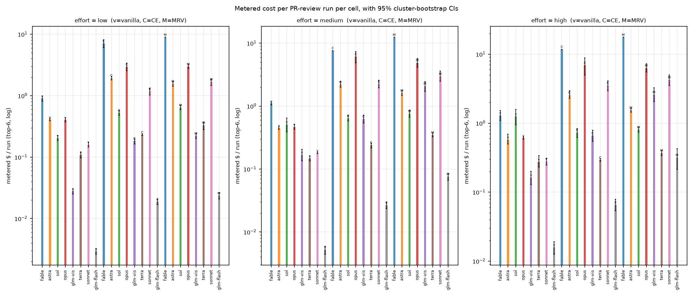
>
> **Takeaway:** the GLM cells sit one to two orders of magnitude below the frontier-model harness cells —
> a difference in how many tokens each harness consumes, not in per-token price (§3.4.3).

#### 3.4.3 Why one harness is cheap and another is not (token composition)

> **Figure 3.4b — Where the tokens go** *(static figure)*
>
> How to read: stacked token composition per review (fresh input, cached input, output) for each cell; the
> cached-input share is what makes a frontier harness's *blended* rate look cheap.
>
> 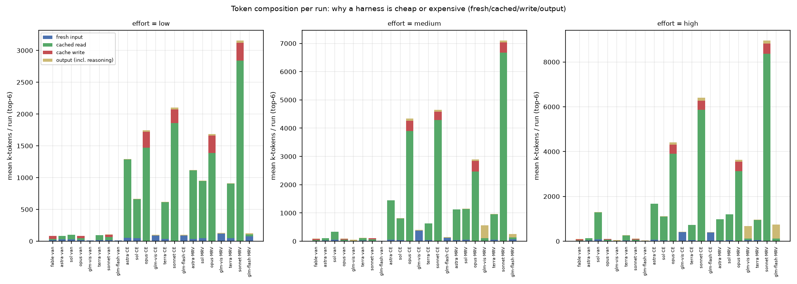
>
> **Takeaway:** the frontier harnesses are input-cache machines — roughly 75–90% of their tokens are cached
> reads at a tenth of list input price — while the GLM harnesses simply burn 10–20× fewer tokens.

The frontier harnesses are *input-cache* machines —
opus-5 CE/MRV burn 1.7–4.4M tokens per PR, ~75–90% of them **cached reads at 10% of list input**
($0.50/Mtok), which is why their blended rate drops to 0.14–0.18 ¢ per k-token ($0.0014–$0.0018). The GLM harnesses burn
10–20× fewer total tokens (100–570k/PR) at list input rates ($1.40 fresh / $0.26 cached for
vision). Both arrive at *cheap per token*; they differ by ~13× in $ per PR review at the
recommendation point (vision-MRV $0.22 vs opus-CE $2.95) and by ~13× in tokens per task against
the opus *harness* cells (T7). The vanilla cells are trivially cheap per task because a single
call is ~100k tokens — but they find the fewest real issues (T4 recall deltas).

#### 3.4.4 Wall-clock

> **Figure 3.4c — Wall-clock per review** *(static figure)*
>
> How to read: per-cell wall-clock seconds per PR review (median with CI), at each effort level. The same
> numbers appear in the wall column of T2.
>
> 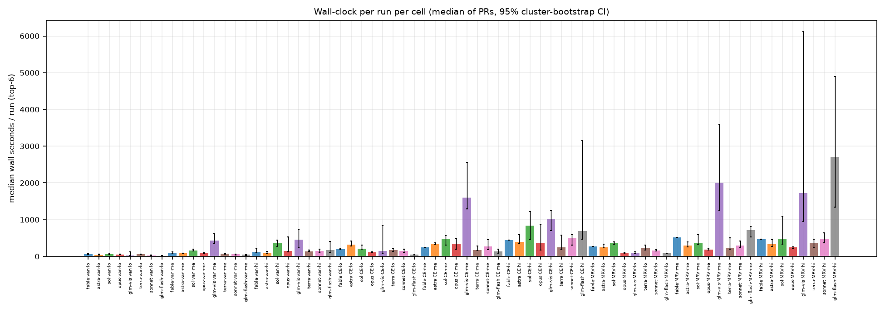
>
> **Takeaway:** at low effort the GLM cells are latency-competitive (`glm-vis MRV low` 95 s/run vs
> `opus-5 CE low` 110 s); at medium and high effort the GLM lane is gateway-throughput-limited — an
> operational difference, not a quality one (§3.5.5).

At **low effort** the recommendation
cells are latency-competitive with everything: glm-vis MRV low 95 s/run [77, 114] vs opus-5 CE low
110 s [99, 121] and opus-5 MRV low 100 s [91, 108]. At **medium/high effort the GLM lane is
throughput-limited by the gateway** (glm-vis MRV medium 2,282 s [1,458, 3,305]; glm-flash MRV high
2,984 s) — an operational, not quality, difference (§3.5.5).

#### 3.4.5 The efficiency frontier (headline figure)

Both figures below are rebuilt on the **true golden set** (§3.1: 42 goldens + 105 individually
test-verified distinct defects = 147) and both use **F2′ — our evaluator** (recall weighted 4:1, nitpick-charged
precision) for the quality axis, with the axis capped at 0.5 so the distribution is readable. A
strict-benchmark version of each figure remains in git history (data freeze 2026-09-16).

> **Figure 3.4d — The efficiency frontier: cost vs recall, and cost vs F2′** *(interactive — toggle the key
> to isolate families; hover points for cell values)*
>
> How to read: every complete cell plotted as metered dollars per real finding (log x) against recall (left
> panel) and F2′ (right panel), both with 95% CIs; the frontier is the upper-left envelope. The axis is
> capped at 0.5 so the distribution stays readable.
>
> 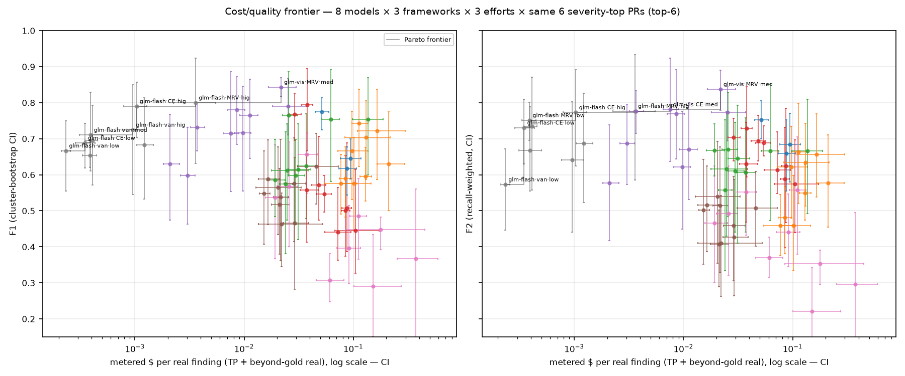
>
> **Takeaway:** the F2′ frontier is entirely GLM cells, while the recall frontier ends at the premium
> `opus · CE · medium` cell — two different purchases: recall is what the opus cell buys, F2′-per-dollar is
> what the GLM cells buy.

The frontier figure plots every complete cell as (metered $ per real
finding = TP + beyond-gold real, log scale) vs **recall** (left) and **F2′** (right), both with 95% CIs.
The **recall frontier is not entirely GLM**: glm-flash van/CE low, glm-flash MRV low, glm-flash MRV high,
glm-vis CE medium, and **opus CE medium** — the overall recall maximum (0.599 at $0.072/real) — so the
premium-model harness cell still buys recall that no GLM cell reaches. The **F2′ frontier is entirely
GLM**: glm-flash van/CE low, glm-flash MRV low, glm-flash CE high, glm-flash MRV high, glm-vis MRV low,
and glm-vis CE medium (the F2′ maximum, 0.494). Read the two panels as different purchases: recall is
what the opus cell buys; F2′-per-dollar is what the GLM cells buy. On value for money: among
sub-$0.30/run cells the best F2′-per-dollar is `glm-flash · MRV · low` (~18.5 F2′ per dollar at $0.024/run,
against glm-vis MRV low's ~2.1 at $0.22); the frontier-model harness cells (opus CE/MRV,
sonnet CE/MRV, fable CE/MRV-gap cells) are dominated on both axes by the GLM harness cells in the F2′
panel — but not in the recall panel, where opus CE medium holds the frontier.

> **Figure 3.4e — Four views of efficiency** *(static figure)*
>
> How to read: four panels, every point with its 95% CI — **(a)** price/performance ($ per PR review vs
> F2′), **(b)** F2′ per dollar, **(c)** F2′ vs wall-clock per run, **(d)** $ per true bug found vs recall.
>
> 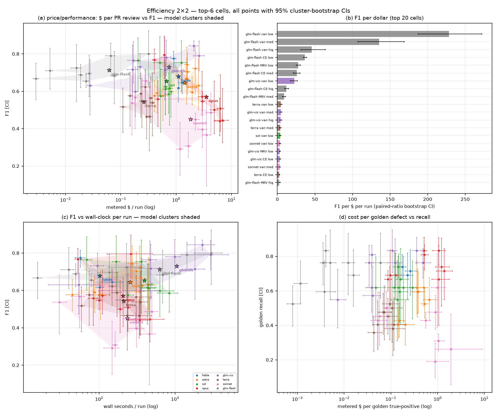
>
> **Takeaway:** panel (d) is the buyer's panel — the GLM harness cells buy F2′ for a small fraction of what
> the frontier-model cells pay — while the recall axis in panel (a) still favours the premium cells.

The four-panel efficiency view puts every point with its
95% CI: **(a)** price/performance ($ per PR review vs F2′ — how much quality a dollar buys *per
review*), **(b)** F2′ per $ (approx CI = F2′ CI / cost point), **(c)** F2′ vs wall-clock per
run (latency/quality; the low-effort GLM cells sit in the fast/high-F2′ corner), and
**(d)** $ per true bug found vs recall (true golden set; the buyer's panel: what a caught real
bug costs, against how many are caught).

> **Figure 3.4f — What a caught real bug costs** *(static figure)*
>
> How to read: dollars per true bug found (true golden set: 42 goldens + 105 verified defects) against
> recall, per cell, with 95% CIs.
>
> 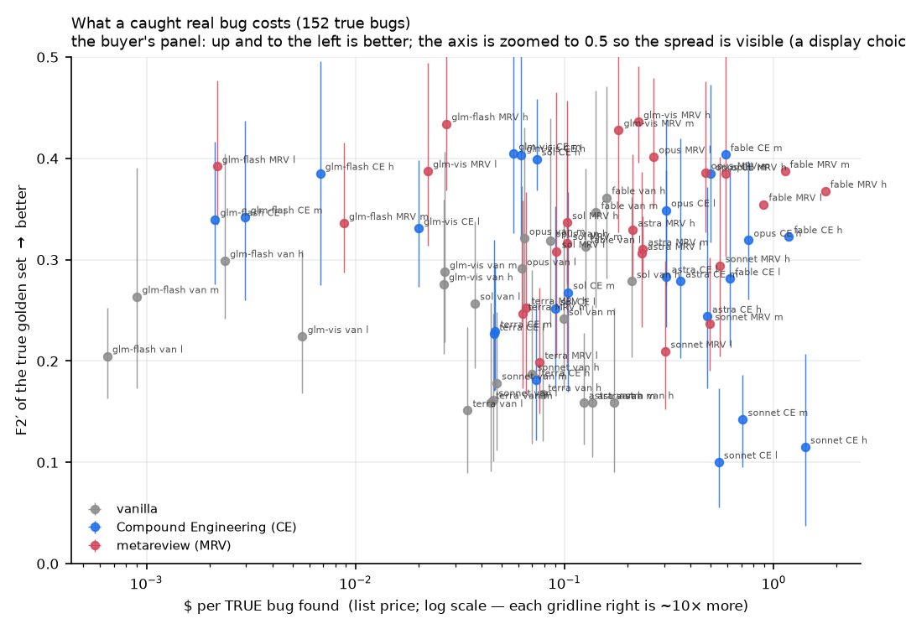
>
> **Takeaway:** the harness cells' cheap end is very cheap per real bug (GLM rows), and the premium
> frontier cells pay multiples of that for their recall — the same trade as figure 3.4d, from the
> cost-per-bug side.

**Interactive versions of all main figures** — single-file HTML, no server needed:
`analysis/figures/interactive_dashboard.html` (open in any browser; built by
`tools/final_report_html.py`). A single global filter key area (checkboxes for all 8 models, 3 frameworks, 3 efforts)
drives every panel at once. All quality metrics presented are the expanded (real-world)
numbers; strict benchmark numbers appear as the comparison (panel 1f). Sections: five independent panels, each its own test with a
question-as-title, how-to-read note, own CI toggle (off by default), own chart, takeaway
callout and click-details card —
(1a) price/performance ($/run vs F2′); (1b) latency/quality (wall vs F2′); (1c) cost per true bug
($/TP vs recall); (1d) cost per real finding ($/real vs F1); (1e) token volume (tokens/run vs F1);
(1f) strict-vs-expanded recall dumbbell (the hidden-gold flip); (2) effort ladder per framework;
(3) token composition
per effort; (4) sample-bias check — a dumbbell chart of the pairs (full-50 gray vs top-6 colored,
sorted by gap, recall/F1 toggle); (5) per-PR selection view (severity vs recall, the six chosen
PRs in bold color). Style follows the OWID/NYT minimal-chrome school:
direct annotation of the recommendation cell, muted palette, no chartjunk, all uncertainty
visible.


### 3.5 The five claims, tested


#### 3.5.1 Harnesses spend more tokens but find more bugs — both numbers, always

Across 42 harness-vs-vanilla pairs on the same 6 PRs:

#### T4 — harness vs vanilla, paired on the same 6 PRs (Δrecall CI; token ×; cost ×)

| cell (model fw effort) | Δrecall [CI] | token × [CI] | cost × [CI] |
|---|---|---|---|
| astra CE low | +0.12 [+0.04, +0.22] | 15.7× [14.4, 16.9] | 4.7× [4.3, 5.2] |
| astra CE medium | +0.19 [+0.09, +0.30] | 13.1× [11.7, 14.7] | 4.9× [4.5, 5.4] |
| astra CE high | +0.14 [+0.00, +0.32] | 12.1× [8.2, 17.1] | 4.4× [3.5, 5.7] |
| astra MRV low | +0.21 [+0.10, +0.33] | 13.6× [12.6, 14.8] | 3.8× [3.5, 4.2] |
| astra MRV medium | +0.17 [+0.10, +0.23] | 10.2× [8.6, 11.9] | 3.6× [3.2, 3.9] |
| astra MRV high | +0.19 [+0.09, +0.31] | 7.1× [5.5, 8.8] | 2.7× [2.3, 3.1] |
| sol CE low | -0.07 [-0.24, +0.18] | 6.5× [5.6, 7.6] | 2.6× [2.2, 2.9] |
| sol CE medium | +0.00 [-0.16, +0.19] | 2.4× [1.6, 4.0] | 1.3× [1.0, 1.7] |
| sol CE high | +0.12 [-0.02, +0.25] | 0.9× [0.5, 1.7] | 0.6× [0.4, 0.9] |
| sol MRV low | -0.02 [-0.16, +0.19] | 9.3× [8.2, 10.5] | 3.1× [2.7, 3.5] |
| sol MRV medium | +0.05 [-0.17, +0.30] | 3.4× [2.4, 5.5] | 1.5× [1.2, 1.9] |
| sol MRV high | +0.00 [-0.09, +0.10] | 0.9× [0.7, 1.6] | 0.6× [0.5, 0.8] |
| opus-5 CE low | +0.14 [+0.02, +0.25] | 20.4× [17.8, 22.9] | 7.3× [6.6, 7.9] |
| opus-5 CE medium | +0.14 [+0.00, +0.31] | 48.9× [36.1, 64.3] | 13.1× [10.9, 15.2] |
| opus-5 CE high | +0.02 [-0.09, +0.16] | 40.6× [31.0, 52.5] | 11.4× [8.5, 13.9] |
| opus-5 MRV low | +0.17 [+0.07, +0.28] | 19.6× [17.9, 21.5] | 7.4× [6.8, 8.0] |
| opus-5 MRV medium | -0.02 [-0.30, +0.21] | 32.6× [27.8, 38.0] | 10.4× [9.5, 11.5] |
| opus-5 MRV high | +0.05 [-0.11, +0.24] | 33.5× [23.2, 46.9] | 10.3× [9.0, 12.1] |
| glm-vis CE low | +0.21 [+0.06, +0.39] | 7.5× [7.1, 8.0] | 6.6× [6.2, 7.1] |
| glm-vis CE medium | +0.21 [+0.11, +0.30] | 8.2× [7.7, 9.0] | 3.7× [3.4, 4.2] |
| glm-vis CE high | +0.19 [+0.09, +0.33] | 9.0× [7.4, 11.0] | 4.1× [3.4, 5.0] |
| glm-vis MRV low | +0.26 [+0.12, +0.41] | 9.6× [9.1, 10.1] | 8.0× [7.4, 8.5] |
| glm-vis MRV medium | +0.21 [+0.11, +0.31] | 11.7× [9.2, 15.2] | 12.4× [9.2, 17.3] |
| glm-vis MRV high | +0.19 [+0.08, +0.33] | 14.3× [10.8, 20.5] | 15.9× [11.4, 24.0] |
| terra CE low | +0.12 [+0.00, +0.20] | 6.4× [5.3, 7.8] | 2.1× [1.9, 2.4] |
| terra CE medium | +0.07 [-0.11, +0.24] | 5.3× [4.1, 6.7] | 1.6× [1.4, 1.8] |
| terra CE high | -0.07 [-0.14, -0.02] | 2.7× [1.8, 4.2] | 1.1× [0.9, 1.3] |
| terra MRV low | +0.05 [-0.05, +0.15] | 9.4× [7.7, 11.3] | 3.0× [2.5, 3.7] |
| terra MRV medium | +0.12 [-0.11, +0.31] | 8.0× [6.5, 9.9] | 2.4× [2.2, 2.5] |
| terra MRV high | +0.05 [-0.14, +0.21] | 3.6× [2.2, 5.7] | 1.4× [1.0, 1.7] |
| sonnet-5 CE low | -0.24 [-0.49, +0.02] | 19.8× [16.9, 22.7] | 7.4× [6.6, 8.2] |
| sonnet-5 CE medium | -0.14 [-0.30, +0.05] | 42.9× [32.1, 54.5] | 12.4× [10.6, 14.3] |
| sonnet-5 CE high | -0.24 [-0.46, -0.04] | 54.4× [42.0, 67.5] | 12.6× [11.0, 14.3] |
| sonnet-5 MRV low | +0.00 [-0.18, +0.17] | 29.8× [23.6, 36.1] | 10.4× [8.8, 11.9] |
| sonnet-5 MRV medium | +0.02 [-0.13, +0.16] | 65.6× [48.9, 86.1] | 16.4× [13.5, 19.7] |
| sonnet-5 MRV high | +0.12 [+0.00, +0.26] | 76.1× [58.8, 95.2] | 15.2× [12.3, 18.3] |
| glm-flash CE low | +0.24 [+0.11, +0.38] | 7.4× [7.1, 7.8] | 6.4× [6.0, 6.9] |
| glm-flash CE medium | +0.12 [+0.00, +0.25] | 7.8× [7.2, 8.5] | 5.1× [4.5, 5.7] |
| glm-flash CE high | +0.17 [+0.10, +0.24] | 10.0× [8.6, 12.2] | 4.1× [3.6, 5.1] |
| glm-flash MRV low | +0.31 [+0.18, +0.49] | 9.4× [9.1, 9.7] | 8.1× [7.2, 8.8] |
| glm-flash MRV medium | +0.05 [-0.05, +0.17] | 14.0× [13.2, 15.1] | 14.5× [13.5, 15.7] |
| glm-flash MRV high | +0.17 [+0.05, +0.30] | 18.6× [13.7, 25.2] | 20.1× [14.1, 28.7] |

Summary: median token multiple **10.1×**
(van 3.5k–100k tokens → harness 100k–4.6M), median Δrecall **+0.12**; resolved positive
(CI excludes 0) in 17/42 pairs, negative in 2 (sonnet CE high and terra CE high), unresolved in 23. Cost
multiples 0.6×–20×. The pairs where the harness pays for itself in recall are opus-5 (CE low
+0.14 [0.02, 0.25] at 20× tokens), the GLM rows (vision MRV low +0.26 [0.12, 0.41] at 9.6×
tokens, 8.0× cost; flash MRV low +0.31 [0.18, 0.49] at 9.4× tokens, 8.1× cost) and astra
(MRV low +0.21 [0.10, 0.33] at 13.6× tokens). sol/terra pairs: token multiples with recall gains
inside noise — a frontier single pass is already near these harnesses' ceilings on hard PRs.

#### 3.5.2 Per-token price vs per-task cost — the operator's "~1/200th" is not supported

Measured (blended $/ktok from actual token mixes, low effort, same 6 PRs):

#### T7 — cost-structure ratios (all pairs, low effort unless stated): per-token / tokens-per-task / net cost-per-task

| glm cell vs frontier cell | per-token (glm/frontier) [CI] | tokens/task [CI] | cost/task [CI] |
|---|---|---|---|
| glm-5.3-flash-background|metareview-realistic|low vs claude-fable-5-1|vanilla-engineered|low | 0.01738 [0.01623, 0.01883] | 1.5× [1.4, 1.6] | 0.02616 [0.02439, 0.02746] |
| glm-5.3-vision-background|metareview-realistic|low vs claude-fable-5-1|vanilla-engineered|low | 0.15598 [0.14958, 0.16257] | 1.6× [1.5, 1.7] | 0.24631 [0.23054, 0.26338] |
| glm-5.3-flash-background|metareview-realistic|low vs claude-opus-5|vanilla-engineered|low | 0.03924 [0.0357, 0.04267] | 1.5× [1.4, 1.5] | 0.05828 [0.05263, 0.0625] |
| glm-5.3-vision-background|metareview-realistic|low vs claude-opus-5|vanilla-engineered|low | 0.35213 [0.3414, 0.36389] | 1.6× [1.5, 1.6] | 0.54874 [0.5264, 0.56933] |
| glm-5.3-flash-background|metareview-realistic|low vs gpt-6-astra|vanilla-engineered|low | 0.03704 [0.03441, 0.03983] | 1.5× [1.3, 1.7] | 0.0574 [0.04873, 0.0677] |
| glm-5.3-vision-background|metareview-realistic|low vs gpt-6-astra|vanilla-engineered|low | 0.33238 [0.30127, 0.36598] | 1.6× [1.5, 1.8] | 0.54042 [0.4753, 0.61013] |
| glm-5.3-vision-background|metareview-realistic|low vs claude-opus-5|metareview-realistic|medium | 2.16674 [2.046, 2.30426] | 0.2× [0.2, 0.3] | 0.42555 [0.35759, 0.53967] |


Key rows:

- glm-flash MRV low vs fable-5.1 vanilla low: per-token **1/57** (0.017 [0.016, 0.019] of fable's
  blended rate), tokens/task **1.5×**, net cost/task **1/38** (0.026 [0.024, 0.028]).
- glm-flash MRV low vs opus-5 vanilla low: per-token **1/26**, tokens/task 1.5×, cost/task **1/17**.
- glm-vis MRV low vs opus-5 vanilla low: per-token **0.35** (NOT 1/200 — opus vanilla is a
  high-volume single call at list rates), tokens/task 1.6×, cost/task **0.55**.
- Against *harness* frontier cells the picture flips: glm-vis MRV low vs opus-5 MRV medium:
  glm is **2.2× more expensive per token** (opus harness is 78% cache reads at $0.50) but uses
  1/5 the tokens, net cost/task 0.43.

The correct summary is not "1/200th per token" but: **the flash tier is ~1/25–1/60 of frontier
per blended token and ~1/17–1/40 per task; the vision tier is ~1/3 of frontier per token vs
vanilla but wins on per-task cost only against harness-volume frontier cells.** Token overhead
partly (not fully) offsets the cheap rate — that is why both ratios must be quoted together.

#### 3.5.3 Higher thinking budgets do not reliably buy more bugs — a null result, stated as one

22 high-vs-medium paired comparisons:

#### T5 — effort ladder: high vs medium, paired (ΔF1 CI; Δrecall CI; cost high/medium)

| model × framework | ΔF1 [CI] | Δrecall [CI] | cost high/med |
|---|---|---|---|
| fable-5.1 van | +0.03 [-0.04, +0.10] | +0.02 [-0.07, +0.15] | 1.17× [1.04, 1.37] |
| astra van | -0.01 [-0.11, +0.06] | -0.02 [-0.11, +0.05] | 1.27× [1.07, 1.55] |
| astra CE | -0.09 [-0.21, -0.01] | -0.07 [-0.18, +0.00] | 1.16× [1.09, 1.23] |
| astra MRV | -0.04 [-0.16, +0.10] | +0.00 [-0.07, +0.07] | 0.96× [0.83, 1.10] |
| sol van | +0.00 [-0.12, +0.14] | +0.00 [-0.16, +0.19] | 2.45× [1.71, 3.37] |
| sol CE | -0.03 [-0.13, +0.10] | +0.12 [-0.02, +0.29] | 1.15× [0.97, 1.32] |
| sol MRV | -0.02 [-0.11, +0.08] | -0.05 [-0.17, +0.05] | 1.06× [0.97, 1.18] |
| opus-5 van | +0.24 [+0.08, +0.39] | +0.00 [-0.14, +0.15] | 1.30× [1.20, 1.42] |
| opus-5 CE | +0.00 [-0.14, +0.14] | -0.12 [-0.24, -0.02] | 1.13× [0.80, 1.54] |
| opus-5 MRV | +0.01 [-0.03, +0.08] | +0.07 [+0.02, +0.13] | 1.28× [1.21, 1.35] |
| glm-vis van | -0.05 [-0.22, +0.09] | -0.05 [-0.26, +0.11] | 0.96× [0.92, 1.01] |
| glm-vis CE | +0.07 [-0.05, +0.15] | -0.07 [-0.13, -0.02] | 1.05× [0.96, 1.15] |
| glm-vis MRV | -0.05 [-0.12, +0.01] | -0.07 [-0.17, +0.00] | 1.24× [1.11, 1.36] |
| terra van | +0.05 [-0.11, +0.21] | +0.05 [-0.11, +0.20] | 1.86× [1.50, 2.31] |
| terra CE | -0.08 [-0.28, +0.09] | -0.10 [-0.33, +0.10] | 1.22× [1.13, 1.35] |
| terra MRV | -0.03 [-0.16, +0.17] | -0.02 [-0.17, +0.18] | 1.07× [0.95, 1.17] |
| sonnet-5 van | +0.09 [+0.01, +0.18] | +0.05 [-0.04, +0.13] | 1.54× [1.38, 1.70] |
| sonnet-5 CE | -0.08 [-0.34, +0.11] | -0.05 [-0.25, +0.15] | 1.57× [1.29, 1.89] |
| sonnet-5 MRV | +0.09 [-0.07, +0.26] | +0.14 [-0.09, +0.39] | 1.43× [1.12, 1.86] |
| glm-flash van | +0.01 [-0.10, +0.10] | -0.05 [-0.17, +0.08] | 3.01× [2.27, 3.74] |
| glm-flash CE | +0.09 [+0.01, +0.20] | +0.00 [-0.13, +0.10] | 2.44× [2.18, 2.73] |
| glm-flash MRV | +0.12 [+0.03, +0.18] | +0.07 [-0.03, +0.15] | 4.17× [3.09, 5.35] |

Summary: **17 not resolved by this sample**; 4 resolved positive
(opus-5 vanilla ΔF1 +0.24 [0.08, 0.39] at 1.30× cost; sonnet-5 vanilla +0.09 [0.01, 0.18] at 1.54×;
glm-flash CE +0.09 [0.01, 0.20] at 2.44×; glm-flash MRV +0.12 [0.03, 0.18] at 4.17×); 1 resolved
**negative** (astra CE ΔF1 −0.09 [−0.21, −0.01] at 1.16× cost — high effort made it worse).
Cost multiples for unresolved pairs are 0.96×–3.0×. A buyer pays 0.96×–4.2× for high vs medium and
in 18/22 model×framework cases cannot measure a quality difference on 6 PRs. For the GLM rows the
cost multiple is the steepest (reasoning tokens at output price) with the least demonstrated gain.

#### 3.5.4 Too little capability collapses recall — the floor exists, and where it starts

Within the matrix, flash-vs-vision:

#### T6 — glm-flash vs glm-vision, paired on the same 6 PRs (Δ from vision → flash)

| framework × effort | Δrecall [CI] | Δ real findings [CI] |
|---|---|---|
| van low | -0.02 [-0.18, +0.15] | -5 [-12, +5] |
| van medium | +0.02 [-0.10, +0.13] | -10 [-16, -2] |
| van high | +0.02 [-0.10, +0.18] | -1 [-21, +19] |
| CE low | +0.00 [-0.15, +0.12] | -39 [-62, -16] |
| CE medium | -0.07 [-0.18, +0.04] | -104 [-179, -45] |
| CE high | +0.00 [-0.07, +0.07] | -81 [-114, -46] |
| MRV low | +0.02 [-0.05, +0.11] | +3 [-56, +64] |
| MRV medium | -0.14 [-0.28, -0.02] | -201 [-266, -141] |
| MRV high | +0.00 [-0.14, +0.12] | -83 [-158, -21] |

Summary: golden recall is statistically indistinguishable at
low/high effort (Δrecall CIs include 0 in 8/9 cells; the exception is MRV medium, vision
+0.14 [0.02, 0.28]) — but **beyond-gold real findings drop sharply for flash**: −39 [−62, −16]
(CE low), −104 [−179, −45] (CE medium), −201 [−266, −141] (MRV medium) per cell (6 PRs). Flash
finds the goldens' core but surfaces far less of the surrounding real-issue space; its adjP is
also lower (more noise). Below the matrix, the legacy rows show the collapse outright: glm-5.2-
vision-flex vanilla on the top-6 recalls **0.28** (medium, n=5) / 0.45 (xhigh, n=6) and ~3
real/PR vs glm-vis vanilla's 0.55–0.62 and 9.5–12.7/PR; kimi-k3 and gpt-5.2 have 1–2 healthy
top-6 runs (unusable as cells). The capability floor sits between glm-5.2 and glm-5.3; **flash is
inside the safe zone for golden recall but measurably weaker on breadth where that drop is demonstrated**
(CE low/medium and MRV medium; at MRV low the delta is +3 [−56, +64] — no demonstrated drop).

#### 3.5.5 The recommendation (supported by this sample, with its stop-holding conditions)

**glm-5.3-vision-background @ metareview-realistic, low effort** is the best measured cost/benefit point:

#### T8 — recommendation ratios (glm @ low vs frontier reference cells, same 6 PRs)

| glm cell (A) vs frontier cell (F) | recall A/F [CI] | F1 A/F [CI] | cost A/F [CI] |
|---|---|---|---|
| glm-5.3-vision-background/metareview-realistic/low vs claude-opus-5/compound-realistic/low | 1 [0.91176, 1.08824] | 1.27957 [1.00385, 1.58151] | 0.07521 [0.06665, 0.0854] |
| glm-5.3-vision-background/metareview-realistic/low vs claude-opus-5/compound-realistic/high | 1.13333 [1, 1.41667] | 1.64516 [1.21722, 2.11846] | 0.03195 [0.02662, 0.04035] |
| glm-5.3-vision-background/metareview-realistic/low vs claude-fable-5-1/vanilla-engineered/low | 1.09677 [1.0303, 1.17241] | 0.94346 [0.87179, 1.05266] | 0.24631 [0.23078, 0.26308] |
| glm-5.3-vision-background/metareview-realistic/low vs gpt-6-astra/metareview-realistic/high | 1.36 [1.19355, 1.68421] | 1.09677 [0.98217, 1.2713] | 0.14304 [0.12475, 0.16081] |
| glm-5.3-vision-background/metareview-realistic/low vs gpt-5.6-sol/compound-realistic/low | 1.47826 [1.09677, 2.5] | 1.27162 [1.07563, 1.82039] | 0.42249 [0.39341, 0.45586] |
| glm-5.3-flash-background/metareview-realistic/low vs claude-opus-5/compound-realistic/low | 1.02941 [1, 1.09677] | 1.14486 [0.91271, 1.4412] | 0.00799 [0.00731, 0.00882] |
| glm-5.3-flash-background/metareview-realistic/low vs claude-opus-5/compound-realistic/high | 1.16667 [1.05263, 1.34783] | 1.47196 [1.04245, 1.98058] | 0.00339 [0.00251, 0.00465] |
| glm-5.3-flash-background/metareview-realistic/low vs claude-fable-5-1/vanilla-engineered/low | 1.12903 [1.05714, 1.21429] | 0.84414 [0.79205, 0.89598] | 0.02616 [0.02446, 0.02746] |
| glm-5.3-flash-background/metareview-realistic/low vs gpt-6-astra/metareview-realistic/high | 1.4 [1.21212, 1.76471] | 0.98131 [0.81731, 1.20743] | 0.01519 [0.01291, 0.01747] |
| glm-5.3-flash-background/metareview-realistic/low vs gpt-5.6-sol/compound-realistic/low | 1.52174 [1.15625, 2.38462] | 1.13775 [0.89697, 1.67821] | 0.04487 [0.03885, 0.05144] |
| glm-5.3-vision-background/compound-realistic/low vs claude-opus-5/compound-realistic/low | 0.94118 [0.86667, 1] | 1.04673 [0.7195, 1.43089] | 0.06226 [0.05541, 0.07163] |
| glm-5.3-vision-background/compound-realistic/low vs claude-opus-5/compound-realistic/high | 1.06667 [1, 1.17391] | 1.34579 [0.91295, 1.85714] | 0.02645 [0.02232, 0.03314] |
| glm-5.3-vision-background/compound-realistic/low vs claude-fable-5-1/vanilla-engineered/low | 1.03226 [0.92857, 1.13333] | 0.77178 [0.62842, 0.93683] | 0.20391 [0.1878, 0.22124] |
| glm-5.3-vision-background/compound-realistic/low vs gpt-6-astra/metareview-realistic/high | 1.28 [1.18182, 1.47368] | 0.8972 [0.76128, 1.02788] | 0.11841 [0.10451, 0.13279] |
| glm-5.3-vision-background/compound-realistic/low vs gpt-5.6-sol/compound-realistic/low | 1.3913 [1.1, 2.07143] | 1.04023 [0.8139, 1.49083] | 0.34976 [0.32092, 0.38138] |
| glm-5.3-flash-background/compound-realistic/low vs claude-opus-5/compound-realistic/low | 0.94118 [0.8, 1.0625] | 1.2043 [0.87772, 1.56202] | 0.00638 [0.00572, 0.00723] |
| glm-5.3-flash-background/compound-realistic/low vs claude-opus-5/compound-realistic/high | 1.06667 [0.84202, 1.36] | 1.54839 [1.09047, 2.13862] | 0.00271 [0.00226, 0.00339] |
| glm-5.3-flash-background/compound-realistic/low vs claude-fable-5-1/vanilla-engineered/low | 1.03226 [0.92857, 1.13333] | 0.88796 [0.80049, 0.98551] | 0.0209 [0.01962, 0.02232] |
| glm-5.3-flash-background/compound-realistic/low vs gpt-6-astra/metareview-realistic/high | 1.28 [1, 1.68421] | 1.03226 [0.82022, 1.33796] | 0.01214 [0.01063, 0.01368] |
| glm-5.3-flash-background/compound-realistic/low vs gpt-5.6-sol/compound-realistic/low | 1.3913 [1, 2.15385] | 1.19682 [0.89893, 1.8263] | 0.03585 [0.03301, 0.03922] |


Headline ratios: recall **1.00×** [0.91, 1.09] of opus-5 CE low (0.81 vs 0.81), F1 **1.28×** [1.00, 1.58]
(0.73 vs 0.57), at **7.5%** [6.7, 8.5] of its metered cost ($0.22 vs $2.95/run; $0.039 vs $0.52
per golden TP; $0.0037 vs $0.048 per real finding) and comparable wall-clock (95 s vs 110 s). vs
opus-5 CE high: recall 1.13×, F1 1.65×, at **3.2%** of cost. vs fable-5.1 vanilla low: recall
1.10× at 24.6% of cost. glm-flash MRV low is the budget option: recall 1.03× of opus CE low at
**0.8%** of its cost, adjP 0.54 (more noise to triage).

**Conditions under which this stops holding** (measured, not speculative): (1) *Gateway
throughput* — at medium/high effort the GLM lane ran 4–12× slower than the frontier cells at the *same*
  effort (up to ~30× against the fastest frontier *low*-effort cell)
(§3.4.4) and the 2026-09-14/15 incident showed the cheap lane's capacity limits; the
recommendation is a **low-effort** recommendation. (2) *Pre-fix infrastructure confound* — the
headline GLM cells predate the gateway/SDK fixes (§2.3.4); quality direction unknown, likely
operational. (3) *Breadth* — if beyond-gold real findings matter (they do for review value),
vision-tier not flash (§3.5.4). (4) *The top-6 sample* — hard-PR-weighted; §2.4.2 shows recall
generalises but harness adjP does not (top-6 overstates harness F1 by ~+0.08; the glm-vis MRV low
full-50 F1 is 0.57 vs top-6 0.73 — the *ranking* survives, the level does not). (5) *Single
judge family per row and k=1 adjudication* (§2.3.1, §4).


### 3.6 Selection effect and sampling


#### T3 — selection effect: top-6 vs full-50 (cells with ≥40/50 healthy scored PRs)

| cell | n | recall top-6 | recall full | F1 top-6 | F1 full | F1 full [CI] |
|---|---|---|---|---|---|---|
| fable-5.1 van low | 50 | 0.74 | 0.65 | 0.78 | 0.70 | 0.70 [0.64, 0.75] |
| astra van low | 48 | 0.40 | 0.36 | 0.58 | 0.53 | 0.53 [0.45, 0.61] |
| astra van medium | 48 | 0.43 | 0.37 | 0.59 | 0.53 | 0.53 [0.44, 0.61] |
| astra van high | 48 | 0.40 | 0.38 | 0.58 | 0.55 | 0.55 [0.46, 0.63] |
| sol van low | 50 | 0.62 | 0.48 | 0.76 | 0.62 | 0.62 [0.53, 0.70] |
| sol van medium | 50 | 0.62 | 0.65 | 0.75 | 0.75 | 0.75 [0.68, 0.82] |
| sol van high | 50 | 0.62 | 0.76 | 0.75 | 0.85 | 0.85 [0.80, 0.90] |
| sol CE low | 50 | 0.55 | 0.50 | 0.57 | 0.50 | 0.50 [0.42, 0.58] |
| sol CE medium | 50 | 0.62 | 0.63 | 0.61 | 0.53 | 0.53 [0.46, 0.60] |
| sol CE high | 50 | 0.74 | 0.64 | 0.58 | 0.51 | 0.51 [0.44, 0.58] |
| sol MRV low | 50 | 0.60 | 0.56 | 0.62 | 0.51 | 0.51 [0.44, 0.59] |
| sol MRV medium | 48 | 0.67 | 0.65 | 0.62 | 0.46 | 0.46 [0.38, 0.53] |
| sol MRV high | 50 | 0.62 | 0.65 | 0.60 | 0.48 | 0.48 [0.40, 0.55] |
| opus-5 CE low | 50 | 0.81 | 0.77 | 0.57 | 0.45 | 0.45 [0.38, 0.52] |
| opus-5 CE medium | 50 | 0.83 | 0.83 | 0.44 | 0.39 | 0.39 [0.32, 0.46] |
| opus-5 CE high | 50 | 0.71 | 0.82 | 0.44 | 0.36 | 0.36 [0.30, 0.43] |
| glm-vis CE low | 50 | 0.76 | 0.73 | 0.60 | 0.43 | 0.43 [0.38, 0.49] |
| glm-vis MRV low | 50 | 0.81 | 0.76 | 0.73 | 0.57 | 0.57 [0.52, 0.63] |
| terra van low | 50 | 0.36 | 0.39 | 0.52 | 0.55 | 0.55 [0.47, 0.62] |
| terra van medium | 47 | 0.40 | 0.44 | 0.58 | 0.59 | 0.59 [0.51, 0.66] |
| terra van high | 49 | 0.45 | 0.51 | 0.62 | 0.65 | 0.65 [0.58, 0.72] |
| terra CE low | 50 | 0.48 | 0.46 | 0.59 | 0.51 | 0.51 [0.45, 0.58] |
| terra CE medium | 50 | 0.48 | 0.46 | 0.55 | 0.51 | 0.51 [0.44, 0.58] |
| terra CE high | 50 | 0.38 | 0.49 | 0.46 | 0.51 | 0.51 [0.43, 0.58] |
| terra MRV low | 49 | 0.40 | 0.44 | 0.47 | 0.46 | 0.46 [0.37, 0.54] |
| terra MRV medium | 50 | 0.52 | 0.46 | 0.56 | 0.43 | 0.43 [0.36, 0.51] |
| terra MRV high | 50 | 0.50 | 0.50 | 0.54 | 0.46 | 0.46 [0.38, 0.53] |
| sonnet-5 CE low | 50 | 0.19 | 0.26 | 0.29 | 0.31 | 0.31 [0.24, 0.39] |
| sonnet-5 CE medium | 50 | 0.31 | 0.28 | 0.45 | 0.33 | 0.33 [0.25, 0.41] |
| sonnet-5 CE high | 50 | 0.26 | 0.34 | 0.37 | 0.37 | 0.37 [0.28, 0.45] |
| glm-flash CE low | 50 | 0.76 | 0.73 | 0.69 | 0.48 | 0.48 [0.42, 0.55] |
| glm-flash MRV low | 50 | 0.83 | 0.73 | 0.65 | 0.51 | 0.51 [0.45, 0.57] |
| glm-flash MRV medium | 50 | 0.69 | 0.69 | 0.68 | 0.67 | 0.67 [0.61, 0.73] |

Rank agreement (Spearman of model F1 ranks, top-6 vs full-50, within framework×effort):

| framework × effort | models with full rows | Spearman ρ |
|---|---|---|
| vanilla-engineered low | 4 | 0.80 |
| compound-realistic low | 6 | 0.37 |
| compound-realistic medium | 4 | 0.80 |
| compound-realistic high | 4 | 0.80 |
| metareview-realistic low | 4 | 0.80 |

Full sampling disclosure: `analysis/COVERAGE.md`.

Summary: 33 cells with ≥40/50 PRs back the
top-6 with full-50 runs; recall is unbiased (mean gap +0.006), harness F1 is overstated by +0.084
on average, model *rankings* mostly agree (Spearman 0.80 median; CE-low 0.37 the exception). The
fable compound/metareview cells are gaps (rate-cap), opus/sonnet vanilla are top-6-only by operator
decision, GLM partial fills were stopped at the data freeze.

> **Figure 3.6a — Does the six-PR sample distort the picture?** *(interactive — toggle the key to isolate
> cells; hover for values)*
>
> How to read: each point compares a cell's score on the selected six highest-severity PRs (y) with the
> same score on the full 50-PR benchmark (x). Points above the diagonal therefore did *better* on the
> selected six than on the full set — the opposite of a "these PRs were harder than average" reading.
>
> 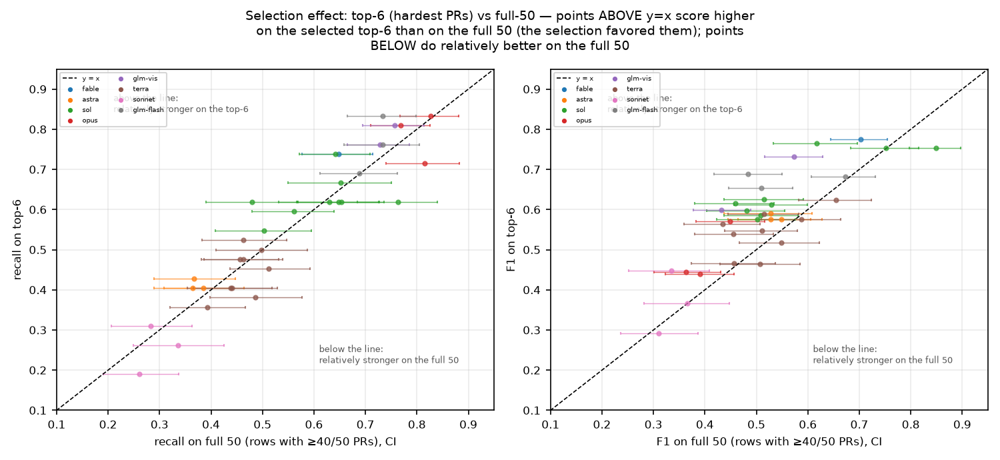
>
> **Takeaway:** recall is essentially unbiased by the selection (mean gap +0.006, median +0.014), while
> harness F1 is overstated by about +0.084 on average; model rankings mostly agree (Spearman 0.80 median).


### 3.7 Effort ladder and cost curves


> **Figure 3.7a — The effort ladder: does more thinking buy more quality?** *(static figure)*
>
> How to read: F1 against dollars per run for each model within each framework, with CIs on both axes.
> Movement up-and-right is buying quality with money; movement sideways is not.
>
> 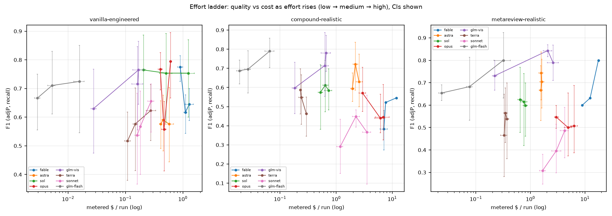
>
> **Takeaway:** the GLM rows buy F1 with dollars at low effort and then flatten, while the frontier rows
> start high-cost and mostly move sideways (§3.5.3) — higher thinking budgets do not reliably buy more bugs.
> Cost per cell is figure 3.4a.


## 4. What we cannot claim


1. **Fable harness cells do not exist** (rate-capped ~3 days; 29 hitlist rows outstanding) — fable
   harness numbers in T1/T2 are gaps, not results.
2. **n = 1 run per cell×PR**: cluster bootstrap quantifies *PR-sampling* variance only;
   run-to-run LLM variance is not in these CIs (`tools/eval_adjudicator.py`,
   `analysis/score_flips.py` outputs, and `analysis/ADJUDICATOR_INTERRATER.md` measure judge-side
   variance only). Some vanilla cells have duplicate runs (coverage doc) that we did not pool.
3. **Single judge family per row**; cross-judge sensitivity only partially measured. gpt-5.2's
   ~55–61% run-to-run self-agreement and the 0.80 intra-5.6-generation agreement cluster are
   documented in `analysis/ADJUDICATOR_INTERRATER.md` (the latter is shared-error convergence,
   not correctness).
4. **k=1 adjudication** (campaign lock): v3.1 clustering removes phrasing flips, but single-vote
   residual noise remains; §2.3.3's v1-vs-rj3 deltas bound the *instrument* risk, not vote noise.
5. **Provider incident** (§2.3.4): all GLM top-6 harness cells contain pre-fix runs.
6. **Matched-excluded / profiles**: all headline numbers are All-profile (see §2.1); Core/Strict
   differ by ≤1 golden on this PR set.
7. **Cost is metered list price**, not our invoice (gateway flat fee); retries are inside
   `per_model_usage` for in-run calls, but gateway-level *failed-call* overhead (~5.4k failed GLM
   calls in the ledger, `tools/key_usage_report.py`) is excluded from per-run figures and is an
   operational surcharge on the cheap lane during the incident window.
8. **The golden set is a floor, not a ceiling**: beyond-gold real findings (10–96/PR for harness
   cells) are real but their developer value is unmeasured (`analysis/ADVISORY_RECALIBRATION.md`,
   `tools/enum_advisory_ceiling.py`; human-preference study not done).


## 5. Reproducibility


Three distinct modes — do not conflate them:

| mode | what it means | where |
|---|---|---|
| **(i) Recompute published statistics** | deterministic, offline, no keys: rebuild every number/CI/table in this report from the saved inputs | §5.1–§5.2 below |
| **(ii) Re-execute saved defect tests** | run the archived failing-test/fix bundles for the 105 verified defects against the pinned PR revisions | `analysis/verified_gold/REPLICATION_KIT.md` (per-bundle `REPRO.md`, toolchain pins, tarball SHA-256s) |
| **(iii) Regenerate model judgments** | the LLM steps (Appendix A clustering, Appendix A overlap checks, §3.1 defect verification, §3.1′ finding→defect assignment) are nondeterministic — **not reproducible by re-running; the stored artifacts are the record** | §5.3 below |

### 5.1 Setup

Tested environment (2026-09-18): **Python 3.14.7, numpy 2.5.2, matplotlib 3.11.1** — pinned exactly in
`requirements.txt`. The chain below is deterministic and offline; only mode (iii) artifacts can differ by
re-running.

```bash
git clone https://github.com/dsifry/harnesseval.git && cd harnesseval
git checkout report-2026-09-18    # the report pin — clone at the tagged revision, not the drifting HEAD
python3 -m venv .venv
.venv/bin/pip install -r requirements.txt     # numpy + matplotlib — the published numbers need nothing else
```

The content revisions this report revision comprises are the 2026-09-18 commit series starting at
`d8645b27` ("post-audit revision"); the `report-2026-09-18` tag pins the final state, including this
hash record and the checksum table below.

**To re-run an eval yourself** (not needed to reproduce the published numbers, which are stored), see
`INSTALL.md` §3.4–§3.5: install the harness deps (`pip install -e .`), provide the pinned `third_party/` checkout
(or authenticated `gh` for PR diffs), then run one cell with `run_model_matrix --fill`. Verified end to end:
`vanilla-engineered / glm-5.3-flash-background / low` on PR 8 ran in 42 s, produced 10 findings, was judged by
gpt-5.2, adjudicated (4 real / 1 hallucination), scored TP=5 FP=6 FN=1, and registered in `runs/`.

**API keys: none are needed for the published numbers.** Every step below is deterministic and offline. Only
the model-running steps (which produced the `runs/` registry and the stored LLM artifacts) need keys: follow
`INSTALL.md` §2.3 and use **your own** OpenAI / Anthropic credentials. **Lunarroute is optional** — it is merely
the OpenAI-compatible gateway this campaign happened to use for the open-weight GLM/Kimi lanes; any router or
direct provider works (`HARNESS_LUNAROUTE_*` in `harnesseval/keys.py`). No key material is committed: the
harness reads keys from a file outside the repo (`~/.config/harnesseval/keys.env`, chmod 600).

**All required inputs are committed** (verified by re-running the chain in a fresh clone):

| input | where | size |
|---|---|---|
| campaign run registry (7,315 runs, manifests + summaries) | `runs/` | 260 MB |
| extracted dataset (era/health/selection rules applied) | `analysis/final_report_dataset.json` | 20 MB |
| the Appendix A unions LLM artifacts (semantic clustering, overlap checks) | `analysis/exp_union_semantic_pilot_*.json`, `analysis/semantic_*.json` | 6 + 34 files |
| **benchmark golden comments** (the 42 goldens + severity) | `analysis/inputs/golden_comments/` (5 files, vendored) | 144 KB |
| verified hidden-gold evidence | `analysis/verified_gold/` (defects, tests, fixes, logs, tarballs) | 3.7 MB + 4.5 MB |
| GLM gateway ledger (backs the §4 caveat) | `analysis/inputs/key_usage.jsonl` (13,475 calls, no key material) | 3.2 MB |

> The benchmark's golden comments are **vendored** at `analysis/inputs/golden_comments/` because the upstream
> checkout lives in `third_party/`, which is gitignored (and is a nested git checkout, so its files cannot be
> committed from here). Provenance and SHA-256 checksums are in that directory's `README.md`. The tools prefer
> the vendored copy and fall back to `third_party/` if present; if neither is found they now **abort with a
> FATAL message** rather than writing a dataset with empty denominators.

### 5.2 The chain (run in this order)

```bash
# 1. ingest the run registry (needs only the committed runs/ + the golden comments)
.venv/bin/python tools/final_report_extract.py            # runs/*        → analysis/final_report_dataset.json

# 2. the §3.1 per-cell metrics, then the registry's derived tier counts/table
.venv/bin/python tools/verified_gold_defect_metrics.py    # dataset+registry → analysis/verified_gold/DEFECT_METRICS.json
.venv/bin/python tools/verified_gold_registry_sync.py     # defect meta.json → DEFECT_REGISTRY.{json,md} (_final counts)

# 3. the headline metrics, including the §3.1 true-gold section it appends
.venv/bin/python tools/final_report_compute.py            # dataset + DEFECT_METRICS → analysis/final_report_metrics.json
                                                          #   (frozen §1–§3.7 + the Appendix A unions + true_gold_defects)

# 4. the catalogue, then the presentation layer
.venv/bin/python tools/gold_defect_catalog.py             # registry → GOLD_DEFECT_CATALOG.{json,md,csv}
.venv/bin/python tools/final_report_figures.py            # → analysis/figures/*.png + interactive_dashboard.html
.venv/bin/python tools/final_report_figures_true_gold.py  # → the true-gold charts
.venv/bin/python tools/final_report_tables.py             # → markdown tables (writes /tmp/final_report_tables.md)
.venv/bin/python tools/final_report_html.py               # → analysis/figures/interactive_dashboard.html

# 5. the two scope/ledger checks the report cites (no keys needed)
.venv/bin/python tools/verify_hitlist.py --verbose        # top-6 scope check (§2.4). NOTE: exits 1 while
                                                          #   hitlist rows remain unrun - expected, 29/111,
                                                          #   the disclosed fable coverage gap. Informational.
.venv/bin/python tools/key_usage_report.py                # GLM gateway ledger (§4 caveat)
```

**Inputs vs outputs.** These files are committed **inputs** produced by the verification campaign, not by this
chain, and must be present: `runs/`, `analysis/inputs/golden_comments/`, `analysis/exp_union_semantic_pilot_*.json`,
`analysis/semantic_*.json`, `analysis/verified_gold/DEFECT_REGISTRY.json`, `analysis/verified_gold/DEFECT_ASSIGN.json`
and the per-defect evidence directories. The chain writes the rest. Step 1 and step 3 each abort with a FATAL
message if a required input is missing, rather than writing a degenerate artifact.

### 5.3 What reproduces exactly, and what does not (measured, not asserted)

**Expected output checksums** (sha256; verify with `shasum -a 256 -c analysis/verified_gold/OUTPUT_SHA256SUMS`
after cloning at the pin — the committed list covers the artifacts below and confirms your checkout
carries the published artifacts exactly. Given the pinned inputs and
requirements, the §5.2 chain regenerates the four deterministic artifacts byte-for-byte;
`DEFECT_ASSIGN.json` is a stored mode-(iii) artifact the chain *consumes*, not one it regenerates.
Figures may still differ in bytes across matplotlib versions, which the pins narrow):

| artifact | sha256 (expected) |
|---|---|
| `analysis/final_report_dataset.json` | `76bf029718e49d85ae28ea102887260b064bef7bb0dbfa06be6abe0d13d02bc2` |
| `analysis/final_report_metrics.json` | `d3737e40f8accee9efe505f6707799b8e209da55d9c0c166ccc098f05dff4380` |
| `analysis/verified_gold/DEFECT_METRICS.json` | `2fa65ec40f198fc3b8efc712f923cd9ca4b129715b270b76ebf944674888a7aa` |
| `analysis/verified_gold/DEFECT_ASSIGN.json` | `67dca6a64ee5779fd86e24f95a82f531fef85f677cecca7b5aa7d7db97bb772d` |
| `analysis/verified_gold/GOLD_DEFECT_CATALOG.json` | `c43b6e8b0536113ca89f22a14e0cf9bbc89974008a16f7344c44ffb3ca0e9a1a` |

The chain was re-run in a **fresh clone** with every chain output deleted first (so a match cannot be a
stale file matching itself) and compared byte-for-byte. Full record, including the eight problems the test
found and fixed: `analysis/REPLICATION_TEST_2026-09-18.md`.

| artifact | result |
|---|---|
| `analysis/final_report_dataset.json` | **byte-identical** |
| `analysis/verified_gold/DEFECT_METRICS.json` | **byte-identical** |
| `analysis/verified_gold/GOLD_DEFECT_CATALOG.json` | **byte-identical** |
| `analysis/verified_gold/DEFECT_REGISTRY.json` | **byte-identical** |
| `final_report_metrics.json` — §3.1 `true_gold_defects` | **identical**: headline, per-cell metrics, CIs, MRV-vs-CE pairs, derived comparisons |
| `final_report_metrics.json` — Appendix A `expanded_gold_verified` | identical once the golden comments are present; the bootstrap CIs are fixed-seed draws and reproduce on the same numpy major version |
| `analysis/figures/*.png` | same data, **different bytes** across matplotlib versions |
| every LLM step (Appendix A clustering, Appendix A overlap checks, §3.1 defect verification) | **not** reproducible by re-running, by design — the stored artifacts are the record |

### 5.4 Tool changes made for this report (disclosed, per the hard rules)

1. `tools/scoreboard.py` — added an `Fb` column with `--beta` (default 2.0, the benchmark's recall-weighted
   default). F1/recall/adjP semantics untouched: adds `ap.add_argument("--beta", ...)` and one line per row
   `fb = (1+b*b)*rec*adjp/max(1e-9, b*b*adjp+rec)`.
2. New analysis tools (no frozen instrument touched): `tools/final_report_extract.py`,
   `tools/final_report_compute.py`, `tools/final_report_figures.py`, `tools/final_report_tables.py`,
   `tools/final_report_true_gold.py`, `tools/verified_gold_defect_metrics.py`,
   `tools/gold_defect_catalog.py`, `tools/final_report_figures_true_gold.py`, and the `verified_gold_*.py`
   verification/merge tools.
3. Input resolvers + loud failure: the eight tools that read the golden comments now prefer
   `analysis/inputs/golden_comments/`; `final_report_extract.py` and `final_report_compute.py` abort instead of
   writing a degenerate dataset when the golden set is empty.

`harnesseval/judge.py`, `readjudicate3.py` semantics, and the golden dataset were **not** modified.


## 6. Further work


Fable account capacity (the only path to a complete matrix); opus/sonnet vanilla full-50 fill;
rj3 k≥3 re-adjudication as a sensitivity layer; cross-judge recall matching; anchor-level
correctness via `tools/anchor_matcher.py`; human-preference study on `important_non_bug` volume;
line-anchored correctness analysis (not yet reported); resuming the GLM fill lanes
(`--skip-batch` health-gated).

## Appendix A. Superseded analyses (retained for provenance)

> **Superseded.** The material in this appendix is retained for provenance only. The primary results
> are in §3.1; nothing in this appendix should be cited without that context.

### A.1 The verified key-union set (superseded by §3.1)

Appendix A introduced the semantic union and was then audited twice more. Both audits found real defects,
and both are corrected here:

1. **Under-merge.** A stricter whole-PR LLM re-merge (same judge, all cluster representatives in one
   call instead of file-chunked) collapsed **359 → 258** clusters: PR 11059 alone went 83 → 35.
   The 359 was an overcount of distinct defects.
2. **Golden overlap.** 47 clusters describe defects **already in the golden set** — the official
   text-only matcher missed them, so the adjudicator filed them as `real_but_ungold`. Counting them
   as additional inflated **both** the denominator and the per-run credit. Judged at the **finding**
   level (a cluster overlaps a golden only if a single member finding is that golden's exact defect),
   then low-confidence cases re-judged strictly; 47 survive and are **excluded**
   from the additional set.

**Verified set: 42 goldens + 211 additional real bugs = 253 distinct bugs.**
Every additional bug carries a human-verifiable card (location, why-real quoting the code,
replication steps, and the cells that found it) in **`analysis/TRUE_GOLDEN_EVIDENCE.md`**; the 47
golden-duplicates are listed there as removed. Judge gpt-5.2, 2026-09-17; artifacts are the record.
Total LLM cost of the verification chain ≈ $30.

**Metrics.** recall_sem = (goldens found + additional bugs found) / 253.
Two credit rules: **A** (benchmark-compatible) counts only goldens the official matcher credited;
**B** (PRIMARY, real-world) counts goldens found officially **∪** goldens whose verified overlapping
cluster the run produced — a set union, so no bug is ever counted twice. adjP charges only
hallucinations (claim soundness); adjP′ also charges nitpicks (the user lens). F1/F1′ pair recall_sem
with adjP/adjP′. CIs: cluster bootstrap, B=10,000, seed 20260916, rng5=SEED+4; every frozen number in
§3.2–§3.6 is byte-identical. Cells with one covered PR have a degenerate (zero-width) CI — flagged in T12.

**Headline (T12).**

| cell (top-6) | recall_sem | adjP | adjP′ | F1 | F1′ |
|---|---|---|---|---|---|
| glm-5.3-vision-background · metareview-realistic · medium | 0.455 [0.384, 0.546] | 0.950 | 0.471 | 0.615 | 0.463 |
| glm-5.3-vision-background · metareview-realistic · high | 0.443 [0.397, 0.500] | 0.941 | 0.496 | 0.602 | 0.468 |
| glm-5.3-vision-background · compound-realistic · medium | 0.458 [0.414, 0.537] | 0.847 | 0.451 | 0.595 | 0.455 |
| glm-5.3-vision-background · metareview-realistic · low | 0.375 [0.294, 0.475] | 0.848 | 0.473 | 0.521 | 0.419 |
| glm-5.3-flash-background · metareview-realistic · low | 0.364 [0.294, 0.440] | 0.754 | 0.371 | 0.491 | 0.367 |
| claude-opus-5 · compound-realistic · low | 0.372 [0.316, 0.440] | 0.686 | 0.363 | 0.482 | 0.367 |
| claude-fable-5-1 · vanilla-engineered · low | 0.261 [0.207, 0.314] | 0.904 | 0.647 | 0.405 | 0.372 |

**What the verification changed.**
- Recall **levels rise** (~0.44–0.46 for the best cells vs 0.33–0.41 under Appendix A) because the
  denominator shrank and golden-FN credit was restored — but the **ordering and the comparison
  verdicts do not move**.
- **MRV still beats CE**: mean ΔF1 **+0.044 [+0.019, +0.073]**
  (17+/4− over 21 paired model·effort
  comparisons); ΔF1′ +0.042 [+0.024, +0.063].
- **Harness-vs-vanilla holds**: 39/43 paired Δrecall_sem resolve positive on this superseded semantic-union metric (primary true-gold count: 39/42).
- Rule A vs B differ by <0.01 on harness cells (e.g. glm-vis·MRV·high 0.435 vs
  0.443); they matter more for weak cells.

**Why even the best harness misses so much — three mechanisms, now separated.**
1. *Denominator inflation* (fixed here): paraphrase splits and golden duplicates made the set look
   ~1.6× bigger than the final universe (253 after the strict re-merge; 147 after the 2026-09-18
   audit — 3 withdrawals + 2 duplicate merges; the raw pre-merge count was 359); a large part
   of the apparent miss was counting the same bug repeatedly.
2. *Configuration complementarity, not blindness and not measured run-to-run variance*: using the
   pre-merge cluster graph, the best cell found 133 of
   359 clusters but **91% of what it missed was found by another harness configuration**; collectively harness
   cells found **94%** of clusters. Different models/efforts/frameworks surface different slices; with one run
   per cell per PR, this experiment does not measure what a re-run of the same setup would recover.
3. *A genuine blind tail of 12* (listed in
   `TRUE_GOLDEN_EVIDENCE.md`): verified bugs **no harness cell found** are almost all a different class —
   performance/N+1/eager-loading, test-quality gaps, framework idioms (`String#<<` mutation, Handlebars
   empty-array truthiness, `\z` anchors), migration-lock semantics. The lenses hunt correctness/security;
   these are outside their brief. A scope explanation was tested and rejected: among anchored findings,
   227 are in the PR's changed files vs **1** out-of-diff.


#### T12 — verified-union matrix (Appendix A; superseded by the §3.1 primary matrix): per-cell metrics with 95% cluster-bootstrap CIs

Union = distinct real bugs after (a) a stricter whole-PR re-merge and (b) removal of clusters verified
to duplicate a golden (47 across the six PRs). recall_sem = (goldens found + additional bugs found) /
(42 goldens + 211 verified additional).
adjP charges only hallucinations; adjP' also charges nitpicks (user lens: everything the reader wades through).

| cell | n PRs | recall_sem | adjP | adjP' | F1 | F1' |
|---|---|---|---|---|---|---|
| glm-vis MRV high | 6 | 0.443 [0.397, 0.500] | 0.941 | 0.496 | 0.602 [0.556, 0.660] | 0.468 [0.435, 0.510] |
| glm-vis MRV medium | 6 | 0.455 [0.384, 0.546] | 0.950 | 0.471 | 0.615 [0.547, 0.691] | 0.463 [0.413, 0.521] |
| fable-5.1 MRV high | 1 | 0.436 [0.436, 0.436] | 0.895 | 0.486 | 0.586 [0.586, 0.586] | 0.459 [0.459, 0.459] |
| glm-vis CE medium | 6 | 0.458 [0.414, 0.537] | 0.847 | 0.451 | 0.595 [0.543, 0.684] | 0.455 [0.420, 0.514] |
| glm-flash MRV high | 6 | 0.443 [0.367, 0.542] | 0.949 | 0.467 | 0.604 [0.528, 0.692] | 0.454 [0.418, 0.497] |
| glm-flash CE high | 6 | 0.391 [0.339, 0.466] | 0.934 | 0.532 | 0.552 [0.503, 0.613] | 0.451 [0.421, 0.487] |
| glm-vis CE high | 6 | 0.431 [0.350, 0.532] | 0.932 | 0.472 | 0.589 [0.509, 0.680] | 0.450 [0.393, 0.528] |
| fable-5.1 MRV medium | 1 | 0.436 [0.436, 0.436] | 0.739 | 0.425 | 0.548 [0.548, 0.548] | 0.430 [0.430, 0.430] |
| sol CE high | 6 | 0.352 [0.312, 0.394] | 0.730 | 0.517 | 0.475 [0.448, 0.513] | 0.419 [0.395, 0.450] |
| glm-vis MRV low | 6 | 0.375 [0.294, 0.475] | 0.848 | 0.473 | 0.521 [0.433, 0.618] | 0.419 [0.350, 0.505] |
| fable-5.1 van high | 6 | 0.281 [0.239, 0.329] | 0.772 | 0.772 | 0.412 [0.362, 0.464] | 0.412 [0.362, 0.464] |
| fable-5.1 MRV low | 1 | 0.410 [0.410, 0.410] | 0.696 | 0.410 | 0.516 [0.516, 0.516] | 0.410 [0.410, 0.410] |
| astra MRV high | 6 | 0.265 [0.238, 0.301] | 0.893 | 0.807 | 0.409 [0.373, 0.452] | 0.399 [0.364, 0.439] |
| opus-5 MRV low | 6 | 0.403 [0.367, 0.453] | 0.667 | 0.391 | 0.502 [0.478, 0.535] | 0.397 [0.358, 0.447] |
| sol MRV high | 6 | 0.289 [0.252, 0.338] | 0.793 | 0.629 | 0.423 [0.386, 0.468] | 0.396 [0.361, 0.439] |
| opus-5 van high | 6 | 0.269 [0.225, 0.337] | 0.971 | 0.747 | 0.421 [0.364, 0.504] | 0.395 [0.347, 0.462] |
| opus-5 MRV medium | 6 | 0.375 [0.326, 0.434] | 0.693 | 0.417 | 0.487 [0.431, 0.554] | 0.395 [0.349, 0.454] |
| glm-flash CE low | 6 | 0.360 [0.314, 0.414] | 0.827 | 0.433 | 0.501 [0.453, 0.549] | 0.393 [0.353, 0.432] |
| glm-vis van medium | 6 | 0.257 [0.196, 0.339] | 1.000 | 0.823 | 0.409 [0.328, 0.506] | 0.392 [0.318, 0.477] |
| fable-5.1 van medium | 6 | 0.265 [0.204, 0.347] | 0.744 | 0.744 | 0.391 [0.319, 0.480] | 0.391 [0.319, 0.480] |
| glm-flash MRV medium | 6 | 0.352 [0.292, 0.432] | 0.864 | 0.438 | 0.500 [0.435, 0.577] | 0.390 [0.347, 0.440] |
| sol MRV medium | 6 | 0.285 [0.216, 0.365] | 0.774 | 0.621 | 0.416 [0.336, 0.500] | 0.390 [0.319, 0.458] |
| opus-5 MRV high | 6 | 0.395 [0.340, 0.467] | 0.671 | 0.385 | 0.498 [0.446, 0.564] | 0.390 [0.339, 0.461] |
| fable-5.1 CE medium | 1 | 0.487 [0.487, 0.487] | 0.655 | 0.322 | 0.559 [0.559, 0.559] | 0.388 [0.388, 0.388] |
| glm-vis van high | 6 | 0.257 [0.193, 0.341] | 0.985 | 0.722 | 0.408 [0.323, 0.507] | 0.379 [0.303, 0.471] |
| opus-5 van medium | 6 | 0.261 [0.212, 0.333] | 0.667 | 0.667 | 0.375 [0.312, 0.447] | 0.375 [0.312, 0.447] |
| glm-flash van high | 6 | 0.249 [0.208, 0.299] | 0.969 | 0.750 | 0.396 [0.341, 0.457] | 0.374 [0.329, 0.424] |
| astra MRV low | 6 | 0.233 [0.196, 0.284] | 0.967 | 0.922 | 0.376 [0.327, 0.441] | 0.372 [0.324, 0.434] |
| fable-5.1 van low | 6 | 0.261 [0.207, 0.314] | 0.904 | 0.647 | 0.405 [0.341, 0.465] | 0.372 [0.314, 0.429] |
| glm-flash MRV low | 6 | 0.364 [0.294, 0.440] | 0.754 | 0.371 | 0.491 [0.430, 0.551] | 0.367 [0.338, 0.402] |
| opus-5 CE low | 6 | 0.372 [0.316, 0.440] | 0.686 | 0.363 | 0.482 [0.439, 0.541] | 0.367 [0.341, 0.405] |
| sol CE medium | 6 | 0.265 [0.196, 0.364] | 0.798 | 0.593 | 0.398 [0.319, 0.492] | 0.366 [0.297, 0.445] |
| sol MRV low | 6 | 0.249 [0.190, 0.322] | 0.829 | 0.670 | 0.383 [0.310, 0.471] | 0.363 [0.294, 0.437] |
| opus-5 CE medium | 6 | 0.462 [0.405, 0.539] | 0.588 | 0.295 | 0.518 [0.453, 0.597] | 0.360 [0.321, 0.406] |
| glm-flash CE medium | 6 | 0.324 [0.240, 0.429] | 0.820 | 0.392 | 0.465 [0.369, 0.564] | 0.355 [0.288, 0.439] |
| opus-5 CE high | 6 | 0.375 [0.293, 0.470] | 0.601 | 0.324 | 0.462 [0.394, 0.540] | 0.348 [0.303, 0.404] |
| fable-5.1 CE high | 1 | 0.410 [0.410, 0.410] | 0.640 | 0.302 | 0.500 [0.500, 0.500] | 0.348 [0.348, 0.348] |
| opus-5 van low | 6 | 0.225 [0.184, 0.273] | 0.950 | 0.713 | 0.364 [0.309, 0.423] | 0.342 [0.293, 0.394] |
| sonnet-5 MRV high | 6 | 0.308 [0.240, 0.387] | 0.667 | 0.379 | 0.422 [0.359, 0.488] | 0.340 [0.287, 0.402] |
| fable-5.1 CE low | 2 | 0.325 [0.295, 0.385] | 0.623 | 0.352 | 0.427 [0.411, 0.455] | 0.338 [0.336, 0.341] |
| glm-vis CE low | 6 | 0.336 [0.273, 0.416] | 0.720 | 0.336 | 0.458 [0.398, 0.537] | 0.336 [0.287, 0.404] |
| glm-flash van medium | 6 | 0.213 [0.166, 0.283] | 0.885 | 0.720 | 0.344 [0.279, 0.429] | 0.329 [0.270, 0.409] |
| astra MRV medium | 6 | 0.206 [0.153, 0.266] | 0.929 | 0.825 | 0.337 [0.261, 0.413] | 0.329 [0.255, 0.410] |
| sol van high | 6 | 0.198 [0.152, 0.250] | 0.980 | 0.962 | 0.329 [0.264, 0.399] | 0.328 [0.264, 0.397] |
| astra CE medium | 6 | 0.202 [0.160, 0.259] | 0.927 | 0.739 | 0.331 [0.270, 0.408] | 0.317 [0.257, 0.391] |
| astra CE low | 6 | 0.198 [0.155, 0.258] | 0.833 | 0.676 | 0.319 [0.262, 0.390] | 0.306 [0.249, 0.373] |
| sol CE low | 6 | 0.217 [0.162, 0.295] | 0.786 | 0.514 | 0.341 [0.272, 0.426] | 0.306 [0.241, 0.380] |
| terra MRV high | 6 | 0.202 [0.143, 0.283] | 0.773 | 0.622 | 0.320 [0.243, 0.415] | 0.304 [0.228, 0.396] |
| astra CE high | 6 | 0.190 [0.141, 0.262] | 0.857 | 0.762 | 0.311 [0.240, 0.405] | 0.304 [0.229, 0.405] |
| terra MRV medium | 6 | 0.198 [0.149, 0.273] | 0.781 | 0.641 | 0.315 [0.256, 0.394] | 0.302 [0.247, 0.373] |
| sol van low | 6 | 0.174 [0.130, 0.233] | 1.000 | 0.978 | 0.296 [0.230, 0.378] | 0.295 [0.229, 0.378] |
| glm-flash van low | 6 | 0.186 [0.148, 0.242] | 0.959 | 0.662 | 0.311 [0.257, 0.386] | 0.290 [0.245, 0.352] |
| sol van medium | 6 | 0.170 [0.123, 0.228] | 0.977 | 0.956 | 0.290 [0.218, 0.371] | 0.289 [0.218, 0.369] |
| terra CE medium | 6 | 0.190 [0.149, 0.245] | 0.814 | 0.571 | 0.308 [0.251, 0.375] | 0.285 [0.236, 0.342] |
| sonnet-5 MRV medium | 6 | 0.241 [0.177, 0.330] | 0.610 | 0.345 | 0.346 [0.268, 0.442] | 0.284 [0.223, 0.358] |
| glm-vis van low | 6 | 0.182 [0.149, 0.238] | 0.852 | 0.597 | 0.300 [0.254, 0.371] | 0.279 [0.240, 0.337] |
| terra CE low | 6 | 0.174 [0.129, 0.239] | 0.880 | 0.647 | 0.290 [0.223, 0.375] | 0.274 [0.216, 0.351] |
| terra MRV low | 6 | 0.158 [0.115, 0.216] | 0.741 | 0.667 | 0.261 [0.196, 0.343] | 0.256 [0.194, 0.335] |
| terra CE high | 6 | 0.150 [0.085, 0.238] | 0.776 | 0.567 | 0.252 [0.156, 0.355] | 0.237 [0.153, 0.326] |
| sonnet-5 van high | 6 | 0.138 [0.092, 0.206] | 0.972 | 0.795 | 0.242 [0.167, 0.338] | 0.236 [0.163, 0.325] |
| sonnet-5 MRV low | 6 | 0.206 [0.161, 0.276] | 0.477 | 0.263 | 0.287 [0.227, 0.371] | 0.231 [0.178, 0.297] |
| sonnet-5 van medium | 6 | 0.130 [0.077, 0.226] | 0.846 | 0.702 | 0.226 [0.141, 0.358] | 0.220 [0.137, 0.350] |
| astra van high | 6 | 0.123 [0.080, 0.174] | 1.000 | 1.000 | 0.218 [0.148, 0.297] | 0.218 [0.148, 0.297] |
| terra van high | 6 | 0.123 [0.090, 0.170] | 1.000 | 1.000 | 0.218 [0.165, 0.290] | 0.218 [0.165, 0.290] |
| sonnet-5 van low | 6 | 0.130 [0.091, 0.194] | 0.825 | 0.623 | 0.225 [0.163, 0.316] | 0.216 [0.159, 0.295] |
| astra van medium | 6 | 0.119 [0.080, 0.161] | 0.968 | 0.968 | 0.211 [0.148, 0.276] | 0.211 [0.148, 0.276] |
| terra van medium | 6 | 0.115 [0.071, 0.164] | 1.000 | 1.000 | 0.206 [0.132, 0.281] | 0.206 [0.132, 0.281] |
| astra van low | 6 | 0.111 [0.083, 0.145] | 1.000 | 1.000 | 0.199 [0.153, 0.253] | 0.199 [0.153, 0.253] |
| terra van low | 6 | 0.111 [0.083, 0.152] | 0.966 | 0.966 | 0.199 [0.151, 0.263] | 0.199 [0.151, 0.263] |
| sonnet-5 CE high | 6 | 0.111 [0.064, 0.178] | 0.800 | 0.500 | 0.194 [0.118, 0.291] | 0.181 [0.112, 0.264] |
| sonnet-5 CE medium | 6 | 0.111 [0.067, 0.147] | 0.903 | 0.412 | 0.197 [0.125, 0.253] | 0.174 [0.120, 0.214] |
| sonnet-5 CE low | 6 | 0.079 [0.062, 0.102] | 0.800 | 0.426 | 0.144 [0.115, 0.180] | 0.133 [0.108, 0.160] |


#### T15 — verified key-union per PR (Appendix A; superseded by the §3.1 per-PR table)

| PR | goldens | verified additional | verified universe | merged clusters | golden-duplicates removed |
|---|---|---|---|---|---|
| calcom/cal.com/pull/11059 | 9 | **24** | 33 | 35 | 11 |
| ai-code-review-evaluation/discourse-graphite/pull/4 | 8 | **70** | 78 | 81 | 11 |
| ai-code-review-evaluation/discourse-graphite/pull/10 | 7 | **32** | 39 | 37 | 5 |
| ai-code-review-evaluation/discourse-graphite/pull/8 | 6 | **21** | 27 | 28 | 7 |
| calcom/cal.com/pull/14740 | 6 | **33** | 39 | 42 | 9 |
| calcom/cal.com/pull/10967 | 6 | **31** | 37 | 35 | 4 |

Total: 42 goldens + 211 verified additional bugs = 253 distinct bugs (258 merged clusters; 47 golden-duplicates removed, not counted).
Per-bug verification cards (location, why-real, replication, found-by): `analysis/TRUE_GOLDEN_EVIDENCE.md`.


### A.2 Expanded-gold union tables (superseded by §3.1)

> **SUPERSEDED by §3.1 (levels only; the Appendix A unions were intermediate steps).** The T9/T10/T11 unions below overcount distinct
> bugs ~17× (paraphrase splits) and, due to a since-fixed extract bug, omit all
> rj3-adjudicated runs' confirmed bugs (706 findings, mostly vanilla cells). The paired
> Δ *directions* survive; all levels should be read from §3.1. Retained for provenance.

The strict-benchmark numbers above answer the question Martian defines: *does the tool
find the human-verified golden comments, without hallucinating?* They deliberately do
not credit findings outside the golden set — which is the right call for a benchmark,
but the wrong lens for a buyer comparing a single-pass reviewer against a harness:
a harness that finds 55 real bugs but only 8 goldens scores the same recall as a
vanilla that finds 8 goldens, and the 47 real-but-ungold bugs are invisible to the
metric. This section separates the two analyses and recomputes recall/precision/F1
against an **expanded ground truth**.

**Construction (our extension, fully disclosed).** Per PR, take every confirmed-bug
finding (rj3 `bug` / in-run `real_but_ungold`) across **ALL healthy scored runs of all
models/frameworks/efforts** (era-legal universe, low/medium/high). Cluster them with a
**file:startline:endline primary key** extracted from each finding's own text prefix
(the `tools/anchor_matcher.py` pattern; 45% of bugtexts carry an anchor), with
rj3-normalization + difflib 0.75 (bucketed by file path) as the fallback for anchorless
findings. The expanded set = goldens ∪ distinct keys (T11). Per cell:
tp_exp = golden TP + own distinct keys; fn_exp = expanded size − tp_exp;
adjP_exp = tp_exp/(tp_exp + hallucinations); F1/F2_exp from the pair. Cluster bootstrap
CIs (B=10,000, rng3 — frozen numbers above untouched). important_non_bug is excluded
(bugs only). **Caveats:** no LLM semantic-merge pass, so cross-model rewordings stay
separate and the union is overcounted ⇒ recall_exp levels are conservative lower bounds;
distinct issues sharing one anchor can over-merge; golden-vs-cluster overlaps may
double-count a few entries. The robust quantity is the paired Δ (T10), which is stable
across all three clustering variants we tried (verbatim, difflib-only, anchor-primary).


#### T11 — hidden-gold union sizes per top-6 PR

| PR | goldens | union clusters | expanded set |
|---|---|---|---|
| calcom/cal.com/pull/11059 | 9 | 981 | 990 |
| ai-code-review-evaluation/discourse-graphite/pull/4 | 8 | 928 | 936 |
| ai-code-review-evaluation/discourse-graphite/pull/10 | 7 | 680 | 687 |
| ai-code-review-evaluation/discourse-graphite/pull/8 | 6 | 513 | 519 |
| calcom/cal.com/pull/14740 | 6 | 919 | 925 |
| calcom/cal.com/pull/10967 | 6 | 960 | 966 |

**T9 — the expanded matrix**


#### T9 — expanded-gold matrix (top-6): recall/adjP/F1 against the hidden-gold union

Strict = Martian benchmark (goldens only). Expanded = goldens + cross-run/cross-model
deduplicated confirmed-bug union (construction and caveats above in this appendix).
recall_exp and F1_exp levels are conservative lower bounds; the paired deltas in T10 are
the robust comparison.

| model | fw | eff | n | recall_strict | recall_exp [CI] | adjP_exp | F1_exp [CI] | F1_strict |
|---|---|---|---|---|---|---|---|---|
| fable-5.1 | van | low | 6 | 0.74 | 0.006 [0.005, 0.008] | 0.82 | 0.012 [0.010, 0.016] | 0.78 |
| fable-5.1 | van | medium | 6 | 0.69 | 0.014 [0.012, 0.016] | 0.76 | 0.028 [0.024, 0.032] | 0.62 |
| fable-5.1 | van | high | 6 | 0.71 | 0.016 [0.013, 0.020] | 0.79 | 0.032 [0.025, 0.039] | 0.65 |
| fable-5.1 **GAP** | CE | low | 2 | 0.60 | 0.041 [0.033, 0.047] | 0.74 | 0.078 [0.064, 0.089] | 0.38 |
| fable-5.1 **GAP** | CE | medium | 1 | 0.86 | 0.047 [0.047, 0.047] | 0.76 | 0.088 [0.088, 0.088] | 0.52 |
| fable-5.1 **GAP** | CE | high | 1 | 0.86 | 0.035 [0.035, 0.035] | 0.73 | 0.067 [0.067, 0.067] | 0.55 |
| fable-5.1 **GAP** | MRV | low | 1 | 0.86 | 0.045 [0.045, 0.045] | 0.82 | 0.086 [0.086, 0.086] | 0.60 |
| fable-5.1 **GAP** | MRV | medium | 1 | 0.86 | 0.054 [0.054, 0.054] | 0.86 | 0.101 [0.101, 0.101] | 0.63 |
| fable-5.1 **GAP** | MRV | high | 1 | 0.86 | 0.048 [0.048, 0.048] | 0.94 | 0.091 [0.091, 0.091] | 0.80 |
| astra | van | low | 6 | 0.40 | 0.003 [0.003, 0.004] | 1.00 | 0.007 [0.005, 0.008] | 0.58 |
| astra | van | medium | 6 | 0.43 | 0.004 [0.003, 0.005] | 0.95 | 0.007 [0.005, 0.009] | 0.59 |
| astra | van | high | 6 | 0.40 | 0.003 [0.002, 0.005] | 1.00 | 0.007 [0.005, 0.009] | 0.58 |
| astra | CE | low | 6 | 0.52 | 0.009 [0.005, 0.013] | 0.81 | 0.017 [0.010, 0.025] | 0.59 |
| astra | CE | medium | 6 | 0.62 | 0.008 [0.005, 0.013] | 0.91 | 0.017 [0.010, 0.025] | 0.72 |
| astra | CE | high | 6 | 0.55 | 0.006 [0.004, 0.009] | 0.79 | 0.012 [0.008, 0.018] | 0.63 |
| astra | MRV | low | 6 | 0.62 | 0.005 [0.004, 0.007] | 0.93 | 0.010 [0.007, 0.014] | 0.74 |
| astra | MRV | medium | 6 | 0.60 | 0.008 [0.005, 0.013] | 0.91 | 0.016 [0.009, 0.025] | 0.70 |
| astra | MRV | high | 6 | 0.60 | 0.009 [0.005, 0.013] | 0.85 | 0.018 [0.011, 0.026] | 0.67 |
| sol | van | low | 6 | 0.62 | 0.009 [0.008, 0.011] | 1.00 | 0.019 [0.016, 0.022] | 0.76 |
| sol | van | medium | 6 | 0.62 | 0.010 [0.008, 0.011] | 0.98 | 0.019 [0.016, 0.022] | 0.75 |
| sol | van | high | 6 | 0.62 | 0.011 [0.009, 0.013] | 0.98 | 0.021 [0.018, 0.025] | 0.75 |
| sol | CE | low | 6 | 0.55 | 0.015 [0.010, 0.020] | 0.83 | 0.029 [0.019, 0.038] | 0.57 |
| sol | CE | medium | 6 | 0.62 | 0.020 [0.016, 0.024] | 0.86 | 0.039 [0.032, 0.047] | 0.61 |
| sol | CE | high | 6 | 0.74 | 0.025 [0.021, 0.028] | 0.79 | 0.048 [0.042, 0.054] | 0.58 |
| sol | MRV | low | 6 | 0.60 | 0.016 [0.012, 0.021] | 0.86 | 0.031 [0.024, 0.041] | 0.62 |
| sol | MRV | medium | 6 | 0.67 | 0.020 [0.015, 0.026] | 0.82 | 0.038 [0.029, 0.051] | 0.62 |
| sol | MRV | high | 6 | 0.62 | 0.020 [0.017, 0.024] | 0.84 | 0.039 [0.033, 0.046] | 0.60 |
| opus-5 | van | low | 6 | 0.67 | 0.006 [0.005, 0.007] | 0.90 | 0.011 [0.009, 0.013] | 0.77 |
| opus-5 | van | medium | 6 | 0.69 | 0.015 [0.011, 0.019] | 0.69 | 0.029 [0.022, 0.037] | 0.56 |
| opus-5 | van | high | 6 | 0.69 | 0.006 [0.004, 0.008] | 0.94 | 0.011 [0.008, 0.015] | 0.79 |
| opus-5 | CE | low | 6 | 0.81 | 0.033 [0.026, 0.040] | 0.79 | 0.063 [0.050, 0.075] | 0.57 |
| opus-5 | CE | medium | 6 | 0.83 | 0.042 [0.036, 0.049] | 0.72 | 0.079 [0.068, 0.091] | 0.44 |
| opus-5 | CE | high | 6 | 0.71 | 0.034 [0.026, 0.040] | 0.73 | 0.065 [0.050, 0.076] | 0.44 |
| opus-5 | MRV | low | 6 | 0.83 | 0.033 [0.031, 0.035] | 0.77 | 0.064 [0.060, 0.067] | 0.55 |
| opus-5 | MRV | medium | 6 | 0.67 | 0.035 [0.030, 0.041] | 0.81 | 0.068 [0.058, 0.078] | 0.50 |
| opus-5 | MRV | high | 6 | 0.74 | 0.038 [0.033, 0.042] | 0.79 | 0.072 [0.064, 0.079] | 0.51 |
| glm-vis | van | low | 6 | 0.55 | 0.011 [0.009, 0.013] | 0.88 | 0.022 [0.018, 0.026] | 0.63 |
| glm-vis | van | medium | 6 | 0.62 | 0.015 [0.013, 0.018] | 1.00 | 0.030 [0.026, 0.035] | 0.76 |
| glm-vis | van | high | 6 | 0.57 | 0.015 [0.013, 0.017] | 0.99 | 0.030 [0.026, 0.034] | 0.72 |
| glm-vis | CE | low | 6 | 0.76 | 0.046 [0.040, 0.049] | 0.87 | 0.087 [0.077, 0.093] | 0.60 |
| glm-vis | CE | medium | 6 | 0.83 | 0.074 [0.063, 0.089] | 0.95 | 0.138 [0.118, 0.162] | 0.71 |
| glm-vis | CE | high | 6 | 0.76 | 0.069 [0.063, 0.078] | 0.98 | 0.128 [0.118, 0.144] | 0.78 |
| glm-vis | MRV | low | 6 | 0.81 | 0.054 [0.045, 0.064] | 0.94 | 0.102 [0.085, 0.120] | 0.73 |
| glm-vis | MRV | medium | 6 | 0.83 | 0.090 [0.079, 0.101] | 0.99 | 0.165 [0.147, 0.183] | 0.84 |
| glm-vis | MRV | high | 6 | 0.76 | 0.100 [0.089, 0.110] | 0.99 | 0.182 [0.164, 0.198] | 0.79 |
| terra | van | low | 6 | 0.36 | 0.006 [0.005, 0.007] | 0.97 | 0.012 [0.010, 0.014] | 0.52 |
| terra | van | medium | 6 | 0.40 | 0.006 [0.005, 0.007] | 1.00 | 0.012 [0.010, 0.014] | 0.58 |
| terra | van | high | 6 | 0.45 | 0.007 [0.006, 0.009] | 1.00 | 0.014 [0.011, 0.017] | 0.62 |
| terra | CE | low | 6 | 0.48 | 0.012 [0.010, 0.014] | 0.91 | 0.024 [0.021, 0.027] | 0.59 |
| terra | CE | medium | 6 | 0.48 | 0.012 [0.009, 0.016] | 0.85 | 0.024 [0.018, 0.031] | 0.55 |
| terra | CE | high | 6 | 0.38 | 0.011 [0.006, 0.015] | 0.83 | 0.021 [0.012, 0.030] | 0.46 |
| terra | MRV | low | 6 | 0.40 | 0.012 [0.008, 0.016] | 0.81 | 0.023 [0.016, 0.031] | 0.47 |
| terra | MRV | medium | 6 | 0.52 | 0.015 [0.009, 0.022] | 0.84 | 0.029 [0.018, 0.042] | 0.56 |
| terra | MRV | high | 6 | 0.50 | 0.014 [0.011, 0.017] | 0.82 | 0.027 [0.023, 0.033] | 0.54 |
| sonnet-5 | van | low | 6 | 0.43 | 0.004 [0.002, 0.005] | 0.72 | 0.007 [0.004, 0.011] | 0.54 |
| sonnet-5 | van | medium | 6 | 0.45 | 0.004 [0.002, 0.005] | 0.76 | 0.008 [0.005, 0.011] | 0.57 |
| sonnet-5 | van | high | 6 | 0.50 | 0.004 [0.003, 0.006] | 0.95 | 0.008 [0.006, 0.011] | 0.66 |
| sonnet-5 | CE | low | 6 | 0.19 | 0.005 [0.003, 0.007] | 0.82 | 0.009 [0.005, 0.013] | 0.29 |
| sonnet-5 | CE | medium | 6 | 0.31 | 0.008 [0.003, 0.014] | 0.93 | 0.015 [0.007, 0.027] | 0.45 |
| sonnet-5 | CE | high | 6 | 0.26 | 0.006 [0.004, 0.009] | 0.82 | 0.013 [0.007, 0.018] | 0.37 |
| sonnet-5 | MRV | low | 6 | 0.43 | 0.014 [0.010, 0.019] | 0.56 | 0.028 [0.020, 0.037] | 0.31 |
| sonnet-5 | MRV | medium | 6 | 0.48 | 0.023 [0.018, 0.029] | 0.75 | 0.045 [0.036, 0.056] | 0.40 |
| sonnet-5 | MRV | high | 6 | 0.62 | 0.025 [0.020, 0.030] | 0.76 | 0.049 [0.038, 0.058] | 0.49 |
| glm-flash | van | low | 6 | 0.52 | 0.011 [0.009, 0.012] | 0.96 | 0.021 [0.018, 0.024] | 0.67 |
| glm-flash | van | medium | 6 | 0.64 | 0.013 [0.011, 0.015] | 0.90 | 0.026 [0.022, 0.030] | 0.71 |
| glm-flash | van | high | 6 | 0.60 | 0.014 [0.011, 0.018] | 0.97 | 0.028 [0.022, 0.035] | 0.72 |
| glm-flash | CE | low | 6 | 0.76 | 0.045 [0.036, 0.051] | 0.92 | 0.085 [0.069, 0.097] | 0.69 |
| glm-flash | CE | medium | 6 | 0.76 | 0.057 [0.050, 0.065] | 0.94 | 0.107 [0.095, 0.121] | 0.70 |
| glm-flash | CE | high | 6 | 0.76 | 0.060 [0.052, 0.068] | 0.98 | 0.112 [0.098, 0.127] | 0.79 |
| glm-flash | MRV | low | 6 | 0.83 | 0.047 [0.041, 0.054] | 0.89 | 0.090 [0.077, 0.103] | 0.65 |
| glm-flash | MRV | medium | 6 | 0.69 | 0.055 [0.046, 0.064] | 0.95 | 0.103 [0.088, 0.121] | 0.68 |
| glm-flash | MRV | high | 6 | 0.76 | 0.081 [0.068, 0.093] | 0.99 | 0.149 [0.127, 0.170] | 0.80 |

**T10 — harness vs vanilla under the expanded set (paired, same 6 PRs)**


#### T10 — harness vs vanilla, paired on the same 6 PRs: Δrecall under the expanded set

| cell (model fw effort) | Δrecall_exp [CI] |
|---|---|
| astra CE low | +0.005 [+0.002, +0.009] |
| astra CE medium | +0.005 [+0.001, +0.009] |
| astra CE high | +0.003 [+0.000, +0.006] |
| astra MRV low | +0.002 [+0.001, +0.003] |
| astra MRV medium | +0.005 [+0.001, +0.009] |
| astra MRV high | +0.006 [+0.002, +0.010] |
| sol CE low | +0.005 [+0.001, +0.009] |
| sol CE medium | +0.011 [+0.005, +0.016] |
| sol CE high | +0.014 [+0.010, +0.018] |
| sol MRV low | +0.006 [+0.004, +0.010] |
| sol MRV medium | +0.010 [+0.006, +0.016] |
| sol MRV high | +0.009 [+0.005, +0.014] |
| opus-5 CE low | +0.027 [+0.021, +0.034] |
| opus-5 CE medium | +0.027 [+0.022, +0.032] |
| opus-5 CE high | +0.028 [+0.019, +0.035] |
| opus-5 MRV low | +0.028 [+0.026, +0.029] |
| opus-5 MRV medium | +0.020 [+0.015, +0.028] |
| opus-5 MRV high | +0.032 [+0.029, +0.035] |
| glm-vis CE low | +0.034 [+0.031, +0.037] |
| glm-vis CE medium | +0.059 [+0.049, +0.071] |
| glm-vis CE high | +0.054 [+0.048, +0.061] |
| glm-vis MRV low | +0.043 [+0.033, +0.053] |
| glm-vis MRV medium | +0.075 [+0.062, +0.087] |
| glm-vis MRV high | +0.085 [+0.073, +0.095] |
| terra CE low | +0.006 [+0.005, +0.008] |
| terra CE medium | +0.006 [+0.003, +0.010] |
| terra CE high | +0.004 [-0.002, +0.008] |
| terra MRV low | +0.006 [+0.003, +0.009] |
| terra MRV medium | +0.008 [+0.003, +0.015] |
| terra MRV high | +0.006 [+0.004, +0.009] |
| sonnet-5 CE low | +0.001 [-0.002, +0.004] |
| sonnet-5 CE medium | +0.004 [-0.000, +0.011] |
| sonnet-5 CE high | +0.002 [-0.000, +0.004] |
| sonnet-5 MRV low | +0.011 [+0.006, +0.016] |
| sonnet-5 MRV medium | +0.019 [+0.014, +0.026] |
| sonnet-5 MRV high | +0.021 [+0.016, +0.026] |
| glm-flash CE low | +0.034 [+0.026, +0.041] |
| glm-flash CE medium | +0.044 [+0.036, +0.051] |
| glm-flash CE high | +0.045 [+0.038, +0.053] |
| glm-flash MRV low | +0.037 [+0.029, +0.044] |
| glm-flash MRV medium | +0.041 [+0.033, +0.052] |
| glm-flash MRV high | +0.066 [+0.051, +0.080] |

Resolved positive 38/42, negative 0, unresolved 4 (strict-benchmark version: 17/42 positive, 2 negative — see T4).

**Reading.** The expanded numbers are our real-world results — the dashboard presents them as the primary metrics throughout (panels 1a–1f, effort ladder, sample-bias check, selection view); the strict benchmark is the artificial lens kept for comparison. Under the expanded set, the harness-vs-vanilla comparison flips decisively:
**38/42 paired Δrecall_exp resolve positive (0 negative; 4 unresolved)**, vs 17/42
positive / 2 negative under the strict benchmark (T4). The vanilla cells collapse
(recall_exp 0.003–0.011 — they find the goldens but almost none of the hidden-gold
space), while the harness cells keep meaningful coverage (0.03–0.10). The cells whose
strict-benchmark harness-vs-vanilla deltas were unresolved (sol/terra) now resolve
positive; sonnet-5's compound cells — the strict benchmark's one resolved *negative* —
move to unresolved/marginal. The recommendation cell (glm-vis · MRV · low) holds and
strengthens: recall_exp 0.054 [0.045, 0.064] — **9× fable-5.1 vanilla low (0.006)** and
comparable to opus-5 harness cells, at the same fraction of the cost. Levels are
conservative; the *ranking* and the *ratios* are the reportable quantities.

