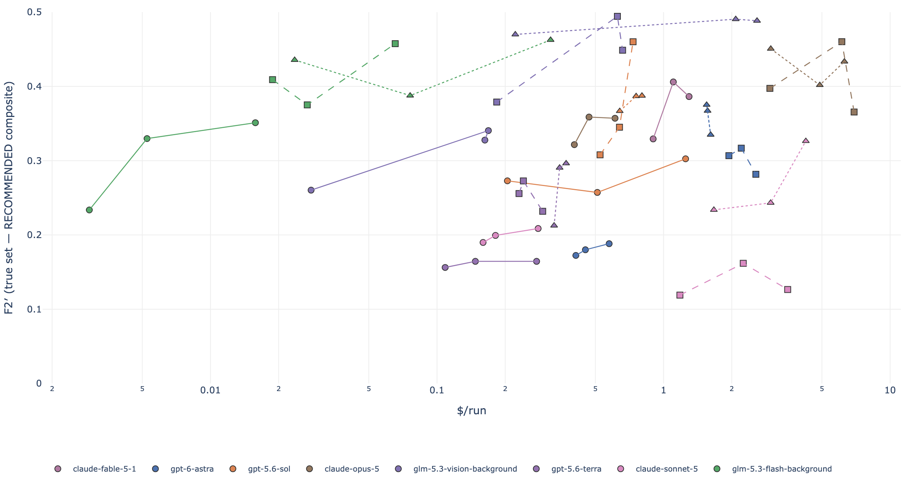
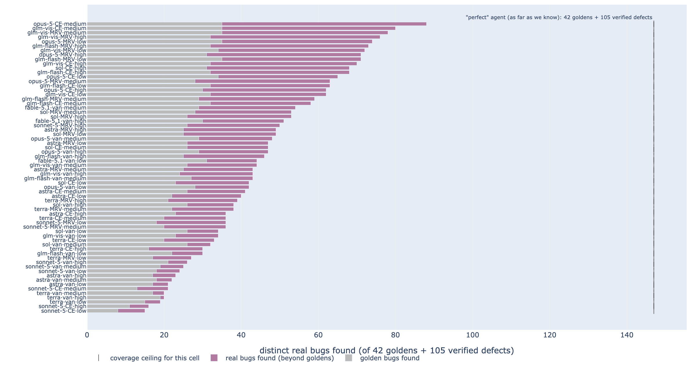
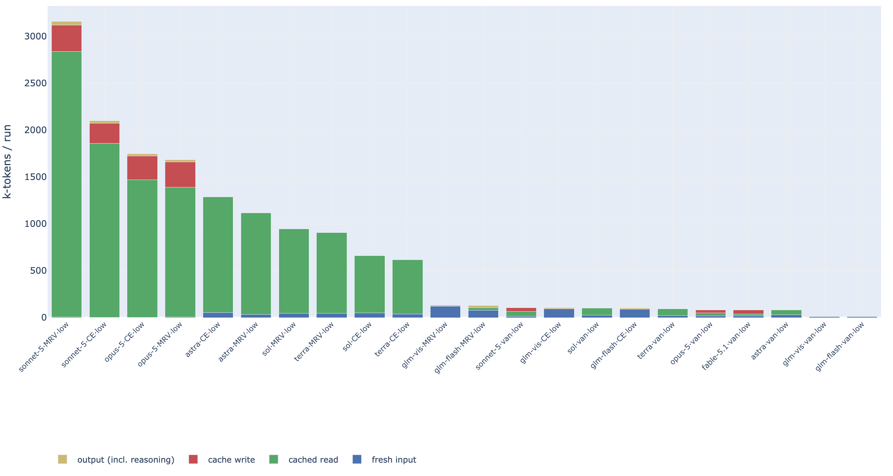
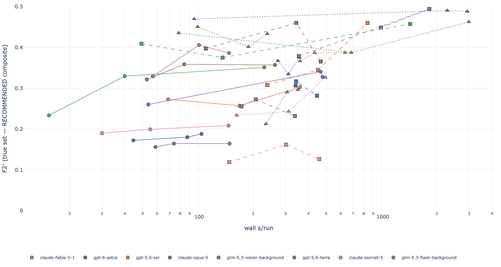
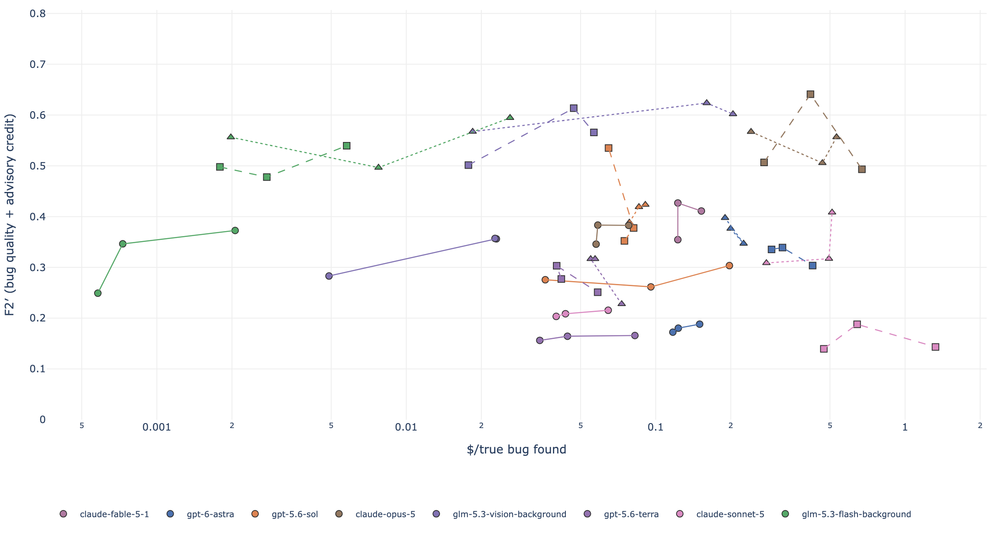
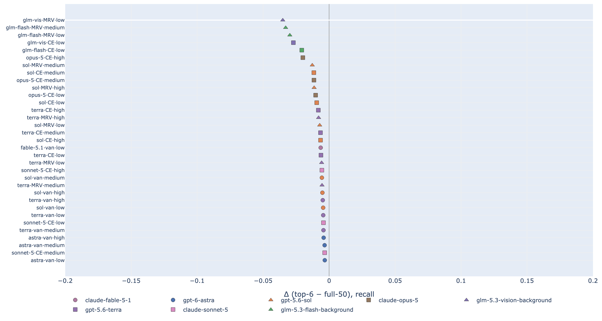
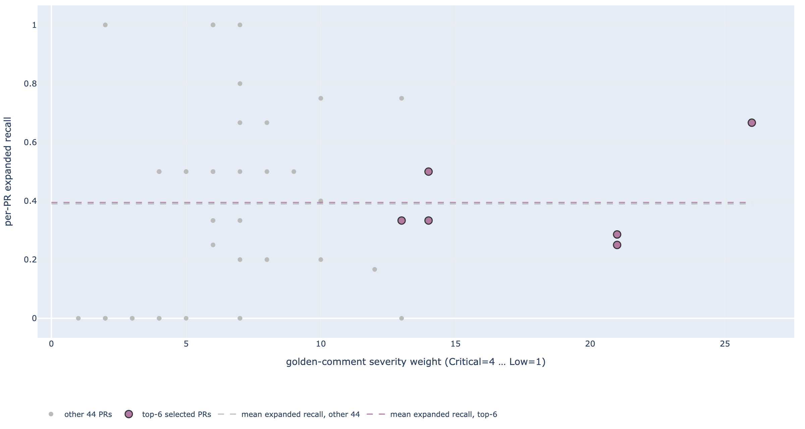
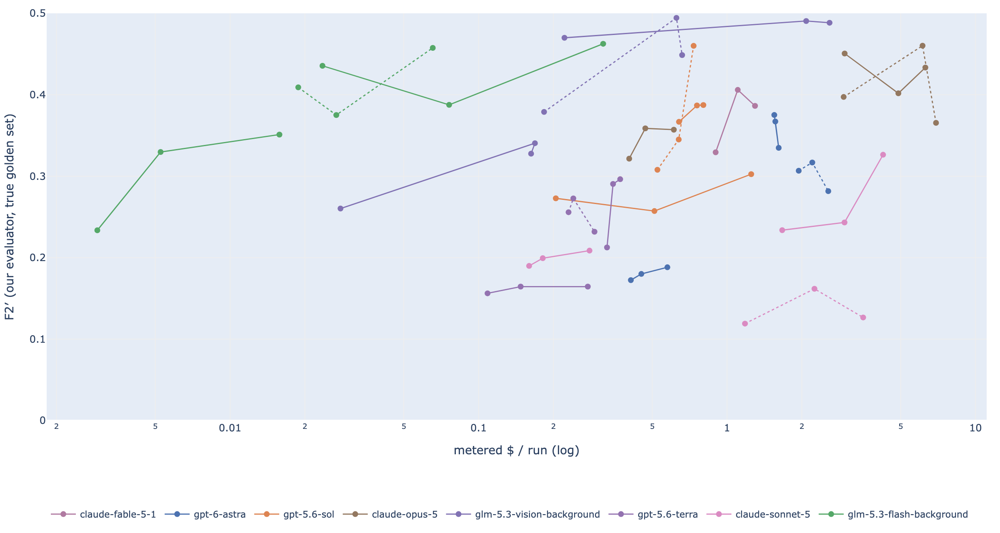

# September 2026: Code-review harnesses find more verified bugs; open-weight models offer lower-cost options on a six-PR benchmark

**In one line:** On six severity-selected PRs from two codebases, harnesses increase true-gold recall over the **same model's vanilla prompt** in **39/42 comparisons** (7 models × 2 harnesses × 3 efforts; Fable excluded because its harness coverage is incomplete). Opus · CE · medium leads the revised advisory-reward F2′ point estimates; GLM harness cells offer lower-cost pilot options. This is evidence for a pilot, not production certification or statistical equivalence.

## Abstract

This evaluation compares bugs found, review noise, API cost and latency across single-prompt and
agentic code review. It provides executable hidden-defect evidence and paired comparisons to help
teams choose a configuration to pilot. Eight models
(three Claude-family, three OpenAI-family, two open-weight GLM) ran through three frameworks — one-shot
prompting plus two agentic harnesses — at three reasoning-effort levels on the six highest-severity PRs
of a public 50-PR benchmark: 2,416 healthy runs, 66 of 72 complete model×framework×effort cells. Quality
is scored under two lenses: the benchmark's 42 human-verified golden comments, and a primary true golden
set built by auditing the campaign's own discoveries into 105 verified hidden defects with archived
reproduction/fix-test evidence (147 distinct bugs; a September 2026 audit withdrew
three and merged two duplicates). Unmatched findings carry saved bug, important-non-bug and unsupported judgments; headline
numbers carry PR-level cluster-bootstrap intervals, and cost, tokens and wall-clock are metered.

> **Figure 1 — Value for money: what a dollar per review buys** *(interactive — toggle the legend key to isolate model families; hover cells for values)*
>
> How to read: each point is one complete cell (a model × framework × effort combination); the x-axis is
> metered dollars per PR review (log scale) and the y-axis is F2′, our advisory-reward composite alongside recall on
> the 147-bug true golden set. Lines trace each model’s effort ladder within a framework; hover for the configuration and values.
>
> 
>
> **Takeaway:** low-effort GLM MRV options score **0.567 (vision)** and **0.556 (flash)**
> at **$0.222** and **$0.024/review**. Read the current ranking and T/A/H counts in §3.1; low API cost
> and a favorable composite do not establish quality equivalence or developer-time savings.


Harnesses improve true-gold recall over the same model’s vanilla prompt in 39 of 42 matched comparisons
(7 models × 2 harnesses × 3 efforts; Fable excluded), with mean Δrecall +0.135 and a peak-recall ratio
of 1.63×. The revised F2′ rewards useful accepted advisories alongside verified bugs; §2.6 discloses its
weights and classifier limitations, and §3.1 reports current rankings and sensitivity. Low-effort
GLM harness cells offer inexpensive pilot options. Medium/high GLM effort can incur substantial latency.

Caveats: one run per cell per PR (intervals cover PR sampling only); a severity-weighted six-PR sample;
instrument-sensitive precision. Read the intervals, not the rankings.

## 1. Introduction

**Why this report exists.** Teams choosing automated code review need to know whether extra model passes
find more defects, how much noise they add, and what they cost per review. We compare the same models
under one-shot prompting and two harnesses, with audited defect evidence and metered costs.

**What we measured.** The campaign covers a public 50-PR benchmark across five codebases, while the
primary 147-bug analysis covers six severity-selected PRs from **two codebases**. Its hidden-defect
portion has 105 fail-on-head/pass-on-fix tests. Results describe these workloads and configurations;
developer time saved, deployment reliability and performance on other repositories remain unmeasured.

**The questions.**

1. **Q1 — Do harnesses find more real bugs than one-shot prompting?** If not, the orchestrator premium
   buys nothing; if so, how large is the gap, and does it hold across models and efforts?
2. **Q2 — Which framework, effort and model cell should a team actually run?** The practitioner's choice
   is among cells, so the results are organised around cell-level cost/benefit.
3. **Q3 — What do those cells cost in money, tokens and wall-clock?** Measured at published list prices
   with a retrieval date, cache pricing included — the folklore ratios above show how easily cost claims
   drift.
4. **Q4 — How much of the apparent signal survives evidence audit and instrument comparability?** A
   cluster is not a bug, an unmatched finding is not necessarily a hallucination, and a metric that
   cannot be computed for some cells is not a zero.

**Scope and history.** One selected run per cell per PR — PR-level uncertainty is quantified by cluster
bootstrap, but repeat-run variance is *not* measured. One benchmark, one 50-PR sample, headline numbers
from its six highest-severity PRs (§2.4 tests that this is a hard-but-valid slice, not a recall-harder
one). This report supersedes the August 2026 experiment (`archive/report-2026-08-26-batch083.md`), which
scored the same frameworks against human labels only; what is new here is executed, audited hidden-gold
ground truth and per-review metered cost.

**In brief.** Under the strict 42-golden lens, the recommended open-weight cell
(`glm-5.3-vision-background`, metareview, low effort) had the same golden-recall point estimate as opus CE-low
(0.81 each; paired ratio CI 0.91–1.09) and a higher F1 point estimate at **7.5% [6.7–8.5%] of the opus compound-engineering cost**;
the cheaper
`glm-5.3-flash-background` reaches recall 0.83 [0.74, 0.92] at **0.8% of the opus CE-low cost**, paying
in precision (adjP 0.54 vs 0.67). Under the true-set lens, harnesses improve recall over their own
model’s vanilla baseline in **39/42** matched comparisons (mean Δrecall **+0.135**). Read §3.1 for
the advisory-reward F2′ comparison, which is a revised preference rather than a change in bug discovery.
The highest-recall cell finds 88 of 147 true bugs and misses **59**; other complete configurations
recover **52**, leaving **7** unfound (the union covers 140/147).

**How to read this report.** §2 is the method — what we ran, how findings are judged, why six PRs, and how
we built ground truth we could execute; read it if you want to check or reproduce a number. §3 is the
results, in five claims plus the cost/token/latency economics and a check that the six-PR sample is not
misleading. §4 states plainly what we cannot claim, and §5 gives the exact reproduction chain (inputs,
commands, checksums). If you only read one thing, read §3.5 (the five claims); if you only look at one
figure, look at Figure 1 (value for money). Appendix A keeps the superseded unions for provenance only.

## 2. Methodology

### 2.1 The lab and the benchmark

**Benchmark-defined** (Martian offline code-review benchmark, README
`third_party/code-review-benchmark/offline/README.md`): 50 PRs across 5 codebases; 173 human-verified
golden comments with severity (Low/Medium/High/Critical) and category tags. Pipeline: extract →
deduplicate → LLM-judge semantic matching → profile-based scoring.

- **Scoring profiles:** Strict = {bug, security, concurrency, data, api} (139 goldens);
  **Core (default)** = +{perf, test_gap, doc_defect} (158); All = +{style, speculative} (173).
  A candidate matching a golden excluded by the active profile is **matched-excluded** — neither
  rewarded nor penalised. Our frozen matcher matches against all 173 goldens, so stored recall is
  the **All** profile; Core/Strict splits are derived per run from `per_golden_matches`. On the
  severity top-6, the three profiles differ by at most one golden (PR 10967's single style
  comment), so top-6 numbers are effectively profile-invariant (§3.2, T1).
- **F-beta:** F1 and F2 (recall-weighted 4:1 — a declared preference, not measured cost) are
  reported for every cell. Fβ = (1+β²)·R·P/(β²·P+R).
- **Judges:** gpt-5.2 for the Anthropic-model rows (fable/opus/sonnet) and the GLM rows;
  claude-opus-4-5-20251101 for the OpenAI rows (sol/terra/astra). Anti-self-preference by vendor,
  single judge family per row (so within-row framework comparisons are judge-consistent);
  cross-judge agreement is only partially measured (§4, `analysis/ADJUDICATOR_INTERRATER.md`).

**Our extensions beyond the benchmark** (each with its tool, each disclosed per-metric):

- **Honest re-adjudication (precision side).** The benchmark's raw precision counts every
  unmatched candidate as a false positive; Martian's own methodology concedes the golden set is
  incomplete. We adjudicate every unmatched finding three-way: `bug` / `important_non_bug` /
  `hallucination` (v2 in-run, `harnesseval/adjudicate.py`; hardened v3.1 = `readjudicate3.py` with
  cross-run clustering, grounded hallucination, provenance stripping, k-vote). adjP =
  TP/(TP+hallucinations); **beyond-gold** = bug+important_non_bug outside the golden set.
  Original campaign judgments remain frozen, including **rj3 at k=1 with v3.1 clustering**.
  This revision adds a separately archived common advisory re-adjudication (§2.6); it preserves
  original bug credit and legacy metrics. Section 2.3.3 describes the original instrument effects.
- **Cluster (PR-level) bootstrap CIs** on every headline number (§2.3.2).
- **Metered cost accounting** at published list prices (§3.4) with a retrieval date, pricing
  fresh input / cached reads / cache writes / output separately.
- Analysis docs we build on and do not rewrite: `analysis/ADJUDICATOR_INTERRATER.md`
  (adjudicator agreement 0.43–0.83 across judge models; the v1→v3 instability motivation),
  `analysis/ADVISORY_RECALIBRATION.md` (advisory-channel accounting fix; mrv 0.11.1–0.11.2),
  `analysis/CE_VS_MRV_GAPS.md` (15% CE-only hidden-gold; ~9% verdict flips across phrasings),
  `analysis/EXTERNAL_REVIEWER_GAPS.md` (92% of CodeRabbit/BugBot findings covered by our union),
  `analysis/ACCEPTANCE_0111_FINAL.md` (0.11.1 acceptance with k=3 adjudication),
  `analysis/CE_RESIDUE_AFTER_UPGRADE.md` (hidden-gold gap decomposition), `FURTHER-RESEARCH.md`.


### 2.2 What we ran: frameworks, models, efforts, judges

**The matrix.** 8 models × 3 frameworks × 3 reasoning-effort levels = 72 cells, a cell being one run of
one combination on one PR. On the six-PR primary sample 66 cells are complete (396 runs, n = 1 run/PR);
six fable compound/metareview cells have 1–2 PRs — coverage gaps, not results (`analysis/COVERAGE.md`).
The campaign holds 2,416 healthy runs, 2,234 of them selected (one per cell×PR); run health and the era
rule deciding which batches a framework may draw from are in §2.3.2.

**Models.** Three vendor families plus open weights:

| model | family | role in the study |
|---|---|---|
| `claude-fable-5-1` | Claude | strong one-shot performer; harness PR coverage incomplete |
| `claude-opus-5` | Claude | frontier reference for the cost comparisons |
| `claude-sonnet-5` | Claude | mid-tier commercial |
| `gpt-5.6-sol`, `gpt-5.6-terra`, `gpt-6-astra` | OpenAI | commercial comparison family |
| `glm-5.3-vision-background` | open-weight (GLM) | the recommended cell's model |
| `glm-5.3-flash-background` | open-weight (GLM) | cheapest strong cell |

**Frameworks.** `vanilla-engineered` is an engineered single prompt (8-category rubric plus severity
guidance) executed as one model call with no subagents — the baseline of pointing a coding agent at a
diff. `compound-realistic` (CE) drives the Compound Engineering `ce-code-review` skill: a risk-driven
persona roster dispatched as parallel subagents, then a separate synthesis pass. `metareview-realistic`
(MRV) drives the metareview binary: deterministic Go gates (free) plus eight adversarial LLM lenses as
parallel subagents, single-pass synthesis. Both harness adapters run the real plugin/CLI inside a host
agent loop, so subagent dispatch is real — with cost-attribution consequences disclosed in §2.3.

**Effort.** `low` / `medium` / `high` map to the provider's reasoning-effort setting (Anthropic: thinking
disabled at low/medium; OpenAI/GLM: `reasoning_effort`); `xhigh` is outside this matrix (§3.5.4).

**Original campaign judges and adjudication instruments.** Golden matching and three-way adjudication
(`bug` / `important_non_bug` / `hallucination`) used cross-family judges to reduce self-preference risk:
`gpt-5.2` for Claude- and GLM-family rows, `claude-opus-4-5-20251101` for OpenAI-family rows, k = 1
(campaign lock). Three precision instruments appear across cells — `v1` (legacy binary, unable to
classify nitpick-class findings), `v2` (in-run three-way), `rj3` (v3.1 clustered re-adjudication); their
comparability limits are disclosed in §2.3.3 and continue to qualify the legacy precision/burden scores.
The new F2′ uses a separate common GLM-base re-adjudication instrument (§2.6), whose same-family
judge risk is explicitly retained.

**Samples.** Primary: the six PRs with the highest summed original-golden severity weight (§2.4).
Secondary: the full 50, used only for the selection-effect check on the 33 cells with ≥40/50 healthy
scored PRs (§3.6). All headline numbers are primary-sample numbers unless labelled otherwise.

#### Caveats: what we did not run, and why

One gap is a decision of ours, and it is worth stating plainly rather than leaving it implicit: **we did not
run Claude Fable 5.1 across all PRs and all harnesses.** Fable 5.1 was run one-shot across all six primary
PRs, but its two harness cells (compound-realistic and metareview-realistic) were run on only one to two PRs
each. Every other model has its full harness grid on the primary sample.

The reason is **budget**. A harness review is not one model call: the orchestrator dispatches several subagent
passes and then synthesises, so a harness run costs many times a one-shot run — and Fable 5.1 is a
frontier-priced model. A full Fable 5.1 grid across the PRs and all three frameworks was more than this
campaign could fund, and we judged the same money better spent on depth everywhere else: executed ground
truth, honest adjudication, and the full-50 comparison runs. The partial Fable harness numbers are therefore
gaps, not findings, and no claim in this report rests on them.

**We will amend this report with updated numbers in either of two cases:**

- **A sponsor funds the runs.** The missing Fable 5.1 harness cells can be run on the same apparatus and
  merged into the same tables; reach out via the repository
  ([github.com/dsifry/harnesseval](https://github.com/dsifry/harnesseval)).
- **Someone runs them and sends us the data.** The methodology is laid out to be reproduced: §2 specifies the
  frameworks, models, effort levels, judges, instruments, run-health and era rules, and §5 publishes the
  reproduction chain (`runs/` inputs, the exact commands and the checksums). Data produced that way drops
  into the same scoring code and the same tables, keeping the comparison like-for-like. Send it to us and we
  will amend the report with it.

Nothing in the conclusions depends on guessing what those cells would have shown: every headline result is
computed from the cells that are complete, and `analysis/COVERAGE.md` records exactly what is missing.

### 2.3 How findings are judged: instruments, comparability, and disclosure


#### 2.3.1 The judging instruments, frozen across the campaign

`harnesseval/judge.py` (golden matcher), `readjudicate3.py` prompt/version semantics, and the
golden dataset were **not modified** for this report. n = 1 selected run per cell×PR (selection
rule in §2.3.2); duplicate healthy scored runs exist for some vanilla cells (listed in
`analysis/COVERAGE.md`) and were not pooled. Adjudication k = 1 (campaign lock); if anyone
re-adjudicates at k≥3, both numbers must be reported (`analysis/ACCEPTANCE_0111_FINAL.md` shows
what k=3 looks like on the 0.11.1 acceptance cells).

#### 2.3.2 Run selection and the era rule

One healthy, scored run per (model × framework × effort × PR): health rule = no error, tokens>0,
findings-or-≤20k-tokens; scored = integer tp/fn present; **era rule (banked 2026-09-13):**
vanilla-engineered pairs accept healthy runs from any batch/era; compound/metareview pairs must
come from batch `20260910-mrv0120-manifold` (pre-0.12 metareview binaries are instrument-confounded).
Within the rule we prefer the current campaign batch, then the fable vanilla batches, then newer
legacy batches (`tools/final_report_extract.py`).

#### 2.3.3 Precision-instrument disclosure (per cell, in T1)

rj3 files exist for ~half the vanilla cells (opus/sonnet vanilla, fable vanilla low, parts of
astra/sol/terra/glm-flash) but almost no compound/metareview cells of the current campaign; the
harness cells use the in-run **v2** three-way adjudicator (same judge family, same taxonomy, k=1,
per-finding instead of clustered). Measured on the same runs, the v1 binary instrument (pre-2026-09-07
vanilla reuse) over-counts hallucinations massively — e.g. opus-5 vanilla low adjP v1 0.50 → rj3
0.90 (28→3 hallucinations), fable vanilla low 0.46→0.82 (37→7) — which is why v1 cells
(fable vanilla medium/high, opus vanilla medium) are flagged in T1. These examples show that the older instrument can depress scores;
they do not establish a quantitative bound or the bias direction for unmeasured cells. The v2→rj3 gap is the residual instrument risk for harness
cells; `analysis/CE_VS_MRV_GAPS.md` measured ~9% verdict flips across phrasings under v2 that v3.1
clustering removes by construction — direction of bias on aggregate adjP is not established.

#### 2.3.4 Provider incident disclosure (GLM rows)

The 2026-09-14/15 Lunaroute gateway incident (aggregate concurrent output > ~400k tokens wedging
the batch; OpenAI SDK `max_retries=2` silently tripling timeouts) was fixed by ~2026-09-15 16:00
(`max_retries=0`, first-attempt retry + streaming, lens semaphore 4, FD headroom). Per-cell
exposure, using a conservative cutoff of 2026-09-15 23:00 UTC (16:00 PDT): **every GLM harness cell
on the top-6 contains pre-fix runs** (glm-vis mrv medium 5/6, high 2/6 are the least exposed); the
glm-flash vanilla cells selected the post-fix 2026-09-16 runs. The incident was operational
(reliability), not a prompt or dataset change, and every selected run passed the health gate; but
the headline GLM cells (incl. the §3.6 recommendation cell glm-vis MRV low, run 2026-09-10) cannot
claim post-fix infrastructure. Treat GLM quality numbers as carrying this caveat; the
gateway-capacity caveat (throughput, not quality) is in §3.5.5.

Also disclosed: the six glm-*-compound cells and glm-vis MRV low lack per-model token splits
(`per_model_usage`); their metered $ prices **all** input at the fresh rate (no cache discount), so
those cells' $ are upper bounds on the input side. Anthropic rows carry real provider billing
(`cost_usd`), which our metered table reproduces to within 4% for opus/sonnet (median metered/billed
0.96/0.96) and underestimates fable-5.1 billing by ~15% (median 0.85 — cache-write pricing), so
fable $ are conservative.


### 2.4 The top-6 design choice, argued and tested

**Why six PRs, and why these six.** The campaign's grid is 8 models × 3 frameworks × 3 effort levels = 72
cells, and every cell × PR combination is a complete review — a harness cell being many model calls, not
one. Run over all 50 benchmark PRs that is 3,600 reviews. The budget for this study allowed the full grid on
a **six-PR primary sample** (432 cell×PR reviews, 66 complete cells), with the remaining budget spent on
depth instead of breadth: executed ground truth for every claimed defect, honest adjudication of every
finding, and full-50 comparison runs used to check the sample (§2.4.2, §3.6). In short, the trade was PR
breadth against depth and redundancy of evidence, and we chose depth on a hard slice.

The six were selected by **summed original-golden severity weight** — an objective, pre-registered criterion,
not a hand-picked set — and it turns out to be the **six PRs with the highest summed original-golden severity in the evaluation
set** (mean summed severity 18.2 versus 6.1 for the other 44, about 3×; §2.4.2). The six span two codebases. The benchmark-golden checks in the rest of this section
show the selection effects and their limits: it is hard-weighted, but recall measured on it is
*not* systematically biased against the tools (§2.4.2), and the earlier hope that it would be a conservative
*lower bound* on full-set results does not survive testing — which is exactly why we report intervals and a
selection check instead of treating six PRs as the whole story (§2.4.3, §3.6).

#### 2.4.1 What "top-6" means, and why it is a defensible slice

**top-6 = the six PRs with the highest summed golden-comment severity weight** (Critical=4,
High=3, Medium=2, Low=1; ties by comment count) — i.e. the six PRs with the **highest original-golden
severity totals** (CAMPAIGN_GLOSSARY.md; verifier `tools/verify_hitlist.py`; artifact
`manifold_top6_hitlist.csv`): [cal.com/11059](https://github.com/calcom/cal.com/pull/11059) (sev 26, 9 comments), [discourse-graphite/4](https://github.com/ai-code-review-evaluation/discourse-graphite/pull/4) (21, 8),
[discourse-graphite/10](https://github.com/ai-code-review-evaluation/discourse-graphite/pull/10) (21, 7), [cal.com/14740](https://github.com/calcom/cal.com/pull/14740) (14, 6), [discourse-graphite/8](https://github.com/ai-code-review-evaluation/discourse-graphite/pull/8) (14, 6),
[cal.com/10967](https://github.com/calcom/cal.com/pull/10967) (13, 6). This selection is by ground-truth severity density, not by any measured
detection difficulty for these tools — §2.4.3 below tests directly that the top-6 is *not* measurably
recall-harder, so read "hard" below as severity-weighted, not as an estimate of what the tools find hard. This is a **deliberate weighting toward higher-severity workloads**: a code-review
tool that only catches easy issues is not worth buying, and cost/benefit is decided at the hard
end. (A lexicographic misreading of "top-6" already corrupted one subset earlier in this campaign —
the severity ordering is binding.)

#### 2.4.2 Is the sample representative of the full benchmark? (tested)
**How hard is the sample?** Measured directly (panel 5 of the dashboard): summing each PR's golden severity
weights (Critical 4 … Low 1), the six headlined PRs average **18.2** against **6.1** for the other 44 — about
**3×** — and the **mildest of the six is as severe as the most severe PR we did not pick** (both 13). The
sample is deliberately severity-weighted; it is neither a random nor a representative sample of production review.


**Scope of this check: benchmark-golden metrics only.** The 147-bug true-gold set exists only for the six selected PRs; these checks do not establish its generalization. Selection effects were examined two ways on the 33 cells with ≥40/50
healthy scored PRs (T3):

1. **Direct gap (selection effect).** Mean recall gap (top-6 − full-50) = **+0.006** (median +0.014,
   range −0.14…+0.14; vanilla +0.005, harness +0.007): recall measured on the top-6 is
   close to full-set recall on average across these observed cells — the severity-weighting does *not* make the
   top-6 recall-harder for these tools. The F1 gap is larger and systematic (+0.065 mean, harness
   +0.084): harness adjP is *higher* on the top-6 (the non-top-6 PRs elicit more hallucinated
   noise from harnesses), so top-6 F1s overstate full-set F1 for harness cells and should be
   corrected by roughly the T3 per-cell gaps when extrapolating.
2. **Ranking agreement.** Spearman ρ of model F1 ranks (top-6 vs full-50) within framework×effort:
   **0.80** for vanilla-low, CE-medium, CE-high and MRV-low, and **0.37 for CE-low** (T3): the
   CE-low ranking is the one place the top-6 reorders models
   (sonnet-5 collapses from 3rd on full-50 to last on top-6); everywhere else ranks are preserved
   or near-preserved. This is direct, if not uniform, evidence for the claim.

#### 2.4.3 Is the top-6 result a conservative "lower bound"? (No — tested, and why that matters)

**What the sub-claim was.** If the six chosen PRs really are the hardest in the set, it is natural to hope
that scores measured on them are a *floor* for the rest of the benchmark: a cell that scores X on the top-6
would then score at least X on the full 50, and our headline numbers would be conservative by construction.
This is the "lower bound" sub-claim. It matters because it decides how to read every number in §3: as a floor
to be improved on, or as a result conditional on the selected severity-weighted slice.

**Why it is false.** A floor would require recall to fall as PR severity rises. It does not: Spearman
ρ between each PR's severity weight and its recall, over the 33 cells with full-50 runs, averages **+0.10**,
with 6 of 33 negative — recall is *not* monotonically lower on harder PRs. So the honest framing is that the
top-6 is a hard-weighted sample whose recall matches the full set on average (§2.4.2), not a lower bound.
Where an individual cell does diverge sharply (e.g. sol vanilla high: top-6 0.62 vs full 0.76), the T3 table
is the correction — and that divergence is also why a selection check is reported at all (§3.6).


### 2.5 Building ground truth we could execute

**Why the human-labelled gold was not enough.** The benchmark's 42 golden comments are expert-labelled and
well defined, but they are only what those reviewers happened to write — they cannot tell us whether a
finding *outside* the list is real, and a buyer comparing harnesses needs exactly that. The campaign's own
discoveries are the only larger source of candidate truth, and a discovery is only trustworthy if it can be
checked mechanically. So the ground truth used in §3.1 is not a label set: it is a set of defects each of
which owns an executed test.

**From clusters to executed defects.** Appendix A's "211 additional bugs" were still *clusters* — produced by an LLM merge over candidate keys, so they
carried both over-counts (one defect restated several ways) and under-counts (real defects the audit split
away and never restored). §3.1 replaces them with **verified defects with archived reproduction/fix-test evidence**, and the count chain in
full runs: **359** raw pre-merge clusters → **253** after the strict re-merge → **152** candidates →
**147** distinct after the 2026-09-18 audit (42 goldens + 105 verified defects).

**Construction (all artifacts in `analysis/verified_gold/`).** For each candidate the pipeline authored a
test, ran it on the PR head (must **FAIL**), authored a minimal fix, ran it again (must **PASS**), and — where
a sibling defect existed at the same site — re-ran under the *bundle's* fix, which must leave it **RED**
(orthogonality: a defect is only counted separately if its own fix is required). The merge audit
(`MERGE_AUDIT.json`) then split multi-concern bundles; an independent six-reviewer duplicate pass plus
fix-location adjudication removed **23 defect-level** restatements; container-level folding removed **17**
more. Finally the audits' own label lists were walked for **under**-counts, restoring **10 defects** that had
been dropped (including an unset-secret **auth bypass** and a missing scheme check before `open(url)`).
Every defect now owns `defects/<id>/{test.diff,fix.patch,logs/,meta.json}`; the canonical list is
**`analysis/verified_gold/GOLD_DEFECT_CATALOG.md`** (110 entries, one per defect — 105 verified distinct,
plus 3 marked WITHDRAWN and 2 marked DUPLICATE by the 2026-09-18 audit — each with its test, its fix
and its provenance). Provenance is recorded per defect rather than inferred from a count of successful fixes. Among the
110 retained catalog entries, **30 have explicit recorded sibling-fix-red evidence**; that cross-fix
check is unrecorded for the other **80**. These counts include withdrawn and duplicate entries and
must not be read as 110 independently verified orthogonality checks. The
comparison numbers quoted below (paired deltas, ensemble coverage, the best cell's misses) are persisted in
`final_report_metrics.json` under `true_gold_defects.<variant>.derived`.

**Verified universe: 42 goldens + 105 verified distinct defects = 147 true bugs.**
All 105 are `D-verified` (fail-on-head → own-fix-pass). A 2026-09-18 post-publication audit — triggered by
external review — withdrew 3 defects whose tests did not demonstrate the claimed behavior (11059-D28,
4-D04, 4-D29) and merged 2 as duplicates (11059-D32 → 11059-D19; 11059-D14, already described by the
original golden); see `analysis/verified_gold/WITHDRAWALS_AND_DEDUP_2026-09-18.md`.
**What the audit taught us.** Three pipeline failures were found by adversarial re-checking, and each one
changed the numbers:

- **A test can manufacture its own failure.** One candidate's test mocked the very dependency whose
  behaviour the claim was about (a mocked `zod` with no default export, while the installed package has
  one); another's recorded "head failure" was a harness stub error (`blank?` on a String) that fired
  *before* the claimed behaviour was ever reached; a third failed with an unrelated `NameError` while the
  claimed exception never fired. Re-reading the **failure reason** in every one of the 110 head logs — not
  just the red/green exit status — is what surfaced them, and is why the three defects named above were
  withdrawn rather than counted.
- **Duplicates can hide across containers.** Two defects described the same missing-secret guard at the
  same call site, differing only in the HTTP status the fix returns; a third restated a mechanism the
  original golden already names, fix site included. Candidate pairs were adjudicated with the repo's
  cross-fix standard — evidence that *neither* defect’s own minimal fix cures the other’s
  test supports keeping the pair distinct; shared mechanisms and fixes support merging — which merged 2 and kept 4 borderline pairs (4-D14, 4-D45, 11059-D33-vs-D22, 4-D56-vs-4-D36) as
  genuinely distinct.
- **The scoring map itself had a quiet hole.** The finding→defect assignment considered only the first 60
  findings of each multi-defect bundle: **276 findings were silently dropped** (241 findings across 51 credited cells), and at least one finding was mis-credited (the `embed_by_username.downcase`-on-nil
  finding went to the queue-flooding defect 4-D04 instead of 4-D56). The repaired pipeline considers all
  **2,923** findings, permits explicit no-match `null`s (71 of them), and re-verifies low-signal
  assignments (`DEFECT_ASSIGN_AUDIT.json`). Every §3.1 number was recomputed from the repaired inputs —
  which changed the absolute bug-recall and then-current composite levels.

The audit's full record, with the evidence behind every decision, is
`analysis/verified_gold/WITHDRAWALS_AND_DEDUP_2026-09-18.md`.

One honest boundary: the 105 are the defects the pipeline could *execute*. The earlier audits' label lists
suggest a small number of further claims whose tests did not converge; we report those as in-doubt plumbing
rather than as verified bugs (`UNDERCOUNT_2026-09-18.md`).

### 2.6 Metrics and the evaluator choice

Three choices shape every number in §3: how defects are counted (the metrics tool below), which composite
is read (F2′), and which cells are allowed to be compared at all (the instrument caveat). Each is a stated
choice with a cost, and each is stated here rather than buried in the results.

**What a 95% confidence interval (CI) means here.** Quality metrics are pooled ratios of summed
PR-level counts, not averages of the six PR scores; cost and latency are per-review means. We resample
the six PR clusters with replacement 10,000 times, recompute each statistic, and report its 2.5th and
97.5th percentiles. These intervals describe sensitivity to resampling the observed PRs. They are not
prediction intervals for a new six-PR dataset, and severity selection limits population inference.
Overlapping marginal CIs do not establish a tie, equivalence or absence of a paired difference: paired
comparisons use the CI of the difference (or ratio). A difference is called resolved when its paired CI
excludes zero. Intervals omit run-to-run model variation (one selected run per cell per PR), uncertainty
from choosing the best cells after seeing the results, and unmeasured judge error.

Metrics: `tools/verified_gold_defect_metrics.py` (cluster bootstrap, B=10,000, seed 20260916); finding-to-
defect assignment by `tools/verified_gold_defect_assign.py` (repaired 2026-09-18: every one of the 2,923
findings is now considered — the pre-repair version silently dropped 276 past a 60-finding cap; audit trail
in `DEFECT_ASSIGN_AUDIT.json`); the section is also exposed as `true_gold_defects` in
`analysis/final_report_metrics.json`.

**Which composite to read.** F2′ now rewards useful staff-level review advisories as well as
verified bugs. This revision changes the evaluator preference and adds a common adjudication pass;
it generates no new review runs and does not measure developer time. The bug-only F2 and recall remain unchanged. For each cell we pool:

- **T:** distinct credited bugs from the 147-bug verified universe (D = 147).
- **A:** accepted useful `important_non_bug` advisories from the original unmatched finding texts,
  classified through the common re-adjudication pass and deduplicated per run using validated identities
  for the selected scoring policy.
  Findings already assigned to a verified bug are excluded from all advisory, penalty and below-threshold
  counts: their frozen verified-bug assignment is authoritative. The original classifier decision and
  verified bug IDs are retained for audit.
- **H:** effective unsupported findings. False claims, style-only comments and vague speculation carry
  the same unit penalty when the current classifier assigns `hallucination` with confidence ≥0.80.
  Findings classified as useful advisories do not enter H, even when below the advisory-credit cutoff.

The primary score is **F2′ = (5T + αA) / (4D + T + αA + H)**, with **α = 1**.
An additional accepted advisory increases this score; an unsupported finding decreases it. A missed
verified bug retains four units of denominator weight. This is an advisory-augmented composite, not an
ordinary F-beta score computed from advisory recall. We report **α = 0.5 and 2** as sensitivity checks.
The choice of α expresses our preference for useful review breadth and has not been calibrated against
human triage time, downstream fixes or economic value. Unbounded advisory volume can drive the score
toward one, so the acceptance bar, deduplication and separate T/A/H counts are essential to interpreting it.

**What qualifies as an advisory.** The common-pass prompt includes the four explicit criteria from
`tools/enum_advisory_ceiling.py`: true, decision-relevant to a staff maintainer, not a correctness bug
and not style, with a concrete benefit to the maintainer. It retains the existing adjudication category
system while preserving historical rj3 defaults separately. False claims, pure style/format nits and
concerns too vague to act on share the `hallucination` penalty category. An unverifiable but plausible
concern retains its classification and receives neither credit nor a penalty when below its scoring threshold.

**Advisory credit and unsupported-finding penalties are separate decisions.** Revised F2′ has no
penalty merely for reporting a non-bug. A finding classified as a useful advisory can earn positive
credit or remain unscored; falling below the advisory cutoff never turns it into a penalty.

| Current common-pass classification | Classifier confidence | F2′ treatment after deduplication and verified-bug exclusion |
|---|---|---|
| Useful advisory (`important_non_bug`) | ≥0.70 | Adds one advisory to A |
| Useful advisory (`important_non_bug`) | <0.70 | No credit and no penalty |
| Unsupported/style/vague finding (`hallucination`) | ≥0.80 | Adds one unsupported finding to H |
| Unsupported/style/vague finding (`hallucination`) | <0.80 | No credit and no penalty |

The classification comes from the current common pass, not necessarily the finding's original
review label. The `hallucination` category includes false factual claims, style-only nitpicks and
vague, non-actionable speculation; it does not mean every penalized finding contains a fabricated
fact. Frozen verified-bug assignments take precedence over model labels, preventing double credit
or a contradictory penalty. These confidence values are model-reported judgments, not calibrated
probabilities or measured advisory value. All below-threshold findings remain classified, with their
category and confidence retained for audit.

**Common pass methodology (all six PRs validated).** The selected judge is **`glm-5.3-background` at low
effort, k=1, initially with four concurrent calls**, processing the top six PRs strictly one PR at a time.
The selected report policy uses **confidence ≥0.70 for advisory credit and ≥0.80 for penalties**,
both inclusive. Thus an `important_non_bug` judgment at 0.75 earns credit, while a `hallucination`
judgment at 0.75 receives no penalty. Below-threshold findings remain classified but unscored; their
original category, response, reasoning and confidence are preserved. The raw pass’s original 0.80
export remains frozen; `analysis/verified_gold/advisory_readjudication/active_scoring_policy.json`
identifies the separately versioned report policy. Newly eligible advisories require policy-specific
duplicate checks, reusing existing pair judgments where valid. Penalty identities and the 0.80
equivalence threshold are unchanged. Classifier bug labels never create verified bug credit. Already admitted verified-defect
identities reuse audited truth per member without another classifier call or an invented confidence.
The choice followed matched low/high pilots, documented in
`analysis/verified_gold/advisory_readjudication/MODEL_PILOT_COMPARISON.md`; those pilots establish
neither calibrated confidence nor equivalent intelligence or production accuracy.

A separately recorded throughput trial increased concurrency from four to six during final duplicate
validation on PR #14740. In-flight calls were drained before restarting; completed judgments and
frozen request/proposal identities were reused. This changes execution scheduling, not the judge,
prompts, thinking level, scoring thresholds or verified bug truth. The trial and four-call baseline
are archived under `passes/glm_base_claim_v3/execution_extensions/concurrency6_v1/` in the advisory
readjudication directory. In equal five-minute final-pair windows, four calls completed 840
comparisons (168/minute), versus 500 (100/minute) at six after a 60-second warmup. Completed-request
median latency rose from 21.45 to 45.11 seconds; schema retries were two versus zero. Six recovered
to 200 comparisons/minute in its last minute, so this short, different-batch comparison does not
establish a causal capacity limit. Four remains the selected default; eight was not trialed.
See `result6_5min.json` in that archive for the measurement windows, request hashes and caveats.

The subsequent policy-specific advisory deduplication uses a separately archived
`execution_extensions/request_timeout_v1` wrapper: each router call has a 120-second wall-clock
deadline, including internal retries, with at most three policy attempts. Timed-out child processes
are terminated and reaped before retry; completed checkpoints are reused. Queue time is excluded
from this deadline. Model, prompts, thinking and scoring rules remain unchanged. Request events
record elapsed time and failures; a timeout is a processing failure, never a finding classification.
Provider-side cancellation and token usage for terminated requests cannot be guaranteed.

The inventory contains original unmatched finding texts regardless of earlier labels. Each distinct
**exact cleaned claim, preserving case**, receives its own judgment unless audited defect truth is
reused. Semantic duplicate counting is a separate step: a shared proposed group does not let one
member's judgment establish another member's truth. The base pass has validated **403 selected saved
runs across all six PRs and 72 cells** (66 complete cells contribute 396 runs; seven runs belong to
partial cells), including 10,057 independent claim classifications and 101 reused audited bug
identities. The ≥0.70 advisory duplicate pass has also completed across all six PRs: **1,501 eligible
advisory claims form 888 validated semantic identities**. All **403 reviews** have validated policy
outputs, and all **66 complete cells** are eligible for F2′ comparison. Earlier Vision-classifier passes
and pilots are not the current instrument.

**Reuse and grouping.** Fine-grained audited `DEFECT_ASSIGN` identities override **17 broad older
multi-defect groups**. Saved semantic coverage spans **7,531 of 12,555 emissions (60%)**, but old groups
and paid votes are candidate evidence only: known overmerges and unsupported consequence variants
prevent treating this as fixed identity coverage or 60% classifier-call savings. Grouping uses full
cleaned finding text rather than shortened excerpts. Validated file paths and intervals prioritize
candidate pairs; overlap does not automatically merge them, different known files remain separate by
default, and missing paths remain unknown. Proposed groups undergo a second-stage pair check for
agreement in the full material mechanism, trigger and consequence. Uncertain pairs stay separate.
Counting groups are split by effective classification so a semantic grouping cannot share false credit
across conflicting judgments. Per-member audited truth and model/grouping provenance are retained.
Independent `final_calculation_validation.json` confirms all 403 measured reviews, exact six-PR
coverage of the 1,501 claims and 888 identities, every classification source hash, and unchanged values
for all 216 cell/universe variants of the frozen bug and legacy metrics. No failed or missing model
request is silently treated as an empty advisory result.

Classified findings below the applicable scoring threshold receive **neither advisory credit nor a
penalty** and are disclosed separately; an absent completed classification is not evidence of no
advisories. High-confidence classifier `bug` groups without a frozen assignment to the verified
universe are recorded as `advisory_uncredited_bugs`: they receive no new T or A credit and no H
penalty. A mistaken bug label can therefore under-penalize a false claim without increasing recall.
Legacy JSON field names `advisory_unresolved` and `F2p_unresolved_bounds` remain compatibility
aliases for below-threshold counts and hypothetical sensitivity bounds, not processing status.
The bounds hold T fixed and compare penalizing all below-threshold groups with crediting them all
as advisories. These are deliberately extreme sensitivity scenarios, **not confidence intervals**,
calibrated probabilities, or assertions that all those findings are actually advisories.

The threshold choice is supported by an exploratory 36-advisory, framework-balanced diff audit,
with nine claims in each confidence band and 11 additional penalty spot-checks. The classifier
metadata was hidden during review, but original claim text sometimes contained the reviewer's own
confidence. The sample informed the selected 0.70 advisory policy; it does not establish a calibrated optimum;
A ≥0.80 sensitivity now uses the **same ≥0.70 validated identities**, with H ≥0.80 and T/D held
fixed (§3.1). This isolates the credit cutoff; it is not the earlier grouping or classifier score.
An A ≥0.60 comparison was not completed and is not claimed. See
`analysis/verified_gold/advisory_readjudication/threshold_evaluation_20260919/EVALUATION.md`.

This is new model adjudication, **not staff-engineer validation**. Diff-only evidence limits what the
judge can verify. Its archived reasoning and confidence are audit evidence, not calibrated probabilities
of correctness. Single-vote judging and a judge from the same model family as two evaluated models leave
judge error and self-preference unmeasured. An earlier Vision-judge purposive seven-probe pilot, documented in
`analysis/verified_gold/advisory_readjudication/CLASSIFIER_PILOT_AUDIT.md`, exposed a false active-save
claim receiving a raw bug verdict at 0.55 despite the reasoning acknowledging no UI caller. The report
policy gives that 0.55 bug judgment no credit or penalty; the probes are not an accuracy estimate or evidence that all false
claims are caught. New outputs are separate from original campaign judgments.
The reference advisory set covers only two of the six current PRs, so we make **no advisory-recall claim**
and do not add advisories to the 147-bug denominator. Semantic clustering reduces repetition but does
not establish that every remaining advisory is independent or that every merge is correct.

**Legacy metrics are retained for provenance.** `adjP′ = T/(T+H_legacy+I_legacy)` and the original F1′ charge every
important non-bug (I_legacy) as a burden, using their original H_legacy accounting. They are labelled **legacy non-bug-burden metrics**, not alternative
versions of the new advisory-reward evaluator. The former F2′ is retained as `F2p_legacy` in machine
outputs. `adjP` and bug-only F2 retain their existing meanings; neither rewards advisory breadth.
Changes in the new F2′ must not be interpreted as changes in verified bug discovery. Relative to
`F2p_legacy`, both the formula and the judgment/deduplication instrument have changed; the whole score
shift cannot be attributed to advisory credit. `F2p_without_advisory_bonus` sets α = 0 using the same
new T/D/H, and `F2p_advisory_bonus_lift` isolates the bonus relative to that baseline. This baseline
is not the frozen legacy bug-only F2.

**Instrument caveat.** The older v1 binary adjudicator cannot measure `important_non_bug`; its legacy
zero is unmeasured. The common classifier supplies a separate advisory instrument, allowing a current
F2′ comparison when classification coverage is complete even if the legacy run used v1. Missing new
classification coverage must still be flagged and excluded from headline F2′ rankings. Original
adjudication instruments continue to qualify legacy precision and burden scores. Neither new advisory
labels nor adjudicator opinions change the test-verified bug universe or bug credit. Bootstrap intervals
reflect observed PR sampling, not classifier uncertainty or uncertainty in the choice of α.

## 3. Results

### 3.1 The primary matrix: the true golden set

The true-golden ground truth built in §2.5 gives the results below on the six-PR sample; **F2′** is
defined and justified in §2.6, including the missing-advisory instrument caveat.

**Headline (true set, advisory weight α = 1).** The common re-adjudication provides measured advisory
coverage for **66 complete cells**. Rankings exclude any cell lacking completed coverage.

| cell | verified bugs T / 147 | accepted advisories A | unsupported H | below cutoff | F2′ [95% CI] |
|---|---|---|---|---|---|
| Opus · CE · medium | 88 | 53 | 40 | 298 | 0.641 [0.563, 0.736] |
| GLM vision · MRV · medium | 78 | 69 | 1 | 186 | 0.624 [0.538, 0.747] |
| GLM vision · CE · medium | 80 | 46 | 13 | 191 | 0.613 [0.543, 0.745] |
| GLM vision · MRV · high | 76 | 54 | 3 | 175 | 0.602 [0.554, 0.678] |
| GLM flash · MRV · high | 73 | 72 | 2 | 165 | 0.595 [0.486, 0.733] |
| GLM vision · MRV · low | 72 | 40 | 5 | 139 | 0.567 [0.490, 0.673] |
| GLM flash · MRV · low | 71 | 50 | 19 | 148 | 0.556 [0.462, 0.712] |
| Fable · vanilla · medium | 54 | 7 | 0 | 27 | 0.427 [0.319, 0.546] |

**The leading F2′ point estimate is Opus · CE · medium at 0.641.** Bug recall retains its own
leader, Opus CE-medium, at **88/147 (0.599)**. Accepted advisories contribute separately to the composite;
an improved F2′ does not establish that another bug was found. New classifications do not change bug credit.

The best eligible vanilla cell is **Fable · vanilla · medium (0.427)**. The best-harness-minus-best-vanilla
paired difference is **0.214 [0.116, 0.275]**, with ratio **1.502 [1.215, 1.819]×**.
Both cells were selected after observing the results, so this comparison is optimistic and does not
establish performance on new repositories. PR-bootstrap uncertainty omits classifier and run-to-run error.

**Framework comparison.** MRV exceeds CE in **18/21** matched point estimates;
95% paired intervals favor MRV in **8/21** cases and CE in **3/21**; **10/21** include zero.
Mean ΔF2′ is **+0.045**. The three CE-favoring cases are Opus medium, Sol high and Terra low.
On the **same 21 model×effort combinations in each framework** (excluding Fable from these means),
mean F2′ is **0.443648 for MRV, 0.399140 for CE and 0.265356 for vanilla**. These are descriptive
means of pooled cell scores, not a comparison of unmatched 24-cell versus 21-cell cohorts. Fable remains
eligible for configuration rankings. The score within each cell pools PR-level counts.
Framework tendencies and the highest single cell answer different questions.

**Advisory-weight sensitivity.** The leading point estimate at each weight is: α = 0.5: Opus · CE · medium; α = 1.0: Opus · CE · medium; α = 2.0: Opus · CE · medium.

| cell | α = 0.5 | α = 1 (primary) | α = 2 |
|---|---|---|---|
| Opus · CE · medium | 0.628 | 0.641 | 0.664 |
| GLM vision · MRV · low | 0.555 | 0.567 | 0.591 |
| GLM flash · MRV · low | 0.541 | 0.556 | 0.585 |
| Fable · vanilla · medium | 0.424 | 0.427 | 0.433 |

This tests a declared preference, not label uncertainty. The common classifier's below-cutoff findings
receive no bonus or penalty in the primary score; its `F2p_unresolved_bounds` quantify the separate
all-penalty versus all-advisory sensitivity with verified bug credit held fixed. They are not CIs.
There is no advisory-recall or developer-time-saved claim.

**Confidence-cutoff sensitivity on identical identities.** Using the same validated ≥0.70 advisory
identities for both columns, fixed H ≥0.80 and fixed T/D, the 21 matched cohorts per framework give:

| framework | mean F2′ at A ≥0.80 | mean F2′ at A ≥0.70 (primary) |
|---|---|---|
| MRV | 0.4316 | 0.4436 |
| CE | 0.3860 | 0.3991 |
| vanilla | 0.2627 | 0.2654 |

These are descriptive policy sensitivities, not significance tests or measured developer utility.
The full accounting is in `analysis/verified_gold/advisory_readjudication/scoring_policies/advisory070_penalty080_v1/FRAMEWORK_COMPARISON.md`.

**Separate the advisory bonus from instrument changes.** For Opus CE-medium, the new common H/T/D
with α = 0 gives **0.614525**; the 53 credited advisories lift it by **0.026567** to **0.641092**.
That is the isolated bonus effect. The historical F2′ of 0.460251 used a different judgment and
counting instrument, so the entire old-to-new change is not attributable to this bonus.

**Unscored findings materially limit interpretation.** Opus CE-medium has **298 below-cutoff groups**
and **60 uncredited classifier-bug groups**; vision MRV-low has **139 and 82**, and flash MRV-low
**148 and 81**, respectively. None earns A/T credit or an H penalty. The all-penalty/all-advisory
below-cutoff bounds are **[0.462, 0.741]** for Opus CE-medium, **[0.474, 0.639]** for vision MRV-low,
and **[0.462, 0.631]** for flash MRV-low. These deliberately extreme scenarios are not confidence
intervals and **exclude uncredited bug groups**. High coverage of processed reviews does not mean
that every finding received a scored or correct judgment.

The frozen bug-accounting input also contains three finding-to-defect assignments that never
entered its TP text inventory: `10967-D03` in run `a7f53199a759`, and `14740-D01`/`14740-D05`
in run `6de9765d8a56`. They receive neither new TP nor advisory credit. These are separate from
the uncredited classifier-bug counts above; preserving the published T/D accounting leaves this
small historical undercredit unchanged.

**Bug discovery is unchanged.** Harnesses improve recall in **39/42** same-model/effort comparisons
(mean Δrecall **+0.135**, Fable excluded for incomplete harness coverage). The peak-recall ratio remains
**1.63×** (0.599 versus 0.367). Legacy F1′, adjP′ and `F2p_legacy` retain the old non-bug-burden
accounting for provenance; they are not alternative versions of the new advisory evaluator.

Full cell counts, sensitivity intervals and paired comparisons are in `analysis/verified_gold/DEFECT_METRICS.json`
and `analysis/final_report_metrics.json` → `true_gold_defects.verified.advisory_summary`.

> **Figure 3.1a — What each cell found, and how much of it is noise** *(interactive — toggle the key to
> isolate cells; hover bars for counts)*
>
> How to read: goldens and hidden-gold defects count distinct verified bugs. Accepted useful advisories
> and unsupported findings count classified clusters. These are **credited units**, not a literal
> decomposition of raw emissions; advisories are not additional members of the bug universe.
> The components do not necessarily sum to raw reported findings.
> Missing advisory coverage is labelled unmeasured.
>
> 
>
> **Takeaway:** `opus · CE · medium` finds the most verified bugs (35 goldens + 53 hidden defects = 88).
> Advisory breadth is a separate benefit in F2′; unsupported findings remain a penalty.

**What changed and what did not.** The audited bug denominator remains 147 and the assignment repair
is preserved. The new evaluator changes how useful non-bug findings are valued, so old F2′ rankings and
ratios must not be carried forward. Recall, metered costs and token conclusions are unchanged. Of the
highest-recall cell's 59 misses, other complete configurations recover 52; the all-cell union remains
140/147. This is configuration complementarity, not measured repeat-run variance.

**Per PR (§3.1).**

| PR | goldens | verified defects | universe |
|---|---|---|---|
| [ai-code-review-evaluation/discourse-graphite/pull/4](https://github.com/ai-code-review-evaluation/discourse-graphite/pull/4) | 8 | **42** | 50 |
| [ai-code-review-evaluation/discourse-graphite/pull/8](https://github.com/ai-code-review-evaluation/discourse-graphite/pull/8) | 6 | **6** | 12 |
| [ai-code-review-evaluation/discourse-graphite/pull/10](https://github.com/ai-code-review-evaluation/discourse-graphite/pull/10) | 7 | **20** | 27 |
| [calcom/cal.com/pull/10967](https://github.com/calcom/cal.com/pull/10967) | 6 | **5** | 11 |
| [calcom/cal.com/pull/11059](https://github.com/calcom/cal.com/pull/11059) | 9 | **15** | 24 |
| [calcom/cal.com/pull/14740](https://github.com/calcom/cal.com/pull/14740) | 6 | **17** | 23 |
| **total** | **42** | **105** | **147** |

> **Figure 3.1b — The quality frontier: how many bugs a cell finds versus how noisy it is (recall vs F2′)** *(interactive — toggle the legend key to isolate models/frameworks/efforts; hover a point for that cell's numbers)*
>
> **How to read.** Further right means more verified bugs found (recall out of 147); further up means
> a higher advisory-reward F2′ score. The score rewards verified bugs and accepted useful advisories,
> and penalizes unsupported findings. Missing advisory coverage is not treated as zero. Whiskers are
> marginal 95% PR-cluster bootstrap intervals; paired differences require paired intervals.
> Partial-coverage cells are gaps rather than headline results.
>
> 
>
> **Takeaway:** the harness cells occupy the top of the cloud, and the open-weight GLM cells reach the
> top-right at a fraction of the cost — but the intervals of the leading cells overlap, which is exactly why
> the claims rest on pair-level comparisons (§3.5) and a selection check (§3.6) rather than on crowning a
> single cell.

**What each cell is actually credited with.**

> **Figure 3.1c — How many real bugs does each setup actually find — and how many do we miss?** *(interactive — the dashboard's own panel; toggle the legend key to isolate components; hover bars for counts)*
>
> How to read: one horizontal bar per cell, showing the distinct real bugs it found out of the 147-bug true
> set, split into original goldens (the benchmark's own 42) and hidden-gold verified defects (105 more); the
> marker is the cell's coverage ceiling. Bars are ordered by framework within model.
>
> 
>
> **Takeaway:** switching from the benchmark's 42 goldens to the 147-bug true set lifts what every cell is
> credited with — the benchmark simply never scores 105 of the 147 bugs — and the best cell still reaches only
> 88 of 147 (`opus · CE · medium`: 35 goldens + 53 verified defects). The harness cells lead; no cell is
> close to finding everything (§3.1 above).

**Why no cell finds every verified bug.**
The denominator is not a list of things an agent could reasonably be expected to find; it is what the whole
campaign (2,416 healthy runs, unioned and then audited) turned up. Three facts follow:

1. **1 of the 105 verified distinct defects was never reported by any run** (`10967-D05`; surfaced by
   our own audit, real and test-validated, but no run's findings describe it). It sits in every cell's
   denominator and caps recall by a hair. Measured against only the defects some run actually reported
   (**104**), the denominators become 146 instead of 147 and recall moves less than half a point: the
   best-recall harness cell, opus · CE · medium, goes 0.599 → **0.603**.
   This is a bug-denominator sensitivity check, separate from advisory-weight sensitivity.
   The `reachable` variant in `DEFECT_METRICS.json` reports this denominator. (Pre-audit this
   understated reachability more severely: 13 defects had zero *credited* findings, but the assignment
   pipeline had silently dropped 276 findings past a 60-finding cap and mis-assigned others — at least
   one of the "never reported" defects, 4-D56, had in fact been reported.)
2. **A cell is one run per PR; the gold set is the union of the fleet.** Averaged over the 66 complete cells,
   a cell finds **25.2 of 42 goldens (60%; best 35/42 = 83%) but only 20.7 of 105 hidden-gold defects (20%;
   best 53/105 = 50%)**. Official goldens are largely reachable; the hidden-gold tail is not.
3. **The tail is heavy and the ceiling is ~95%.** 30 defects have ≤3 assigned findings anywhere, 12 are found
   by exactly one of the 66 cells, and **unioning all 66 cells still reaches only 140/147 (95%)** — 6 defects
   (4-D38, 10-D20, 10-D21, 10-D22, 10967-D05, 11059-D33) and 1 golden are found by no complete cell at all.
   The defects no complete cell finds concentrate in PR 10 (3 of the 6).

Recall levels depend on the audited bug universe. F2′ additionally depends on the accepted advisory
count, unsupported findings and the chosen α; it is not just a transformation of recall. Report all
three counts together and use the α sensitivity alongside the point estimates.

**Honest limitations.** The adjudication/duplicate judges are non-deterministic (documented); duplicate
calls used majority rules and fix-location evidence rather than a single judge's word. The ground-truth
construction, the 2026-09-18 evidence audit (3 withheld from the verified universe, 2 merged as
duplicates) and the finding→defect assignment repair are described in §2.5, with per-defect evidence in
`WITHDRAWALS_AND_DEDUP_2026-09-18.md`.

### 3.2 The benchmark's own lens (its 42 golden comments), kept for comparison


66 of 72 cells are complete (6/6 PRs each; 396 runs, n = 1 run/PR, k = 1); the six fable
compound/metareview cells have 1–2 PRs each (**coverage gaps, not results** — fable's account was
rate-capped during collection, and completing the grid was not funded; `analysis/COVERAGE.md`). `xhigh` is out of the matrix by operator
decision (legacy rows aside: §3.5.4). Judges, batches, instruments per cell are in T1/T2 notes and
`analysis/COVERAGE.md`.

#### T1 — apples-to-apples matrix (severity top-6): quality, 95% cluster-bootstrap CIs

recall = frozen-matcher TP/(TP+FN) vs the 42 goldens on these six PRs (All profile; Core/Strict differ only by
PR 10967's single style golden on this PR set). adjP = TP/(TP+hallucinations), k=1 verdicts;
`inst` = precision instrument (rj3 = v3.1 clustered k=1, v2 = in-run three-way, v1 = binary legacy).
n = PRs with a selected healthy scored run (1 run/PR). Judge: gpt-5.2 for fable/opus/sonnet/glm rows,
claude-opus-4-5-20251101 for sol/terra/astra rows.

<!-- collapsible: Show the full matrix — all 72 cells (66 complete + 6 partial), 12 columns, 95% CIs -->
| model | fw | eff | n | recall [CI] | adjP [CI] | F1 [CI] | F2 [CI] | beyond-gold/PR | inst |
|---|---|---|---|---|---|---|---|---|---|
| fable-5.1 | van | low | 6 | 0.74 [0.67, 0.81] | 0.82 [0.74, 0.89] | 0.78 [0.72, 0.81] | 0.75 [0.70, 0.81] | 12.3 | rj3 |
| fable-5.1 | van | medium | 6 | 0.69 [0.55, 0.82] | 0.56 [0.50, 0.61] | 0.62 [0.54, 0.68] | 0.66 [0.56, 0.75] | 7.8 | v1 |
| fable-5.1 | van | high | 6 | 0.71 [0.57, 0.84] | 0.59 [0.54, 0.65] | 0.65 [0.59, 0.70] | 0.68 [0.58, 0.77] | 8.8 | v1 |
| fable-5.1 **GAP** | CE | low | 2 | 0.60 [0.38, 0.86] | 0.28 [0.21, 0.33] | 0.38 [0.27, 0.48] | 0.49 [0.33, 0.65] | 66.0 | v2 |
| fable-5.1 **GAP** | CE | medium | 1 | 0.86 [0.86, 0.86] | 0.38 [0.38, 0.38] | 0.52 [0.52, 0.52] | 0.68 [0.68, 0.68] | 75.0 | v2 |
| fable-5.1 **GAP** | CE | high | 1 | 0.86 [0.86, 0.86] | 0.40 [0.40, 0.40] | 0.55 [0.55, 0.55] | 0.70 [0.70, 0.70] | 54.0 | v2 |
| fable-5.1 **GAP** | MRV | low | 1 | 0.86 [0.86, 0.86] | 0.46 [0.46, 0.46] | 0.60 [0.60, 0.60] | 0.73 [0.73, 0.73] | 50.0 | v2 |
| fable-5.1 **GAP** | MRV | medium | 1 | 0.86 [0.86, 0.86] | 0.50 [0.50, 0.50] | 0.63 [0.63, 0.63] | 0.75 [0.75, 0.75] | 65.0 | v2 |
| fable-5.1 **GAP** | MRV | high | 1 | 0.86 [0.86, 0.86] | 0.75 [0.75, 0.75] | 0.80 [0.80, 0.80] | 0.83 [0.83, 0.83] | 59.0 | v2 |
| astra | van | low | 6 | 0.40 [0.33, 0.49] | 1.00 [1.00, 1.00] | 0.58 [0.49, 0.66] | 0.46 [0.38, 0.55] | 2.5 | rj3/v2 |
| astra | van | medium | 6 | 0.43 [0.33, 0.51] | 0.95 [0.83, 1.00] | 0.59 [0.48, 0.68] | 0.48 [0.38, 0.57] | 2.3 | rj3 |
| astra | van | high | 6 | 0.40 [0.29, 0.54] | 1.00 [1.00, 1.00] | 0.58 [0.44, 0.70] | 0.46 [0.33, 0.60] | 2.8 | rj3 |
| astra | CE | low | 6 | 0.52 [0.44, 0.62] | 0.69 [0.58, 0.81] | 0.59 [0.53, 0.68] | 0.55 [0.47, 0.63] | 11.3 | rj3/v2 |
| astra | CE | medium | 6 | 0.62 [0.51, 0.74] | 0.87 [0.70, 1.00] | 0.72 [0.59, 0.84] | 0.66 [0.54, 0.77] | 9.0 | rj3/v2 |
| astra | CE | high | 6 | 0.55 [0.43, 0.68] | 0.74 [0.59, 0.90] | 0.63 [0.50, 0.77] | 0.58 [0.45, 0.71] | 8.3 | rj3/v2 |
| astra | MRV | low | 6 | 0.62 [0.47, 0.77] | 0.93 [0.86, 1.00] | 0.74 [0.62, 0.84] | 0.66 [0.52, 0.80] | 9.5 | rj3 |
| astra | MRV | medium | 6 | 0.60 [0.47, 0.71] | 0.86 [0.74, 0.97] | 0.70 [0.59, 0.81] | 0.63 [0.51, 0.74] | 8.2 | rj3/v2 |
| astra | MRV | high | 6 | 0.60 [0.45, 0.73] | 0.76 [0.59, 1.00] | 0.67 [0.53, 0.78] | 0.62 [0.48, 0.73] | 11.8 | rj3/v2 |
| sol | van | low | 6 | 0.62 [0.43, 0.80] | 1.00 [1.00, 1.00] | 0.76 [0.60, 0.89] | 0.67 [0.48, 0.83] | 3.7 | v2 |
| sol | van | medium | 6 | 0.62 [0.42, 0.83] | 0.96 [0.88, 1.00] | 0.75 [0.58, 0.89] | 0.67 [0.47, 0.85] | 3.8 | v2 |
| sol | van | high | 6 | 0.62 [0.44, 0.77] | 0.96 [0.88, 1.00] | 0.75 [0.60, 0.87] | 0.67 [0.49, 0.81] | 4.8 | v2 |
| sol | CE | low | 6 | 0.55 [0.31, 0.77] | 0.61 [0.47, 0.71] | 0.57 [0.38, 0.72] | 0.56 [0.33, 0.75] | 18.0 | v2 |
| sol | CE | medium | 6 | 0.62 [0.40, 0.81] | 0.60 [0.49, 0.79] | 0.61 [0.47, 0.74] | 0.62 [0.43, 0.77] | 21.5 | v2 |
| sol | CE | high | 6 | 0.74 [0.67, 0.80] | 0.48 [0.37, 0.67] | 0.58 [0.48, 0.70] | 0.67 [0.60, 0.74] | 33.0 | v2 |
| sol | MRV | low | 6 | 0.60 [0.42, 0.76] | 0.66 [0.54, 0.79] | 0.62 [0.48, 0.77] | 0.61 [0.44, 0.76] | 13.2 | v2 |
| sol | MRV | medium | 6 | 0.67 [0.40, 0.84] | 0.57 [0.43, 0.67] | 0.62 [0.42, 0.74] | 0.65 [0.41, 0.79] | 19.5 | v2 |
| sol | MRV | high | 6 | 0.62 [0.42, 0.80] | 0.58 [0.49, 0.68] | 0.60 [0.46, 0.70] | 0.61 [0.44, 0.75] | 22.7 | v2 |
| opus-5 | van | low | 6 | 0.67 [0.60, 0.72] | 0.90 [0.82, 0.97] | 0.77 [0.70, 0.82] | 0.70 [0.64, 0.76] | 9.3 | rj3 |
| opus-5 | van | medium | 6 | 0.69 [0.51, 0.84] | 0.47 [0.34, 0.57] | 0.56 [0.41, 0.65] | 0.63 [0.47, 0.75] | 7.7 | v1 |
| opus-5 | van | high | 6 | 0.69 [0.55, 0.82] | 0.94 [0.85, 1.00] | 0.79 [0.67, 0.89] | 0.73 [0.59, 0.84] | 11.3 | rj3 |
| opus-5 | CE | low | 6 | 0.81 [0.72, 0.87] | 0.44 [0.33, 0.67] | 0.57 [0.47, 0.71] | 0.69 [0.64, 0.77] | 55.5 | v2 |
| opus-5 | CE | medium | 6 | 0.83 [0.75, 0.91] | 0.30 [0.23, 0.42] | 0.44 [0.36, 0.56] | 0.61 [0.55, 0.72] | 78.8 | v2 |
| opus-5 | CE | high | 6 | 0.71 [0.55, 0.84] | 0.32 [0.23, 0.52] | 0.44 [0.33, 0.62] | 0.57 [0.44, 0.70] | 61.5 | v2 |
| opus-5 | MRV | low | 6 | 0.83 [0.76, 0.91] | 0.41 [0.35, 0.48] | 0.55 [0.50, 0.60] | 0.69 [0.65, 0.74] | 48.8 | v2 |
| opus-5 | MRV | medium | 6 | 0.67 [0.40, 0.86] | 0.40 [0.30, 0.59] | 0.50 [0.37, 0.65] | 0.59 [0.40, 0.73] | 53.2 | v2 |
| opus-5 | MRV | high | 6 | 0.74 [0.51, 0.90] | 0.39 [0.28, 0.61] | 0.51 [0.39, 0.69] | 0.63 [0.47, 0.78] | 67.2 | v2 |
| glm-vis | van | low | 6 | 0.55 [0.38, 0.72] | 0.74 [0.58, 0.90] | 0.63 [0.47, 0.77] | 0.58 [0.42, 0.74] | 9.5 | v2 |
| glm-vis | van | medium | 6 | 0.62 [0.48, 0.76] | 1.00 [1.00, 1.00] | 0.76 [0.65, 0.86] | 0.67 [0.53, 0.80] | 10.7 | v2 |
| glm-vis | van | high | 6 | 0.57 [0.40, 0.74] | 0.96 [0.86, 1.00] | 0.72 [0.56, 0.85] | 0.62 [0.45, 0.78] | 12.7 | v2 |
| glm-vis | CE | low | 6 | 0.76 [0.63, 0.86] | 0.49 [0.35, 0.67] | 0.60 [0.46, 0.73] | 0.69 [0.57, 0.79] | 55.3 | v2 |
| glm-vis | CE | medium | 6 | 0.83 [0.71, 0.95] | 0.62 [0.45, 0.84] | 0.71 [0.55, 0.89] | 0.78 [0.64, 0.92] | 77.2 | v2 |
| glm-vis | CE | high | 6 | 0.76 [0.62, 0.90] | 0.80 [0.73, 0.86] | 0.78 [0.68, 0.87] | 0.77 [0.64, 0.89] | 71.3 | v2 |
| glm-vis | MRV | low | 6 | 0.81 [0.74, 0.86] | 0.67 [0.59, 0.78] | 0.73 [0.67, 0.80] | 0.78 [0.71, 0.83] | 54.3 | v2 |
| glm-vis | MRV | medium | 6 | 0.83 [0.76, 0.91] | 0.85 [0.80, 0.91] | 0.84 [0.82, 0.87] | 0.84 [0.78, 0.89] | 90.0 | v2 |
| glm-vis | MRV | high | 6 | 0.76 [0.67, 0.84] | 0.82 [0.68, 0.94] | 0.79 [0.71, 0.87] | 0.77 [0.69, 0.84] | 96.8 | v2 |
| terra | van | low | 6 | 0.36 [0.25, 0.45] | 0.94 [0.79, 1.00] | 0.52 [0.38, 0.62] | 0.41 [0.29, 0.50] | 2.7 | v2 |
| terra | van | medium | 6 | 0.40 [0.26, 0.54] | 1.00 [1.00, 1.00] | 0.58 [0.41, 0.70] | 0.46 [0.31, 0.60] | 2.3 | v2 |
| terra | van | high | 6 | 0.45 [0.35, 0.56] | 1.00 [1.00, 1.00] | 0.62 [0.52, 0.71] | 0.51 [0.40, 0.61] | 2.8 | v2 |
| terra | CE | low | 6 | 0.48 [0.35, 0.59] | 0.77 [0.65, 0.91] | 0.59 [0.46, 0.70] | 0.52 [0.39, 0.62] | 10.7 | v2 |
| terra | CE | medium | 6 | 0.48 [0.32, 0.63] | 0.65 [0.53, 0.78] | 0.55 [0.41, 0.67] | 0.50 [0.35, 0.64] | 12.5 | v2 |
| terra | CE | high | 6 | 0.38 [0.23, 0.54] | 0.59 [0.50, 0.82] | 0.46 [0.34, 0.55] | 0.41 [0.26, 0.54] | 10.7 | v2 |
| terra | MRV | low | 6 | 0.40 [0.26, 0.56] | 0.55 [0.33, 0.82] | 0.47 [0.28, 0.65] | 0.43 [0.26, 0.59] | 8.5 | v2 |
| terra | MRV | medium | 6 | 0.52 [0.32, 0.74] | 0.61 [0.51, 0.78] | 0.56 [0.43, 0.68] | 0.54 [0.36, 0.69] | 13.3 | v2 |
| terra | MRV | high | 6 | 0.50 [0.30, 0.69] | 0.58 [0.44, 0.77] | 0.54 [0.36, 0.70] | 0.51 [0.33, 0.68] | 13.7 | v2 |
| sonnet-5 | van | low | 6 | 0.43 [0.27, 0.59] | 0.72 [0.56, 0.81] | 0.54 [0.37, 0.68] | 0.47 [0.30, 0.62] | 5.3 | rj3 |
| sonnet-5 | van | medium | 6 | 0.45 [0.29, 0.59] | 0.76 [0.64, 0.86] | 0.57 [0.40, 0.69] | 0.49 [0.32, 0.63] | 3.8 | rj3 |
| sonnet-5 | van | high | 6 | 0.50 [0.38, 0.59] | 0.95 [0.88, 1.00] | 0.66 [0.55, 0.72] | 0.55 [0.43, 0.64] | 4.0 | rj3 |
| sonnet-5 | CE | low | 6 | 0.19 [0.10, 0.30] | 0.62 [0.36, 0.86] | 0.29 [0.15, 0.43] | 0.22 [0.11, 0.34] | 6.5 | v2 |
| sonnet-5 | CE | medium | 6 | 0.31 [0.25, 0.35] | 0.81 [0.68, 1.00] | 0.45 [0.39, 0.48] | 0.35 [0.29, 0.39] | 10.5 | v2 |
| sonnet-5 | CE | high | 6 | 0.26 [0.06, 0.47] | 0.61 [0.33, 0.72] | 0.37 [0.10, 0.56] | 0.30 [0.07, 0.50] | 7.7 | v2 |
| sonnet-5 | MRV | low | 6 | 0.43 [0.38, 0.47] | 0.24 [0.18, 0.32] | 0.31 [0.25, 0.38] | 0.37 [0.32, 0.43] | 24.3 | v2 |
| sonnet-5 | MRV | medium | 6 | 0.48 [0.38, 0.57] | 0.34 [0.23, 0.49] | 0.40 [0.30, 0.51] | 0.44 [0.35, 0.55] | 29.2 | v2 |
| sonnet-5 | MRV | high | 6 | 0.62 [0.39, 0.82] | 0.40 [0.33, 0.47] | 0.49 [0.37, 0.59] | 0.56 [0.38, 0.71] | 34.0 | v2 |
| glm-flash | van | low | 6 | 0.52 [0.39, 0.63] | 0.92 [0.84, 1.00] | 0.67 [0.56, 0.75] | 0.57 [0.45, 0.67] | 8.8 | v2 |
| glm-flash | van | medium | 6 | 0.64 [0.53, 0.77] | 0.79 [0.69, 0.92] | 0.71 [0.61, 0.83] | 0.67 [0.56, 0.79] | 8.8 | v2 |
| glm-flash | van | high | 6 | 0.60 [0.40, 0.77] | 0.93 [0.83, 1.00] | 0.72 [0.55, 0.85] | 0.64 [0.44, 0.80] | 12.3 | rj3/v2 |
| glm-flash | CE | low | 6 | 0.76 [0.63, 0.88] | 0.63 [0.55, 0.72] | 0.69 [0.62, 0.74] | 0.73 [0.63, 0.81] | 48.8 | v2 |
| glm-flash | CE | medium | 6 | 0.76 [0.55, 0.95] | 0.64 [0.55, 0.75] | 0.70 [0.57, 0.79] | 0.73 [0.56, 0.87] | 60.3 | v2 |
| glm-flash | CE | high | 6 | 0.76 [0.58, 0.93] | 0.82 [0.72, 0.96] | 0.79 [0.70, 0.86] | 0.77 [0.62, 0.89] | 57.8 | v2 |
| glm-flash | MRV | low | 6 | 0.83 [0.74, 0.92] | 0.54 [0.49, 0.59] | 0.65 [0.62, 0.69] | 0.75 [0.70, 0.80] | 54.7 | v2 |
| glm-flash | MRV | medium | 6 | 0.69 [0.51, 0.84] | 0.67 [0.52, 0.82] | 0.68 [0.53, 0.81] | 0.69 [0.52, 0.83] | 57.5 | v2 |
| glm-flash | MRV | high | 6 | 0.76 [0.56, 0.93] | 0.84 [0.73, 0.93] | 0.80 [0.63, 0.92] | 0.78 [0.59, 0.93] | 83.0 | v2 |
<!-- /collapsible -->

**Reading the matrix.** (a) *Harnesses raise recall where the base model is weak or mid-tier and
leave it unchanged or worse at the top of the frontier*: +0.14…+0.31 recall for opus-5/glm rows
(17/42 pairs resolve positive and 2 negative, i.e. 19 pairs whose paired CI excludes 0; median Δrecall +0.12), while sol/terra
rows are inside noise (T4) — a strong model in a single pass already finds what the harness's
lenses find on these PRs. (b) *sonnet-5 is the counterexample that matters for buyers*: its
compound cells *lose* recall (−0.24 [−0.46, −0.04] at high effort) because Claude-Code-style
compound routing sends reviewer subagents to haiku-4.5 (visible in `per_model_usage`) — a
harness is only as good as the models it actually calls. (c) *adjP is where frontier harness cells
bleed*: opus-5 CE/MRV adjP 0.30–0.44 vs glm-vis MRV medium 0.85 and astra MRV low 0.93 — the
expensive harnesses emit large volumes of non-golden content of which more is judged waste.

> **Figure 3.2a — Recall with 95% confidence intervals, per cell (strict 42-golden lens)** *(static figure)*
>
> How to read: one bar per cell, grouped by framework within model. Bar height is recall against the
> benchmark's own **42 human-verified golden comments** (the "strict lens"; our extended 147-bug ground truth
> is the primary lens in §3.1, and this panel is kept so the two can be compared). **CI means confidence
> interval**: the vertical whisker on each bar is the 95% CI obtained by resampling the six PRs 10,000 times
> (a PR-level cluster bootstrap — defined in full in §2.6). It summarizes sensitivity to resampling
> the observed PRs: wider intervals mean greater uncertainty under this resampling model. It is not a
> prediction interval for another six-PR benchmark and does not cover run-to-run model variation. Marginal whisker overlap is not a paired test; use the paired difference intervals to assess comparisons.
>
> 
>
> **Takeaway:** under the benchmark's own lens, harnesses raise recall where the base model is weak or
> mid-tier and leave it unchanged or worse at the top of the frontier (reading (a) above). Note how wide most
> whiskers are: at six PRs, few cell-to-cell gaps survive their intervals, which is exactly why the claims in
> §3 rest on paired comparisons (T4 onward) rather than on the ordering of the bars.


### 3.3 Framework comparison on the true golden set

MRV has a higher F2′ point estimate in 18 of 21 matched model·effort comparisons against CE;
8/21 differences favor MRV at 95%, 3/21 favor CE, and 10/21 include zero (§3.1).
This is the primary framework comparison.
The superseded semantic-union analyses and tables T13/T14 remain in Appendix A for provenance.

### 3.4 Cost, tokens, wall-clock, and the open-weight story


#### 3.4.1 Price table (retrieved 2026-09-16)

| model | fresh input | cached read | cache write (5m) | output | source |
|---|---|---|---|---|---|
| claude-fable-5-1 | $10.00 | $0.25 | $12.50 | $50.00 | platform.claude.com …/pricing |
| claude-opus-5 | $5.00 | $0.50 | $6.25 | $25.00 | platform.claude.com |
| claude-sonnet-5 | $2.00 | $0.20 | $2.50 | $10.00 | platform.claude.com |
| gpt-6-astra | $10.00 | $1.00 | $12.50 | $50.00 | developers.openai.com/api/docs/pricing (standard) |
| gpt-5.6-sol | $4.00 | $0.40 | $5.00 | $20.00 | same (promotional, ≥ through 2026-11-21) |
| gpt-5.6-terra | $2.00 | $0.20 | $2.50 | $12.00 | same |
| glm-5.3-vision-background (GLM-5.3) | $1.40 | $0.26 | — | $4.40 | docs.z.ai/guides/overview/pricing |
| glm-5.3-flash-background (GLM-5.3-Flash) | $0.15 | $0.03 | — | $0.50 | docs.z.ai |

Per 1M tokens, USD, standard tier, short-context rates. Metered $ = fresh_in·in + cached_in·cached
+ cache_w·w + (output+reasoning)·out, from `per_model_usage` per run. Our GLM traffic went through
the Lunaroute gateway at a flat fee ($0 billed) — the metered figures are what the same token
counts would cost on the public APIs. Reasoning output is billed at the output rate for OpenAI/GLM
rows (it is a large share: e.g. glm-vis MRV high ≈ 470k reasoning tokens/run). Anthropic
reconciliation in §2.3.4.

#### 3.4.2 Cost & throughput per cell

#### T2 — cost & throughput per cell (top-6), 95% cluster-bootstrap CIs

Metered $ at published list prices retrieved 2026-09-16 (REPORT.md §3.4.1). tok/run includes
fresh input + cached reads + cache writes + output (incl. reasoning). GLM cells marked * are
conservative (all input priced at the fresh rate; no per-model token split available).
Values < $0.01 are shown in cents (¢) to avoid leading-zero drowning; ≥ $0.01 in $.

<!-- collapsible: Show the table (72 data rows) -->
| model | fw | eff | $/run [CI] | $/real [CI] | $/TP [CI] | tok/run [CI] | wall s/run [CI] | price per k-tok [CI] |
|---|---|---|---|---|---|---|---|---|
| fable-5.1 | van | low | $0.89976 [$0.81493, $0.98873] | $0.05142 [$0.04497, $0.05971] | $0.17415 [$0.1514, $0.20981] | 84,674 [79,473, 90,156] | 57 [48, 65] | $0.01063 [$0.01025, $0.011] |
| fable-5.1 | van | medium | $1.10452 [$1.04313, $1.16957] | $0.0872 [$0.07388, $0.10624] | $0.22852 [$0.18303, $0.29345] | 90,477 [84,540, 96,679] | 101 [90, 116] | $0.01221 [$0.01192, $0.01247] |
| fable-5.1 | van | high | $1.29594 [$1.09528, $1.518] | $0.09368 [$0.07603, $0.11719] | $0.25919 [$0.20134, $0.35383] | 95,959 [89,842, 101,526] | 148 [107, 204] | $0.01351 [$0.01208, $0.01533] |
| fable-5.1 | CE | low | $7.09035 [$6.03101, $8.1497] | $0.10057 [$0.09476, $0.10965] | $1.57563 [$1.00517, $2.71657] | 2,377,174 [2,036,714, 2,717,635] | 197 [187, 206] | 0.29827¢ [0.29611¢, 0.29988¢] |
| fable-5.1 | CE | medium | $7.62321 [$7.62321, $7.62321] | $0.09411 [$0.09411, $0.09411] | $1.27054 [$1.27054, $1.27054] | 2,030,451 [2,030,451, 2,030,451] | 245 [245, 245] | 0.37544¢ [0.37544¢, 0.37544¢] |
| fable-5.1 | CE | high | $11.79453 [$11.79453, $11.79453] | $0.19658 [$0.19658, $0.19658] | $1.96575 [$1.96575, $1.96575] | 2,143,181 [2,143,181, 2,143,181] | 438 [438, 438] | 0.55033¢ [0.55033¢, 0.55033¢] |
| fable-5.1 | MRV | low | $8.93581 [$8.93581, $8.93581] | $0.15957 [$0.15957, $0.15957] | $1.4893 [$1.4893, $1.4893] | 2,315,429 [2,315,429, 2,315,429] | 274 [274, 274] | 0.38592¢ [0.38592¢, 0.38592¢] |
| fable-5.1 | MRV | medium | $12.42245 [$12.42245, $12.42245] | $0.17496 [$0.17496, $0.17496] | $2.07041 [$2.07041, $2.07041] | 2,978,748 [2,978,748, 2,978,748] | 518 [518, 518] | 0.41704¢ [0.41704¢, 0.41704¢] |
| fable-5.1 | MRV | high | $17.60581 [$17.60581, $17.60581] | $0.27086 [$0.27086, $0.27086] | $2.9343 [$2.9343, $2.9343] | 4,081,982 [4,081,982, 4,081,982] | 467 [467, 467] | 0.43131¢ [0.43131¢, 0.43131¢] |
| astra | van | low | $0.41009 [$0.39022, $0.42919] | $0.07689 [$0.054, $0.10732] | $0.14474 [$0.10489, $0.19254] | 82,234 [75,700, 91,576] | 44 [37, 53] | 0.49868¢ [0.45804¢, 0.54523¢] |
| astra | van | medium | $0.45193 [$0.4297, $0.47395] | $0.08474 [$0.07478, $0.09674] | $0.15064 [$0.11449, $0.19948] | 110,601 [101,440, 117,775] | 88 [84, 90] | 0.40861¢ [0.3796¢, 0.44477¢] |
| astra | van | high | $0.57528 [$0.4963, $0.68959] | $0.10152 [$0.07611, $0.14462] | $0.20304 [$0.13391, $0.31671] | 138,119 [109,068, 190,666] | 105 [85, 137] | 0.41651¢ [0.35583¢, 0.49493¢] |
| astra | CE | low | $1.94294 [$1.80527, $2.07706] | $0.12953 [$0.1151, $0.14629] | $0.52989 [$0.45667, $0.6227] | 1,289,516 [1,193,476, 1,358,941] | 340 [293, 396] | 0.15067¢ [0.1452¢, 0.15687¢] |
| astra | CE | medium | $2.20319 [$1.99423, $2.44326] | $0.16524 [$0.10912, $0.29851] | $0.50843 [$0.42705, $0.61081] | 1,448,556 [1,279,832, 1,660,926] | 343 [326, 363] | 0.1521¢ [0.14562¢, 0.1608¢] |
| astra | CE | high | $2.55536 [$2.29064, $2.94778] | $0.21003 [$0.16468, $0.29493] | $0.66662 [$0.49982, $0.98574] | 1,673,915 [1,472,350, 1,980,316] | 445 [370, 532] | 0.15266¢ [0.14777¢, 0.15757¢] |
| astra | MRV | low | $1.56438 [$1.43195, $1.69065] | $0.11309 [$0.09696, $0.13658] | $0.36101 [$0.25066, $0.52089] | 1,119,058 [1,017,521, 1,215,700] | 273 [238, 321] | 0.13979¢ [0.13878¢, 0.14111¢] |
| astra | MRV | medium | $1.61394 [$1.47618, $1.77112] | $0.13086 [$0.0833, $0.21612] | $0.38735 [$0.29706, $0.50468] | 1,123,343 [1,000,408, 1,279,905] | 311 [264, 368] | 0.14367¢ [0.13817¢, 0.14929¢] |
| astra | MRV | high | $1.54941 [$1.4456, $1.6522] | $0.09684 [$0.072, $0.13643] | $0.37186 [$0.27059, $0.53825] | 985,535 [916,834, 1,065,486] | 357 [286, 431] | 0.15722¢ [0.14971¢, 0.17022¢] |
| sol | van | low | $0.20456 [$0.18659, $0.2249] | $0.02557 [$0.02252, $0.03104] | $0.04721 [$0.0322, $0.07664] | 102,740 [92,864, 112,325] | 69 [58, 81] | 0.1991¢ [0.18681¢, 0.21516¢] |
| sol | van | medium | $0.51022 [$0.38896, $0.64302] | $0.06248 [$0.05162, $0.07461] | $0.11774 [$0.08535, $0.17988] | 340,590 [204,142, 499,578] | 168 [150, 188] | 0.1498¢ [0.12694¢, 0.19353¢] |
| sol | van | high | $1.25099 [$0.94013, $1.57224] | $0.13647 [$0.09769, $0.18722] | $0.28869 [$0.25059, $0.33673] | 1,300,885 [719,345, 1,815,179] | 359 [304, 415] | 0.09616¢ [0.08505¢, 0.12993¢] |
| sol | CE | low | $0.52457 [$0.47952, $0.5712] | $0.02403 [$0.02098, $0.02778] | $0.13684 [$0.09965, $0.23511] | 664,934 [617,469, 714,112] | 239 [200, 285] | 0.07889¢ [0.07444¢, 0.08347¢] |
| sol | CE | medium | $0.63898 [$0.58205, $0.71395] | $0.02473 [$0.01779, $0.03868] | $0.14746 [$0.10915, $0.22781] | 818,232 [757,414, 896,048] | 451 [351, 539] | 0.07809¢ [0.07063¢, 0.08553¢] |
| sol | CE | high | $0.73363 [$0.6203, $0.83683] | $0.01922 [$0.01614, $0.02372] | $0.14199 [$0.11314, $0.17459] | 1,111,710 [920,118, 1,291,572] | 839 [587, 1,088] | 0.06599¢ [0.06433¢, 0.06803¢] |
| sol | MRV | low | $0.64059 [$0.5881, $0.69734] | $0.03696 [$0.03076, $0.04571] | $0.15374 [$0.11278, $0.23026] | 951,387 [903,351, 1,010,724] | 360 [337, 384] | 0.06733¢ [0.06307¢, 0.07232¢] |
| sol | MRV | medium | $0.75677 [$0.66104, $0.86231] | $0.03131 [$0.0255, $0.04012] | $0.16216 [$0.13117, $0.23757] | 1,147,056 [1,028,438, 1,284,697] | 432 [341, 562] | 0.06597¢ [0.0619¢, 0.07103¢] |
| sol | MRV | high | $0.80288 [$0.73777, $0.87846] | $0.02974 [$0.02558, $0.03596] | $0.18528 [$0.14584, $0.26099] | 1,200,600 [1,104,018, 1,335,211] | 634 [383, 957] | 0.06687¢ [0.06354¢, 0.07124¢] |
| opus-5 | van | low | $0.40387 [$0.37106, $0.43668] | $0.02885 [$0.02567, $0.03313] | $0.08654 [$0.07478, $0.10343] | 85,801 [80,978, 91,027] | 53 [48, 59] | 0.4707¢ [0.4568¢, 0.48259¢] |
| opus-5 | van | medium | $0.46887 [$0.42624, $0.51107] | $0.03751 [$0.03247, $0.04771] | $0.09701 [$0.07677, $0.14191] | 88,793 [83,371, 94,290] | 84 [72, 96] | 0.52805¢ [0.50787¢, 0.54549¢] |
| opus-5 | van | high | $0.61069 [$0.5884, $0.63697] | $0.03777 [$0.03369, $0.0426] | $0.12635 [$0.09887, $0.16709] | 108,497 [92,130, 135,808] | 263 [127, 505] | 0.56286¢ [0.44684¢, 0.66785¢] |
| opus-5 | CE | low | $2.9469 [$2.55117, $3.3698] | $0.04818 [$0.04152, $0.05615] | $0.52004 [$0.44115, $0.62597] | 1,746,846 [1,488,792, 2,037,178] | 110 [99, 121] | 0.1687¢ [0.1613¢, 0.17749¢] |
| opus-5 | CE | medium | $6.12246 [$4.86896, $7.34344] | $0.07231 [$0.055, $0.09537] | $1.04956 [$0.7685, $1.46824] | 4,338,290 [3,121,208, 5,894,118] | 343 [242, 440] | 0.14113¢ [0.12299¢, 0.15735¢] |
| opus-5 | CE | high | $6.93603 [$5.01286, $8.80568] | $0.1043 [$0.06776, $0.17285] | $1.38721 [$0.94995, $2.09081] | 4,408,575 [3,195,227, 5,534,892] | 466 [235, 714] | 0.15733¢ [0.14599¢, 0.16793¢] |
| opus-5 | MRV | low | $2.97406 [$2.77815, $3.26019] | $0.0544 [$0.04588, $0.06265] | $0.50984 [$0.46205, $0.5897] | 1,682,788 [1,502,906, 1,899,089] | 100 [91, 108] | 0.17673¢ [0.16954¢, 0.1865¢] |
| opus-5 | MRV | medium | $4.8933 [$4.15649, $5.72878] | $0.08461 [$0.07726, $0.09307] | $1.04856 [$0.74782, $1.79207] | 2,893,026 [2,334,053, 3,577,594] | 188 [173, 205] | 0.16914¢ [0.1591¢, 0.17983¢] |
| opus-5 | MRV | high | $6.28363 [$5.49863, $7.25528] | $0.08687 [$0.0783, $0.09554] | $1.21619 [$0.91095, $1.7597] | 3,637,024 [3,042,034, 4,546,484] | 239 [217, 257] | 0.17277¢ [0.1587¢, 0.1875¢] |
| glm-vis | van | low | $0.02782 [$0.02498, $0.03053] | 0.20864¢ [0.18188¢, 0.25639¢] | 0.72571¢ [0.51485¢, 1.09471¢] | 13,970 [12,517, 15,394] | 54 [21, 106] | 0.19914¢ [0.19314¢, 0.20563¢] |
| glm-vis | van | medium | $0.16858 [$0.13471, $0.20552] | $0.01124 [$0.00914, $0.01339] | $0.0389 [$0.02887, $0.05354] | 48,746 [40,655, 57,548] | 466 [377, 565] | 0.34583¢ [0.32738¢, 0.36067¢] |
| glm-vis | van | high | $0.16267 [$0.12931, $0.20121] | 0.97604¢ [0.81405¢, 1.14946¢] | $0.04067 [$0.02538, $0.05982] | 47,377 [39,498, 56,298] | 477 [302, 661] | 0.34336¢ [0.32365¢, 0.35834¢] |
| glm-vis* | CE | low | $0.18347 [$0.16394, $0.19941] | 0.30243¢ [0.26239¢, 0.35631¢] | $0.0344 [$0.02838, $0.04285] | 104,327 [91,765, 114,864] | 354 [100, 615] | 0.17586¢ [0.17297¢, 0.17911¢] |
| glm-vis* | CE | medium | $0.62565 [$0.53696, $0.72003] | 0.7538¢ [0.64837¢, 0.89076¢] | $0.10726 [$0.08427, $0.13402] | 399,941 [343,039, 459,636] | 1,822 [1,374, 2,461] | 0.15644¢ [0.15417¢, 0.15864¢] |
| glm-vis* | CE | high | $0.65951 [$0.54109, $0.79229] | 0.86024¢ [0.70721¢, 1.01672¢] | $0.12366 [$0.08833, $0.17549] | 428,575 [343,507, 522,593] | 993 [751, 1,180] | 0.15389¢ [0.15125¢, 0.1575¢] |
| glm-vis* | MRV | low | $0.22162 [$0.20061, $0.24184] | 0.36937¢ [0.32181¢, 0.43282¢] | $0.03911 [$0.03471, $0.04663] | 133,707 [121,635, 145,122] | 95 [77, 114] | 0.16575¢ [0.16274¢, 0.16881¢] |
| glm-vis | MRV | medium | $2.08234 [$1.71685, $2.46321] | $0.02173 [$0.01661, $0.02981] | $0.35697 [$0.29551, $0.42857] | 568,192 [478,247, 655,326] | 2,282 [1,458, 3,305] | 0.36649¢ [0.35591¢, 0.37848¢] |
| glm-vis | MRV | high | $2.58585 [$2.05458, $3.26775] | $0.02531 [$0.01809, $0.03715] | $0.48485 [$0.3386, $0.70759] | 679,347 [545,940, 836,272] | 2,933 [1,209, 5,037] | 0.38064¢ [0.37012¢, 0.39084¢] |
| terra | van | low | $0.10866 [$0.09678, $0.12142] | $0.02103 [$0.01771, $0.02585] | $0.04346 [$0.03242, $0.06294] | 97,082 [83,058, 112,643] | 59 [53, 64] | 0.11192¢ [0.08907¢, 0.13513¢] |
| terra | van | medium | $0.14768 [$0.13496, $0.16097] | $0.02858 [$0.02322, $0.03669] | $0.05212 [$0.04137, $0.07267] | 120,100 [100,026, 138,704] | 74 [68, 82] | 0.12297¢ [0.10572¢, 0.14482¢] |
| terra | van | high | $0.27518 [$0.23053, $0.3375] | $0.04586 [$0.03081, $0.07258] | $0.0869 [$0.05989, $0.13529] | 269,919 [168,377, 416,805] | 149 [134, 166] | 0.10195¢ [0.07987¢, 0.14356¢] |
| terra | CE | low | $0.23018 [$0.22571, $0.23482] | $0.01644 [$0.01352, $0.02098] | $0.06906 [$0.05409, $0.09988] | 618,230 [593,025, 645,588] | 173 [146, 198] | 0.03723¢ [0.03621¢, 0.03846¢] |
| terra | CE | medium | $0.2406 [$0.2155, $0.25979] | $0.0152 [$0.01383, $0.01722] | $0.07218 [$0.05664, $0.1051] | 635,630 [541,319, 716,624] | 207 [167, 255] | 0.03785¢ [0.03584¢, 0.04009¢] |
| terra | CE | high | $0.29276 [$0.28248, $0.30652] | $0.02196 [$0.01357, $0.05235] | $0.10979 [$0.07283, $0.1975] | 733,006 [686,279, 774,629] | 338 [215, 487] | 0.03994¢ [0.0384¢, 0.0418¢] |
| terra | MRV | low | $0.32879 [$0.28216, $0.37193] | $0.02901 [$0.02301, $0.03907] | $0.11604 [$0.08212, $0.18715] | 910,042 [759,794, 1,036,912] | 234 [189, 282] | 0.03613¢ [0.03522¢, 0.03725¢] |
| terra | MRV | medium | $0.34769 [$0.32447, $0.37581] | $0.02045 [$0.0128, $0.0331] | $0.09482 [$0.06622, $0.15366] | 963,549 [843,360, 1,077,508] | 306 [203, 494] | 0.03608¢ [0.03445¢, 0.03912¢] |
| terra | MRV | high | $0.3715 [$0.34037, $0.40009] | $0.02164 [$0.01854, $0.02545] | $0.10614 [$0.07515, $0.17299] | 959,658 [897,595, 1,031,670] | 350 [270, 430] | 0.03871¢ [0.03709¢, 0.04053¢] |
| sonnet-5 | van | low | $0.15972 [$0.14661, $0.17458] | $0.01917 [$0.01574, $0.02537] | $0.05324 [$0.03765, $0.08786] | 106,101 [101,105, 111,647] | 30 [25, 37] | 0.15053¢ [0.145¢, 0.15637¢] |
| sonnet-5 | van | medium | $0.18124 [$0.17633, $0.18612] | $0.02589 [$0.02008, $0.03082] | $0.05723 [$0.04048, $0.08977] | 108,308 [103,922, 113,058] | 55 [43, 64] | 0.16734¢ [0.16087¢, 0.17416¢] |
| sonnet-5 | van | high | $0.27956 [$0.24606, $0.31059] | $0.03727 [$0.03107, $0.04673] | $0.07987 [$0.06823, $0.09957] | 117,769 [111,811, 124,221] | 147 [115, 178] | 0.23738¢ [0.21854¢, 0.25457¢] |
| sonnet-5 | CE | low | $1.18086 [$1.02644, $1.31576] | $0.15075 [$0.10071, $0.27359] | $0.88564 [$0.58562, $1.70246] | 2,099,659 [1,770,056, 2,469,525] | 148 [115, 182] | 0.05624¢ [0.05326¢, 0.05941¢] |
| sonnet-5 | CE | medium | $2.24799 [$1.95068, $2.59023] | $0.17747 [$0.08482, $0.44935] | $1.03754 [$0.83182, $1.3933] | 4,645,076 [3,451,139, 5,977,056] | 302 [212, 410] | 0.0484¢ [0.04226¢, 0.0588¢] |
| sonnet-5 | CE | high | $3.53068 [$2.95244, $4.10893] | $0.37165 [$0.25313, $0.59255] | $1.92583 [$0.91526, $9.00518] | 6,401,650 [4,964,368, 8,056,486] | 458 [348, 552] | 0.05515¢ [0.04899¢, 0.06377¢] |
| sonnet-5 | MRV | low | $1.66751 [$1.46228, $1.86799] | $0.06101 [$0.04559, $0.08146] | $0.55584 [$0.43448, $0.70659] | 3,157,529 [2,519,122, 3,856,663] | 163 [151, 176] | 0.05281¢ [0.0485¢, 0.05858¢] |
| sonnet-5 | MRV | medium | $2.97041 [$2.47063, $3.59508] | $0.0914 [$0.07088, $0.11587] | $0.89112 [$0.62113, $1.20778] | 7,104,122 [5,495,342, 9,022,138] | 312 [248, 388] | 0.04181¢ [0.0388¢, 0.04654¢] |
| sonnet-5 | MRV | high | $4.24628 [$3.51936, $4.98643] | $0.11077 [$0.0933, $0.13204] | $0.97991 [$0.73088, $1.47725] | 8,960,936 [6,821,516, 11,274,310] | 494 [402, 589] | 0.04739¢ [0.04385¢, 0.0519¢] |
| glm-flash | van | low | 0.29204¢ [0.2611¢, 0.32199¢] | 0.02336¢ [0.02127¢, 0.02562¢] | 0.07965¢ [0.06021¢, 0.11796¢] | 13,594 [12,137, 15,076] | 15 [14, 18] | 0.02148¢ [0.02073¢, 0.02232¢] |
| glm-flash | van | medium | 0.52529¢ [0.44058¢, 0.58979¢] | 0.0394¢ [0.03095¢, 0.0502¢] | 0.11673¢ [0.0851¢, 0.16073¢] | 18,394 [15,982, 20,249] | 40 [31, 47] | 0.02856¢ [0.02691¢, 0.03022¢] |
| glm-flash | van | high | $0.0158 [$0.01253, $0.01904] | 0.09575¢ [0.07633¢, 0.12054¢] | 0.37918¢ [0.25337¢, 0.65981¢] | 39,963 [32,359, 47,619] | 230 [131, 375] | 0.03953¢ [0.03815¢, 0.04058¢] |
| glm-flash* | CE | low | $0.01881 [$0.01689, $0.02058] | 0.03472¢ [0.02856¢, 0.04326¢] | 0.35261¢ [0.30757¢, 0.41375¢] | 100,411 [88,676, 111,047] | 49 [45, 53] | 0.01873¢ [0.01843¢, 0.0191¢] |
| glm-flash* | CE | medium | $0.02676 [$0.02346, $0.02949] | 0.04075¢ [0.03475¢, 0.04565¢] | 0.50169¢ [0.3971¢, 0.67163¢] | 142,898 [123,073, 158,867] | 136 [97, 175] | 0.01872¢ [0.01844¢, 0.01912¢] |
| glm-flash* | CE | high | $0.0654 [$0.05356, $0.07834] | 0.10354¢ [0.07904¢, 0.12897¢] | $0.01226 [$0.00908, $0.01657] | 400,588 [322,752, 485,037] | 1,432 [521, 3,111] | 0.01633¢ [0.01608¢, 0.01666¢] |
| glm-flash | MRV | low | $0.02354 [$0.02093, $0.02635] | 0.03891¢ [0.03323¢, 0.04456¢] | 0.40353¢ [0.36845¢, 0.46147¢] | 127,440 [114,595, 140,318] | 79 [74, 83] | 0.01847¢ [0.01717¢, 0.01965¢] |
| glm-flash | MRV | medium | $0.07612 [$0.06658, $0.08463] | 0.12211¢ [0.10431¢, 0.14759¢] | $0.01575 [$0.0121, $0.02126] | 258,152 [227,704, 283,565] | 684 [561, 782] | 0.02949¢ [0.02865¢, 0.03031¢] |
| glm-flash | MRV | high | $0.31726 [$0.21397, $0.42794] | 0.35916¢ [0.22542¢, 0.55112¢] | $0.05949 [$0.0394, $0.0844] | 743,571 [527,665, 969,148] | 2,984 [1,797, 4,190] | 0.04267¢ [0.04037¢, 0.04408¢] |
<!-- /collapsible -->


> **Figure 3.4a — Cost per review, per cell (log scale)** *(static figure — the compact all-cells view;
> the same quantity is plotted interactively against quality in Figure 1, dashboard panel 1a)*
>
> How to read: one point per cell; y is metered dollars per PR review at published list prices on a log
> scale, with 95% cluster-bootstrap whiskers; cells are ordered by framework within model.
>
> 
>
> **Takeaway:** the GLM cells sit one to two orders of magnitude below the frontier-model harness cells —
> a difference in how many tokens each harness consumes, not in per-token price (§3.4.3).

#### 3.4.3 Why one harness is cheap and another is not (token composition)

> **Figure 3.4b — Where a review's token bill actually comes from** *(interactive — the dashboard's own panel; toggle the legend key to isolate components)*
>
> How to read: stacked token composition per review (fresh input, cached read, cache write, output) for
> low-effort cells; use the full dashboard’s effort selector for medium and high. The cached-read share is what makes a frontier harness's *blended* per-token
> rate look cheap. Hover any bar for its component volumes.
>
> 
>
> **Takeaway:** the frontier harnesses are input-cache machines — roughly 75–90% of their tokens are cached
> reads at a tenth of list input price — while the GLM harnesses use fewer tokens; flash also benefits from much lower per-token prices. The full
> <a href="analysis/figures/interactive_dashboard.html">interactive dashboard</a> remains the place to filter
> every panel by model, framework and effort at once.

The frontier harnesses are *input-cache* machines —
opus-5 CE/MRV burn 1.7–4.4M tokens per PR, ~75–90% of them **cached reads at 10% of list input**
($0.50/Mtok), which is why their blended rate drops to 0.14–0.18 ¢ per k-token ($0.0014–$0.0018). The GLM harnesses burn
fewer total tokens (about 100–744k/PR across complete GLM harness cells) at list input rates ($1.40 fresh / $0.26 cached for
vision). Both arrive at *cheap per token*; they differ by ~13× in $ per PR review at the
recommendation point (vision-MRV $0.22 vs opus-CE $2.95) and by ~13× in tokens per task against
the opus *harness* cells (§3.5.2). The vanilla cells are trivially cheap per task because a single
call is ~100k tokens — but they find the fewest real issues (T4 recall deltas).

#### 3.4.4 Wall-clock

> **Figure 3.4c — Does a slower setup buy a better review?** *(interactive — the dashboard's own panel; toggle the legend key; the 95% CI checkbox sits under the chart)*
>
> How to read: wall-clock seconds per PR review (x) against F2′ (y), one point per cell; points further right
> took longer per review. Toggling the 95% CI checkbox shows the cluster-bootstrap whiskers. The same
> seconds appear in the wall column of T2.
>
> 
>
> **Takeaway:** higher latency does not consistently coincide with a higher observed F2′. At **low effort**
> the GLM cells are latency-competitive (`glm-vis MRV low` 95 s/run vs `opus-5 CE low` 110 s); at medium and
> high effort the GLM lane is gateway-throughput-limited (e.g. glm-vis MRV medium ~2,282 s/run) — an
> operational difference, not a quality one (§3.5.5).

At **low effort** the recommendation
cells are latency-competitive with everything: glm-vis MRV low 95 s/run [77, 114] vs opus-5 CE low
110 s [99, 121] and opus-5 MRV low 100 s [91, 108]. At **medium/high effort the GLM lane is
throughput-limited by the gateway** (glm-vis MRV medium 2,282 s [1,458, 3,305]; glm-flash MRV high
2,984 s) — an operational, not quality, difference (§3.5.5).

#### 3.4.5 The efficiency frontier (headline figure)

Both figures below use the **true golden set** (§3.1: 42 goldens + 105 verified hidden defects
with archived reproduction/fix-test evidence = 147) and both use **F2′ — our evaluator** (verified bugs plus
accepted useful advisories, with unsupported findings penalized) for the quality axis. Axis limits include the full confidence intervals. A
strict-benchmark version of each figure remains in git history (data freeze 2026-09-16).

> **Figure 3.4d — The efficiency frontier: cost vs recall, and cost vs F2′** *(interactive — toggle the key
> to isolate families; hover points for cell values)*
>
> How to read: every complete cell plotted as metered dollars per real finding (log x) against recall (left
> panel) and F2′ (right panel); use the CI checkbox to show uncertainty. The frontier is the
> upper-left envelope of point estimates. Numbered keys identify its cells; axes include all CI endpoints.
>
> 
>
> **Takeaway:** compare the bug-recall frontier with the advisory-reward frontier. Higher F2′ may
> reflect useful advisory breadth as well as additional verified bugs; it does not measure time saved.

The frontier x-axis uses metered dollars per real finding under the **original campaign adjudication**,
including repeated findings; it is not recomputed from the new deduplicated A/T counts. The y-axis uses
the new F2′. This x-axis differs from dollars per distinct verified bug in Figure 3.4e. Read the generated plot for its current envelope rather than treating a
frontier as a production guarantee. Recall retains the premium `opus · CE · medium` endpoint, with
88/147 bugs found. F2′ also rewards accepted advisory breadth, so the two panels answer different
questions. Cells missing advisory coverage are not eligible for the comparable F2′ frontier.

> **Figure 3.4e — What it costs to catch one true bug** *(interactive — the dashboard's own panel; toggle the legend key to isolate models; the 95% CI checkbox sits under the chart)*
>
> How to read: the x-axis is the price per **distinct true bug** — one of the 147 in our golden set — and the
> y-axis is F2′, a composite that rewards verified bugs and accepted useful advisories while
> penalizing unsupported findings. Its weights are declared preferences, not measured developer costs. Cheap-and-high is the win: a point far to the left but low is buying cheap catches while missing a
> lot; far right and high is thorough but you pay for it. One point per complete cell, coloured by model;
> hover for the value and its CI, double-click a legend entry to isolate a model.
>
> **Mind the denominator.** This panel counts each distinct true bug **once** — a bug is credited once no
> matter how often it was reported. The dashboard's panel 1d instead divides by every adjudicated real
> finding under the original campaign judgments, including repetitions and beyond-gold findings.
> Panel 1d retains that historical cost denominator while its y-axis uses new F2′; its denominator
> is not a count of newly accepted advisory clusters. The cost measures are not interchangeable.
>
> 
>
> **Takeaway:** per distinct true bug found, the open-weight GLM harness cells pay far less than the frontier
> models — glm-flash·MRV·low **$0.0020/bug**, glm-vis·MRV·low **$0.0185/bug**, glm-vis·MRV·high
> **$0.204/bug**, against opus·CE·low **$0.272/bug** and fable·vanilla·high **$0.152/bug** — and fable finds
> 51 real bugs to glm-vis MRV high's 76.

**Interactive versions of all main figures** — single-file HTML, no server needed:
`analysis/figures/interactive_dashboard.html` (open in any browser; built by
`tools/final_report_html.py`). A single global filter key area (checkboxes for all 8 models, 3 frameworks, 3 efforts)
drives every panel at once. The primary quality metrics use the audited true-gold set; benchmark-golden selection checks and labelled historical views remain separate. These are benchmark measurements, not production estimates.
Sections contain independent panels, each with a
question-as-title, how-to-read note, own CI toggle (off by default), own chart, takeaway
callout and click-details card —
(1a) price/performance ($/run vs F2′); (1b) latency/quality (wall vs F2′); (1c) cost per true bug
($/distinct verified bug vs F2′); (1d) cost per original-campaign real finding ($/real vs F2′);
(1e) token volume (tokens/run vs F2′); (1f) stacked verified bugs found (goldens and hidden defects); (2) effort ladder per framework;
(3) token composition
per effort; (4) sample-bias check — a dumbbell chart of the pairs (full-50 gray vs top-6 colored,
sorted by gap, recall/F1 toggle); (5) per-PR selection view (severity vs recall, the six chosen
PRs in bold color). Style follows the OWID/NYT minimal-chrome school:
direct annotation of the recommendation cell, muted palette, no chartjunk, all uncertainty
visible.


### 3.5 The five claims, tested


#### 3.5.1 Harnesses spend more tokens but find more bugs — both numbers, always

**The claim, and why both numbers must travel together.** A harness finds more than a one-shot prompt because
it makes the model work harder — more passes, more tool calls, more tokens. The honest way to report that is
to quote both sides at once, because a quality gain at any price is not something a buyer can act on. Table T4
does exactly that for all 42 matched harness-vs-vanilla pairs on the same PRs, and the pattern is consistent:
a harness typically spends **10–20× the tokens** and costs **roughly 3–5× the dollars** of the *same model*
run one-shot, while raising recall on those PRs. Two things make that trade worth reading carefully rather
than dismissing on the multiple alone. First, the multiple is measured per review, not per bug: a harness that
costs 4× per review but finds 12× the real bugs is strictly cheaper per bug found (that comparison is the
subject of §3.4 and Figure 1). Second, the multiple is a property of the *model's price*, not of the harness
design — which is why running a harness on an open-weight model costs less than a frontier model run once,
and that inversion is the report's cost headline.

Across 42 harness-vs-vanilla pairs on the same 6 PRs.

> **Table T4 — harness vs vanilla, paired on the same 6 PRs (Δrecall CI; token ×; cost ×)** — full table in [Appendix B, Table T4](#t4).


Summary (**42-golden benchmark lens**): median token multiple **10.1×**
(van about 3.5k–270k tokens → harness about 100k–6.4M), median Δrecall **+0.12**; resolved positive
(CI excludes 0) in 17/42 pairs, negative in 2 (sonnet CE high and terra CE high), unresolved in 23. Cost
multiples 0.6×–20×. The pairs where the harness pays for itself in recall are opus-5 (CE low
+0.14 [0.02, 0.25] at 20× tokens), the GLM rows (vision MRV low +0.26 [0.12, 0.41] at 9.6×
tokens, 8.0× cost; flash MRV low +0.31 [0.18, 0.49] at 9.4× tokens, 8.1× cost) and astra
(MRV low +0.21 [0.10, 0.33] at 13.6× tokens). sol/terra pairs: token multiples with recall gains
inside noise — a frontier single pass is already near these harnesses' ceilings on hard PRs.

#### 3.5.2 Per-token price vs per-task cost — the operator's "~1/200th" is not supported

The operator's shorthand was "~1/200th per token, ~1/10th per task". Measured at published list prices with
the token mixes these runs actually used, neither ratio holds. The direction of the folklore is right — the
open-weight lane is dramatically cheaper — but its magnitude is not: against the matching frontier one-shot
run the cheap GLM-flash harness is **about 1/57 per blended token** and **about 1/38 per task**. The two
ratios differ because a harness task spends more tokens than a one-shot task does (§3.5.1), so the per-task
advantage is smaller than the per-token advantage — quote whichever you mean, and check which one a vendor is
quoting.

The per-pair ratios are below (collapsed so they do not interrupt the argument):


<!-- collapsible: Show the per-pair ratios — per-token, tokens-per-task, cost-per-task (8 rows) -->
| glm cell vs frontier cell | per-token (glm/frontier) [CI] | tokens/task [CI] | cost/task [CI] |
|---|---|---|---|
| glm-5.3-flash-background · metareview-realistic · low vs claude-fable-5-1 · vanilla-engineered · low | 0.01738 [0.01623, 0.01883] | 1.5051× [1.4289, 1.5758] | 0.02616 [0.02439, 0.02746] |
| glm-5.3-vision-background · metareview-realistic · low vs claude-fable-5-1 · vanilla-engineered · low | 0.15598 [0.14958, 0.16257] | 1.5791× [1.4937, 1.6662] | 0.24631 [0.23054, 0.26338] |
| glm-5.3-flash-background · metareview-realistic · low vs claude-opus-5 · vanilla-engineered · low | 0.03924 [0.0357, 0.04267] | 1.4853× [1.4149, 1.5443] | 0.05828 [0.05263, 0.0625] |
| glm-5.3-vision-background · metareview-realistic · low vs claude-opus-5 · vanilla-engineered · low | 0.35213 [0.3414, 0.36389] | 1.5583× [1.4825, 1.6296] | 0.54874 [0.5264, 0.56933] |
| glm-5.3-flash-background · metareview-realistic · low vs gpt-6-astra · vanilla-engineered · low | 0.03704 [0.03441, 0.03983] | 1.5497× [1.3437, 1.7425] | 0.0574 [0.04873, 0.0677] |
| glm-5.3-vision-background · metareview-realistic · low vs gpt-6-astra · vanilla-engineered · low | 0.33238 [0.30127, 0.36598] | 1.6259× [1.4584, 1.7778] | 0.54042 [0.4753, 0.61013] |
| glm-5.3-vision-background · metareview-realistic · low vs claude-opus-5 · metareview-realistic · medium | 0.97996 [0.92149, 1.03174] | 0.0462× [0.0398, 0.0536] | 0.04529 [0.04087, 0.05024] |
<!-- /collapsible -->


Key rows:

- glm-flash MRV low vs fable-5.1 vanilla low: per-token **1/57** (0.017 [0.016, 0.019] of fable's
  blended rate), tokens/task **1.5×**, net cost/task **1/38** (0.026 [0.024, 0.028]).
- glm-flash MRV low vs opus-5 vanilla low: per-token **1/26**, tokens/task 1.5×, cost/task **1/17**.
- glm-vis MRV low vs opus-5 vanilla low: per-token **0.35** (NOT 1/200 — opus vanilla is a
  high-volume single call at list rates), tokens/task 1.6×, cost/task **0.55**.
- Against a commercial *harness* reference: glm-vis MRV low vs opus-5 MRV medium:
  the per-token ratio is about **0.980**, the token-volume ratio **0.0462**, and the per-task cost ratio **0.0453**. Both rates and volume enter the cost identity.

The correct summary is not "1/200th per token" but: **the flash tier is ~1/25–1/60 of frontier
per blended token and ~1/17–1/40 per task; the vision tier is ~1/3 of frontier per token vs
opus vanilla; vision MRV-low is also cheaper per task than the low-effort vanilla references (about 25% of Fable, 55% of Opus and 54% of Astra).** Token overhead
partly (not fully) offsets the cheap rate — that is why both ratios must be quoted together.

#### 3.5.3 Higher thinking budgets do not reliably buy more bugs — a null result, stated as one

Under the **42-golden benchmark lens**, there are 22 high-vs-medium paired comparisons.

> **Table T5 — effort ladder: high vs medium, paired (ΔF1 CI; Δrecall CI; cost high/medium)** — full table in [Appendix B, Table T5](#t5).


Summary: **17 not resolved by this sample**; 4 resolved positive
(opus-5 vanilla ΔF1 +0.24 [0.08, 0.39] at 1.30× cost; sonnet-5 vanilla +0.09 [0.01, 0.18] at 1.54×;
glm-flash CE +0.09 [0.01, 0.20] at 2.44×; glm-flash MRV +0.12 [0.03, 0.18] at 4.17×); 1 resolved
**negative** (astra CE ΔF1 −0.09 [−0.21, −0.01] at 1.16× cost — high effort made it worse).
Cost multiples for unresolved pairs are 0.96×–3.0×. A buyer pays 0.96×–4.2× for high vs medium and
in 17/22 model×framework cases cannot measure a quality difference on 6 PRs. For the GLM rows the
cost multiple is the steepest (reasoning tokens at output price) with the least demonstrated gain.

#### 3.5.4 Too little capability collapses recall — the floor exists, and where it starts

Within the matrix, flash vs vision.

> **Table T6 — glm-flash vs glm-vision, paired on the same 6 PRs (Δ from vision → flash)** — full table in [Appendix B, Table T6](#t6).


Summary (**42-golden benchmark lens**): paired golden-recall differences are unresolved at
low/high effort (Δrecall CIs include 0 in 8/9 cells; the exception is MRV medium, vision
+0.14 [0.02, 0.28]) — but **beyond-gold real findings drop sharply for flash**: −39 [−62, −16]
(CE low), −104 [−179, −45] (CE medium), −201 [−266, −141] (MRV medium) per cell (6 PRs). Flash
finds the goldens' core but surfaces far less of the surrounding real-issue space; its adjP is
also lower (more noise). Below the matrix, the legacy rows show the collapse outright: glm-5.2-
vision-flex vanilla on the top-6 recalls **0.28** (medium, n=5) / 0.45 (xhigh, n=6) and ~3
real/PR vs glm-vis vanilla's 0.55–0.62 and 9.5–12.7/PR; kimi-k3 and gpt-5.2 have 1–2 healthy
top-6 runs (unusable as cells). The capability floor sits between glm-5.2 and glm-5.3; **flash has unresolved golden-recall differences in most comparisons and lower breadth where that drop is demonstrated**
(CE low/medium and MRV medium; at MRV low the delta is +3 [−56, +64] — no demonstrated drop).

#### 3.5.5 The recommendation (supported by this sample, with its stop-holding conditions)

The two low-effort MRV configurations remain useful pilot candidates: **vision** and the substantially
cheaper **flash**. Their current common-instrument comparison is:

| MRV low-effort model | bugs / 147 | accepted A | unsupported H | below cutoff | F2′ | $/review | seconds/review |
|---|---|---|---|---|---|---|---|
| vision | 72 | 40 | 5 | 139 | 0.567 | $0.222 | 95 |
| flash | 71 | 50 | 19 | 148 | 0.556 | $0.024 | 79 |

Vision costs about **9.4×** as much and finds one additional distinct bug, with **14 fewer scored
unsupported findings**; flash receives **10 more accepted advisories**. Accepted advisories and
unsupported findings are separate outcomes, rather than one combined noise count. Its F2′ interval is
0.567 [0.490, 0.673], compared with flash's 0.556 [0.462, 0.712]. Marginal intervals do not
resolve a paired difference or establish equivalence. This experiment does not establish which saves
more developer time; measure triage time and usefulness on your own reviews.

> **Table T8 — recommendation ratios (glm @ low vs frontier reference cells, same 6 PRs)** — full table in [Appendix B, Table T8](#t8).


**42-golden benchmark comparison (not true-gold metrics):** recall **1.00×** [0.91, 1.09] of opus-5 CE low (0.81 vs 0.81), F1 **1.28×** [1.00, 1.58]
(0.73 vs 0.57), at **7.5%** [6.7, 8.5] of its metered cost ($0.22 vs $2.95/run; $0.039 vs $0.52
per golden TP; $0.0037 vs $0.048 per real finding) and comparable wall-clock (95 s vs 110 s). vs
opus-5 CE high: recall 1.13×, F1 1.65×, at **3.2%** of cost. vs fable-5.1 vanilla low: recall
1.10× at 24.6% of cost. glm-flash MRV low is the budget option: recall 1.03× of opus CE low at
**0.8%** of its cost, adjP 0.54 (more noise to triage).

**Conditions under which this stops holding** (measured, not speculative): (1) *Gateway
throughput* — at medium/high effort the GLM lane ran 4–12× slower than the frontier cells at the *same*
  effort (up to ~30× against the fastest frontier *low*-effort cell)
(§3.4.4) and the 2026-09-14/15 incident showed the cheap lane's capacity limits; the
recommendation is a **low-effort** recommendation. (2) *Pre-fix infrastructure confound* — the
headline GLM cells predate the gateway/SDK fixes (§2.3.4); quality direction unknown, likely
operational. (3) *Breadth* — if beyond-gold real findings matter (they do for review value),
the demonstrated flash breadth losses occur at CE low/medium and MRV medium; MRV-low shows no resolved breadth loss (§3.5.4). (4) *The top-6 sample* — hard-PR-weighted; §2.4.2 checks only benchmark-golden recall and precision across the observed full-set cells; it does not validate true-gold generalization (top-6 overstates harness F1 by ~+0.08; the glm-vis MRV low
full-50 F1 is 0.57 vs top-6 0.73 — the *ranking* survives, the level does not). (5) *Single
judge family per row and k=1 adjudication* (§2.3.1, §4).


### 3.6 Does the six-PR choice distort benchmark-golden metrics? (selection effect and sampling)


> **Table T3 — selection effect: top-6 vs full-50 (cells with ≥40/50 healthy scored PRs)** — full table in [Appendix B, Table T3](#t3).


Rank agreement (Spearman of model F1 ranks, top-6 vs full-50, within framework×effort):

| framework × effort | models with full rows | Spearman ρ |
|---|---|---|
| vanilla-engineered low | 4 | 0.80 |
| compound-realistic low | 6 | 0.37 |
| compound-realistic medium | 4 | 0.80 |
| compound-realistic high | 4 | 0.80 |
| metareview-realistic low | 4 | 0.80 |

Full sampling disclosure: `analysis/COVERAGE.md`.

Summary: 33 cells with ≥40/50 PRs back the
top-6 with full-50 runs; benchmark-golden recall has a small observed mean gap (mean gap +0.006), harness F1 is overstated by +0.084
on average, model *rankings* mostly agree (Spearman 0.80 median; CE-low 0.37 the exception). The
fable compound/metareview cells remain gaps (budget decision after collection limits), opus/sonnet vanilla are top-6-only by operator
decision, GLM partial fills were stopped at the data freeze.

> **Figure 3.6a — Does the six-PR sample distort the picture?** *(interactive — the dashboard's own panel; toggle the legend key to isolate models; hover for values)*
>
> How to read: one point per cell, showing that cell's recall on the selected six highest-severity PRs minus
> its recall on the full 50-PR benchmark (Δ, x-axis; the vertical line is zero). A point **right** of zero did
> *better* on the selected six than on the full set — the opposite of a "these PRs were harder than average"
> reading. Models are grouped, so each key entry is one model's ladder of cells. (The dashboard adds an
> F1 toggle for this panel; the embedded version shows recall.)
>
> 
>
> **Takeaway (benchmark-golden lens):** recall has a small observed mean selection gap (mean gap +0.006, median +0.014; most points
> cluster on the zero line), while harness F1 is overstated by about +0.084 on average; model rankings mostly
> agree (Spearman 0.80 median, CE-low 0.37 the exception).


> **Figure 3.6b — Can you trust the six PRs this report went deep on?** *(interactive — the dashboard's own panel; toggle the legend key; hover for values)*
>
> How to read: one point per PR in the benchmark — x is the summed original-golden severity weight
> (Critical = 4 … Low = 1), y is the per-PR benchmark-golden recall. The six PRs this report went deep on are
> highlighted (with their mean), against the other covered PRs. This embedded panel shows
> Astra · vanilla · high; use the dashboard’s cell selector to inspect other configurations.
>
> 
>
> **Takeaway:** the six selected PRs are the benchmark's highest summed original-golden severity, not a
> random draw — every top-6 number in this report is conditional on that choice. The full-50 checks above
> describe benchmark-golden selection effects; they do not validate the six-PR true-gold conclusions on all 50 PRs, and the sampling disclosure is in `analysis/COVERAGE.md`.

### 3.7 Effort ladder and cost curves


> **Figure 3.7a — The effort ladder: does more thinking buy more quality?** *(interactive — the dashboard's own panel; toggle the legend key to isolate frameworks/models; hover for values)*
>
> How to read: metered dollars per run (x, log scale) against F2′ (y), one point per cell, with each model's
> low→medium→high effort steps connected inside its framework. Movement up-and-right is buying quality with
> money; movement sideways (or down) is not.
>
> 
>
> **Takeaway:** compare changes in F2′ alongside cost at each effort setting. Section 3.5.3 separately
> tests effort under the 42-golden lens; those tests do not establish a null effect on advisory-reward F2′.
> Cost per cell is Figure 3.4a.


## 4. What we cannot claim


1. **We did not run Fable 5.1 across all PRs and all harnesses — our choice, for budget.** Fable 5.1 was run
   one-shot on the full primary sample, but its compound-engineering and metareview cells only on 1–2 PRs each:
   a complete Fable 5.1 harness grid (all PRs × all frameworks) was more than this campaign could fund, and we
   spent that money on depth instead. The partial Fable harness numbers in T1/T2 are gaps, not results, and no
   claim in this report rests on them. **We will amend the report with updated data** if a sponsor funds the
   runs, or if someone runs them per §2 and sends us the data — see §2.2's caveats.
2. **n = 1 run per cell×PR**: cluster bootstrap quantifies *PR-sampling* variance only;
   run-to-run LLM variance is not in these CIs (`tools/eval_adjudicator.py`,
   `analysis/score_flips.py` outputs, and `analysis/ADJUDICATOR_INTERRATER.md` measure judge-side
   variance only). Some vanilla cells have duplicate runs (coverage doc) that we did not pool.
3. **Single judge family per row**; cross-judge sensitivity only partially measured. gpt-5.2's
   ~55–61% run-to-run self-agreement and the 0.80 intra-5.6-generation agreement cluster are
   documented in `analysis/ADJUDICATOR_INTERRATER.md` (the latter is shared-error convergence,
   not correctness).
4. **k=1 adjudication** (campaign lock): v3.1 clustering removes phrasing flips, but single-vote
   residual noise remains; §2.3.3's v1-vs-rj3 deltas illustrate *instrument* risk; they do not bound it or measure vote noise.
5. **Provider incident** (§2.3.4): all GLM top-6 harness cells contain pre-fix runs.
6. **Matched-excluded / profiles**: all headline numbers are All-profile (see §2.1); Core/Strict
   differ by ≤1 golden on this PR set.
7. **Cost is metered list price**, not our invoice (gateway flat fee); retries are inside
   `per_model_usage` for in-run calls, but gateway-level *failed-call* overhead (~5.4k failed GLM
   calls in the ledger, `tools/key_usage_report.py`) is excluded from per-run figures and is an
   operational surcharge on the cheap lane during the incident window.
8. **Advisory usefulness is model-adjudicated.** A common GLM-base k=1 classifier applies the existing
   staff-review bar; this is not human validation. Same-family judging may favor GLM outputs, and
   confidence scores do not measure calibration. The reference advisory set covers only two of six PRs,
   so advisory recall is unmeasured. α sensitivity tests a declared preference, not uncertainty in labels.
   More accepted advisory volume can raise F2′ without finding another bug; read T/A/H and recall together.


## 5. Reproducibility


Three distinct modes — do not conflate them:

| mode | what it means | where |
|---|---|---|
| **(i) Recompute published statistics** | deterministic, offline, no keys: rebuild every number/CI/table in this report from the saved inputs | §5.1–§5.2 below |
| **(ii) Re-execute saved defect tests** | run the archived failing-test/fix bundles for the 105 verified defects against the pinned PR revisions | `analysis/verified_gold/REPLICATION_KIT.md` (per-bundle `REPRO.md`, toolchain pins, tarball SHA-256s) |
| **(iii) Regenerate model judgments** | the LLM steps (Appendix A clustering, Appendix A overlap checks, §3.1 defect verification, finding→defect assignment and common advisory re-adjudication) are nondeterministic — **not reproducible by re-running; the stored artifacts are the record** | §5.3 below |

### 5.1 Setup

Tested environment (2026-09-18): **Python 3.14.7, numpy 2.5.2, matplotlib 3.11.1** — pinned exactly in
`requirements.txt`. Numeric regeneration is deterministic and offline after dependencies are installed.
HTML rendering additionally uses Markdown 3.10.3 and Plotly 7.1.0; static dashboard snapshots use
Kaleido 1.4.0 and an installed Chrome/Chromium. The dashboard-fragment exporter uses Node.js
(tested: 22.23.2). Image bytes can depend on the browser, fonts and rendering platform.

```bash
git clone https://github.com/dsifry/harnesseval.git && cd harnesseval
# Use the source revision containing this corrected report and its checksum manifest.
# The older report-2026-09-18 tag is the pre-correction edition.
git rev-parse HEAD
git status --short              # retain any local changes as part of the source snapshot
python3 -m venv .venv
.venv/bin/pip install -r requirements.txt     # numeric analysis + HTML/chart rendering dependencies
```

**Source snapshot.** The historical `report-2026-09-18` tag resolves to `8f7b8f9c`, before the
calculation, provenance and presentation corrections in this edition. Use the source checkout that
contains this corrected Markdown and its matching `OUTPUT_SHA256SUMS`; the old tag alone will not
reproduce these corrected artifacts. Until the corrections are committed, retain the working-tree
changes as well as the base commit. The correction and validation record is
`analysis/REPORT_CORRECTIONS_2026-09-18.md`.

**To re-run an eval yourself** (not needed to reproduce the published numbers, which are stored), see
`INSTALL.md` §3.4–§3.5: install the harness deps (`pip install -e .`), provide the pinned `third_party/` checkout
(or authenticated `gh` for PR diffs), then run one cell with `run_model_matrix --fill`. Verified end to end:
`vanilla-engineered / glm-5.3-flash-background / low` on PR 8 ran in 42 s, produced 10 findings, was judged by
gpt-5.2, adjudicated (4 real / 1 hallucination), scored TP=5 FP=6 FN=1, and registered in `runs/`.

**API keys: none are needed to recompute statistics from saved judgments.** The numeric chain below is deterministic and offline. Only
the model-running steps (which produced the `runs/` registry and the stored LLM artifacts) need keys: follow
`INSTALL.md` §2.3 and use **your own** OpenAI / Anthropic credentials. **Lunarroute is optional** — it is merely
the OpenAI-compatible gateway this campaign happened to use for the open-weight GLM/Kimi lanes; any router or
direct provider works (`HARNESS_LUNAROUTE_*` in `harnesseval/keys.py`). No key material is committed: the
harness reads keys from a file outside the repo (`~/.config/harnesseval/keys.env`, chmod 600).

**Original campaign inputs** (the pre-correction chain was verified in a fresh clone; see §5.3):

| input | where | size |
|---|---|---|
| campaign run registry (7,315 runs, manifests + summaries) | `runs/` | 260 MB |
| extracted dataset (era/health/selection rules applied) | `analysis/final_report_dataset.json` | 20 MB |
| the Appendix A unions LLM artifacts (semantic clustering, overlap checks) | `analysis/exp_union_semantic_pilot_*.json`, `analysis/semantic_*.json` | 6 + 34 files |
| **benchmark golden comments** (the 42 goldens + severity) | `analysis/inputs/golden_comments/` (5 files, vendored) | 144 KB |
| verified hidden-gold evidence | `analysis/verified_gold/` (defects, tests, fixes, logs, tarballs) | 3.7 MB + 4.5 MB |
| GLM gateway ledger (backs the §4 caveat) | `analysis/inputs/key_usage.jsonl` (13,475 calls, no key material) | 3.2 MB |

> The benchmark's golden comments are **vendored** at `analysis/inputs/golden_comments/` because the upstream
> checkout lives in `third_party/`, which is gitignored (and is a nested git checkout, so its files cannot be
> committed from here). Provenance and SHA-256 checksums are in that directory's `README.md`. The tools prefer
> the vendored copy and fall back to `third_party/` if present; if neither is found they now **abort with a
> FATAL message** rather than writing a dataset with empty denominators.

### 5.2 The chain (run in this order)

```bash
# 1. ingest the run registry (needs only the committed runs/ + the golden comments)
.venv/bin/python tools/final_report_extract.py            # runs/*        → analysis/final_report_dataset.json

# 2. the §3.1 per-cell metrics, then the registry's derived tier counts/table
.venv/bin/python tools/verified_gold_defect_metrics.py    # dataset+registry → analysis/verified_gold/DEFECT_METRICS.json
.venv/bin/python tools/verified_gold_registry_sync.py     # defect meta.json → DEFECT_REGISTRY.{json,md} (_final counts)

# 3. the headline metrics, including the §3.1 true-gold section it appends
.venv/bin/python tools/final_report_compute.py            # dataset + DEFECT_METRICS → analysis/final_report_metrics.json
                                                          #   (frozen §1–§3.7 + the Appendix A unions + true_gold_defects)

# 4. the catalogue, then the presentation layer
.venv/bin/python tools/gold_defect_catalog.py             # registry → GOLD_DEFECT_CATALOG.{json,md,csv}
.venv/bin/python tools/final_report_figures.py            # → analysis/figures/*.png + interactive_dashboard.html
.venv/bin/python tools/final_report_figures_true_gold.py  # → the true-gold charts
.venv/bin/python tools/final_report_tables.py             # → markdown tables (writes /tmp/final_report_tables.md)
.venv/bin/python tools/final_report_html.py               # → analysis/figures/interactive_dashboard.html

# 5. rebuild the current report's interactive charts and static fallbacks
.venv/bin/python tools/report_interactive_charts.py      # independent chart fragments + manifest
node tools/export_dashboard_panels.js --ci              # dashboard fragments, including CI variants
.venv/bin/python tools/dashboard_panel_snapshots.py      # requires installed Chrome/Chromium
.venv/bin/python tools/report_to_html.py                 # REPORT.md + EXECUTIVE_SUMMARY.md → matching HTML

# 6. the two scope/ledger checks the report cites (no keys needed)
.venv/bin/python tools/verify_hitlist.py --verbose        # top-6 scope check (§2.4). NOTE: exits 1 while
                                                          #   hitlist rows remain unrun - expected, 29/111,
                                                          #   the disclosed fable coverage gap. Informational.
.venv/bin/python tools/key_usage_report.py                # GLM gateway ledger (§4 caveat)
```

**Inputs vs outputs.** These files are committed **inputs** produced by the verification campaign, not by this
chain, and must be present: `runs/`, `analysis/inputs/golden_comments/`, `analysis/exp_union_semantic_pilot_*.json`,
`analysis/semantic_*.json`, `analysis/verified_gold/DEFECT_REGISTRY.json`, `analysis/verified_gold/DEFECT_ASSIGN.json`
and the per-defect evidence directories. The chain writes the rest. Step 1 and step 3 each abort with a FATAL
message if a required input is missing, rather than writing a degenerate artifact.

**Common advisory instrument inputs.** The separate model-judgment archive is
`analysis/verified_gold/advisory_readjudication/`: the selected pass manifest records configuration
and hashes; `active_pass.json` identifies the active archive rather than making old passes current.
`prompts.json` and `diffs/` retain prompts and full cached PR diffs. The `clusters/`, `verdicts/`,
`runs/` and `attempts/` directories retain cluster plans, judgments, per-run records and model attempts;
`progress.json` records current-pass progress. These preserve decisions and provenance. Original run judgments and verified bug assignments are preserved.
These saved judgments are inputs to offline metric regeneration, not outputs an offline command can invent.
The raw pass is `passes/glm_base_claim_v3/`; the selected policy is
`scoring_policies/advisory070_penalty080_v1/`, selected by `active_scoring_policy.json`. Its `policy.json`
and completed per-PR `groups/` artifacts freeze the ≥0.70 advisory identities. `tools/advisory_scoring_policy.py`
validates source hashes and applies A ≥0.70/H ≥0.80 without changing raw judgments. Missing or stale
policy grouping is not accepted as a valid scored result. `tools/advisory_policy_dedup.py` contains
the frozen grouping implementation; the current model-calling entry point is
`.venv/bin/python -m tools.advisory_timeout`, which applies the archived 120-second timeout extension.
This belongs to mode (iii), not the offline numerical chain.
`tools/advisory_framework_comparison.py` filters the same identities at ≥0.80 and writes the matched
`framework_comparison.json` and `FRAMEWORK_COMPARISON.md` into the policy directory.
To refresh current true-gold statistics and the confidence-cutoff comparison from saved judgments:

```bash
.venv/bin/python tools/verified_gold_defect_metrics.py
.venv/bin/python tools/final_report_true_gold.py
.venv/bin/python -m tools.advisory_framework_comparison
```

Re-running `tools/readjudicate_report_advisories.py` is mode (iii): it makes new model calls, requires
provider access, and need not reproduce the same labels. Its manifest records the actual judging
configuration. The common-pass prompt adds the explicit staff advisory criteria while preserving
historical rj3 defaults. The selected report policy credits A ≥0.70 and penalizes H ≥0.80, inclusive. Reused semantic evidence, grouping decisions and raw responses are archived
separately, making the changed instrument explicit.

### 5.3 What reproduces exactly, and what does not (measured, not asserted)

**Expected output checksums** (sha256; verify with `shasum -a 256 -c analysis/verified_gold/OUTPUT_SHA256SUMS`
from the matching source snapshot — the manifest covers the artifacts below and confirms your checkout
carries the published artifacts exactly. Given the pinned inputs and
requirements, the §5.2 numeric chain deterministically regenerates its metric artifacts;
`DEFECT_ASSIGN.json` is a stored mode-(iii) artifact the chain *consumes*, not one it regenerates.
Figures may still differ in bytes across matplotlib versions, which the pins narrow):

| artifact | sha256 (expected) |
|---|---|
| `analysis/final_report_dataset.json` | `76bf029718e49d85ae28ea102887260b064bef7bb0dbfa06be6abe0d13d02bc2` |
| `analysis/final_report_metrics.json` | `49a309a4ab99bf2cb9df9c33478ac001d2230840a9f660887de8e17e91d57381` |
| `analysis/verified_gold/DEFECT_METRICS.json` | `878a25bb337b2bc1aaa5e78f4b8e96d15fd639c16f3aa5005c47fae9e06bb285` |
| `analysis/verified_gold/DEFECT_ASSIGN.json` | `67dca6a64ee5779fd86e24f95a82f531fef85f677cecca7b5aa7d7db97bb772d` |
| `analysis/verified_gold/GOLD_DEFECT_CATALOG.json` | `67474d09d4e1dcd1b42a06e606464b8c769a0974a25dc0a5630c2c6fa622e0a8` |

For the **pre-correction edition**, the chain was re-run in a fresh clone with every chain output deleted first (so a match cannot be a
stale file matching itself) and compared byte-for-byte. Full record, including the eight problems the test
found and fixed: `analysis/REPLICATION_TEST_2026-09-18.md`. The historical results below describe that
reproduction test; the corrected edition’s checks and changed artifact hashes are recorded separately in
`analysis/REPORT_CORRECTIONS_2026-09-18.md`.

| artifact | result |
|---|---|
| `analysis/final_report_dataset.json` | **byte-identical** |
| `analysis/verified_gold/DEFECT_METRICS.json` | **byte-identical** |
| `analysis/verified_gold/GOLD_DEFECT_CATALOG.json` | **byte-identical** |
| `analysis/verified_gold/DEFECT_REGISTRY.json` | **byte-identical** |
| `final_report_metrics.json` — §3.1 `true_gold_defects` | **identical**: headline, per-cell metrics, CIs, MRV-vs-CE pairs, derived comparisons |
| `final_report_metrics.json` — Appendix A `expanded_gold_verified` | identical once the golden comments are present; the bootstrap CIs are fixed-seed draws and reproduce on the same numpy major version |
| `analysis/figures/*.png` | same data, **different bytes** across matplotlib versions |
| every LLM step (Appendix A clustering, Appendix A overlap checks, §3.1 defect verification) | **not** reproducible by re-running, by design — the stored artifacts are the record |

### 5.4 Tool changes made for this report (disclosed for transparency)

1. `tools/scoreboard.py` — added an `Fb` column with `--beta` (default 2.0, the benchmark's recall-weighted
   default). F1/recall/adjP semantics untouched: adds `ap.add_argument("--beta", ...)` and one line per row
   `fb = (1+b*b)*rec*adjp/max(1e-9, b*b*adjp+rec)`.
2. New analysis tools (no frozen instrument touched): `tools/final_report_extract.py`,
   `tools/final_report_compute.py`, `tools/final_report_figures.py`, `tools/final_report_tables.py`,
   `tools/final_report_true_gold.py`, `tools/verified_gold_defect_metrics.py`,
   `tools/gold_defect_catalog.py`, `tools/final_report_figures_true_gold.py`, and the `verified_gold_*.py`
   verification/merge tools.
3. Input resolvers + loud failure: the eight tools that read the golden comments now prefer
   `analysis/inputs/golden_comments/`; `final_report_extract.py` and `final_report_compute.py` abort instead of
   writing a degenerate dataset when the golden set is empty.

`harnesseval/judge.py`, `readjudicate3.py` semantics, and the golden dataset were **not** modified.


## 6. Further work


Funding and sufficient provider capacity to complete the Fable harness grid; opus/sonnet vanilla full-50 fill;
rj3 k≥3 re-adjudication as a sensitivity layer; cross-judge recall matching; anchor-level
correctness via `tools/anchor_matcher.py`; human-preference study on `important_non_bug` volume;
line-anchored correctness analysis (not yet reported); resuming the GLM fill lanes
(`--skip-batch` health-gated).

## Appendix A. Superseded analyses (retained for provenance)

**Historical definitions:** scores and interpretations below retain their original metric definitions.
Any historical F2′ charged important non-bugs as burden; it is not the advisory-reward F2′ now defined
in §2.6. These historical tables must not be mixed into current F2′ rankings.

> **Superseded.** The material in this appendix is retained for provenance only. The primary results
> are in §3.1; nothing in this appendix should be cited without that context.

### A.1 The superseded key-union analysis (the earlier clustering approach)

Appendix A introduced the semantic union and was then audited twice more. Both audits found real defects,
and both are corrected here:

1. **Under-merge.** A stricter whole-PR LLM re-merge (same judge, all cluster representatives in one
   call instead of file-chunked) collapsed **359 → 258** clusters: PR 11059 alone went 83 → 35.
   The 359 was an overcount of distinct defects.
2. **Golden overlap.** 47 clusters describe defects **already in the golden set** — the official
   text-only matcher missed them, so the adjudicator filed them as `real_but_ungold`. Counting them
   as additional inflated **both** the denominator and the per-run credit. Judged at the **finding**
   level (a cluster overlaps a golden only if a single member finding is that golden's exact defect),
   then low-confidence cases re-judged strictly; 47 survive and are **excluded**
   from the additional set.

**Verified set: 42 goldens + 211 additional real bugs = 253 distinct bugs.**
Every additional bug carries a human-verifiable card (location, why-real quoting the code,
replication steps, and the cells that found it) in **`analysis/TRUE_GOLDEN_EVIDENCE.md`**; the 47
golden-duplicates are listed there as removed. Judge gpt-5.2, 2026-09-17; artifacts are the record.
Total LLM cost of the verification chain ≈ $30.

**Metrics.** recall_sem = (goldens found + additional bugs found) / 253.
Two credit rules: **A** (benchmark-compatible) counts only goldens the official matcher credited;
**B** (PRIMARY, real-world) counts goldens found officially **∪** goldens whose verified overlapping
cluster the run produced — a set union, so no bug is ever counted twice. adjP charges only
hallucinations (claim soundness); adjP′ also charges nitpicks (the user lens). F1/F1′ pair recall_sem
with adjP/adjP′. CIs: cluster bootstrap, B=10,000, seed 20260916, rng5=SEED+4. This revision fixes the
paired bootstrap metric-axis indexing and makes harness-versus-vanilla draws pool counts just as their
point estimators do. Historical paired intervals change; primary true-gold metrics do not. Cells with one covered PR have a degenerate (zero-width) CI — flagged in T12.

**Headline (T12).**

| cell (top-6) | recall_sem | adjP | adjP′ | F1 | F1′ |
|---|---|---|---|---|---|
| glm-5.3-vision-background · metareview-realistic · medium | 0.455 [0.384, 0.546] | 0.950 | 0.471 | 0.615 | 0.463 |
| glm-5.3-vision-background · metareview-realistic · high | 0.443 [0.397, 0.500] | 0.941 | 0.496 | 0.602 | 0.468 |
| glm-5.3-vision-background · compound-realistic · medium | 0.458 [0.414, 0.537] | 0.847 | 0.451 | 0.595 | 0.455 |
| glm-5.3-vision-background · metareview-realistic · low | 0.375 [0.294, 0.475] | 0.848 | 0.473 | 0.521 | 0.419 |
| glm-5.3-flash-background · metareview-realistic · low | 0.364 [0.294, 0.440] | 0.754 | 0.371 | 0.491 | 0.367 |
| claude-opus-5 · compound-realistic · low | 0.372 [0.316, 0.440] | 0.686 | 0.363 | 0.482 | 0.367 |
| claude-fable-5-1 · vanilla-engineered · low | 0.261 [0.207, 0.314] | 0.904 | 0.647 | 0.405 | 0.372 |

**What the verification changed.**
- Recall **levels rise** (~0.44–0.46 for the best cells vs 0.33–0.41 under Appendix A) because the
  denominator shrank and golden-FN credit was restored — but the **ordering and the comparison
  verdicts do not move**.
- **MRV still beats CE**: mean ΔF1 **+0.044 [+0.019, +0.073]**
  (17+/4− over 21 paired model·effort
  comparisons); ΔF1′ +0.042 [+0.024, +0.063].
- **Harness-vs-vanilla holds**: 39/43 paired Δrecall_sem resolve positive on this superseded semantic-union metric (primary true-gold count: 39/42).
- Rule A vs B differ by <0.01 on harness cells (e.g. glm-vis·MRV·high 0.435 vs
  0.443); they matter more for weak cells.

**Why even the best harness misses so much — three mechanisms, now separated.**
1. *Denominator inflation* (fixed here): paraphrase splits and golden duplicates made the set look
   ~1.6× bigger than the final universe (253 after the strict re-merge; 147 after the 2026-09-18
   audit — 3 withdrawals + 2 duplicate merges; the raw pre-merge count was 359); a large part
   of the apparent miss was counting the same bug repeatedly.
2. *Configuration complementarity, not blindness and not measured run-to-run variance*: using the
   pre-merge cluster graph, the best cell found 133 of
   359 clusters but **91% of what it missed was found by another harness configuration**; collectively harness
   cells found **94%** of clusters. Different models/efforts/frameworks surface different slices; with one run
   per cell per PR, this experiment does not measure what a re-run of the same setup would recover.
3. *A genuine blind tail of 12* (listed in
   `TRUE_GOLDEN_EVIDENCE.md`): verified bugs **no harness cell found** are almost all a different class —
   performance/N+1/eager-loading, test-quality gaps, framework idioms (`String#<<` mutation, Handlebars
   empty-array truthiness, `\z` anchors), migration-lock semantics. The lenses hunt correctness/security;
   these are outside their brief. A scope explanation was tested and rejected: among anchored findings,
   227 are in the PR's changed files vs **1** out-of-diff.


> **Table T12 — verified-union matrix (Appendix A; superseded by the §3.1 primary matrix): per-cell metrics with 95% cluster-bootstrap CIs** — full table in [Appendix B, Table T12](#t12).


> **Table T15 — verified key-union per PR (Appendix A; superseded by the §3.1 per-PR table)** — full table in [Appendix B, Table T15](#t15).


Total: 42 goldens + 211 verified additional bugs = 253 distinct bugs (258 merged clusters; 47 golden-duplicates removed, not counted).
Per-bug verification cards (location, why-real, replication, found-by): `analysis/TRUE_GOLDEN_EVIDENCE.md`.


### A.2 Expanded-gold union tables (superseded by §3.1)

> **SUPERSEDED by §3.1 (levels only; the Appendix A unions were intermediate steps).** The T9/T10/T11 unions below overcount distinct
> bugs ~17× (paraphrase splits) and, due to a since-fixed extract bug, omit all
> rj3-adjudicated runs' confirmed bugs (706 findings, mostly vanilla cells). The paired
> Δ *directions* survive; all levels should be read from §3.1. Retained for provenance.

The strict-benchmark numbers above answer the question Martian defines: *does the tool
find the human-verified golden comments, without hallucinating?* They deliberately do
not credit findings outside the golden set — which is the right call for a benchmark,
but the wrong lens for a buyer comparing a single-pass reviewer against a harness:
a harness that finds 55 real bugs but only 8 goldens scores the same recall as a
vanilla that finds 8 goldens, and the 47 real-but-ungold bugs are invisible to the
metric. This section separates the two analyses and recomputes recall/precision/F1
against an **expanded ground truth**.

**Construction (our extension, fully disclosed).** Per PR, take every confirmed-bug
finding (rj3 `bug` / in-run `real_but_ungold`) across **ALL healthy scored runs of all
models/frameworks/efforts** (era-legal universe, low/medium/high). Cluster them with a
**file:startline:endline primary key** extracted from each finding's own text prefix
(the `tools/anchor_matcher.py` pattern; 45% of bugtexts carry an anchor), with
rj3-normalization + difflib 0.75 (bucketed by file path) as the fallback for anchorless
findings. The expanded set = goldens ∪ distinct keys (T11). Per cell:
tp_exp = golden TP + own distinct keys; fn_exp = expanded size − tp_exp;
adjP_exp = tp_exp/(tp_exp + hallucinations); F1/F2_exp from the pair. Cluster bootstrap
CIs (B=10,000, rng3 — frozen numbers above untouched). important_non_bug is excluded
(bugs only). **Caveats:** no LLM semantic-merge pass, so cross-model rewordings stay
separate and the union is overcounted ⇒ recall_exp levels are conservative lower bounds;
distinct issues sharing one anchor can over-merge; golden-vs-cluster overlaps may
double-count a few entries. The robust quantity is the paired Δ (T10), which is stable
across all three clustering variants we tried (verbatim, difflib-only, anchor-primary).


> **Table T11 — hidden-gold union sizes per top-6 PR** — full table in [Appendix B, Table T11](#t11).


> **Table T9 — expanded-gold matrix (top-6): recall/adjP/F1 against the hidden-gold union** — full table in [Appendix B, Table T9](#t9).


> **Table T10 — harness vs vanilla, paired on the same 6 PRs: Δrecall under the expanded set** — full table in [Appendix B, Table T10](#t10).


Resolved positive 38/42, negative 0, unresolved 4 (strict-benchmark version: 17/42 positive, 2 negative — see T4).

**Historical reading (superseded).** These expanded-union numbers preceded the audited true-gold analysis in §3.1 and are retained only for provenance. Under the expanded set, the harness-vs-vanilla comparison flips decisively:
**38/42 paired Δrecall_exp resolve positive (0 negative; 4 unresolved)**, vs 17/42
positive / 2 negative under the strict benchmark (T4). The vanilla cells collapse
(recall_exp 0.003–0.011 — they find the goldens but almost none of the hidden-gold
space), while the harness cells keep meaningful coverage (0.03–0.10). The cells whose
strict-benchmark harness-vs-vanilla deltas were unresolved (sol/terra) now resolve
positive; sonnet-5's compound cells — the strict benchmark's one resolved *negative* —
move to unresolved/marginal. The recommendation cell (glm-vis · MRV · low) holds and
strengthens: recall_exp 0.054 [0.045, 0.064] — **9× fable-5.1 vanilla low (0.006)** and
comparable to opus-5 harness cells, at the same fraction of the cost. Levels are
conservative; the *ranking* and the *ratios* are the reportable quantities.

---

### A.3 Superseded semantic framework comparisons

> **Table T13 — CE vs MRV, paired on the same PRs (Δ = MRV − CE, semantic metrics)** — full table in [Appendix A, Table T13](#t13).


Pairs-level aggregate: mean ΔF1 +0.044 [+0.019, +0.073], mean ΔF1' +0.042 [+0.024, +0.063] — **resolves positive**. Signs: ΔF1 17+/4−/00; ΔF1' 18+/3−.
Δrecall: 6 positive, 2 negative, 13 unresolved paired intervals (95%).
ΔF1: 7 positive, 2 negative, 12 unresolved paired intervals (95%).
ΔF1′: 9 positive, 0 negative, 12 unresolved paired intervals (95%).


#### T14 — harness vs vanilla, paired Δrecall_sem (semantic union)

<!-- collapsible: Show the table (43 data rows) -->
| model · fw · effort | n PRs | Δrecall_sem (harness − vanilla) | resolved |
|---|---|---|---|
| fable-5.1 CE low | 2 | +0.111 [+0.077, +0.128] | + |
| opus-5 CE high | 6 | +0.107 [+0.009, +0.190] | + |
| opus-5 CE low | 6 | +0.146 [+0.112, +0.186] | + |
| opus-5 CE medium | 6 | +0.202 [+0.160, +0.250] | + |
| opus-5 MRV high | 6 | +0.126 [+0.077, +0.193] | + |
| opus-5 MRV low | 6 | +0.178 [+0.149, +0.201] | + |
| opus-5 MRV medium | 6 | +0.115 [+0.059, +0.180] | + |
| sonnet-5 CE high | 6 | -0.028 [-0.075, +0.009] | ~ |
| sonnet-5 CE low | 6 | -0.051 [-0.126, +0.000] | ~ |
| sonnet-5 CE medium | 6 | -0.020 [-0.120, +0.055] | ~ |
| sonnet-5 MRV high | 6 | +0.170 [+0.125, +0.231] | + |
| sonnet-5 MRV low | 6 | +0.075 [+0.015, +0.129] | + |
| sonnet-5 MRV medium | 6 | +0.111 [+0.055, +0.188] | + |
| glm-flash CE high | 6 | +0.142 [+0.123, +0.172] | + |
| glm-flash CE low | 6 | +0.174 [+0.136, +0.204] | + |
| glm-flash CE medium | 6 | +0.111 [+0.069, +0.167] | + |
| glm-flash MRV high | 6 | +0.194 [+0.155, +0.250] | + |
| glm-flash MRV low | 6 | +0.178 [+0.141, +0.216] | + |
| glm-flash MRV medium | 6 | +0.138 [+0.117, +0.168] | + |
| glm-vis CE high | 6 | +0.174 [+0.109, +0.270] | + |
| glm-vis CE low | 6 | +0.154 [+0.117, +0.193] | + |
| glm-vis CE medium | 6 | +0.202 [+0.136, +0.250] | + |
| glm-vis MRV high | 6 | +0.186 [+0.138, +0.224] | + |
| glm-vis MRV low | 6 | +0.194 [+0.139, +0.259] | + |
| glm-vis MRV medium | 6 | +0.198 [+0.154, +0.245] | + |
| sol CE high | 6 | +0.154 [+0.122, +0.186] | + |
| sol CE low | 6 | +0.043 [+0.014, +0.068] | + |
| sol CE medium | 6 | +0.095 [+0.026, +0.172] | + |
| sol MRV high | 6 | +0.091 [+0.046, +0.135] | + |
| sol MRV low | 6 | +0.075 [+0.047, +0.111] | + |
| sol MRV medium | 6 | +0.115 [+0.080, +0.163] | + |
| terra CE high | 6 | +0.028 [-0.032, +0.081] | ~ |
| terra CE low | 6 | +0.063 [+0.034, +0.102] | + |
| terra CE medium | 6 | +0.075 [+0.036, +0.111] | + |
| terra MRV high | 6 | +0.079 [+0.034, +0.140] | + |
| terra MRV low | 6 | +0.047 [+0.026, +0.078] | + |
| terra MRV medium | 6 | +0.083 [+0.041, +0.127] | + |
| astra CE high | 6 | +0.067 [+0.015, +0.119] | + |
| astra CE low | 6 | +0.087 [+0.054, +0.137] | + |
| astra CE medium | 6 | +0.083 [+0.035, +0.126] | + |
| astra MRV high | 6 | +0.142 [+0.085, +0.184] | + |
| astra MRV low | 6 | +0.123 [+0.082, +0.168] | + |
| astra MRV medium | 6 | +0.087 [+0.010, +0.131] | + |
<!-- /collapsible -->

With the corrected pooled-count bootstrap: 39 positive, 0 negative and 4 unresolved intervals
on this superseded semantic-union metric. The primary true-gold result is 39/42 positive **point estimates**;
these are different denominators and different claims.


<a id="t13"></a>
<!-- collapsible: Table T13 — CE vs MRV, paired on the same PRs (Δ = MRV − CE, semantic metrics) -->
#### T13 — CE vs MRV, paired on the same PRs (Δ = MRV − CE, semantic metrics)

| model · effort | n PRs | Δrecall_sem | ΔF1 | ΔF1' |
|---|---|---|---|---|
| opus-5 · high | 6 | +0.020 [-0.055, +0.124] | +0.035 [-0.024, +0.112] | +0.042 [-0.016, +0.110] |
| opus-5 · low | 6 | +0.032 [-0.032, +0.083] | +0.020 [-0.027, +0.055] | +0.030 [+0.003, +0.062] |
| opus-5 · medium | 6 | -0.087 [-0.141, -0.045] | -0.031 [-0.070, +0.010] | +0.035 [+0.011, +0.066] |
| sonnet-5 · high | 6 | +0.198 [+0.156, +0.257] | +0.227 [+0.165, +0.281] | +0.159 [+0.116, +0.201] |
| sonnet-5 · low | 6 | +0.126 [+0.078, +0.198] | +0.143 [+0.080, +0.232] | +0.097 [+0.046, +0.166] |
| sonnet-5 · medium | 6 | +0.130 [+0.043, +0.245] | +0.148 [+0.029, +0.303] | +0.109 [+0.022, +0.229] |
| glm-flash · high | 6 | +0.051 [+0.024, +0.089] | +0.052 [+0.020, +0.095] | +0.003 [-0.010, +0.019] |
| glm-flash · low | 6 | +0.004 [-0.060, +0.077] | -0.011 [-0.075, +0.059] | -0.026 [-0.072, +0.021] |
| glm-flash · medium | 6 | +0.028 [-0.018, +0.061] | +0.035 [-0.007, +0.072] | +0.035 [-0.018, +0.075] |
| glm-vis · high | 6 | +0.012 [-0.078, +0.071] | +0.013 [-0.085, +0.080] | +0.017 [-0.073, +0.080] |
| glm-vis · low | 6 | +0.040 [+0.013, +0.075] | +0.062 [+0.030, +0.092] | +0.083 [+0.050, +0.122] |
| glm-vis · medium | 6 | -0.004 [-0.059, +0.077] | +0.020 [-0.035, +0.097] | +0.008 [-0.037, +0.074] |
| sol · high | 6 | -0.063 [-0.094, -0.043] | -0.051 [-0.070, -0.019] | -0.023 [-0.051, +0.005] |
| sol · low | 6 | +0.032 [-0.015, +0.083] | +0.042 [-0.009, +0.101] | +0.058 [+0.011, +0.115] |
| sol · medium | 6 | +0.020 [-0.052, +0.104] | +0.019 [-0.059, +0.108] | +0.024 [-0.036, +0.098] |
| terra · high | 6 | +0.051 [-0.010, +0.146] | +0.068 [-0.012, +0.193] | +0.067 [-0.006, +0.188] |
| terra · low | 6 | -0.016 [-0.035, +0.004] | -0.030 [-0.053, -0.004] | -0.019 [-0.034, +0.010] |
| terra · medium | 6 | +0.008 [-0.019, +0.041] | +0.008 [-0.023, +0.038] | +0.017 [-0.017, +0.049] |
| astra · high | 6 | +0.075 [+0.020, +0.113] | +0.098 [+0.018, +0.161] | +0.095 [+0.002, +0.167] |
| astra · low | 6 | +0.036 [+0.000, +0.065] | +0.056 [+0.013, +0.093] | +0.066 [+0.022, +0.105] |
| astra · medium | 6 | +0.004 [-0.068, +0.062] | +0.005 [-0.096, +0.080] | +0.012 [-0.093, +0.086] |
<!-- /collapsible -->

## Appendix B. Data tables

Every supporting data table is collected here, collapsed by default and linked from the text where it is
discussed. They carry the same numbers as the machine-readable artifacts
(`analysis/final_report_metrics.json`, `analysis/verified_gold/DEFECT_METRICS.json`): the narrative sections
state each finding, and these tables are the full evidence behind it. Three tables stay in the section that
discusses them, also collapsed, because they are the primary evidence for that section's own claim — **T1**
(§3.2, the benchmark's own lens), **T2** (§3.4, cost and throughput) and **T14** (§3.3, harness vs vanilla on
the semantic union).

<a id="t4"></a>
<!-- collapsible: Table T4 — harness vs vanilla, paired on the same 6 PRs (Δrecall CI; token ×; cost ×) -->
#### T4 — harness vs vanilla, paired on the same 6 PRs (Δrecall CI; token ×; cost ×)

| cell (model fw effort) | Δrecall [CI] | token × [CI] | cost × [CI] |
|---|---|---|---|
| astra CE low | +0.12 [+0.04, +0.22] | 15.7× [14.4, 16.9] | 4.7× [4.3, 5.2] |
| astra CE medium | +0.19 [+0.09, +0.30] | 13.1× [11.7, 14.7] | 4.9× [4.5, 5.4] |
| astra CE high | +0.14 [+0.00, +0.32] | 12.1× [8.2, 17.1] | 4.4× [3.5, 5.7] |
| astra MRV low | +0.21 [+0.10, +0.33] | 13.6× [12.6, 14.8] | 3.8× [3.5, 4.2] |
| astra MRV medium | +0.17 [+0.10, +0.23] | 10.2× [8.6, 11.9] | 3.6× [3.2, 3.9] |
| astra MRV high | +0.19 [+0.09, +0.31] | 7.1× [5.5, 8.8] | 2.7× [2.3, 3.1] |
| sol CE low | -0.07 [-0.24, +0.18] | 6.5× [5.6, 7.6] | 2.6× [2.2, 2.9] |
| sol CE medium | +0.00 [-0.16, +0.19] | 2.4× [1.6, 4.0] | 1.3× [1.0, 1.7] |
| sol CE high | +0.12 [-0.02, +0.25] | 0.9× [0.5, 1.7] | 0.6× [0.4, 0.9] |
| sol MRV low | -0.02 [-0.16, +0.19] | 9.3× [8.2, 10.5] | 3.1× [2.7, 3.5] |
| sol MRV medium | +0.05 [-0.17, +0.30] | 3.4× [2.4, 5.5] | 1.5× [1.2, 1.9] |
| sol MRV high | +0.00 [-0.09, +0.10] | 0.9× [0.7, 1.6] | 0.6× [0.5, 0.8] |
| opus-5 CE low | +0.14 [+0.02, +0.25] | 20.4× [17.8, 22.9] | 7.3× [6.6, 7.9] |
| opus-5 CE medium | +0.14 [+0.00, +0.31] | 48.9× [36.1, 64.3] | 13.1× [10.9, 15.2] |
| opus-5 CE high | +0.02 [-0.09, +0.16] | 40.6× [31.0, 52.5] | 11.4× [8.5, 13.9] |
| opus-5 MRV low | +0.17 [+0.07, +0.28] | 19.6× [17.9, 21.5] | 7.4× [6.8, 8.0] |
| opus-5 MRV medium | -0.02 [-0.30, +0.21] | 32.6× [27.8, 38.0] | 10.4× [9.5, 11.5] |
| opus-5 MRV high | +0.05 [-0.11, +0.24] | 33.5× [23.2, 46.9] | 10.3× [9.0, 12.1] |
| glm-vis CE low | +0.21 [+0.06, +0.39] | 7.5× [7.1, 8.0] | 6.6× [6.2, 7.1] |
| glm-vis CE medium | +0.21 [+0.11, +0.30] | 8.2× [7.7, 9.0] | 3.7× [3.4, 4.2] |
| glm-vis CE high | +0.19 [+0.09, +0.33] | 9.0× [7.4, 11.0] | 4.1× [3.4, 5.0] |
| glm-vis MRV low | +0.26 [+0.12, +0.41] | 9.6× [9.1, 10.1] | 8.0× [7.4, 8.5] |
| glm-vis MRV medium | +0.21 [+0.11, +0.31] | 11.7× [9.2, 15.2] | 12.4× [9.2, 17.3] |
| glm-vis MRV high | +0.19 [+0.08, +0.33] | 14.3× [10.8, 20.5] | 15.9× [11.4, 24.0] |
| terra CE low | +0.12 [+0.00, +0.20] | 6.4× [5.3, 7.8] | 2.1× [1.9, 2.4] |
| terra CE medium | +0.07 [-0.11, +0.24] | 5.3× [4.1, 6.7] | 1.6× [1.4, 1.8] |
| terra CE high | -0.07 [-0.14, -0.02] | 2.7× [1.8, 4.2] | 1.1× [0.9, 1.3] |
| terra MRV low | +0.05 [-0.05, +0.15] | 9.4× [7.7, 11.3] | 3.0× [2.5, 3.7] |
| terra MRV medium | +0.12 [-0.11, +0.31] | 8.0× [6.5, 9.9] | 2.4× [2.2, 2.5] |
| terra MRV high | +0.05 [-0.14, +0.21] | 3.6× [2.2, 5.7] | 1.4× [1.0, 1.7] |
| sonnet-5 CE low | -0.24 [-0.49, +0.02] | 19.8× [16.9, 22.7] | 7.4× [6.6, 8.2] |
| sonnet-5 CE medium | -0.14 [-0.30, +0.05] | 42.9× [32.1, 54.5] | 12.4× [10.6, 14.3] |
| sonnet-5 CE high | -0.24 [-0.46, -0.04] | 54.4× [42.0, 67.5] | 12.6× [11.0, 14.3] |
| sonnet-5 MRV low | +0.00 [-0.18, +0.17] | 29.8× [23.6, 36.1] | 10.4× [8.8, 11.9] |
| sonnet-5 MRV medium | +0.02 [-0.13, +0.16] | 65.6× [48.9, 86.1] | 16.4× [13.5, 19.7] |
| sonnet-5 MRV high | +0.12 [+0.00, +0.26] | 76.1× [58.8, 95.2] | 15.2× [12.3, 18.3] |
| glm-flash CE low | +0.24 [+0.11, +0.38] | 7.4× [7.1, 7.8] | 6.4× [6.0, 6.9] |
| glm-flash CE medium | +0.12 [+0.00, +0.25] | 7.8× [7.2, 8.5] | 5.1× [4.5, 5.7] |
| glm-flash CE high | +0.17 [+0.10, +0.24] | 10.0× [8.6, 12.2] | 4.1× [3.6, 5.1] |
| glm-flash MRV low | +0.31 [+0.18, +0.49] | 9.4× [9.1, 9.7] | 8.1× [7.2, 8.8] |
| glm-flash MRV medium | +0.05 [-0.05, +0.17] | 14.0× [13.2, 15.1] | 14.5× [13.5, 15.7] |
| glm-flash MRV high | +0.17 [+0.05, +0.30] | 18.6× [13.7, 25.2] | 20.1× [14.1, 28.7] |
<!-- /collapsible -->

<a id="t5"></a>
<!-- collapsible: Table T5 — effort ladder: high vs medium, paired (ΔF1 CI; Δrecall CI; cost high/medium) -->
#### T5 — effort ladder: high vs medium, paired (ΔF1 CI; Δrecall CI; cost high/medium)

| model × framework | ΔF1 [CI] | Δrecall [CI] | cost high/med |
|---|---|---|---|
| fable-5.1 van | +0.03 [-0.04, +0.10] | +0.02 [-0.07, +0.15] | 1.17× [1.04, 1.37] |
| astra van | -0.01 [-0.11, +0.06] | -0.02 [-0.11, +0.05] | 1.27× [1.07, 1.55] |
| astra CE | -0.09 [-0.21, -0.01] | -0.07 [-0.18, +0.00] | 1.16× [1.09, 1.23] |
| astra MRV | -0.04 [-0.16, +0.10] | +0.00 [-0.07, +0.07] | 0.96× [0.83, 1.10] |
| sol van | +0.00 [-0.12, +0.14] | +0.00 [-0.16, +0.19] | 2.45× [1.71, 3.37] |
| sol CE | -0.03 [-0.13, +0.10] | +0.12 [-0.02, +0.29] | 1.15× [0.97, 1.32] |
| sol MRV | -0.02 [-0.11, +0.08] | -0.05 [-0.17, +0.05] | 1.06× [0.97, 1.18] |
| opus-5 van | +0.24 [+0.08, +0.39] | +0.00 [-0.14, +0.15] | 1.30× [1.20, 1.42] |
| opus-5 CE | +0.00 [-0.14, +0.14] | -0.12 [-0.24, -0.02] | 1.13× [0.80, 1.54] |
| opus-5 MRV | +0.01 [-0.03, +0.08] | +0.07 [+0.02, +0.13] | 1.28× [1.21, 1.35] |
| glm-vis van | -0.05 [-0.22, +0.09] | -0.05 [-0.26, +0.11] | 0.96× [0.92, 1.01] |
| glm-vis CE | +0.07 [-0.05, +0.15] | -0.07 [-0.13, -0.02] | 1.05× [0.96, 1.15] |
| glm-vis MRV | -0.05 [-0.12, +0.01] | -0.07 [-0.17, +0.00] | 1.24× [1.11, 1.36] |
| terra van | +0.05 [-0.11, +0.21] | +0.05 [-0.11, +0.20] | 1.86× [1.50, 2.31] |
| terra CE | -0.08 [-0.28, +0.09] | -0.10 [-0.33, +0.10] | 1.22× [1.13, 1.35] |
| terra MRV | -0.03 [-0.16, +0.17] | -0.02 [-0.17, +0.18] | 1.07× [0.95, 1.17] |
| sonnet-5 van | +0.09 [+0.01, +0.18] | +0.05 [-0.04, +0.13] | 1.54× [1.38, 1.70] |
| sonnet-5 CE | -0.08 [-0.34, +0.11] | -0.05 [-0.25, +0.15] | 1.57× [1.29, 1.89] |
| sonnet-5 MRV | +0.09 [-0.07, +0.26] | +0.14 [-0.09, +0.39] | 1.43× [1.12, 1.86] |
| glm-flash van | +0.01 [-0.10, +0.10] | -0.05 [-0.17, +0.08] | 3.01× [2.27, 3.74] |
| glm-flash CE | +0.09 [+0.01, +0.20] | +0.00 [-0.13, +0.10] | 2.44× [2.18, 2.73] |
| glm-flash MRV | +0.12 [+0.03, +0.18] | +0.07 [-0.03, +0.15] | 4.17× [3.09, 5.35] |
<!-- /collapsible -->

<a id="t6"></a>
<!-- collapsible: Table T6 — glm-flash vs glm-vision, paired on the same 6 PRs (Δ from vision → flash) -->
#### T6 — glm-flash vs glm-vision, paired on the same 6 PRs (Δ from vision → flash)

| framework × effort | Δrecall [CI] | Δ real findings [CI] |
|---|---|---|
| van low | -0.02 [-0.18, +0.15] | -5 [-12, +5] |
| van medium | +0.02 [-0.10, +0.13] | -10 [-16, -2] |
| van high | +0.02 [-0.10, +0.18] | -1 [-21, +19] |
| CE low | +0.00 [-0.15, +0.12] | -39 [-62, -16] |
| CE medium | -0.07 [-0.18, +0.04] | -104 [-179, -45] |
| CE high | +0.00 [-0.07, +0.07] | -81 [-114, -46] |
| MRV low | +0.02 [-0.05, +0.11] | +3 [-56, +64] |
| MRV medium | -0.14 [-0.28, -0.02] | -201 [-266, -141] |
| MRV high | +0.00 [-0.14, +0.12] | -83 [-158, -21] |
<!-- /collapsible -->

<a id="t8"></a>
<!-- collapsible: Table T8 — recommendation ratios (glm @ low vs frontier reference cells, same 6 PRs) -->
#### T8 — recommendation ratios (glm @ low vs frontier reference cells, same 6 PRs)

| glm cell (A) vs frontier cell (F) | recall A/F [CI] | F1 A/F [CI] | cost A/F [CI] |
|---|---|---|---|
| glm-5.3-vision-background/metareview-realistic/low vs claude-opus-5/compound-realistic/low | 1 [0.91176, 1.08824] | 1.27957 [1.00385, 1.58151] | 0.07521 [0.06665, 0.0854] |
| glm-5.3-vision-background/metareview-realistic/low vs claude-opus-5/compound-realistic/high | 1.13333 [1, 1.41667] | 1.64516 [1.21722, 2.11846] | 0.03195 [0.02662, 0.04035] |
| glm-5.3-vision-background/metareview-realistic/low vs claude-fable-5-1/vanilla-engineered/low | 1.09677 [1.0303, 1.17241] | 0.94346 [0.87179, 1.05266] | 0.24631 [0.23078, 0.26308] |
| glm-5.3-vision-background/metareview-realistic/low vs gpt-6-astra/metareview-realistic/high | 1.36 [1.19355, 1.68421] | 1.09677 [0.98217, 1.2713] | 0.14304 [0.12475, 0.16081] |
| glm-5.3-vision-background/metareview-realistic/low vs gpt-5.6-sol/compound-realistic/low | 1.47826 [1.09677, 2.5] | 1.27162 [1.07563, 1.82039] | 0.42249 [0.39341, 0.45586] |
| glm-5.3-flash-background/metareview-realistic/low vs claude-opus-5/compound-realistic/low | 1.02941 [1, 1.09677] | 1.14486 [0.91271, 1.4412] | 0.00799 [0.00731, 0.00882] |
| glm-5.3-flash-background/metareview-realistic/low vs claude-opus-5/compound-realistic/high | 1.16667 [1.05263, 1.34783] | 1.47196 [1.04245, 1.98058] | 0.00339 [0.00251, 0.00465] |
| glm-5.3-flash-background/metareview-realistic/low vs claude-fable-5-1/vanilla-engineered/low | 1.12903 [1.05714, 1.21429] | 0.84414 [0.79205, 0.89598] | 0.02616 [0.02446, 0.02746] |
| glm-5.3-flash-background/metareview-realistic/low vs gpt-6-astra/metareview-realistic/high | 1.4 [1.21212, 1.76471] | 0.98131 [0.81731, 1.20743] | 0.01519 [0.01291, 0.01747] |
| glm-5.3-flash-background/metareview-realistic/low vs gpt-5.6-sol/compound-realistic/low | 1.52174 [1.15625, 2.38462] | 1.13775 [0.89697, 1.67821] | 0.04487 [0.03885, 0.05144] |
| glm-5.3-vision-background/compound-realistic/low vs claude-opus-5/compound-realistic/low | 0.94118 [0.86667, 1] | 1.04673 [0.7195, 1.43089] | 0.06226 [0.05541, 0.07163] |
| glm-5.3-vision-background/compound-realistic/low vs claude-opus-5/compound-realistic/high | 1.06667 [1, 1.17391] | 1.34579 [0.91295, 1.85714] | 0.02645 [0.02232, 0.03314] |
| glm-5.3-vision-background/compound-realistic/low vs claude-fable-5-1/vanilla-engineered/low | 1.03226 [0.92857, 1.13333] | 0.77178 [0.62842, 0.93683] | 0.20391 [0.1878, 0.22124] |
| glm-5.3-vision-background/compound-realistic/low vs gpt-6-astra/metareview-realistic/high | 1.28 [1.18182, 1.47368] | 0.8972 [0.76128, 1.02788] | 0.11841 [0.10451, 0.13279] |
| glm-5.3-vision-background/compound-realistic/low vs gpt-5.6-sol/compound-realistic/low | 1.3913 [1.1, 2.07143] | 1.04023 [0.8139, 1.49083] | 0.34976 [0.32092, 0.38138] |
| glm-5.3-flash-background/compound-realistic/low vs claude-opus-5/compound-realistic/low | 0.94118 [0.8, 1.0625] | 1.2043 [0.87772, 1.56202] | 0.00638 [0.00572, 0.00723] |
| glm-5.3-flash-background/compound-realistic/low vs claude-opus-5/compound-realistic/high | 1.06667 [0.84202, 1.36] | 1.54839 [1.09047, 2.13862] | 0.00271 [0.00226, 0.00339] |
| glm-5.3-flash-background/compound-realistic/low vs claude-fable-5-1/vanilla-engineered/low | 1.03226 [0.92857, 1.13333] | 0.88796 [0.80049, 0.98551] | 0.0209 [0.01962, 0.02232] |
| glm-5.3-flash-background/compound-realistic/low vs gpt-6-astra/metareview-realistic/high | 1.28 [1, 1.68421] | 1.03226 [0.82022, 1.33796] | 0.01214 [0.01063, 0.01368] |
| glm-5.3-flash-background/compound-realistic/low vs gpt-5.6-sol/compound-realistic/low | 1.3913 [1, 2.15385] | 1.19682 [0.89893, 1.8263] | 0.03585 [0.03301, 0.03922] |
<!-- /collapsible -->

<a id="t3"></a>
<!-- collapsible: Table T3 — selection effect: top-6 vs full-50 (cells with ≥40/50 healthy scored PRs) -->
#### T3 — selection effect: top-6 vs full-50 (cells with ≥40/50 healthy scored PRs)

| cell | n | recall top-6 | recall full | F1 top-6 | F1 full | F1 full [CI] |
|---|---|---|---|---|---|---|
| fable-5.1 van low | 50 | 0.74 | 0.65 | 0.78 | 0.70 | 0.70 [0.64, 0.75] |
| astra van low | 48 | 0.40 | 0.36 | 0.58 | 0.53 | 0.53 [0.45, 0.61] |
| astra van medium | 48 | 0.43 | 0.37 | 0.59 | 0.53 | 0.53 [0.44, 0.61] |
| astra van high | 48 | 0.40 | 0.38 | 0.58 | 0.55 | 0.55 [0.46, 0.63] |
| sol van low | 50 | 0.62 | 0.48 | 0.76 | 0.62 | 0.62 [0.53, 0.70] |
| sol van medium | 50 | 0.62 | 0.65 | 0.75 | 0.75 | 0.75 [0.68, 0.82] |
| sol van high | 50 | 0.62 | 0.76 | 0.75 | 0.85 | 0.85 [0.80, 0.90] |
| sol CE low | 50 | 0.55 | 0.50 | 0.57 | 0.50 | 0.50 [0.42, 0.58] |
| sol CE medium | 50 | 0.62 | 0.63 | 0.61 | 0.53 | 0.53 [0.46, 0.60] |
| sol CE high | 50 | 0.74 | 0.64 | 0.58 | 0.51 | 0.51 [0.44, 0.58] |
| sol MRV low | 50 | 0.60 | 0.56 | 0.62 | 0.51 | 0.51 [0.44, 0.59] |
| sol MRV medium | 48 | 0.67 | 0.65 | 0.62 | 0.46 | 0.46 [0.38, 0.53] |
| sol MRV high | 50 | 0.62 | 0.65 | 0.60 | 0.48 | 0.48 [0.40, 0.55] |
| opus-5 CE low | 50 | 0.81 | 0.77 | 0.57 | 0.45 | 0.45 [0.38, 0.52] |
| opus-5 CE medium | 50 | 0.83 | 0.83 | 0.44 | 0.39 | 0.39 [0.32, 0.46] |
| opus-5 CE high | 50 | 0.71 | 0.82 | 0.44 | 0.36 | 0.36 [0.30, 0.43] |
| glm-vis CE low | 50 | 0.76 | 0.73 | 0.60 | 0.43 | 0.43 [0.38, 0.49] |
| glm-vis MRV low | 50 | 0.81 | 0.76 | 0.73 | 0.57 | 0.57 [0.52, 0.63] |
| terra van low | 50 | 0.36 | 0.39 | 0.52 | 0.55 | 0.55 [0.47, 0.62] |
| terra van medium | 47 | 0.40 | 0.44 | 0.58 | 0.59 | 0.59 [0.51, 0.66] |
| terra van high | 49 | 0.45 | 0.51 | 0.62 | 0.65 | 0.65 [0.58, 0.72] |
| terra CE low | 50 | 0.48 | 0.46 | 0.59 | 0.51 | 0.51 [0.45, 0.58] |
| terra CE medium | 50 | 0.48 | 0.46 | 0.55 | 0.51 | 0.51 [0.44, 0.58] |
| terra CE high | 50 | 0.38 | 0.49 | 0.46 | 0.51 | 0.51 [0.43, 0.58] |
| terra MRV low | 49 | 0.40 | 0.44 | 0.47 | 0.46 | 0.46 [0.37, 0.54] |
| terra MRV medium | 50 | 0.52 | 0.46 | 0.56 | 0.43 | 0.43 [0.36, 0.51] |
| terra MRV high | 50 | 0.50 | 0.50 | 0.54 | 0.46 | 0.46 [0.38, 0.53] |
| sonnet-5 CE low | 50 | 0.19 | 0.26 | 0.29 | 0.31 | 0.31 [0.24, 0.39] |
| sonnet-5 CE medium | 50 | 0.31 | 0.28 | 0.45 | 0.33 | 0.33 [0.25, 0.41] |
| sonnet-5 CE high | 50 | 0.26 | 0.34 | 0.37 | 0.37 | 0.37 [0.28, 0.45] |
| glm-flash CE low | 50 | 0.76 | 0.73 | 0.69 | 0.48 | 0.48 [0.42, 0.55] |
| glm-flash MRV low | 50 | 0.83 | 0.73 | 0.65 | 0.51 | 0.51 [0.45, 0.57] |
| glm-flash MRV medium | 50 | 0.69 | 0.69 | 0.68 | 0.67 | 0.67 [0.61, 0.73] |
<!-- /collapsible -->

<a id="t12"></a>
<!-- collapsible: Table T12 — verified-union matrix (Appendix A; superseded by the §3.1 primary matrix): per-cell metrics with 95% cluster-bootstrap CIs -->
#### T12 — verified-union matrix (Appendix A; superseded by the §3.1 primary matrix): per-cell metrics with 95% cluster-bootstrap CIs

Union = distinct real bugs after (a) a stricter whole-PR re-merge and (b) removal of clusters verified
to duplicate a golden (47 across the six PRs). recall_sem = (goldens found + additional bugs found) /
(42 goldens + 211 verified additional).
Historical metrics: adjP charges only hallucinations; legacy adjP' also charges important non-bugs.
These superseded scores do not reward advisories and are not the current §2.6 evaluator.

| cell | n PRs | recall_sem | adjP | adjP' | F1 | F1' |
|---|---|---|---|---|---|---|
| glm-vis MRV high | 6 | 0.443 [0.397, 0.500] | 0.941 | 0.496 | 0.602 [0.556, 0.660] | 0.468 [0.435, 0.510] |
| glm-vis MRV medium | 6 | 0.455 [0.384, 0.546] | 0.950 | 0.471 | 0.615 [0.547, 0.691] | 0.463 [0.413, 0.521] |
| fable-5.1 MRV high | 1 | 0.436 [0.436, 0.436] | 0.895 | 0.486 | 0.586 [0.586, 0.586] | 0.459 [0.459, 0.459] |
| glm-vis CE medium | 6 | 0.458 [0.414, 0.537] | 0.847 | 0.451 | 0.595 [0.543, 0.684] | 0.455 [0.420, 0.514] |
| glm-flash MRV high | 6 | 0.443 [0.367, 0.542] | 0.949 | 0.467 | 0.604 [0.528, 0.692] | 0.454 [0.418, 0.497] |
| glm-flash CE high | 6 | 0.391 [0.339, 0.466] | 0.934 | 0.532 | 0.552 [0.503, 0.613] | 0.451 [0.421, 0.487] |
| glm-vis CE high | 6 | 0.431 [0.350, 0.532] | 0.932 | 0.472 | 0.589 [0.509, 0.680] | 0.450 [0.393, 0.528] |
| fable-5.1 MRV medium | 1 | 0.436 [0.436, 0.436] | 0.739 | 0.425 | 0.548 [0.548, 0.548] | 0.430 [0.430, 0.430] |
| sol CE high | 6 | 0.352 [0.312, 0.394] | 0.730 | 0.517 | 0.475 [0.448, 0.513] | 0.419 [0.395, 0.450] |
| glm-vis MRV low | 6 | 0.375 [0.294, 0.475] | 0.848 | 0.473 | 0.521 [0.433, 0.618] | 0.419 [0.350, 0.505] |
| fable-5.1 van high | 6 | 0.281 [0.239, 0.329] | 0.772 | 0.772 | 0.412 [0.362, 0.464] | 0.412 [0.362, 0.464] |
| fable-5.1 MRV low | 1 | 0.410 [0.410, 0.410] | 0.696 | 0.410 | 0.516 [0.516, 0.516] | 0.410 [0.410, 0.410] |
| astra MRV high | 6 | 0.265 [0.238, 0.301] | 0.893 | 0.807 | 0.409 [0.373, 0.452] | 0.399 [0.364, 0.439] |
| opus-5 MRV low | 6 | 0.403 [0.367, 0.453] | 0.667 | 0.391 | 0.502 [0.478, 0.535] | 0.397 [0.358, 0.447] |
| sol MRV high | 6 | 0.289 [0.252, 0.338] | 0.793 | 0.629 | 0.423 [0.386, 0.468] | 0.396 [0.361, 0.439] |
| opus-5 van high | 6 | 0.269 [0.225, 0.337] | 0.971 | 0.747 | 0.421 [0.364, 0.504] | 0.395 [0.347, 0.462] |
| opus-5 MRV medium | 6 | 0.375 [0.326, 0.434] | 0.693 | 0.417 | 0.487 [0.431, 0.554] | 0.395 [0.349, 0.454] |
| glm-flash CE low | 6 | 0.360 [0.314, 0.414] | 0.827 | 0.433 | 0.501 [0.453, 0.549] | 0.393 [0.353, 0.432] |
| glm-vis van medium | 6 | 0.257 [0.196, 0.339] | 1.000 | 0.823 | 0.409 [0.328, 0.506] | 0.392 [0.318, 0.477] |
| fable-5.1 van medium | 6 | 0.265 [0.204, 0.347] | 0.744 | 0.744 | 0.391 [0.319, 0.480] | 0.391 [0.319, 0.480] |
| glm-flash MRV medium | 6 | 0.352 [0.292, 0.432] | 0.864 | 0.438 | 0.500 [0.435, 0.577] | 0.390 [0.347, 0.440] |
| sol MRV medium | 6 | 0.285 [0.216, 0.365] | 0.774 | 0.621 | 0.416 [0.336, 0.500] | 0.390 [0.319, 0.458] |
| opus-5 MRV high | 6 | 0.395 [0.340, 0.467] | 0.671 | 0.385 | 0.498 [0.446, 0.564] | 0.390 [0.339, 0.461] |
| fable-5.1 CE medium | 1 | 0.487 [0.487, 0.487] | 0.655 | 0.322 | 0.559 [0.559, 0.559] | 0.388 [0.388, 0.388] |
| glm-vis van high | 6 | 0.257 [0.193, 0.341] | 0.985 | 0.722 | 0.408 [0.323, 0.507] | 0.379 [0.303, 0.471] |
| opus-5 van medium | 6 | 0.261 [0.212, 0.333] | 0.667 | 0.667 | 0.375 [0.312, 0.447] | 0.375 [0.312, 0.447] |
| glm-flash van high | 6 | 0.249 [0.208, 0.299] | 0.969 | 0.750 | 0.396 [0.341, 0.457] | 0.374 [0.329, 0.424] |
| astra MRV low | 6 | 0.233 [0.196, 0.284] | 0.967 | 0.922 | 0.376 [0.327, 0.441] | 0.372 [0.324, 0.434] |
| fable-5.1 van low | 6 | 0.261 [0.207, 0.314] | 0.904 | 0.647 | 0.405 [0.341, 0.465] | 0.372 [0.314, 0.429] |
| glm-flash MRV low | 6 | 0.364 [0.294, 0.440] | 0.754 | 0.371 | 0.491 [0.430, 0.551] | 0.367 [0.338, 0.402] |
| opus-5 CE low | 6 | 0.372 [0.316, 0.440] | 0.686 | 0.363 | 0.482 [0.439, 0.541] | 0.367 [0.341, 0.405] |
| sol CE medium | 6 | 0.265 [0.196, 0.364] | 0.798 | 0.593 | 0.398 [0.319, 0.492] | 0.366 [0.297, 0.445] |
| sol MRV low | 6 | 0.249 [0.190, 0.322] | 0.829 | 0.670 | 0.383 [0.310, 0.471] | 0.363 [0.294, 0.437] |
| opus-5 CE medium | 6 | 0.462 [0.405, 0.539] | 0.588 | 0.295 | 0.518 [0.453, 0.597] | 0.360 [0.321, 0.406] |
| glm-flash CE medium | 6 | 0.324 [0.240, 0.429] | 0.820 | 0.392 | 0.465 [0.369, 0.564] | 0.355 [0.288, 0.439] |
| opus-5 CE high | 6 | 0.375 [0.293, 0.470] | 0.601 | 0.324 | 0.462 [0.394, 0.540] | 0.348 [0.303, 0.404] |
| fable-5.1 CE high | 1 | 0.410 [0.410, 0.410] | 0.640 | 0.302 | 0.500 [0.500, 0.500] | 0.348 [0.348, 0.348] |
| opus-5 van low | 6 | 0.225 [0.184, 0.273] | 0.950 | 0.713 | 0.364 [0.309, 0.423] | 0.342 [0.293, 0.394] |
| sonnet-5 MRV high | 6 | 0.308 [0.240, 0.387] | 0.667 | 0.379 | 0.422 [0.359, 0.488] | 0.340 [0.287, 0.402] |
| fable-5.1 CE low | 2 | 0.325 [0.295, 0.385] | 0.623 | 0.352 | 0.427 [0.411, 0.455] | 0.338 [0.336, 0.341] |
| glm-vis CE low | 6 | 0.336 [0.273, 0.416] | 0.720 | 0.336 | 0.458 [0.398, 0.537] | 0.336 [0.287, 0.404] |
| glm-flash van medium | 6 | 0.213 [0.166, 0.283] | 0.885 | 0.720 | 0.344 [0.279, 0.429] | 0.329 [0.270, 0.409] |
| astra MRV medium | 6 | 0.206 [0.153, 0.266] | 0.929 | 0.825 | 0.337 [0.261, 0.413] | 0.329 [0.255, 0.410] |
| sol van high | 6 | 0.198 [0.152, 0.250] | 0.980 | 0.962 | 0.329 [0.264, 0.399] | 0.328 [0.264, 0.397] |
| astra CE medium | 6 | 0.202 [0.160, 0.259] | 0.927 | 0.739 | 0.331 [0.270, 0.408] | 0.317 [0.257, 0.391] |
| astra CE low | 6 | 0.198 [0.155, 0.258] | 0.833 | 0.676 | 0.319 [0.262, 0.390] | 0.306 [0.249, 0.373] |
| sol CE low | 6 | 0.217 [0.162, 0.295] | 0.786 | 0.514 | 0.341 [0.272, 0.426] | 0.306 [0.241, 0.380] |
| terra MRV high | 6 | 0.202 [0.143, 0.283] | 0.773 | 0.622 | 0.320 [0.243, 0.415] | 0.304 [0.228, 0.396] |
| astra CE high | 6 | 0.190 [0.141, 0.262] | 0.857 | 0.762 | 0.311 [0.240, 0.405] | 0.304 [0.229, 0.405] |
| terra MRV medium | 6 | 0.198 [0.149, 0.273] | 0.781 | 0.641 | 0.315 [0.256, 0.394] | 0.302 [0.247, 0.373] |
| sol van low | 6 | 0.174 [0.130, 0.233] | 1.000 | 0.978 | 0.296 [0.230, 0.378] | 0.295 [0.229, 0.378] |
| glm-flash van low | 6 | 0.186 [0.148, 0.242] | 0.959 | 0.662 | 0.311 [0.257, 0.386] | 0.290 [0.245, 0.352] |
| sol van medium | 6 | 0.170 [0.123, 0.228] | 0.977 | 0.956 | 0.290 [0.218, 0.371] | 0.289 [0.218, 0.369] |
| terra CE medium | 6 | 0.190 [0.149, 0.245] | 0.814 | 0.571 | 0.308 [0.251, 0.375] | 0.285 [0.236, 0.342] |
| sonnet-5 MRV medium | 6 | 0.241 [0.177, 0.330] | 0.610 | 0.345 | 0.346 [0.268, 0.442] | 0.284 [0.223, 0.358] |
| glm-vis van low | 6 | 0.182 [0.149, 0.238] | 0.852 | 0.597 | 0.300 [0.254, 0.371] | 0.279 [0.240, 0.337] |
| terra CE low | 6 | 0.174 [0.129, 0.239] | 0.880 | 0.647 | 0.290 [0.223, 0.375] | 0.274 [0.216, 0.351] |
| terra MRV low | 6 | 0.158 [0.115, 0.216] | 0.741 | 0.667 | 0.261 [0.196, 0.343] | 0.256 [0.194, 0.335] |
| terra CE high | 6 | 0.150 [0.085, 0.238] | 0.776 | 0.567 | 0.252 [0.156, 0.355] | 0.237 [0.153, 0.326] |
| sonnet-5 van high | 6 | 0.138 [0.092, 0.206] | 0.972 | 0.795 | 0.242 [0.167, 0.338] | 0.236 [0.163, 0.325] |
| sonnet-5 MRV low | 6 | 0.206 [0.161, 0.276] | 0.477 | 0.263 | 0.287 [0.227, 0.371] | 0.231 [0.178, 0.297] |
| sonnet-5 van medium | 6 | 0.130 [0.077, 0.226] | 0.846 | 0.702 | 0.226 [0.141, 0.358] | 0.220 [0.137, 0.350] |
| astra van high | 6 | 0.123 [0.080, 0.174] | 1.000 | 1.000 | 0.218 [0.148, 0.297] | 0.218 [0.148, 0.297] |
| terra van high | 6 | 0.123 [0.090, 0.170] | 1.000 | 1.000 | 0.218 [0.165, 0.290] | 0.218 [0.165, 0.290] |
| sonnet-5 van low | 6 | 0.130 [0.091, 0.194] | 0.825 | 0.623 | 0.225 [0.163, 0.316] | 0.216 [0.159, 0.295] |
| astra van medium | 6 | 0.119 [0.080, 0.161] | 0.968 | 0.968 | 0.211 [0.148, 0.276] | 0.211 [0.148, 0.276] |
| terra van medium | 6 | 0.115 [0.071, 0.164] | 1.000 | 1.000 | 0.206 [0.132, 0.281] | 0.206 [0.132, 0.281] |
| astra van low | 6 | 0.111 [0.083, 0.145] | 1.000 | 1.000 | 0.199 [0.153, 0.253] | 0.199 [0.153, 0.253] |
| terra van low | 6 | 0.111 [0.083, 0.152] | 0.966 | 0.966 | 0.199 [0.151, 0.263] | 0.199 [0.151, 0.263] |
| sonnet-5 CE high | 6 | 0.111 [0.064, 0.178] | 0.800 | 0.500 | 0.194 [0.118, 0.291] | 0.181 [0.112, 0.264] |
| sonnet-5 CE medium | 6 | 0.111 [0.067, 0.147] | 0.903 | 0.412 | 0.197 [0.125, 0.253] | 0.174 [0.120, 0.214] |
| sonnet-5 CE low | 6 | 0.079 [0.062, 0.102] | 0.800 | 0.426 | 0.144 [0.115, 0.180] | 0.133 [0.108, 0.160] |
<!-- /collapsible -->

<a id="t15"></a>
<!-- collapsible: Table T15 — verified key-union per PR (Appendix A; superseded by the §3.1 per-PR table) -->
#### T15 — verified key-union per PR (Appendix A; superseded by the §3.1 per-PR table)

| PR | goldens | verified additional | verified universe | merged clusters | golden-duplicates removed |
|---|---|---|---|---|---|
| calcom/cal.com/pull/11059 | 9 | **24** | 33 | 35 | 11 |
| ai-code-review-evaluation/discourse-graphite/pull/4 | 8 | **70** | 78 | 81 | 11 |
| ai-code-review-evaluation/discourse-graphite/pull/10 | 7 | **32** | 39 | 37 | 5 |
| ai-code-review-evaluation/discourse-graphite/pull/8 | 6 | **21** | 27 | 28 | 7 |
| calcom/cal.com/pull/14740 | 6 | **33** | 39 | 42 | 9 |
| calcom/cal.com/pull/10967 | 6 | **31** | 37 | 35 | 4 |
<!-- /collapsible -->

<a id="t9"></a>
<!-- collapsible: Table T9 — expanded-gold matrix (top-6): recall/adjP/F1 against the hidden-gold union -->
#### T9 — expanded-gold matrix (top-6): recall/adjP/F1 against the hidden-gold union

Strict = Martian benchmark (goldens only). Expanded = goldens + cross-run/cross-model
deduplicated confirmed-bug union (construction and caveats above in this appendix).
recall_exp and F1_exp levels are conservative lower bounds; the paired deltas in T10 are
the robust comparison.

| model | fw | eff | n | recall_strict | recall_exp [CI] | adjP_exp | F1_exp [CI] | F1_strict |
|---|---|---|---|---|---|---|---|---|
| fable-5.1 | van | low | 6 | 0.74 | 0.014 [0.013, 0.015] | 0.91 | 0.027 [0.025, 0.029] | 0.78 |
| fable-5.1 | van | medium | 6 | 0.69 | 0.013 [0.011, 0.015] | 0.76 | 0.026 [0.023, 0.030] | 0.62 |
| fable-5.1 | van | high | 6 | 0.71 | 0.015 [0.012, 0.018] | 0.79 | 0.029 [0.024, 0.036] | 0.65 |
| fable-5.1 **GAP** | CE | low | 2 | 0.60 | 0.038 [0.031, 0.044] | 0.74 | 0.073 [0.059, 0.083] | 0.38 |
| fable-5.1 **GAP** | CE | medium | 1 | 0.86 | 0.043 [0.043, 0.043] | 0.76 | 0.082 [0.082, 0.082] | 0.52 |
| fable-5.1 **GAP** | CE | high | 1 | 0.86 | 0.032 [0.032, 0.032] | 0.73 | 0.062 [0.062, 0.062] | 0.55 |
| fable-5.1 **GAP** | MRV | low | 1 | 0.86 | 0.042 [0.042, 0.042] | 0.82 | 0.080 [0.080, 0.080] | 0.60 |
| fable-5.1 **GAP** | MRV | medium | 1 | 0.86 | 0.050 [0.050, 0.050] | 0.86 | 0.094 [0.094, 0.094] | 0.63 |
| fable-5.1 **GAP** | MRV | high | 1 | 0.86 | 0.045 [0.045, 0.045] | 0.94 | 0.085 [0.085, 0.085] | 0.80 |
| astra | van | low | 6 | 0.40 | 0.006 [0.005, 0.008] | 1.00 | 0.012 [0.010, 0.015] | 0.58 |
| astra | van | medium | 6 | 0.43 | 0.006 [0.005, 0.007] | 0.97 | 0.011 [0.010, 0.013] | 0.59 |
| astra | van | high | 6 | 0.40 | 0.006 [0.005, 0.007] | 1.00 | 0.012 [0.010, 0.014] | 0.58 |
| astra | CE | low | 6 | 0.52 | 0.012 [0.011, 0.014] | 0.87 | 0.024 [0.021, 0.027] | 0.59 |
| astra | CE | medium | 6 | 0.62 | 0.011 [0.007, 0.014] | 0.94 | 0.021 [0.015, 0.028] | 0.72 |
| astra | CE | high | 6 | 0.55 | 0.011 [0.008, 0.014] | 0.88 | 0.021 [0.015, 0.028] | 0.63 |
| astra | MRV | low | 6 | 0.62 | 0.014 [0.011, 0.017] | 0.97 | 0.027 [0.023, 0.033] | 0.74 |
| astra | MRV | medium | 6 | 0.60 | 0.011 [0.007, 0.014] | 0.94 | 0.022 [0.014, 0.028] | 0.70 |
| astra | MRV | high | 6 | 0.60 | 0.014 [0.011, 0.018] | 0.90 | 0.028 [0.021, 0.036] | 0.67 |
| sol | van | low | 6 | 0.62 | 0.009 [0.007, 0.010] | 1.00 | 0.017 [0.015, 0.020] | 0.76 |
| sol | van | medium | 6 | 0.62 | 0.009 [0.007, 0.010] | 0.98 | 0.018 [0.015, 0.020] | 0.75 |
| sol | van | high | 6 | 0.62 | 0.010 [0.008, 0.012] | 0.98 | 0.020 [0.016, 0.023] | 0.75 |
| sol | CE | low | 6 | 0.55 | 0.013 [0.009, 0.018] | 0.83 | 0.026 [0.018, 0.035] | 0.57 |
| sol | CE | medium | 6 | 0.62 | 0.019 [0.015, 0.022] | 0.86 | 0.036 [0.029, 0.044] | 0.61 |
| sol | CE | high | 6 | 0.74 | 0.023 [0.020, 0.026] | 0.79 | 0.044 [0.039, 0.050] | 0.58 |
| sol | MRV | low | 6 | 0.60 | 0.015 [0.011, 0.019] | 0.86 | 0.029 [0.022, 0.038] | 0.62 |
| sol | MRV | medium | 6 | 0.67 | 0.018 [0.014, 0.024] | 0.82 | 0.036 [0.027, 0.047] | 0.62 |
| sol | MRV | high | 6 | 0.62 | 0.019 [0.015, 0.022] | 0.84 | 0.036 [0.030, 0.043] | 0.60 |
| opus-5 | van | low | 6 | 0.67 | 0.012 [0.010, 0.014] | 0.96 | 0.023 [0.020, 0.027] | 0.77 |
| opus-5 | van | medium | 6 | 0.69 | 0.014 [0.010, 0.017] | 0.69 | 0.027 [0.020, 0.034] | 0.56 |
| opus-5 | van | high | 6 | 0.69 | 0.014 [0.011, 0.017] | 0.97 | 0.027 [0.021, 0.033] | 0.79 |
| opus-5 | CE | low | 6 | 0.81 | 0.030 [0.024, 0.037] | 0.79 | 0.059 [0.046, 0.071] | 0.57 |
| opus-5 | CE | medium | 6 | 0.83 | 0.039 [0.033, 0.045] | 0.72 | 0.073 [0.063, 0.084] | 0.44 |
| opus-5 | CE | high | 6 | 0.71 | 0.031 [0.024, 0.037] | 0.73 | 0.060 [0.047, 0.070] | 0.44 |
| opus-5 | MRV | low | 6 | 0.83 | 0.031 [0.029, 0.033] | 0.77 | 0.059 [0.055, 0.063] | 0.55 |
| opus-5 | MRV | medium | 6 | 0.67 | 0.033 [0.028, 0.038] | 0.81 | 0.063 [0.054, 0.072] | 0.50 |
| opus-5 | MRV | high | 6 | 0.74 | 0.035 [0.031, 0.039] | 0.79 | 0.067 [0.059, 0.074] | 0.51 |
| glm-vis | van | low | 6 | 0.55 | 0.010 [0.008, 0.012] | 0.88 | 0.020 [0.017, 0.024] | 0.63 |
| glm-vis | van | medium | 6 | 0.62 | 0.014 [0.012, 0.017] | 1.00 | 0.028 [0.024, 0.033] | 0.76 |
| glm-vis | van | high | 6 | 0.57 | 0.014 [0.012, 0.016] | 0.99 | 0.028 [0.024, 0.031] | 0.72 |
| glm-vis | CE | low | 6 | 0.76 | 0.042 [0.037, 0.045] | 0.87 | 0.081 [0.071, 0.087] | 0.60 |
| glm-vis | CE | medium | 6 | 0.83 | 0.069 [0.059, 0.082] | 0.95 | 0.129 [0.110, 0.150] | 0.71 |
| glm-vis | CE | high | 6 | 0.76 | 0.064 [0.059, 0.072] | 0.98 | 0.119 [0.110, 0.134] | 0.78 |
| glm-vis | MRV | low | 6 | 0.81 | 0.050 [0.041, 0.060] | 0.94 | 0.095 [0.079, 0.113] | 0.73 |
| glm-vis | MRV | medium | 6 | 0.83 | 0.083 [0.073, 0.093] | 0.99 | 0.153 [0.136, 0.170] | 0.84 |
| glm-vis | MRV | high | 6 | 0.76 | 0.093 [0.082, 0.102] | 0.99 | 0.170 [0.152, 0.185] | 0.79 |
| terra | van | low | 6 | 0.36 | 0.006 [0.004, 0.007] | 0.97 | 0.011 [0.009, 0.013] | 0.52 |
| terra | van | medium | 6 | 0.40 | 0.006 [0.004, 0.007] | 1.00 | 0.011 [0.009, 0.013] | 0.58 |
| terra | van | high | 6 | 0.45 | 0.007 [0.005, 0.008] | 1.00 | 0.013 [0.011, 0.016] | 0.62 |
| terra | CE | low | 6 | 0.48 | 0.011 [0.010, 0.013] | 0.91 | 0.022 [0.019, 0.025] | 0.59 |
| terra | CE | medium | 6 | 0.48 | 0.011 [0.009, 0.015] | 0.85 | 0.022 [0.017, 0.029] | 0.55 |
| terra | CE | high | 6 | 0.38 | 0.010 [0.005, 0.014] | 0.83 | 0.020 [0.011, 0.028] | 0.46 |
| terra | MRV | low | 6 | 0.40 | 0.011 [0.008, 0.015] | 0.81 | 0.021 [0.015, 0.029] | 0.47 |
| terra | MRV | medium | 6 | 0.52 | 0.013 [0.009, 0.020] | 0.84 | 0.027 [0.017, 0.039] | 0.56 |
| terra | MRV | high | 6 | 0.50 | 0.013 [0.011, 0.015] | 0.82 | 0.025 [0.021, 0.030] | 0.54 |
| sonnet-5 | van | low | 6 | 0.43 | 0.007 [0.005, 0.009] | 0.84 | 0.014 [0.010, 0.018] | 0.54 |
| sonnet-5 | van | medium | 6 | 0.45 | 0.006 [0.004, 0.009] | 0.85 | 0.012 [0.009, 0.017] | 0.57 |
| sonnet-5 | van | high | 6 | 0.50 | 0.007 [0.006, 0.008] | 0.97 | 0.014 [0.012, 0.016] | 0.66 |
| sonnet-5 | CE | low | 6 | 0.19 | 0.004 [0.002, 0.006] | 0.82 | 0.008 [0.005, 0.012] | 0.29 |
| sonnet-5 | CE | medium | 6 | 0.31 | 0.007 [0.003, 0.013] | 0.93 | 0.014 [0.006, 0.025] | 0.45 |
| sonnet-5 | CE | high | 6 | 0.26 | 0.006 [0.003, 0.008] | 0.82 | 0.012 [0.006, 0.017] | 0.37 |
| sonnet-5 | MRV | low | 6 | 0.43 | 0.013 [0.009, 0.018] | 0.56 | 0.026 [0.018, 0.034] | 0.31 |
| sonnet-5 | MRV | medium | 6 | 0.48 | 0.021 [0.017, 0.027] | 0.75 | 0.042 [0.033, 0.052] | 0.40 |
| sonnet-5 | MRV | high | 6 | 0.62 | 0.023 [0.018, 0.028] | 0.76 | 0.045 [0.035, 0.054] | 0.49 |
| glm-flash | van | low | 6 | 0.52 | 0.010 [0.009, 0.011] | 0.96 | 0.019 [0.017, 0.022] | 0.67 |
| glm-flash | van | medium | 6 | 0.64 | 0.012 [0.010, 0.014] | 0.90 | 0.024 [0.021, 0.028] | 0.71 |
| glm-flash | van | high | 6 | 0.60 | 0.015 [0.012, 0.018] | 0.98 | 0.029 [0.023, 0.036] | 0.72 |
| glm-flash | CE | low | 6 | 0.76 | 0.041 [0.033, 0.048] | 0.92 | 0.079 [0.064, 0.091] | 0.69 |
| glm-flash | CE | medium | 6 | 0.76 | 0.053 [0.046, 0.060] | 0.94 | 0.100 [0.088, 0.112] | 0.70 |
| glm-flash | CE | high | 6 | 0.76 | 0.055 [0.048, 0.062] | 0.98 | 0.104 [0.092, 0.117] | 0.79 |
| glm-flash | MRV | low | 6 | 0.83 | 0.044 [0.037, 0.050] | 0.89 | 0.083 [0.072, 0.095] | 0.65 |
| glm-flash | MRV | medium | 6 | 0.69 | 0.051 [0.043, 0.060] | 0.95 | 0.096 [0.082, 0.112] | 0.68 |
| glm-flash | MRV | high | 6 | 0.76 | 0.075 [0.063, 0.086] | 0.99 | 0.139 [0.118, 0.159] | 0.80 |
<!-- /collapsible -->

<a id="t10"></a>
<!-- collapsible: Table T10 — harness vs vanilla, paired on the same 6 PRs: Δrecall under the expanded set -->
#### T10 — harness vs vanilla, paired on the same 6 PRs: Δrecall under the expanded set

| cell (model fw effort) | Δrecall_exp [CI] |
|---|---|
| astra CE low | +0.006 [+0.004, +0.009] |
| astra CE medium | +0.005 [+0.002, +0.009] |
| astra CE high | +0.005 [+0.002, +0.008] |
| astra MRV low | +0.008 [+0.005, +0.012] |
| astra MRV medium | +0.005 [+0.001, +0.009] |
| astra MRV high | +0.008 [+0.004, +0.013] |
| sol CE low | +0.005 [+0.001, +0.008] |
| sol CE medium | +0.010 [+0.005, +0.015] |
| sol CE high | +0.013 [+0.009, +0.017] |
| sol MRV low | +0.006 [+0.004, +0.010] |
| sol MRV medium | +0.009 [+0.006, +0.015] |
| sol MRV high | +0.009 [+0.005, +0.013] |
| opus-5 CE low | +0.019 [+0.012, +0.025] |
| opus-5 CE medium | +0.025 [+0.021, +0.029] |
| opus-5 CE high | +0.018 [+0.009, +0.023] |
| opus-5 MRV low | +0.019 [+0.017, +0.021] |
| opus-5 MRV medium | +0.019 [+0.014, +0.026] |
| opus-5 MRV high | +0.021 [+0.016, +0.025] |
| glm-vis CE low | +0.032 [+0.028, +0.035] |
| glm-vis CE medium | +0.055 [+0.045, +0.066] |
| glm-vis CE high | +0.050 [+0.045, +0.057] |
| glm-vis MRV low | +0.040 [+0.031, +0.050] |
| glm-vis MRV medium | +0.069 [+0.058, +0.081] |
| glm-vis MRV high | +0.079 [+0.068, +0.088] |
| terra CE low | +0.006 [+0.004, +0.007] |
| terra CE medium | +0.005 [+0.003, +0.009] |
| terra CE high | +0.003 [-0.002, +0.007] |
| terra MRV low | +0.005 [+0.003, +0.009] |
| terra MRV medium | +0.008 [+0.003, +0.014] |
| terra MRV high | +0.006 [+0.004, +0.008] |
| sonnet-5 CE low | -0.003 [-0.006, +0.001] |
| sonnet-5 CE medium | +0.001 [-0.003, +0.007] |
| sonnet-5 CE high | -0.001 [-0.003, +0.001] |
| sonnet-5 MRV low | +0.006 [+0.003, +0.010] |
| sonnet-5 MRV medium | +0.015 [+0.010, +0.022] |
| sonnet-5 MRV high | +0.016 [+0.012, +0.021] |
| glm-flash CE low | +0.032 [+0.024, +0.038] |
| glm-flash CE medium | +0.040 [+0.034, +0.048] |
| glm-flash CE high | +0.040 [+0.034, +0.048] |
| glm-flash MRV low | +0.034 [+0.027, +0.041] |
| glm-flash MRV medium | +0.038 [+0.031, +0.048] |
| glm-flash MRV high | +0.060 [+0.047, +0.073] |
<!-- /collapsible -->

<a id="t11"></a>
<!-- collapsible: Table T11 — hidden-gold union sizes per top-6 PR -->
#### T11 — hidden-gold union sizes per top-6 PR

| PR | goldens | union clusters | expanded set |
|---|---|---|---|
| calcom/cal.com/pull/11059 | 9 | 1039 | 1048 |
| ai-code-review-evaluation/discourse-graphite/pull/4 | 8 | 1003 | 1011 |
| ai-code-review-evaluation/discourse-graphite/pull/10 | 7 | 734 | 741 |
| ai-code-review-evaluation/discourse-graphite/pull/8 | 6 | 570 | 576 |
| calcom/cal.com/pull/14740 | 6 | 998 | 1004 |
| calcom/cal.com/pull/10967 | 6 | 1036 | 1042 |
<!-- /collapsible -->

## About this revision

*(corrected report revision 2026-09-18 · based on pre-correction tag `report-2026-09-18`; see §5)*

**Campaign:** `20260910-mrv0120-manifold` (+ vanilla reuse batches, era rule in §2.3.2) · **Data freeze:**
2026-09-16 09:35 (verified: no data-generating lanes alive at 09:45; every number below is
computed from `runs/*/summary.json` as of the freeze — re-run the commands in §5 and you will get
these numbers) · **This report supersedes** `archive/report-2026-08-26-batch083.md`,
`archive/report2-2026-08-26-batch083.md`, `docs/FRAMEWORK_COMPARISON.md`.

Companion documents: **`EXECUTIVE_SUMMARY.md`** (1–2 pages, decision-first),
**`analysis/COVERAGE.md`** (coverage table + sampling disclosure), figures in
`analysis/figures/` (embedded in the HTML rendering), machine-readable numbers in
`analysis/final_report_metrics.json` / `analysis/final_report_dataset.json`.

> **Note on naming:** this file was `REPORT_FINAL.md`; the `FINAL` name was dropped because the
> report is a living revision, not a final artifact. The historical August-2026 reports live in `archive/`.
